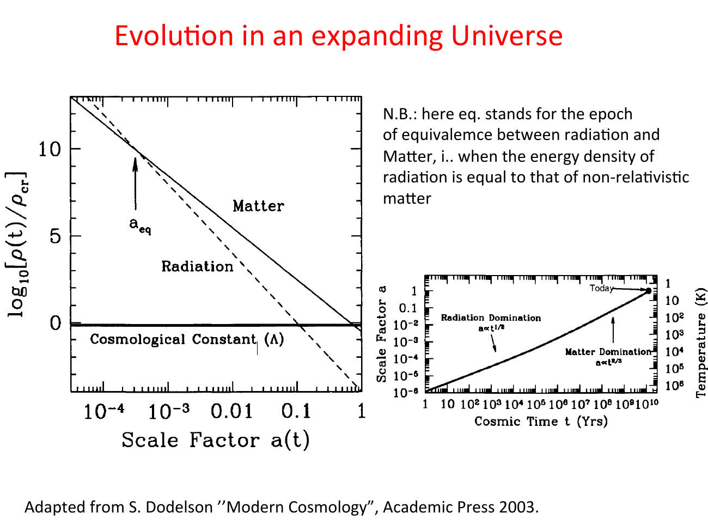

special solutions of the Friedmann equation, useful as **building blocks**: the actual universe is a piecewise combination of these regimes.

starting from
$$H^2 = \left(\frac{\dot a}{a}\right)^2 = \frac{8\pi G}{3}\rho - \frac{k c^2}{a^2} + \frac{\Lambda c^2}{3}$$

let me solve in different limits.

---

## Milne (empty) universe: $\rho = 0$, $\Lambda = 0$, $k = -1$

the simplest case: no matter, no Λ, only curvature drives the dynamics:
$$\dot a^2 = c^2 \quad \Rightarrow \quad a(t) \propto t$$

linear expansion. used as a reference baseline. only an open ($k = -1$) Milne universe is physical.

---

## Einstein-de Sitter (EdS): matter only, flat

$\rho = \rho_m \propto a^{-3}$, $\Lambda = 0$, $k = 0$:
$$\dot a^2 = \frac{8\pi G \rho_0}{3 a}$$

→ $a \propto t^{2/3}$. age of the universe: $t_0 = 2/(3 H_0)$.

with the measured $H_0 = 67.4$ km/s/Mpc, EdS gives $t_0 \approx 9.6$ Gyr — *too young* compared to the observed 13.8 Gyr (see the age problem at [Cosmic_inventory_dark_energy](../../02_Zettel/Theory/Cosmic_inventory_dark_energy.md)).

---

## radiation-dominated: $\rho \propto a^{-4}$, flat

$$\dot a^2 = \frac{8\pi G \rho_{\gamma 0}}{3 a^2}$$

→ $a \propto t^{1/2}$. age: $t_0 = 1/(2 H_0)$, even younger than EdS.

valid in the early universe ($z \gtrsim z_{\rm eq} \sim 3300$).

---

## Λ-dominated (de Sitter): $\rho = \rho_V = $ const, flat

$\Lambda$ alone:
$$H^2 = \frac{\Lambda c^2}{3} = $ const
$$

→ $a(t) \propto e^{Ht}$, exponential expansion.

the late-time attractor of any Λ-containing universe. inflation in the early universe is a near-de-Sitter phase, and dark-energy domination today is approaching one (see [Inflation overview](../../02_Zettel/Theory/Inflation overview.md) and [Cosmic_inventory_dark_energy](../../02_Zettel/Theory/Cosmic_inventory_dark_energy.md)).

---

## closed (matter only, $k = +1$, $\Lambda = 0$)

a parametric solution exists:
$$a(\eta) = \frac{a_{\max}}{2}(1 - \cos\eta), \qquad t(\eta) = \frac{a_{\max}}{2 c}(\eta - \sin\eta)$$

(with $\eta$ a parameter, not conformal time here.) the universe expands to a maximum size $a_{\max}$ at $\eta = \pi$, then **recollapses**: a Big Crunch.

ruled out by observations: the universe is flat ($\Omega_K \approx 0$) and contains dark energy.

---

## open (matter only, $k = -1$, $\Lambda = 0$)

similar parametric solution:
$$a(\eta) = \frac{|k|^{-1/2}}{2}(\cosh\eta - 1), \qquad t(\eta) = \frac{|k|^{-1/2}}{2 c}(\sinh\eta - \eta)$$

the universe expands forever, asymptotically approaching the Milne (empty) limit at late times.

---

## ΛCDM (the actual universe)

three regimes in $a(t)$:

| regime | $z$ | $a(t)$ |
|---|---|---|
| **radiation-dominated** | $z \gtrsim 3300$ | $a \propto t^{1/2}$ |
| **matter-dominated** | $0.7 \lesssim z \lesssim 3300$ | $a \propto t^{2/3}$ |
| **Λ-dominated** | $z \lesssim 0.7$ | $a \propto e^{Ht}$ |

the various models converge at small $t$ (early universe is matter+radiation dominated, regardless of $\Lambda$) but diverge dramatically at large $t$.

age of the universe in ΛCDM: $\sim 13.8$ Gyr — Λ contributing those crucial extra few Gyr that EdS cannot.

---

## Einstein's static universe (historical sidebar)

Einstein originally added Λ specifically to make a *static* solution: $\dot a = \ddot a = 0$. setting both to zero in the Friedmann + acceleration equations:
$$\frac{8\pi G}{3}\rho - \frac{k c^2}{a^2} + \frac{\Lambda c^2}{3} = 0$$
$$-\frac{4\pi G}{3}\rho + \frac{\Lambda c^2}{3} = 0 \quad (\text{for } w = 0 \text{ matter})$$

this gives a unique static solution, but it is **unstable**: perturb it, and it either expands or collapses. when Hubble showed the universe expanding, Einstein called Λ his "biggest blunder."

ironic postscript: $\Lambda$ came back in 1998 — not for static universe, but for **acceleration**.

---

## see also

- [Fundamentals_Astrophysics_Cosmology_MOC](../../00_Atlas/Fundamentals_Astrophysics_Cosmology_MOC.md)
- Friedmann equations with Λ
- [Density parameters and flatness](../../02_Zettel/Theory/Density parameters and flatness.md)
- [Brief thermal history](../../02_Zettel/Theory/Brief thermal history.md)
- [Cosmic_inventory_dark_energy](../../02_Zettel/Theory/Cosmic_inventory_dark_energy.md)
