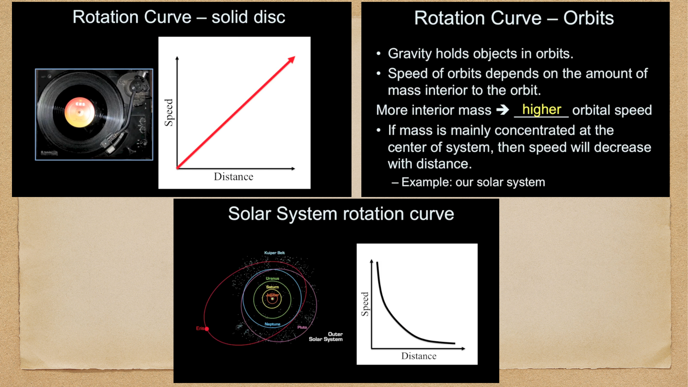

at the very center of the Milky Way sits **Sagittarius A*** (Sgr A*), a **supermassive black hole** of mass
$$M_\bullet = (4.297 \pm 0.012) \times 10^6\, M_\odot$$

(GRAVITY collaboration 2022, plus consistent EHT measurement of the shadow.) at a distance of $\sim 8.2$ kpc from the Sun.

the existence of Sgr A* is one of the cleanest demonstrations of supermassive black holes anywhere in the universe, because we can resolve individual stars orbiting it and watch them complete full orbits.

---

## the S-stars and Schwarzschild precession

a cluster of **S-stars** orbits Sgr A* at distances of $\sim 100-1000$ AU, with orbital periods of decades. the most famous, **S2**, has been tracked since the 1990s:
- orbital period: 16 years
- pericenter distance: $\sim 120$ AU ($\sim 2200\, r_S$)
- pericenter velocity: $\sim 7700$ km/s = $0.026 c$

S2 has been observed completing **multiple full orbits**. from these orbits, the central mass and distance can be determined to remarkable precision.

in 2018, the GRAVITY/SINFONI team detected **gravitational redshift** of S2 light at pericenter, and in 2020 they detected **Schwarzschild precession** of the orbit at $\sim 12$ arcmin per orbit — a direct test of GR in a strong-field regime.

→ Reinhard Genzel (MPE) and Andrea Ghez (UCLA) shared the 2020 Nobel Prize for these observations.

---

## the Event Horizon Telescope image

in May 2022, the EHT collaboration released the first **resolved image of Sgr A***:

a ring of emission with a dark central shadow — exactly as predicted by GR for a black hole. the ring diameter is $\sim 50\,\mu$as, consistent with $M_\bullet = 4.3 \times 10^6\, M_\odot$ and the known distance.

so we now have **two independent confirmations** of the Galactic black hole:
1. Keplerian orbits of S-stars (long-term tracking)
2. Resolved silhouette of the event horizon (interferometric imaging)

---

## activity level and accretion

unlike many AGN, Sgr A* is **extremely quiescent**:
- $L_{\rm Sgr A*} \sim 10^{36}$ erg/s (in the IR/X-ray)
- compare $L_{\rm Edd} \sim 5 \times 10^{44}$ erg/s for $4 \times 10^6\, M_\odot$ → operating at $\sim 10^{-9}$ of Eddington

so Sgr A* is **starving** — much less material reaches the accretion flow than it could accept. probably most of the energy released is in radiatively inefficient accretion (hot but underdense flow, energy advected into the hole).

it does produce **flares**: factor-of-10 brightenings in the IR and X-ray on hour timescales. these are probably from individual blobs of plasma orbiting close to the ISCO.

---

## the central environment

surrounding Sgr A*:
- a **nuclear star cluster** of $\sim 10^7\, M_\odot$ in the central pc
- the **central molecular zone** (CMZ): $10^7\, M_\odot$ of dense molecular gas in the inner $\sim 200$ pc
- old gas + dust circumnuclear disk
- young star cluster ("S-stars cluster")
- the famous **Galactic Center magnetar** SGR 1745-29, discovered 2013, only 0.1 pc from Sgr A*
- pulsars searched for here would be excellent probes of strong-field GR

all observations rely on **infrared and radio** because optical extinction toward the GC is enormous ($A_V \sim 30$ mag).

---

## why this matters

the Galactic Center is:
1. **the closest supermassive black hole**: only place where we can resolve individual stars on parsec orbits
2. a **strong-field GR laboratory** (S2 pericenter, EHT shadow)
3. a **template** for understanding AGN: low-luminosity AGN, quiescent supermassive holes
4. a **cosmic ray and gamma-ray source**: Fermi sees diffuse gamma rays plus a possible "Galactic Center excess" that some interpret as dark matter annihilation
5. evidence for the **M-sigma relation**: $M_\bullet \propto \sigma^4$ for galactic bulges (see [Magorrian relation](../../02_Zettel/Theory/Magorrian relation.md) in the Observational Cosmology MOC)

---

## see also

- [Fundamentals_Astrophysics_Cosmology_MOC](../../00_Atlas/Fundamentals_Astrophysics_Cosmology_MOC.md)
- [Milky Way structure](../../02_Zettel/Theory/Milky Way structure.md)
- [Cosmic_inventory_dark_matter](../../02_Zettel/Theory/Cosmic_inventory_dark_matter.md)
- [Accretion onto compact objects](../../02_Zettel/Theory/Accretion onto compact objects.md)
- [Magorrian relation](../../02_Zettel/Theory/Magorrian relation.md)
- [Hubble morphological sequence](../../02_Zettel/Theory/Hubble morphological sequence.md)
