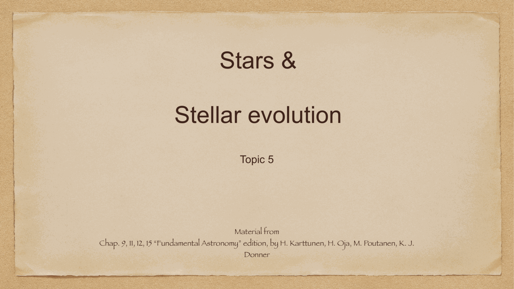
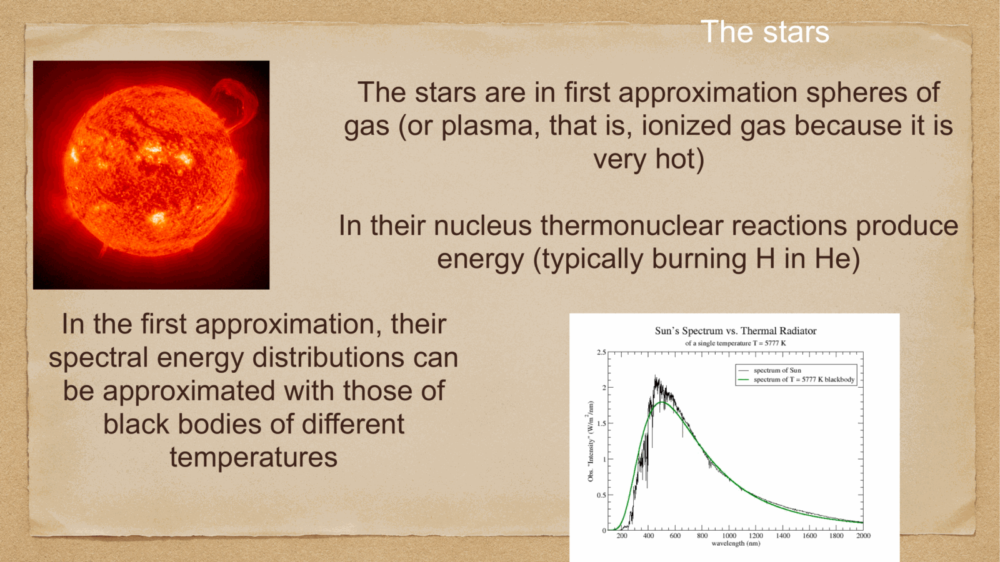

the **Hertzsprung-Russell diagram** plots stars in the $(T_{\rm eff}, L)$ plane. it is the central organizing tool of stellar astrophysics: every star sits somewhere on this diagram, and **where** it sits tells you the star's mass, age, and evolutionary state.

historically introduced independently by Ejnar Hertzsprung (1911) and Henry Norris Russell (1913).

---

## axes and conventions

- **horizontal axis**: temperature $T_{\rm eff}$, *increasing to the left* (an unfortunate historical convention). equivalently: spectral type O→B→A→F→G→K→M.
- **vertical axis**: luminosity $L$ (in solar units, $L/L_\odot$), or absolute magnitude $M_V$ (decreasing upward).

a star with $T_{\rm eff} = 5800$ K, $L = L_\odot$ — the **Sun** — sits at $(5800, 1)$, on the lower middle of the diagram.

---

## the main features

three main loci of stars:

### main sequence (MS)

a diagonal band running from upper left (hot, luminous) to lower right (cool, faint). about 90% of stars at any given time are on the MS — these are stars **fusing hydrogen to helium in their cores**.

mass-luminosity relation along the MS:
$$L \propto M^{3.5\text{-}4}$$

so a 10 $M_\odot$ MS star is $\sim 3000\, L_\odot$. the more massive the star, the *much* more luminous.

### giants and supergiants

cool, luminous stars sitting *above* the MS at red colors. these are post-MS stars in shell-burning phases:
- **subgiants** (luminosity class IV): just leaving the MS
- **giants** (III): hydrogen-shell burning, expanded envelope
- **bright giants** (II)
- **supergiants** (Ia, Ib): the most massive evolved stars — Betelgeuse, Antares
- **AGB stars**: asymptotic giant branch, very late stages of intermediate-mass stars

### white dwarfs

faint, hot stars sitting *below* the MS. these are the **degenerate cores** of post-AGB stars, no longer fusing — just cooling. typical mass $\sim 0.6\, M_\odot$, radius $\sim R_\oplus$.

---

## why the structure?

the MS exists because hydrogen burning is the longest-lasting phase of a star's life ($\sim 10^7$ to $10^{10}$ yr depending on mass). so most stars are caught in this phase.

after H-core exhaustion, the star expands and cools (becomes a red giant), then climbs the giant branch, then either:
- (low/intermediate mass) sheds its envelope and becomes a planetary nebula + white dwarf
- (high mass) explodes as a supernova, leaving a neutron star or black hole

each phase is a *track* across the HR diagram. given a star's position, you can read off where it is in this evolutionary path.

---

## isochrones

for a coeval population (e.g. a star cluster), all stars start at the same time. lower-mass stars take longer to evolve, so at age $t$:
- the most massive stars have already left the MS (for clusters older than ~Gyr)
- intermediate-mass stars are on the giant branch
- low-mass stars still on the MS

the locus of all stars in the cluster on the HR diagram is an **isochrone** ("equal age"). the **MS turn-off** point — where the brightest MS star sits — gives the cluster age via the mass-lifetime relation.

→ this is how globular cluster ages are determined ($\sim 12$–$13$ Gyr, providing a lower limit on the age of the universe before the SN Ia Hubble diagram).

---

## the cosmological role of the HR diagram

apart from being the central organizing tool of stellar astrophysics, the HR diagram:
- gives **standard candles**: Cepheids on the instability strip, RR Lyraes on the horizontal branch (see [Cepheids and supernovae](../../02_Zettel/Theory/Cepheids and supernovae.html))
- gives **ages of the universe**: globular cluster MS turn-offs at $\sim 13$ Gyr
- enables **stellar population synthesis**: integrating an isochrone over the IMF gives the integrated SED of a population (see [Spectral energy distributions](../../02_Zettel/Theory/Spectral energy distributions.html))
- provides the **end-states** that make compact objects (neutron stars, black holes), the targets of high-energy astrophysics (see [Lab_High-Energy_MOC](../../00_Atlas/Lab_High-Energy_MOC.html))

---

## see also

- [Fundamentals_Astrophysics_Cosmology_MOC](../../00_Atlas/Fundamentals_Astrophysics_Cosmology_MOC.html)
- [Stellar spectra and spectral classification](../../02_Zettel/Theory/Stellar spectra and spectral classification.html)
- [Main sequence, giants, supergiants, white dwarfs](../../02_Zettel/Theory/Main sequence, giants, supergiants, white dwarfs.html)
- [Stellar scaling relations](../../02_Zettel/Theory/Stellar scaling relations.html)
- [Stellar nucleosynthesis](../../02_Zettel/Theory/Stellar nucleosynthesis.html)
- [Stellar evolution timescales](../../02_Zettel/Theory/Stellar evolution timescales.html)
- [Solar evolution and final stages](../../02_Zettel/Theory/Solar evolution and final stages.html)
