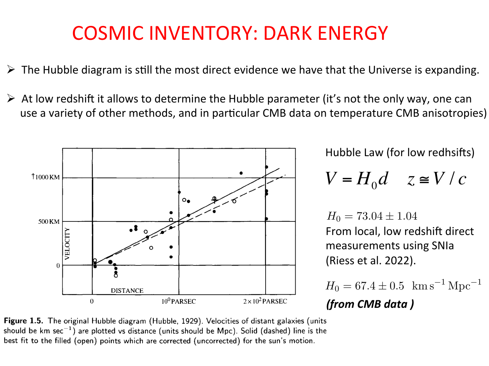
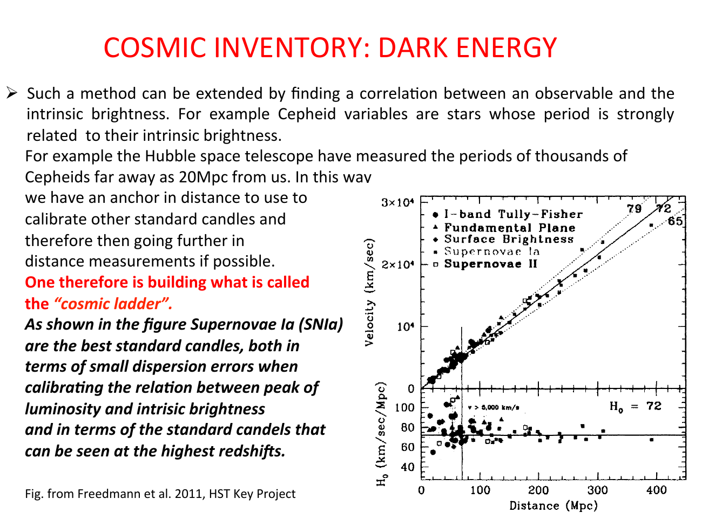

at low redshift, **Hubble's law** has a beautifully simple form:
$$v = H_0\, d, \qquad z \simeq \frac{v}{c}$$

a straight line through the origin in the $v$-$d$ plot. this is the celebrated 1929 Hubble result.

---

## low-z derivation

start from the FRW metric (see 03_Zettel/Theory/Robertson-Walker metric). a comoving object at coordinate $r$ has physical distance
$$d_{\rm phys}(t) = a(t)\, r$$

differentiating with respect to time, with $r$ fixed (comoving):
$$\dot d_{\rm phys} = \dot a\, r = \frac{\dot a}{a}\, d_{\rm phys} = H\, d_{\rm phys}$$

at the present epoch:
$$\boxed{\,v = H_0\, d\,}$$

so the **expansion of the universe** automatically produces a linear velocity-distance relation for every comoving observer. nothing to do with the Doppler effect of moving stars in our own galaxy — it is the *space* itself stretching.

---

## redshift at low z

cosmological redshift comes from the same $a(t)$ stretching photons as they travel:
$$1 + z = \frac{a(t_0)}{a(t_e)}$$

at low z, expand $a(t_e) = a(t_0)[1 - H_0(t_0 - t_e) + \cdots]$:
$$1 + z = \frac{1}{1 - H_0(t_0 - t_e)} \approx 1 + H_0(t_0 - t_e) + \cdots$$

so $z \approx H_0(t_0 - t_e) \approx H_0 d/c$, i.e.
$$\boxed{\,z \simeq \frac{v}{c}\,}$$

equivalent to Doppler at first order in $z$, but conceptually different.

---

## why low-z and not high-z

at high redshift, the linear approximation breaks down because:
- the scale factor change $a(t_e)/a(t_0) = 1/(1+z)$ is no longer close to 1
- the time interval $(t_0 - t_e)$ requires integrating the actual $H(t)$ history
- $d$ itself becomes ambiguous: is it $d_C, d_A, d_L$, or proper distance?

so the low-z form is *only* good for $z \ll 1$. for high-z (SN Ia at $z \sim 1$), we need the full **luminosity distance**:
$$d_L(z) = (1 + z)\int_0^z \frac{c\, dz'}{H(z')}$$

and at small $z$:
$$d_L(z) = \frac{c}{H_0}\left[z + \tfrac12(1 - q_0) z^2 + O(z^3)\right]$$

→ see [Hubble law exact form](../../02_Zettel/Theory/Hubble law exact form.html).

---

## measuring $H_0$ at low z

practical recipe:
1. measure redshifts of nearby galaxies ($z \lesssim 0.1$, well within the linear regime)
2. measure their distances independently — Cepheid period-luminosity, Tully-Fisher, SN Ia, surface brightness fluctuations, etc.
3. fit the $v$-$d$ plot, slope is $H_0$

with HST Cepheids out to $\sim 20$ Mpc, then SN Ia to extend the ladder beyond, we get:
$$H_0 = 73.04 \pm 1.04~\text{km/s/Mpc} \quad \text{(Riess et al. 2022)}$$

inconsistent at $\sim 5\sigma$ with the CMB-anchored value $67.4 \pm 0.5$. this is the **Hubble tension**.

---

## see also

- [Fundamentals_Astrophysics_Cosmology_MOC](../../00_Atlas/Fundamentals_Astrophysics_Cosmology_MOC.html)
- 03_Zettel/Theory/Robertson-Walker metric
- [Hubble constant and deceleration parameter](../../02_Zettel/Theory/Hubble constant and deceleration parameter.html)
- [Hubble law exact form](../../02_Zettel/Theory/Hubble law exact form.html)
- 03_Zettel/Theory/Cosmological distances
- [Cepheids and supernovae](../../02_Zettel/Theory/Cepheids and supernovae.html)
