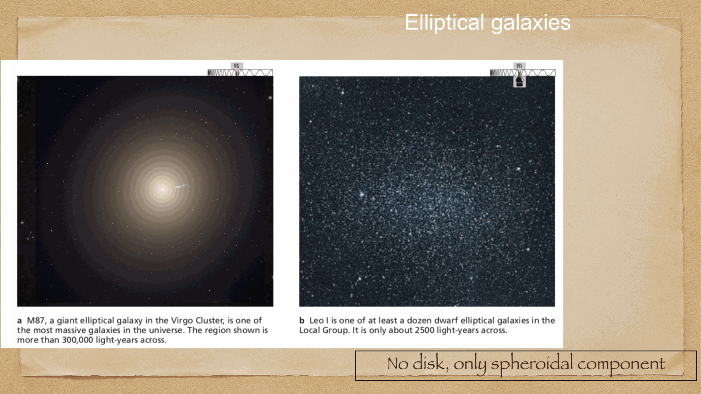

Edwin Hubble's 1926 morphological classification of galaxies, the **tuning fork diagram**. still the standard system for categorizing galaxy shapes.

despite Hubble interpreting it as an *evolutionary sequence* (he thought ellipticals evolved into spirals — wrong), the classification is purely **morphological** and is now read backward: galaxies do not move along the fork as they age.



---

## the tuning fork

```
  E0 — E3 — E5 — E7 — S0 ─┬─ Sa — Sb — Sc — Sd
                            └─ SBa — SBb — SBc — SBd
```

three main branches:
- **ellipticals** (left handle of the fork)
- **lenticulars** (S0, the joint)
- **spirals** (right side, with bar / unbarred branches)

plus **irregulars** (Irr) off to the side.

---

## ellipticals (E)

featureless, smooth distributions of stars. classified by **flattening**:
$$E_n \quad \text{where}\quad n = 10\left(1 - \frac{b}{a}\right)$$

where $b/a$ is the apparent axis ratio. so:
- E0: spherical (round)
- E5: $b/a = 0.5$ (moderate flattening)
- E7: $b/a = 0.3$ (most flattened — beyond this they become S0s)

importantly, the classification is **apparent** flattening — depends on viewing angle. an E0 galaxy might be a spheroid seen face-on, but a flattened ellipsoid seen pole-on would also look E0.

properties:
- predominantly **old, red** stars (Pop II)
- **gas-poor**, no recent star formation
- supported by **velocity dispersion** $\sigma$, not rotation
- massive ones at cluster centers are called **cD galaxies** ($M \sim 10^{12-13}\, M_\odot$)
- dwarf ellipticals (dE, cE) are very different physically — supported by rotation, more like puffed-up spirals

---

## spirals (S, SB)

flat disks with spiral arms. classified by:

1. **presence of bar**:
   - SA: no bar (ordinary spiral)
   - SAB: intermediate (weak bar)
   - SB: strongly barred

2. **tightness of spiral arms** and **size of bulge** (a → d sequence):
   - **Sa, SBa**: large bulge, tightly wound arms (smooth)
   - **Sb, SBb**: intermediate
   - **Sc, SBc**: small bulge, loosely wound arms (clumpy, lots of star formation)
   - **Sd**: very small bulge, very loose arms

(Hubble's original classification ended at Sc; later authors added Sd for the most disk-dominated cases.)

properties:
- mix of old (bulge) and young (disk) stellar populations
- **gas-rich** disks supporting active star formation
- supported by **rotation**, with $V_{\rm flat} \sim 200-300$ km/s
- show the spiral density wave structure (see [Spiral arm kinematics](../../02_Zettel/Theory/Spiral arm kinematics.html))

---

## lenticulars (S0)

intermediate between E and S. have a disk but **no spiral arms** and very little gas. classified by amount of dust:
- S0$_1$, S0$_2$, S0$_3$ (old to less dusty)

probably formed from spirals that lost their gas (e.g. by ram-pressure stripping in a cluster). evidence: S0 galaxies are far more common in clusters than in the field.

---

## irregulars (Irr)

no clear morphological pattern. classified into:
- **Irr I**: like the Magellanic Clouds — gas-rich, lots of star formation, low metallicity
- **Irr II**: peculiar, often interacting/merging galaxies (later renamed "peculiar" or with explicit notation)

irregulars are typically low-mass, gas-rich, and often metal-poor. they may be remnants of dwarf galaxy interactions or examples of late-time accretion.

---

## the de Vaucouleurs extension

Gérard de Vaucouleurs extended the Hubble classification:
- added **finer subdivisions** (Sa → Sab → Sb → Sbc → Sc, etc.)
- added **rings**: r (inner ring), s (no ring)
- formal notation: e.g. SAB(rs)bc for an intermediate-bar spiral with intermediate ring structure

this is the system used in modern catalogs (NGC, RC3, etc.).

---

## the morphological numerical T-type

a numerical scale for the Hubble sequence:
- **T = -5 to -4**: E galaxies
- **T = -3 to -1**: S0
- **T = 0**: S0/a
- **T = 1**: Sa
- **T = 3**: Sb
- **T = 5**: Sc
- **T = 7**: Sd
- **T = 9**: Sm
- **T = 10**: Im (Magellanic irregular)

useful for statistical work — it's a simple ordinal variable along the Hubble sequence.

---

## what the sequence actually means physically

**the Hubble sequence is not an evolutionary sequence**. galaxies do *not* move along the fork as they age. instead:
- the morphological type correlates with **gas content and SFR**: E and S0 are gas-poor and quiescent; Sd and Irr are gas-rich and star-forming.
- the morphological type correlates with **environment**: clusters favor E and S0; field favors S and Irr.
- the morphological type correlates with **bulge-to-disk ratio**: larger bulge → earlier type (Sa) → smaller bulge → later type (Sd).

so Hubble morphology is a useful *summary* of galaxy properties, but the underlying physics is **what fraction of stars are in the bulge vs disk** and **how much gas is left**.

---

## why this matters

morphology is the **first thing you can measure** about a galaxy from imaging. it correlates with:
- color (E = red, Sd = blue)
- gas content (E = poor, Sd = rich)
- mass (E tend to be massive, Irr tend to be low-mass)
- environment (E in clusters, S in the field)
- evolutionary stage and history

so morphological classification is still the standard starting point for any galaxy study, even in the era of Sloan Digital Sky Survey, JWST, and machine-learning classifiers.

---

## see also

- [Fundamentals_Astrophysics_Cosmology_MOC](../../00_Atlas/Fundamentals_Astrophysics_Cosmology_MOC.html)
- [Galaxies in the local universe](../../02_Zettel/Theory/Galaxies in the local universe.html)
- [Galaxy morphology vs physical properties](../../02_Zettel/Theory/Galaxy morphology vs physical properties.html)
- [Galaxies across wavelengths](../../02_Zettel/Theory/Galaxies across wavelengths.html)
- [Color bimodality of galaxies](../../02_Zettel/Theory/Color bimodality of galaxies.html)
- [Spiral arm kinematics](../../02_Zettel/Theory/Spiral arm kinematics.html)
