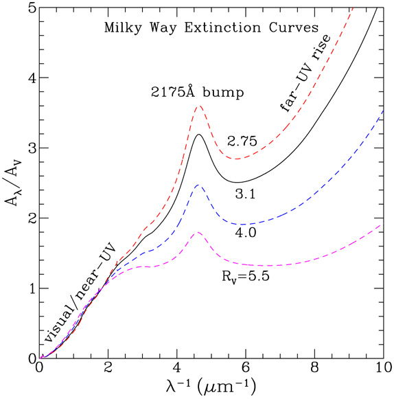

light from a distant star is **dimmed** and **reddened** as it travels through the interstellar medium (ISM). dust grains scatter and absorb starlight, with bluer wavelengths affected more strongly than redder. this is **interstellar extinction**, and ignoring it gives wrong distances and wrong stellar properties.

---

## the extinction law

light traveling a distance $ds$ through a medium with **opacity** $\alpha_\nu$ (cm$^{-1}$) loses intensity by:
$$dI_\nu = -\alpha_\nu I_\nu\, ds$$

integrating:
$$I_\nu(\text{observed}) = I_\nu(\text{intrinsic}) \cdot e^{-\tau_\nu}$$

with the **optical depth**
$$\tau_\nu = \int \alpha_\nu\, ds$$

so a source attenuated by optical depth $\tau$ has its intensity reduced by a factor $e^{-\tau}$.

in magnitudes:
$$A_\lambda = -2.5\log_{10}(F_{\rm obs}/F_{\rm int}) = 2.5\log_{10}(e)\cdot \tau_\lambda \approx 1.086\, \tau_\lambda$$

so $A_\lambda$ (in magnitudes) and $\tau_\lambda$ (dimensionless optical depth) are essentially the same quantity, off by 1.086.

---

## reddening

extinction is **wavelength-dependent**: blue light is absorbed/scattered more strongly than red light. so a reddened spectrum looks redder than it is intrinsically.

the **color excess**:
$$E(B - V) \equiv (B - V)_{\rm obs} - (B - V)_{\rm int} = A_B - A_V$$

(the difference of magnitudes in B and V, minus the intrinsic color of the star.)

ratio of total to selective extinction:
$$R_V \equiv \frac{A_V}{E(B - V)}$$

empirically, **for the diffuse Milky Way ISM, $R_V \approx 3.1$** (Cardelli, Clayton, Mathis 1989). this is a reasonably universal value, though specific sightlines vary.

so given $E(B - V)$, you get $A_V \approx 3.1\, E(B - V)$, and from there extinction in any band via the extinction curve.

---

## the extinction curve

how $A_\lambda/A_V$ varies with wavelength. 

roughly:
- UV: steep rise toward shorter $\lambda$, dominated by small grain absorption
- the famous **2175 Å bump** — possibly from PAHs or small carbonaceous grains
- visible: $A_\lambda$ decreasing with $\lambda$
- infrared: steeply falling — an IR observation suffers much less extinction than optical

approximate fit in the optical (Cardelli, Clayton, Mathis 1989, with $R_V = 3.1$):
$$\frac{A_\lambda}{A_V} \sim 1.7 \cdot \left(\frac{0.55\,\mu m}{\lambda}\right)$$

(only approximate; the real curve has structure.)

so in 2MASS K-band ($2.2\,\mu$m), extinction is reduced by $\sim 10\times$ relative to V. this is why infrared surveys get much further into the dusty Galactic plane.

---

## why we have to correct for it

extinction matters because it directly affects:
- **distance estimates**: a star looks fainter than it should at a given distance, leading to overestimated distances
- **photometric redshifts**: dust reddens galaxy spectra, mimicking aging or higher-redshift effects
- **luminosity functions**: a magnitude-limited sample is biased toward unreddened sightlines
- **stellar mass estimates**: dust is a primary uncertainty in galaxy SED fitting (see [Dust attenuation and extinction curves](../../02_Zettel/Theory/Dust attenuation and extinction curves.html))

the modulus relation must be corrected:
$$m - M = 5\log_{10}(d_{\rm pc}/10) + A_V$$

(neglecting K-correction at high z; see [K-correction](../../02_Zettel/Theory/K-correction.html) in the Observational Cosmology MOC.)

---

## measuring extinction

several methods:
- **pair method**: compare the spectrum of a reddened star to an intrinsic spectrum of the same spectral type. the difference gives $E(B-V)$ at every wavelength.
- **HI 21-cm column density**: empirically $E(B-V) \propto N_H$ for diffuse ISM, with $N_H/E(B-V) \approx 5.8 \times 10^{21}$ cm$^{-2}$/mag.
- **Schlegel-Finkbeiner-Davis (SFD) maps**: full-sky maps of dust IR emission converted to $E(B-V)$. the standard Galactic-extinction reference.
- **Balmer decrement**: $F(H\alpha)/F(H\beta)$ for HII regions has a known intrinsic value (2.86 for case B); deviation gives $E(B-V)$ in the ionized gas.

---

## dust within other galaxies

reddening within the host galaxy of a distant source can be much larger than Milky Way reddening. for galaxies, modeling typically uses:
- **Calzetti law** (2000): empirical dust attenuation law for starburst galaxies
- **Charlot & Fall** (2000): two-component law, accounting for birth-cloud vs diffuse ISM dust
- **Cardelli** (1989): the workhorse for Milky Way sightlines

→ see [Dust attenuation and extinction curves](../../02_Zettel/Theory/Dust attenuation and extinction curves.html) (Observational Cosmology MOC).

---

## the bigger picture

dust is *not* just a nuisance. it is a key tracer of:
- star formation in galaxies (dust absorbs UV, re-emits in IR — see [IR SFR tracer](../../02_Zettel/Theory/IR SFR tracer.html))
- chemical enrichment (heavy-element grains)
- the cool ISM (cold dust at $\sim 20$ K dominates the FIR spectrum)

so understanding extinction is dual-purpose: a correction *and* a probe.

---

## see also

- [Fundamentals_Astrophysics_Cosmology_MOC](../../00_Atlas/Fundamentals_Astrophysics_Cosmology_MOC.html)
- [Electromagnetic radiation basics](../../02_Zettel/Theory/Electromagnetic radiation basics.html)
- [Magnitudes and photometric systems](../../02_Zettel/Theory/Magnitudes and photometric systems.html)
- [Stellar spectra and spectral classification](../../02_Zettel/Theory/Stellar spectra and spectral classification.html)
- [Milky Way structure](../../02_Zettel/Theory/Milky Way structure.html)
- [Interstellar medium components and gas cycle](../../02_Zettel/Theory/Interstellar medium components and gas cycle.html)
- [Dust attenuation and extinction curves](../../02_Zettel/Theory/Dust attenuation and extinction curves.html)
- [Photoelectric absorption](../../02_Zettel/Theory/Photoelectric absorption.html) — the X-ray analog
