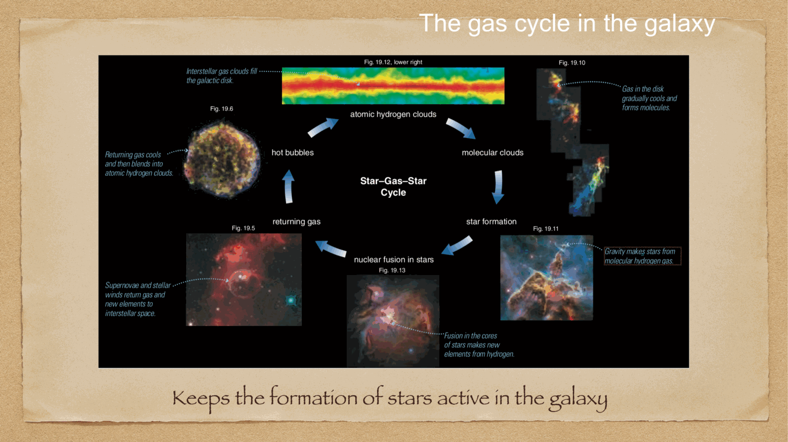

the **interstellar medium** (ISM) fills the space between stars in a galaxy with gas, dust, magnetic fields, and cosmic rays. though only $\sim 10\%$ of a galaxy's baryonic mass, the ISM is where stars are born and where stars die — it is the dynamical heart of galaxy evolution.

key fact: the ISM is **not in equilibrium**. it is a constantly cycling system, replenished by stellar mass loss, depleted by star formation, stirred by supernova feedback.

---

## the four (or five) phases of the ISM

distinguished by temperature and density. the McKee-Ostriker (1977) framework:

| phase | $T$ (K) | $n$ (cm$^{-3}$) | tracer | volume fraction |
|---|---|---|---|---|
| **molecular** | 10-20 | $10^2-10^6$ | CO emission, mm | < 1% |
| **cold neutral medium (CNM)** | 100 | 50 | HI 21 cm absorption | a few % |
| **warm neutral medium (WNM)** | 5000-8000 | 0.5 | HI 21 cm emission | 30-60% |
| **warm ionized medium (WIM)** | 8000-10 000 | 0.1 | H$\alpha$ recombination | 10-20% |
| **hot ionized medium (HIM)** | $10^6-10^7$ | $10^{-3}$ | X-rays, OVI absorption | 30-50% |

these phases are roughly in pressure equilibrium ($n T \sim$ const) but exist over many decades in $T$ and $n$.

---

## molecular gas

cold, dense, where stars form. dominant component:
- **molecular hydrogen** H$_2$: not directly observable in absorption (no permanent dipole) or emission (rovibrational lines too high-energy at $T = 10$ K)
- traced by **CO** (1-0, 2-1 rotational lines at 115 GHz, 230 GHz). conversion factor $X_{\rm CO}$ relates CO intensity to H$_2$ column density (with significant uncertainty in metal-poor environments).
- traced by **dust IR/sub-mm emission** (Herschel, ALMA)
- traced by **gamma rays** (cosmic rays interacting with H$_2$, observed by Fermi)

gas mass in the Milky Way molecular phase: $\sim 10^9\, M_\odot$, mostly in **giant molecular clouds (GMCs)** of $10^4-10^6\, M_\odot$ each.

→ stars form in the densest cores of GMCs (see [Jeans theory and protostellar formation](../../02_Zettel/Theory/Jeans theory and protostellar formation.html)).

---

## atomic neutral hydrogen (HI)

the most abundant phase by mass: $\sim 10^{10}\, M_\odot$ in the Milky Way disk. emits/absorbs the **21 cm line** (hyperfine spin-flip transition of neutral H), one of the most useful tools in astronomy.

the 21 cm line traces:
- the disk structure of the Milky Way and other galaxies
- rotation curves (the cleanest extragalactic measurement of $V(R)$)
- gas fueling of star formation

at high z, the 21 cm line is THE probe of the epoch of reionization (cm experiments like SKA, HERA, LOFAR target this).

---

## ionized gas

two flavors:
- **HII regions** around hot O/B stars: ionized by Lyman-continuum photons from young massive stars. emit recombination lines (H$\alpha$, H$\beta$, ...) and forbidden metal lines. tracers of ongoing star formation.
- **WIM** (diffuse warm ionized medium): faint H$\alpha$ from regions far from any obvious ionizing source. probably ionized by escaping Lyman-continuum from O/B stars.
- **HIM** (hot ionized medium): shock-heated by supernova explosions. fills $\sim 30\%$ of the disk volume, with bubbles up to kpc scale. emits X-rays.

→ HII regions are the textbook **SFR tracers** (see [H-alpha SFR tracer](../../02_Zettel/Theory/H-alpha SFR tracer.html) in the Observational Cosmology MOC).

---

## dust

$\sim 1\%$ by mass of the gas. but it dominates the **opacity** of the ISM:
- absorbs UV-optical starlight
- re-emits in the IR/sub-mm
- blocks our view of the inner Galaxy (which is why the optical Milky Way looks like a dark band)
- catalyzes formation of H$_2$ on grain surfaces

types: silicate grains, carbonaceous grains, polycyclic aromatic hydrocarbons (PAHs), ice mantles. complex chemistry.

→ see [Interstellar absorption](../../02_Zettel/Theory/Interstellar absorption.html).

---

## the gas cycle

the ISM is a **dynamical reservoir**:

1. **star formation** consumes the molecular phase, locking gas into stars
2. stars **return mass** to the ISM through:
   - stellar winds (especially AGB stars and O stars)
   - planetary nebulae (low-mass stars)
   - supernova explosions (high-mass stars)
3. the returned mass is **enriched in metals** by stellar nucleosynthesis (see [Stellar nucleosynthesis](../../02_Zettel/Theory/Stellar nucleosynthesis.html))
4. **gas inflows** from the intergalactic medium replenish the disk (cold flows at high z, halo cooling at low z)
5. **gas outflows** driven by stellar feedback or AGN remove gas

so in steady state: SFR $\approx$ inflow rate, the **bathtub model** of galaxy evolution.

---

## why ISM matters cosmologically

- the **gas reservoir** is what fuels star formation, and hence galaxy growth. the galaxy main sequence ($M_* - {\rm SFR}$) is fundamentally a statement about gas content.
- the **chemical enrichment** in the ISM records the integrated history of star formation — see [Chemical evolution of galaxies](../../02_Zettel/Theory/Chemical evolution of galaxies.html).
- the **CGM** (circumgalactic medium) and IGM are extensions of the ISM cycle to galaxy halos and beyond — see the Observational Cosmology MOC.
- **dust** in the ISM affects every observation (extinction, reddening, IR re-emission, far-IR cosmology).

→ the ISM is the substrate on which galaxy evolution happens.

---

## see also

- [Fundamentals_Astrophysics_Cosmology_MOC](../../00_Atlas/Fundamentals_Astrophysics_Cosmology_MOC.html)
- [Milky Way structure](../../02_Zettel/Theory/Milky Way structure.html)
- [Spiral arm kinematics](../../02_Zettel/Theory/Spiral arm kinematics.html)
- [Galactic Center](../../02_Zettel/Theory/Galactic Center.html)
- [Interstellar absorption](../../02_Zettel/Theory/Interstellar absorption.html)
- [Jeans theory and protostellar formation](../../02_Zettel/Theory/Jeans theory and protostellar formation.html)
- [Stellar nucleosynthesis](../../02_Zettel/Theory/Stellar nucleosynthesis.html)
- [Chemical evolution of galaxies](../../02_Zettel/Theory/Chemical evolution of galaxies.html)
