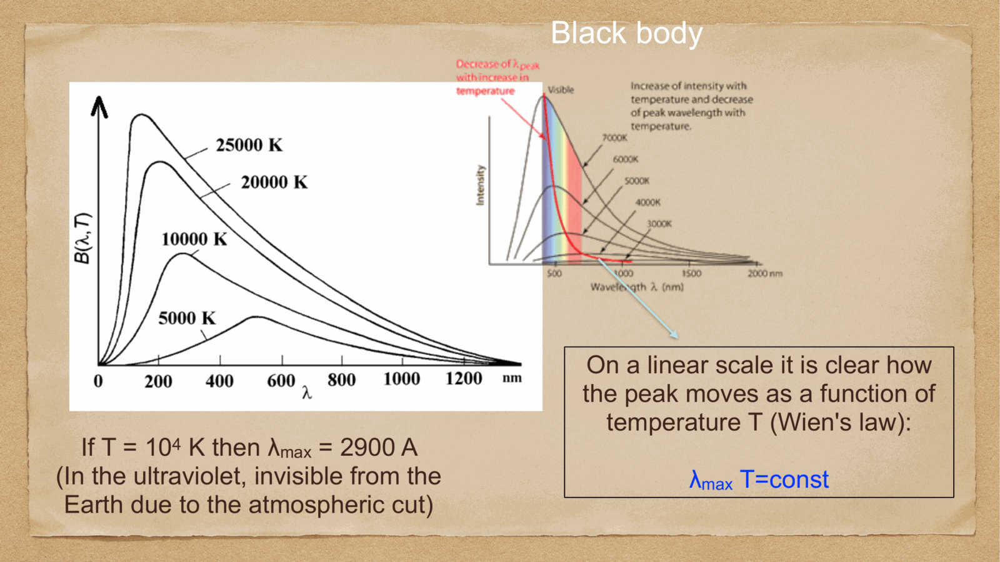

a deeply weird unit, but the one all of astronomy uses: **magnitudes**. logarithmic, inverted (brighter → smaller number), and historical (Hipparchus's eyeball calibration in ~150 BC).

---

## the Pogson scale (1856)

historically, naked-eye stars were classified into 6 "magnitudes," with brightest stars m=1 and faintest m=6. Norman Pogson formalized this in 1856 by the relation:

$$\boxed{\,m_1 - m_2 = -2.5 \log_{10}\left(\frac{F_1}{F_2}\right)\,}$$

so a difference of 5 magnitudes corresponds to a factor of $10^{5/2.5} = 100$ in flux. the **brighter** the source, the **smaller** the magnitude (and bright sources can have negative magnitudes).

example: a 6th-magnitude star is $100\times$ fainter than a 1st-magnitude star, exactly as Hipparchus's eye was logarithmically responding to brightness.

---

## apparent magnitude

the **apparent magnitude** $m$ is what we measure: the brightness as it appears at Earth. depends on:
- the intrinsic luminosity of the source
- its distance
- absorption along the line of sight

calibration: Vega is *defined* to have $m = 0$ in any photometric band (approximately — modern definitions use AB magnitudes, see below).

ranges:
- Sun: $m_V = -26.7$
- full Moon: $m_V \approx -12.7$
- Sirius (brightest star at night): $m_V = -1.46$
- Vega: $m_V = 0.03$
- Polaris: $m_V \approx 2$
- naked-eye limit: $m_V \approx 6$
- Hubble Ultra Deep Field limit: $m_V \approx 30$

---

## absolute magnitude and the distance modulus

the **absolute magnitude** $M$ is the apparent magnitude an object would have at a standard distance of **10 pc**:
$$\boxed{\,m - M = 5 \log_{10}(d_{\rm pc}/10) = 5\log_{10}(d_{\rm pc}) - 5\,}$$

equivalently:
$$m - M = 5\log_{10}(d_{\rm Mpc}) + 25$$

so $M$ is **intrinsic**: a property of the source, not depending on observer position. the difference $\mu \equiv m - M$ is the **distance modulus**, a logarithmic distance.

derivation: $F = L/(4\pi d^2)$, so $F_1/F_2 = (d_2/d_1)^2$. taking $d_2 = 10$ pc and $d_1 = d$:
$$m - M = -2.5\log_{10}(F/F_{10}) = -2.5\log_{10}((10/d)^2) = 5\log_{10}(d/10)$$

absolute magnitudes are how we compare intrinsic luminosities of stars. for example:
- Sun: $M_V = 4.83$
- Sirius A: $M_V = 1.42$
- Betelgeuse: $M_V = -5.85$
- Andromeda galaxy: $M_V \approx -21$

---

## color indices

the difference of magnitudes in two photometric bands:
$$B - V = m_B - m_V$$

a measure of the **color** of an object. blue/hot stars have small or negative $B - V$ (more flux in B than in V). red/cool stars have large $B - V$.

calibration: Vega has $B - V = 0$ by definition. for the Sun, $B - V \approx 0.65$.

color is essentially a proxy for **temperature** — a quasi-blackbody spectrum has a unique $B - V$ for each $T$ (modulo absorption lines):
- O star: $B - V \approx -0.32$
- A0 (Vega): $B - V = 0$
- G2 (Sun): $B - V = 0.65$
- M0: $B - V \approx 1.40$

so two-band photometry alone gives a rough $T$ estimate. add a third band and you can also estimate dust reddening — see [Interstellar absorption](../../02_Zettel/Theory/Interstellar absorption.html).

---

## bolometric magnitude

the **bolometric magnitude** $M_{\rm bol}$ corresponds to the luminosity integrated over all frequencies:
$$M_{\rm bol} = -2.5 \log_{10}(L/L_\odot) + M_{\rm bol,\odot}$$

with $M_{\rm bol,\odot} = 4.74$ as the conventional zero point.

since most photometry only measures one band, we use the **bolometric correction** to convert:
$$BC = M_{\rm bol} - M_V$$

values of $BC$ are tabulated as a function of spectral type.

---

## photometric systems

different telescopes use different filter sets. the major ones:

### Johnson-Cousins (UBVRI)
the workhorse of optical astronomy:
- **U** (ultraviolet, $\lambda_{\rm eff} \approx 365$ nm)
- **B** (blue, $\approx 445$ nm)
- **V** (visual, $\approx 551$ nm) — close to the human eye peak
- **R** (red, $\approx 658$ nm)
- **I** (near-infrared, $\approx 806$ nm)

extended into the IR with J, H, K, L, M bands (Bessell, Glass).

### SDSS ugriz
the modern survey-era replacement, with non-overlapping filters:
$$u, g, r, i, z$$

### AB magnitudes
a more rigorous flux-based system, where magnitudes are referenced to a constant flux per unit frequency rather than Vega:
$$m_{\rm AB} = -2.5\log_{10}(F_\nu/{\rm Jy}) + 8.90$$

so an AB-magnitude 0 source has $F_\nu = 3631$ Jy. rapidly becoming the standard for cosmology surveys.

---

## why magnitudes and not just fluxes?

historical inertia, mostly. but also:
- the human eye really *is* logarithmic, so for visual estimation magnitudes are natural
- magnitudes are convenient for **differential photometry** (relative brightness), where calibration uncertainties cancel
- the dynamic range of astronomical sources is enormous (~30 magnitudes from brightest to faintest), and logs handle that gracefully

modern professional astronomy still uses magnitudes universally, even though we have CCDs that measure fluxes directly.

---

## see also

- [Fundamentals_Astrophysics_Cosmology_MOC](../../00_Atlas/Fundamentals_Astrophysics_Cosmology_MOC.html)
- [Electromagnetic radiation basics](../../02_Zettel/Theory/Electromagnetic radiation basics.html)
- [Blackbody radiation and Stefan-Boltzmann](../../02_Zettel/Theory/Blackbody radiation and Stefan-Boltzmann.html)
- [Stellar spectra and spectral classification](../../02_Zettel/Theory/Stellar spectra and spectral classification.html)
- [Interstellar absorption](../../02_Zettel/Theory/Interstellar absorption.html)
- [Parallax and standard candles](../../02_Zettel/Theory/Parallax and standard candles.html)
- [Cepheids and supernovae](../../02_Zettel/Theory/Cepheids and supernovae.html)
- [HR diagram](../../02_Zettel/Theory/HR diagram.html)
- [Luminosity and Flux for -Instrumentations](../../02_Zettel/Theory/Luminosity and Flux for -Instrumentations.html) — X-ray version
