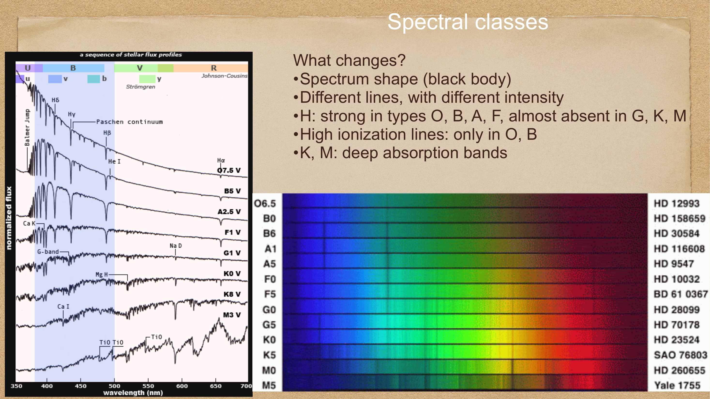
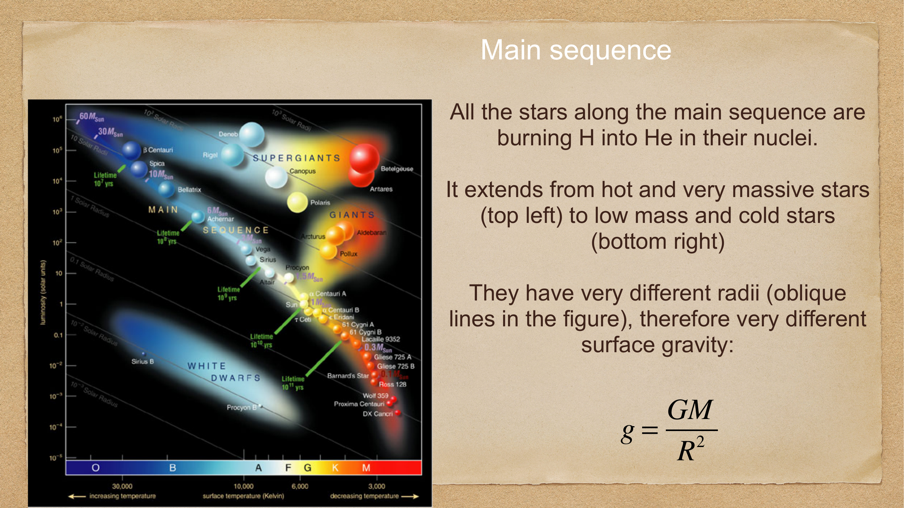
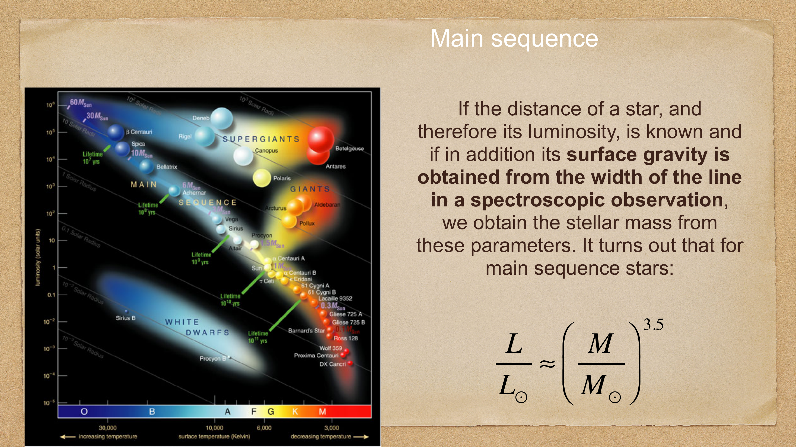

the four main populations on the HR diagram, each corresponding to a different stage of stellar life and a different physical regime.

---

## main sequence (MS)

stars **fusing hydrogen to helium in their cores** via the pp chain or the CNO cycle (see [Stellar nucleosynthesis](../../02_Zettel/Theory/Stellar nucleosynthesis.md)).

defining feature: hydrostatic equilibrium between gravity (compressing the star) and thermal pressure from nuclear burning (resisting compression). this state is stable and long-lasting.

mass-luminosity relation:
$$L \propto M^{3.5}$$

(approximate; steeper at high M, shallower at low M.)

mass-radius:
$$R \propto M^{0.8}$$

so a 10 $M_\odot$ MS star is about 6 $R_\odot$, and 3000 $L_\odot$. its $T_{\rm eff}$ from Stefan-Boltzmann: $T_{\rm eff} \propto (L/R^2)^{1/4} \propto M^{0.5}$, so $\sim 17 000$ K — a B-type star.

MS lifetime:
$$t_{\rm MS} \sim \frac{M}{L} \propto M^{-2.5}$$

with $t_{\rm MS,\odot} \approx 10^{10}$ yr. so:
- $1\, M_\odot$: $\sim 10$ Gyr (Sun is about half-way through)
- $10\, M_\odot$: $\sim 30$ Myr
- $0.1\, M_\odot$ (red dwarf): $\sim 10^{12}$ yr — longer than the age of the universe, so no red dwarf has ever finished its MS.

---

## subgiants and giants

after H exhaustion in the core, the core contracts and heats up, while a shell of hydrogen burning starts surrounding the inert helium core. the envelope **expands and cools**:
- the star moves *redward* and *upward* on the HR diagram
- $T_{\rm eff}$ falls; $L$ rises (slightly initially)

reasons:
- the core contracts → gravitational energy released → core temperature rises → shell-burning becomes more efficient → larger luminosity
- the envelope expands as the star tries to find a new equilibrium → cooler surface

eventually the star reaches the **red giant branch (RGB)** — luminous, cool, with a degenerate He core.

next phase: at the **He flash** (for stars $\lesssim 2.3\, M_\odot$), the He core ignites, the star moves to the **horizontal branch** (HB), where He core burning sustains the luminosity.

after He core exhaustion: the **asymptotic giant branch (AGB)**, with He shell burning above an inert C-O core. the star pulses, sheds its envelope as a **planetary nebula**, and ultimately reveals a hot core that becomes a **white dwarf**.

---

## supergiants

stars with $M \gtrsim 8\, M_\odot$ have a different post-MS evolution: they are **always luminous** ($L > 10^4\, L_\odot$) and traverse the HR diagram nearly horizontally, alternating between blue and red supergiant phases as different shell-burning episodes turn on.

key feature: **non-degenerate** core. they go through successive nuclear burning stages (H → He → C → O → Ne → Si) on shorter and shorter timescales, until they have an iron core that cannot fuse further. the core collapses → **core-collapse supernova** (Type II, Ib, Ic).

end products: **neutron star** (typical) or **black hole** (if very massive). the supernova ejects most of the mass and enriches the ISM with metals.

→ see [Solar evolution and final stages](../../02_Zettel/Theory/Solar evolution and final stages.md).

---

## white dwarfs

the **end product** of low and intermediate-mass stars (initial $M \lesssim 8\, M_\odot$). after losing their envelopes during the AGB and planetary nebula phases, what remains is the **degenerate C-O core** at $\sim 0.6\, M_\odot$.

properties:
- mass $\sim 0.6\, M_\odot$ (with the famous **Chandrasekhar limit** $M_{\rm Ch} = 1.4\, M_\odot$ as the upper bound)
- radius $\sim R_\oplus$ (about 0.01 $R_\odot$): density $\sim 10^6$ g/cm$^3$
- supported by **electron degeneracy pressure**, not thermal pressure
- no nuclear burning — they just cool over time
- typical hot WDs have $T \sim 10^5$ K, fading to $T \sim 5000$ K over $\sim 10$ Gyr
- mass-radius relation: $R \propto M^{-1/3}$ (degenerate equation of state)

WDs sit *below* the MS on the HR diagram because they are very hot but very small — same $T$ as a B star, but $L \sim 10^{-4}\, L_\odot$.

cosmological role: a SN Ia explosion happens when a C-O white dwarf in a binary accretes enough material to approach the Chandrasekhar limit and detonate (or merge with another WD). the resulting standardizable explosion is the **standard candle** that mapped the dark-energy-driven expansion of the universe (see [Cepheids and supernovae](../../02_Zettel/Theory/Cepheids and supernovae.md) and [Cosmic_inventory_dark_energy](../../02_Zettel/Theory/Cosmic_inventory_dark_energy.md)).

---

## the four populations on the HR diagram

| population | location | radius | density | support | fate |
|---|---|---|---|---|---|
| **main sequence** | central diagonal band | $\sim R_\odot$–10 $R_\odot$ | normal | thermal | giant phase |
| **giants** | upper right | 10–100 $R_\odot$ | low | thermal | WD or SN |
| **supergiants** | upper part, far right | 100–1000 $R_\odot$ | very low | thermal | SN |
| **white dwarfs** | lower part, hot | $\sim R_\oplus$ | $10^6$ g/cm$^3$ | electron degeneracy | cools forever |

---

## the IMF and the post-MS census

from the **initial mass function** (see [Initial mass function](../../02_Zettel/Theory/Initial mass function.md)), most stars are low-mass:
- the Galactic disc has $\sim 10^{11}$ stars
- 90% are MS, 9% are giants, 1% are WDs
- (these fractions depend on the population age — older clusters have more WDs)

more massive stars are *underrepresented* in the present-day census because they evolve faster. but they contribute disproportionately to chemical enrichment, ionizing radiation, and supernova rates.

---

## see also

- [Fundamentals_Astrophysics_Cosmology_MOC](../../00_Atlas/Fundamentals_Astrophysics_Cosmology_MOC.md)
- [HR diagram](../../02_Zettel/Theory/HR diagram.md)
- [Stellar scaling relations](../../02_Zettel/Theory/Stellar scaling relations.md)
- [Stellar structure equations](../../02_Zettel/Theory/Stellar structure equations.md)
- [Stellar nucleosynthesis](../../02_Zettel/Theory/Stellar nucleosynthesis.md)
- [Stellar evolution timescales](../../02_Zettel/Theory/Stellar evolution timescales.md)
- [Solar evolution and final stages](../../02_Zettel/Theory/Solar evolution and final stages.md)
