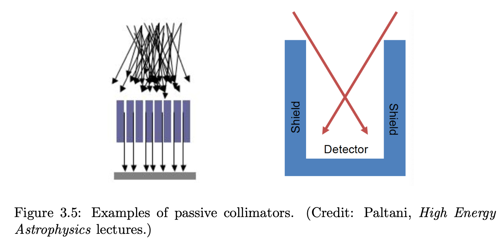

A **mechanical collimator** is the simplest instrument for high-energy X-ray and gamma-ray astronomy
	it works by **geometrically blocking** photons that arrive from outside a defined angular range
		no focusing is possible at these energies — the collimator replaces the telescope

Schematic of a mechanical collimator: absorbent walls around a detector restrict the field of view to a cone of half-angle $\Delta\theta$. Photons from outside this cone are stopped before reaching the detector.

---

## Operating principle

The detector is surrounded by **absorbing walls** (often made of lead, tungsten, or CsI)
	forming a grid of parallel tubes or a honeycomb structure
		only photons arriving within the **collimation angle** pass through to the detector

The **collimation angle** (half-angle of the accepted cone):
$$\Delta\theta \approx \frac{d}{L}$$

where
	$d$ is the diameter (or spacing) of each tube
	$L$ is the length of the tubes

To narrow the field of view: use longer tubes (larger $L$) or smaller tube spacing (smaller $d$)
	typical values: $\Delta\theta \sim 1°$–$5°$
		compared to Chandra's HPD of $0.5''$ — a factor of $\sim 10{,}000$ worse in angular resolution

---

## Observation method: on/off

Since a collimator cannot image the sky,
	source positions are found using the **on/off method**:

**OFF observation**: point at a blank sky region with no known sources
	measure the background count rate $b$

**ON observation**: move the telescope so the source is within the field of view
	measure the total count rate $s + b$

The source count rate is recovered by subtraction:
$$s = (s+b) - b$$

This method requires that the background is **stable and spatially uniform**
	it fails when the background varies between the on and off pointings
	it also fails when the field of view contains **multiple sources** — the collimator cannot separate them

---

## Sensitivity and limitations

The collimator has **good sensitivity** in hard X-rays (above $\sim 10$ keV) and soft gamma-rays
	because photoelectric absorption becomes small, and focusing (grazing incidence) is no longer practical
	it is used in missions like **Uhuru** (2–20 keV), **BeppoSAX PDS** (15–300 keV), **INTEGRAL SPI**

However:
	**no imaging capability** — only total flux in the field of view
	**source confusion**: a bright nearby source within $\Delta\theta$ contaminates the measurement
	**poor angular resolution**: $\Delta\theta \sim$ degrees, not arcseconds
	cannot resolve extended sources or separate AGN from clusters

The collimator was the dominant X-ray instrument in the 1970s (before focusing X-ray telescopes)
	it was replaced by [coded aperture masks](../../02_Zettel/Theory/Coded Mask.md) for imaging, and by [Wolter telescopes](../../02_Zettel/Theory/Wolter Telescope.md) for focusing below $\sim 10$ keV

---

## Comparison with coded mask

| Property | Collimator | Coded mask |
|---|---|---|
| Imaging | No | Yes (via deconvolution) |
| Angular resolution | $\Delta\theta = d/L \sim$ degrees | $\theta \sim d_{mask}/D_{det} \sim$ arcminutes |
| Sensitivity | High (simple) | Lower (background noise from deconvolution) |
| Source confusion | Severe | Mitigated |
| Energy range | Hard X / soft $\gamma$ | Hard X / soft $\gamma$ |

Both instruments share the same fundamental limitation:
	**no focusing** — every detector pixel sees the full field of view simultaneously
		therefore the background is high and cannot be suppressed as in a focusing telescope
