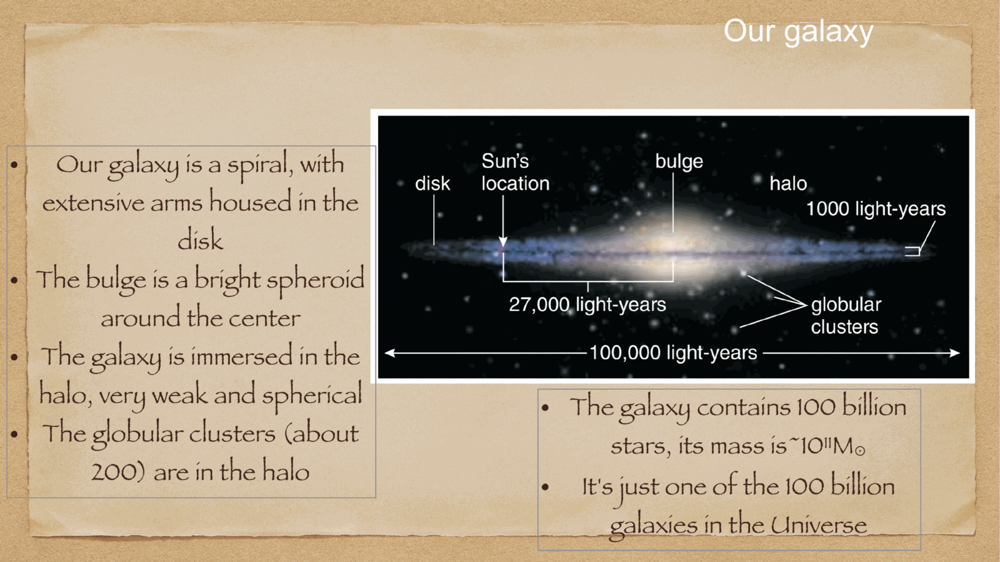

our home galaxy: a **barred spiral galaxy**, type SBbc. the Sun sits in the disk, $\sim 8.2$ kpc from the center, in the **Orion-Cygnus arm** between two major spiral arms.

we live inside it, so mapping the Milky Way is *harder* than mapping external galaxies. dust extinction blocks our view of the central regions in the optical band; we have to use IR and radio to look through it.

---

## the four main components

| component | typical scale | mass | population | gas |
|---|---|---|---|---|
| **disk** | 30 kpc diameter, 300 pc thick | $5 \times 10^{10}\, M_\odot$ | young stars, OB associations, Pop I | HI, H$_2$, dust |
| **bulge** | 1-2 kpc | $10^{10}\, M_\odot$ | old stars, Pop II | little gas |
| **halo** | 30-50 kpc radius | $10^9\, M_\odot$ in stars | very old, low metallicity, Pop II | hot diffuse |
| **dark matter halo** | $\sim 200$ kpc | $10^{12}\, M_\odot$ | non-luminous | none |

---

## the disk

home to most of the Galactic gas and to most of the star formation. structure:

- **thin disk**: scale height $h \sim 300$ pc, age 0–10 Gyr, near-solar metallicity. holds the spiral arms and most young stars.
- **thick disk**: scale height $\sim 1$ kpc, older ($\sim 10$ Gyr), lower metallicity. probably formed by mergers or kinematic heating.

surface density falls exponentially with radius:
$$\Sigma(R) \propto e^{-R/h_R}$$

with scale length $h_R \sim 3$ kpc for the Milky Way. so the disk is heavily concentrated in the inner Galaxy.

---

## the bulge

a triaxial structure (mildly bar-like) of old stars in the central few kpc. contains $\sim 10^{10}\, M_\odot$. low gas content.

old stellar population (Pop II): no recent star formation. the stars formed early in the universe and have been there ever since. but the bulge has multiple populations; recent surveys (APOGEE) reveal a complex star formation history.

at the very center: the **Galactic Center** with the supermassive black hole **Sgr A*** ($M \sim 4 \times 10^6\, M_\odot$). see [Galactic Center](../../02_Zettel/Theory/Galactic Center.html).

---

## the bar

modern observations (especially infrared, e.g. 2MASS, Spitzer) show the inner Milky Way has a **bar** — an elongated stellar structure tilted relative to the Sun-Galactic Center line. about $\sim 5$ kpc long, oriented at $\sim 25-30°$ to our line of sight.

Milky Way is therefore a **barred spiral**: SBbc in the Hubble classification (see [Hubble morphological sequence](../../02_Zettel/Theory/Hubble morphological sequence.html)).

---

## the halo

very low surface brightness component. contains:
- ~150 known **globular clusters** (each with $10^4-10^6$ old stars, very low metallicity)
- isolated halo stars (faint, old, metal-poor)
- a few dwarf satellite galaxies (LMC, SMC, Sagittarius dSph, ...)
- **substructures** from past merger events (e.g. the Sagittarius stream, the Gaia-Enceladus debris)

the halo records the **assembly history** of the Galaxy: each merged satellite leaves behind streams of stars on characteristic orbits.

---

## the rotation curve

how fast does material orbit at radius $R$? the rotation curve $V(R)$ is **flat** out to large radii:
$$V \approx 220\,\text{km/s}\quad (R \gtrsim 5\,\text{kpc})$$

if only luminous matter (stars + gas) contributed to gravity, the curve would Keplerian-decline beyond the visible disk:
$$V \propto 1/\sqrt R$$

instead, $V$ stays flat. this is the signature of an **extended dark matter halo** with $\rho \propto 1/r^2$ (giving $M(r) \propto r$, hence flat $V$).

→ see [Cosmic_inventory_dark_matter](../../02_Zettel/Theory/Cosmic_inventory_dark_matter.html).

local Milky Way dark matter density: $\rho_{DM} \sim 0.4$ GeV/cm$^3$ at the Sun's location. critical input for direct dark matter detection experiments (XENON, LUX, etc.).

---

## the position of the Sun

- $R_{\rm sun} \approx 8.2$ kpc from the Galactic Center (Gravity collaboration, EHT)
- $z_{\rm sun} \approx 25$ pc above the midplane
- in the **Orion-Cygnus arm**, a minor spiral arm between the Sagittarius arm (closer to GC) and the Perseus arm (further out)
- orbital velocity around GC: $\sim 220$ km/s
- orbital period: $\sim 230$ Myr ("galactic year")
- the Sun has completed $\sim 20$ galactic years since formation

---

## see also

- [Fundamentals_Astrophysics_Cosmology_MOC](../../00_Atlas/Fundamentals_Astrophysics_Cosmology_MOC.html)
- [Interstellar medium components and gas cycle](../../02_Zettel/Theory/Interstellar medium components and gas cycle.html)
- [Spiral arm kinematics](../../02_Zettel/Theory/Spiral arm kinematics.html)
- [Galactic Center](../../02_Zettel/Theory/Galactic Center.html)
- [Cosmic_inventory_dark_matter](../../02_Zettel/Theory/Cosmic_inventory_dark_matter.html)
- [Hubble morphological sequence](../../02_Zettel/Theory/Hubble morphological sequence.html)
- [Galaxies in the local universe](../../02_Zettel/Theory/Galaxies in the local universe.html)
