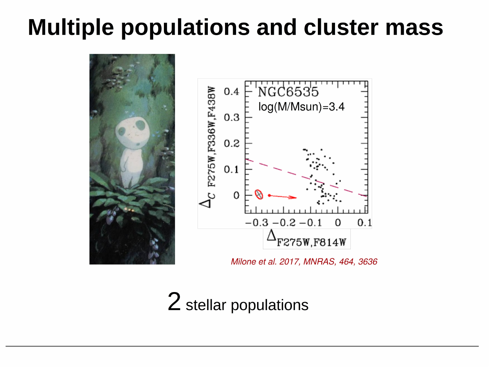

for most of the 20th century globular clusters were the textbook example of a [Single stellar population SSP](../../02_Zettel/Theory/Single stellar population SSP.html): one age, one metallicity, one helium content, all stars formed in a single burst from chemically homogeneous gas. this picture broke down gradually + then catastrophically over three decades.

## the spectroscopic prelude

the first cracks appeared in the 1970s with low-resolution spectroscopy of red giants in M3 + M13. some giants showed strong CN bands, others did not, at the same luminosity + metallicity. cohen, norris, freeman, suntzeff + others noticed star-to-star variations in CN, CH, Na that could not be reproduced by any single isochrone.

through the 1980s + 1990s these scattered anomalies coalesced into a coherent pattern. high-resolution echelle spectroscopy by carretta, gratton, sneden, kraft + collaborators showed that essentially every well-studied galactic GC has a [Na O anticorrelation](../../02_Zettel/Theory/Na O anticorrelation.html): stars that are sodium-rich are oxygen-poor, + vice versa. this anti-correlation is not seen in halo or disk field stars at the same metallicity. it is the chemical fingerprint of GCs.

the fanfare moment was the FLAMES@VLT survey by carretta + gratton + bragaglia (2009, 2010), which observed ~2500 RGB stars in 19 GCs. every cluster showed Na-O. they argued this was the defining signature of a globular cluster: any old massive cluster has it, any cluster without it is not really a GC.

*Na-O anti-correlation in 19 GCs (Carretta et al. 2009): every cluster shows the inverse correlation between [Na/Fe] and [O/Fe], the chemical fingerprint of multiple populations.*

## the photometric revolution

spectroscopy is expensive + reaches only the brightest giants. the breakthrough came when HST + UV photometry made the populations visible directly on the [Color-magnitude diagrams of clusters](../../02_Zettel/Theory/Color-magnitude diagrams of clusters.html).

bedin et al. 2004 used ACS to image $\omega$ Centauri + found a clearly split Main sequence MS: two parallel sequences separated by ~0.1 mag in color, both extending from the turn-off down several magnitudes. this could not be a chance superposition or a binary sequence. $\omega$ Cen was already known to be chemically peculiar (wide [Fe/H] spread, anomalous abundances), but the MS split forced the conclusion that it hosted physically distinct populations.

piotto et al. 2007 then found a triple main sequence in NGC 2808, a cluster previously thought to be normal. three discrete MS branches, with the bluest interpreted as helium-enhanced ($Y \sim 0.40$) by d'antona + caloi. this was the moment GCs lost their SSP status definitively. NGC 2808 had no metallicity spread, so the only way to split the MS was a [Helium spread in GCs](../../02_Zettel/Theory/Helium spread in GCs.html).

## the UV legacy survey

milone, piotto, bedin + collaborators systematized this with the HST UV Legacy Survey of GCs (PI piotto, milone et al. 2017). 57 galactic GCs imaged in F275W + F336W + F438W + F606W + F814W. the UV filters are the magic: F275W is sensitive to OH, F336W to NH, F438W contains the CN + CH bands. stars with different (C, N, O) abundances split cleanly in UV colors even when they overlap in optical.

this survey produced [Photometric chromosome maps](../../02_Zettel/Theory/Photometric chromosome maps.html) for nearly every galactic GC + showed that multiple populations are universal in old massive clusters. it also revealed [Type I and Type II GCs](../../02_Zettel/Theory/Type I and Type II GCs.html) as two distinct flavors of the phenomenon.

## what we now believe

every old galactic GC with mass $M \gtrsim 10^{4.5}\, M_\odot$ hosts at least two populations:
- 1G: primordial composition (Na-poor, O-rich, CN-weak, normal He)
- 2G: enhanced in Na, Al, N, He + depleted in O, Mg, C

the 2G fraction averages ~65% across the survey, increases with cluster mass, + the populations are not radially mixed in the youngest dynamical sense (2G often centrally concentrated, suggesting it formed in a denser inner region).

this is the central problem of Stellar Astrophysics today: GCs are not SSPs, the Na-O anti-correlation reflects hot proton-capture nucleosynthesis, + something polluted the cluster gas before the 2G formed. who the polluter was remains the open question (see [Polluter scenarios for second-generation GC stars](../../02_Zettel/Theory/Polluter scenarios for second-generation GC stars.html)).

## see also

- [Na O anticorrelation](../../02_Zettel/Theory/Na O anticorrelation.html)
- [CN CH MgAl anticorrelations](../../02_Zettel/Theory/CN CH MgAl anticorrelations.html)
- [Helium spread in GCs](../../02_Zettel/Theory/Helium spread in GCs.html)
- [Photometric chromosome maps](../../02_Zettel/Theory/Photometric chromosome maps.html)
- [Type I and Type II GCs](../../02_Zettel/Theory/Type I and Type II GCs.html)
- [Polluter scenarios for second-generation GC stars](../../02_Zettel/Theory/Polluter scenarios for second-generation GC stars.html)
- [GC formation models with MPs](../../02_Zettel/Theory/GC formation models with MPs.html)
- [Single stellar population SSP](../../02_Zettel/Theory/Single stellar population SSP.html)
- [Color-magnitude diagrams of clusters](../../02_Zettel/Theory/Color-magnitude diagrams of clusters.html)
- [Stellar populations I II III](../../02_Zettel/Theory/Stellar populations I II III.html)
- [Stellar_Astrophysics_MOC](../../00_Atlas/Stellar_Astrophysics_MOC.html)
