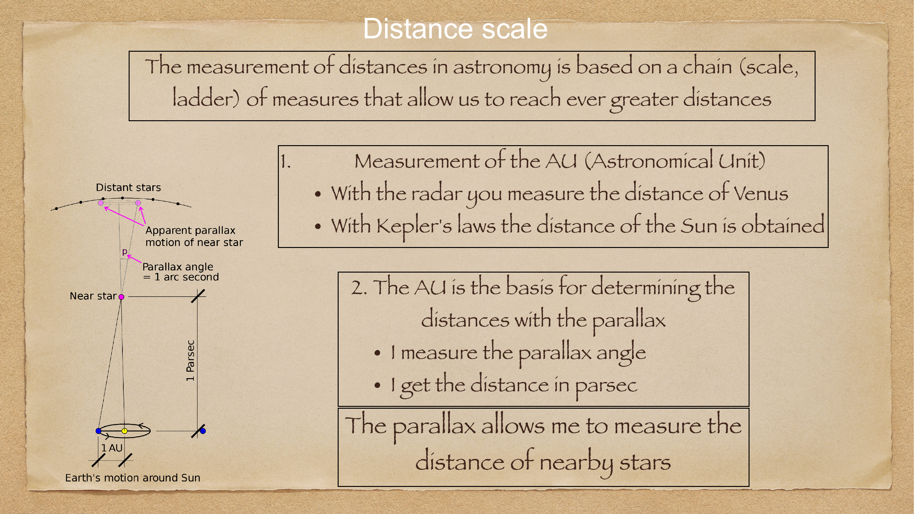
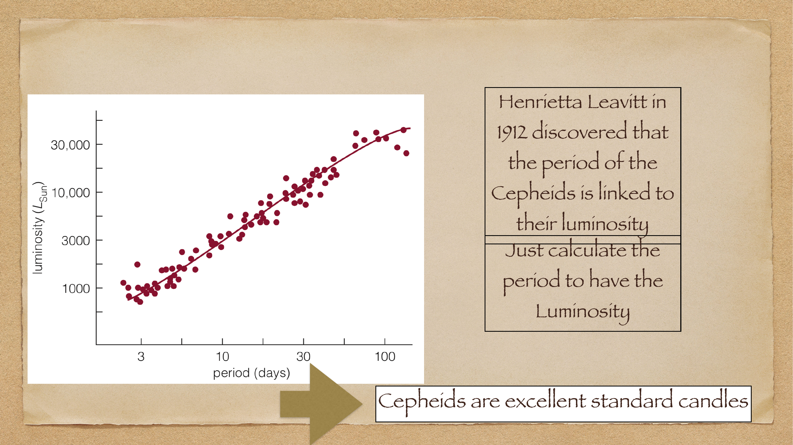

distances in astronomy span $\sim 30$ orders of magnitude — from the Earth-Moon distance (light-second) to the radius of the observable universe ($\sim 14$ Gpc). no single technique works at all scales. instead we use a **distance ladder**: each technique calibrated against the previous one.

the ladder starts from **trigonometric parallax** and extends to **standard candles** (Cepheids, supernovae) and **standard rulers** (BAO).

---

## trigonometric parallax

the most fundamental distance measurement: pure geometry.

as the Earth orbits the Sun, a nearby star appears to shift back and forth against the more distant background. the **parallax angle** $p$ is half the apparent angular shift over a year:
$$p = \frac{1\,\text{AU}}{d}$$

so the distance is:
$$\boxed{\,d = \frac{1}{p}\,\text{(in pc, with $p$ in arcseconds)}\,}$$

definition of the **parsec**: a star with $p = 1''$ is at $d = 1$ pc $\approx 3.086 \times 10^{16}$ m $\approx 3.26$ light-years.

closest stars:
- Proxima Centauri: $p = 768$ mas → $d = 1.3$ pc
- α Cen A/B: $p = 747$ mas → $d = 1.34$ pc
- Sirius A: $p = 379$ mas → $d = 2.64$ pc

with **Hipparcos** (1990s): parallaxes to $\sim 1$ mas precision, accessible distances to $\sim 100$ pc.
with **Gaia** (DR3, 2022): parallaxes to $\sim 30\,\mu$as for bright stars, distances out to $\sim$ 30 kpc — the entire Milky Way.

Gaia has revolutionized astrophysics: $> 10^9$ parallaxes, the cleanest distance measurements ever made.

---

## the limit of parallax

even Gaia cannot measure parallaxes for galaxies. we need to:
1. measure parallax distances to nearby objects of known type (e.g. Cepheid variables)
2. calibrate their **intrinsic luminosity**
3. use them as **standard candles** at larger distances

this is the **distance ladder**.

---

## standard candles

a standard candle is an object of **known intrinsic luminosity**. measuring its apparent brightness gives the distance via $F = L/(4\pi d^2)$, equivalently $d_L^2 = L/(4\pi F)$.

candidates:
- **Cepheid variables**: period-luminosity relation (see [Cepheids and supernovae](../../02_Zettel/Theory/Cepheids and supernovae.md))
- **RR Lyrae stars**: horizontal-branch pulsators, $M_V \approx 0.5$ — useful in old stellar populations
- **TRGB**: tip of the red giant branch, $M_I \approx -4.0$ — uses the Helium flash that ends RGB evolution
- **planetary nebula luminosity function**: bright cutoff at $M = -4.5$ in [OIII] 5007 Å — galaxy distances
- **surface brightness fluctuations**: Poisson noise of unresolved giants in elliptical galaxies
- **Tully-Fisher**: $L \propto V_{\rm flat}^4$ for spirals (see [Tully-Fisher relation](../../02_Zettel/Theory/Tully-Fisher relation.md))
- **fundamental plane**: $R_e \propto \sigma^{1.4} \langle I\rangle^{-0.9}$ for ellipticals
- **SN Ia**: standard candle thermonuclear explosions (see [Cepheids and supernovae](../../02_Zettel/Theory/Cepheids and supernovae.md))

each is calibrated against the previous step:
parallax → Cepheids in MW → Cepheids in nearby galaxies → SN Ia in same galaxies → SN Ia at high z

---

## the distance modulus

a logarithmic distance, in magnitudes:
$$\mu \equiv m - M = 5\log_{10}(d_{\rm pc}/10) = 5\log_{10}(d_{\rm Mpc}) + 25$$

(see [Magnitudes and photometric systems](../../02_Zettel/Theory/Magnitudes and photometric systems.md)). this is the standard way to express distances in observational astronomy.

example: for the Andromeda galaxy at $d = 0.78$ Mpc, $\mu = 24.5$. for the Hubble Deep Field at $z = 1$, $\mu \approx 44$.

---

## the distance ladder in steps

| step | technique | reach | calibrated against |
|---|---|---|---|
| 1 | parallax (Gaia) | 30 kpc | geometry |
| 2 | Cepheids in MW | 30 kpc (Galactic) | parallax |
| 3 | Cepheids in nearby galaxies (HST KP) | 30 Mpc | MW Cepheids |
| 4 | SN Ia in galaxies hosting Cepheids | 30 Mpc | HST Cepheids |
| 5 | SN Ia at higher z | 1000 Mpc and beyond | local SN Ia |
| 6 | BAO standard ruler | $z \sim 0.1$ - 3 | CMB |
| 7 | CMB acoustic peak | $z = 1100$ | physics from first principles |

steps 5 → 6 give the **Hubble diagram**, which discovered acceleration (1998).
steps 7 → 1 give the **inverse distance ladder**: anchor at the CMB sound horizon, work outward.

the **Hubble tension** between steps 1-5 (local, $H_0 = 73$) and step 7 (CMB, $H_0 = 67$) is the major outstanding puzzle of cosmological measurement.

---

## why this matters

every distance in cosmology uses this ladder. a wrong step at any rung propagates:
- a wrong parallax zero point shifts everything by a constant factor
- a wrong Cepheid metallicity dependence affects the LMC-anchored P-L relation
- a wrong SN Ia standardization affects high-z distances

so the cosmic distance ladder is a careful, multi-decade effort to **propagate calibration uncertainties** to high redshift. it is one of the great projects of modern astronomy.

---

## see also

- [Fundamentals_Astrophysics_Cosmology_MOC](../../00_Atlas/Fundamentals_Astrophysics_Cosmology_MOC.md)
- [Cepheids and supernovae](../../02_Zettel/Theory/Cepheids and supernovae.md)
- [Hubble's law and cosmological redshift](../../02_Zettel/Theory/Hubble's law and cosmological redshift.md)
- [Magnitudes and photometric systems](../../02_Zettel/Theory/Magnitudes and photometric systems.md)
- [Tully-Fisher relation](../../02_Zettel/Theory/Tully-Fisher relation.md)
- [Fundamental plane of ellipticals](../../02_Zettel/Theory/Fundamental plane of ellipticals.md)
- [Hubble constant and deceleration parameter](../../02_Zettel/Theory/Hubble constant and deceleration parameter.md)
- 03_Zettel/Theory/Cosmological distances
- [Cosmic_inventory_dark_energy](../../02_Zettel/Theory/Cosmic_inventory_dark_energy.md)
