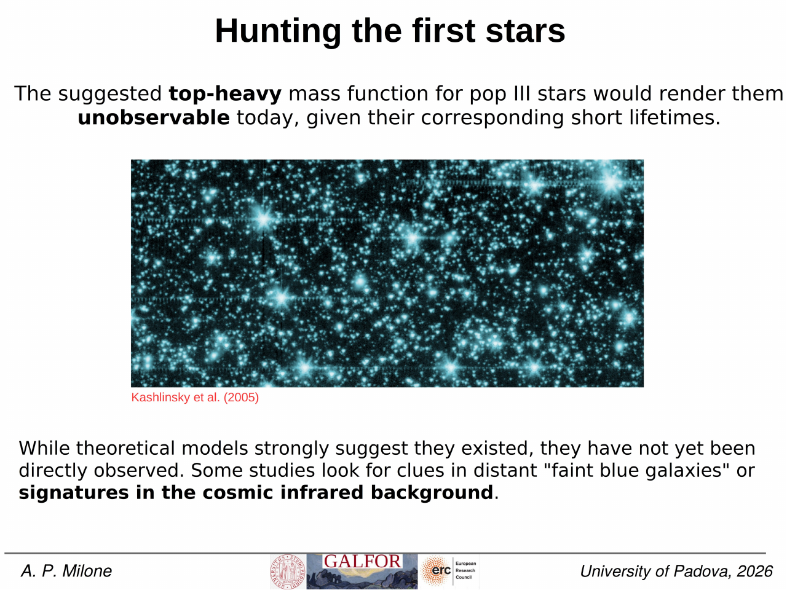

**Population III stars** are the hypothetical first generation of stars in the universe, formed from primordial gas at $z \sim 20$-$30$ with $Z = 0$ (no metals beyond H, He, Li from BBN). they are the **bridge between the Big Bang and chemical evolution**: their nucleosynthesis seeded the universe with the first heavy elements, enabling all subsequent star formation.

## the predicted IMF

without metals, the gas cooling channels are restricted to:
- molecular hydrogen H$_2$ (rotational + vibrational lines, weak below $\sim 200$ K);
- HD cooling (slightly more efficient at low $T$);
- atomic hydrogen Lyman-$\alpha$ (above $10^4$ K).

these are weak compared to metal-line cooling. the consequence: gas in primordial halos cannot fragment into low-mass clouds. simulations (Bromm & Larson 2004 review, ARA&A 42, 79) predict a **top-heavy IMF** with characteristic mass $\langle M \rangle \sim 100\,M_\odot$ and stars potentially up to $1000\,M_\odot$.

this is dramatically different from the [Salpeter/Chabrier IMFs](../../02_Zettel/Theory/Salpeter Kroupa Chabrier IMFs.md) of present-day stellar populations.

## fates of Pop III stars

depending on initial mass:

| $M_{\rm Pop III}$ | fate | yield |
|---|---|---|
| $\lesssim 9\,M_\odot$ | white dwarf | minimal enrichment |
| $10$-$40\,M_\odot$ | core-collapse SN | typical CCSN yields |
| $40$-$100\,M_\odot$ | direct collapse to BH | no enrichment |
| $140$-$260\,M_\odot$ | **pair-instability supernova** | enormous enrichment, 100% destruction, characteristic even-Z pattern |
| $> 260\,M_\odot$ | direct collapse to BH | no enrichment |

so the **even-Z element pattern** is a smoking gun for pair-instability SNe. searches for stars with this pattern have so far been unsuccessful, suggesting most Pop III stars were either $< 140\,M_\odot$ (CCSN dominant) or $> 260\,M_\odot$ (direct collapse, no enrichment).

## why no direct detection (yet)

Pop III stars formed at $z \sim 15$-$30$, within $\sim 100$-$300$ Myr after the Big Bang. by $z \sim 6$ (reionisation completion), most have either died as SNe or been incorporated into Pop II stars. JWST is now searching for direct detection at $z > 10$ via:

- **He II $\lambda 1640$ emission**: characteristic of $T_{\rm eff} > 10^5$ K (only achievable in extremely massive low-metallicity stars).
- **strong UV continuum + Balmer break absence**.
- **specific SED slopes** distinct from later galaxy populations.

candidate Pop III SF regions identified at $z \sim 10$-$15$ (LAP1-B, GLASS-z12, etc.) are tantalising but not yet definitive. see [JWST and the first stars](../../02_Zettel/Theory/JWST and the first stars.md).

## the indirect evidence: CEMP-no + r-II stars

Pop III nucleosynthesis is fingerprinted in the chemistry of extremely metal-poor ($[{\rm Fe/H}] < -3$) Galactic halo + UFDG stars:

- **CEMP-no stars** (carbon-enhanced metal-poor, no s-process): high [C/Fe] without the s-process pattern of AGB stars; consistent with the predicted yields of zero-metallicity faint SNe (Christlieb et al. 2002, HE 0107-5240).
- **r-process II stars**: [Eu/Fe] $> +1$, requiring rare neutron-star mergers or magnetorotational SNe; some observed in UFDGs (Ji et al. 2016 in Reticulum II).
- **near-zero metallicity giants**: HE 1327-2326 with $[{\rm Fe/H}] = -5.4$ (Frebel et al. 2005, Nature 434, 871) — among the most iron-poor stars ever found.

these stars are direct chemical fossils of single-progenitor Pop III enrichment events: each is a "ghost" of a single Pop III progenitor that polluted a small protocloud.

## connection to first galaxy formation

Pop III stars set the timing of:

1. the **end of the cosmic dark ages** (their UV photons reionise H);
2. the **transition from Pop III to Pop II** at $Z = Z_{\rm crit} \sim 10^{-5}$-$10^{-4}\,Z_\odot$ (see [Critical metallicity for fragmentation](../../02_Zettel/Theory/Critical metallicity for fragmentation.md));
3. the **seeding of supermassive black holes** (direct-collapse Pop III stars $> 260\,M_\odot$ may form intermediate-mass BHs that later grow into SMBHs).

## surveys for extremely metal-poor stars

the hunt for Pop III fossils is carried out by several ongoing survey programs (Milone 2026, Lecture 14):

- **Hamburg/ESO Survey** (Christlieb, Frebel, Beers): low-resolution prism survey selecting metal-poor candidates from objective-prism Ca K line weakness. discovered HE 0107-5240 and HE 1327-2326.
- **SkyMapper** (Wolf et al. 2018): southern photometric survey using a dedicated $v$-filter centered on the Ca II K + H lines. photometric metallicity from $v-g$ color allows pre-selection of $[{\rm Fe/H}] < -3$ candidates down to $g \sim 17$.
- **Pristine survey** (Starkenburg et al. 2017): northern photometric survey using a narrow CaHK filter on CFHT MegaCam. photometric $[{\rm Fe/H}]$ accuracy $\sim 0.2$ dex for metal-poor halo stars.
- **R-Process Alliance** (Hansen et al. 2018): systematic follow-up of r-process-enhanced stars to map early neutron-capture nucleosynthesis.

## reference papers

- **Bromm & Larson 2004, ARA&A 42, 79** — review of Pop III stars + critical metallicity.
- **Christlieb et al. 2002, Nature 419, 904** — HE 0107-5240, an ultra-iron-poor giant.
- **Frebel et al. 2005, Nature 434, 871** — HE 1327-2326, $[{\rm Fe/H}] = -5.4$.
- **Beers & Christlieb 2005, ARA&A 43, 531** — review of metal-poor stars.
- **Heger & Woosley 2002, ApJ 567, 532** — Pop III nucleosynthesis predictions.
- **Karlsson et al. 2013, RvMP 85, 809** — review of stellar archaeology.
- **Wolf et al. 2018** — SkyMapper survey for metal-poor stars.
- **Starkenburg et al. 2017** — Pristine CaHK photometric metallicity survey.
- **Hansen et al. 2018** — R-Process Alliance.

## see also

- [Critical metallicity for fragmentation](../../02_Zettel/Theory/Critical metallicity for fragmentation.md)
- [Pop III nucleosynthesis signatures](../../02_Zettel/Theory/Pop III nucleosynthesis signatures.md)
- [Search for Pop III stars in dwarf galaxies](../../02_Zettel/Theory/Search for Pop III stars in dwarf galaxies.md)
- [JWST and the first stars](../../02_Zettel/Theory/JWST and the first stars.md)
- [Pop III remnants in UFDGs](../../02_Zettel/Theory/Pop III remnants in UFDGs.md)
- [Big Bang nucleosynthesis](../../02_Zettel/Theory/Big Bang nucleosynthesis.md)
- [Ultra-faint dwarf galaxies definition](../../02_Zettel/Theory/Ultra-faint dwarf galaxies definition.md)
- [Stellar_Astrophysics_MOC](../../00_Atlas/Stellar_Astrophysics_MOC.md)
