before any astrophysics: just *how do we point at the sky*.
	the stars look like they sit on a sphere
		whose center happens to be wherever I am standing.
			I do not know their true distances from me, and for the purposes of pointing I do not care.
				I just need **two coordinates** to identify a point on the celestial sphere,
					and a way to **transform between coordinate systems**.

this is the geometry every later observation in every later course assumes.

---

## the celestial sphere

old globes, old astrolabes, old cosmographies — all of them rest on the same idea: a sphere of directions, parametrized by two angles.

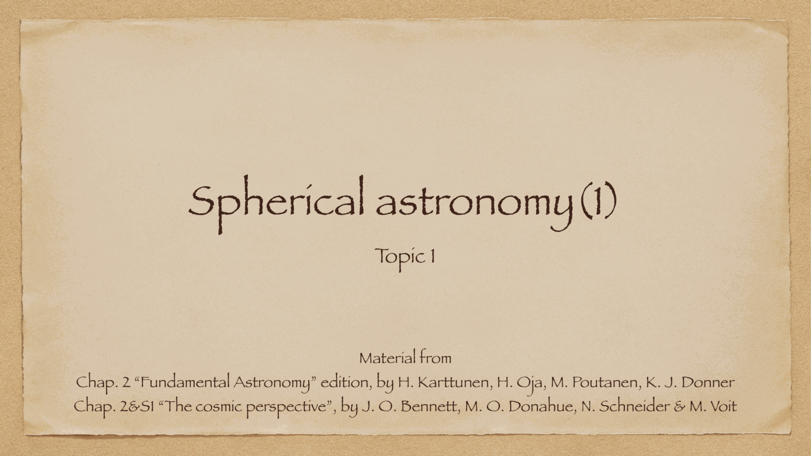

---

## great circles and spherical triangles

a **great circle** (massimo cerchio) is the intersection of the sphere with a plane through its center. a **small circle** (cerchio minore) is the intersection with a plane *not* through the center. the two points at which the perpendicular axis through the center pierces the sphere are the **poles** of that great circle.

a **spherical triangle** is bounded by three arcs of great circles.

the side $|AB|$ of the spherical triangle and the central angle $c$ subtending it are tied by
$$|AB| = r c, \qquad [c] = \text{rad}$$

so on a unit-radius sphere the angles *are* the side lengths. this is convenient: on the celestial sphere we never need the radius — it cancels out of every angular relation.

### spherical excess

unlike planar triangles, a spherical triangle has internal angles that sum to *more* than $180°$:
$$A + B + C > 180°$$

the excess $E$ is itself geometric:
$$E = A + B + C - 180°$$

and the area of the triangle is exactly
$$\text{Area}(ABC) = E r^2 \qquad [E] = \text{rad}$$

so an octant of a unit sphere ($A = B = C = 90°$) has $E = 90° = \pi/2$ and area $\pi/2$, which checks out ($1/8$ of $4\pi$).

---

## spherical trigonometry: rotating between coordinate systems

a point $P$ on a sphere can be written in two ways:
- **cartesian**: $(x, y, z)$
- **two angles**: $(\psi, \theta)$, with $\theta$ the elevation from the $xy$-plane and $\psi$ counter-clockwise from the positive $x$-axis

so on a unit sphere
$$x = \cos\psi\cos\theta, \quad y = \sin\psi\cos\theta, \quad z = \sin\theta$$

now consider a second system $(x', y', z')$ obtained by rotating around the $x$-axis by an angle $\chi$:

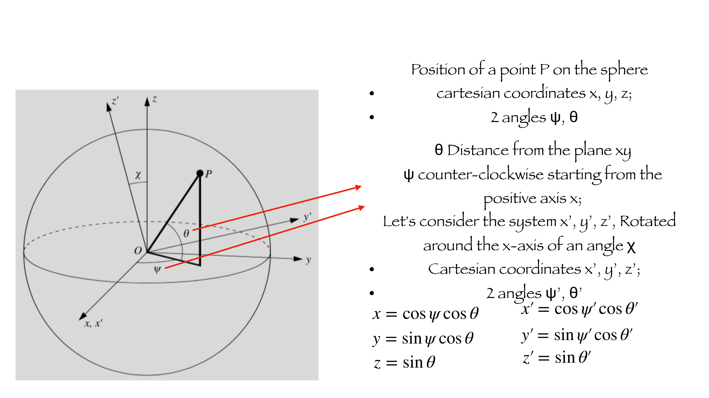

the cartesian rotation is just
$$x' = x, \qquad y' = y\cos\chi + z\sin\chi, \qquad z' = z\cos\chi - y\sin\chi$$

substituting the angular form into the cartesian rotation gives the **three master equations of spherical trigonometry**:

$$\cos\psi'\cos\theta' = \cos\psi\cos\theta$$
$$\sin\psi'\cos\theta' = \sin\psi\cos\theta\cos\chi + \sin\theta\sin\chi$$
$$\sin\theta' = \sin\theta\cos\chi - \sin\chi\sin\psi\cos\theta$$

these are the *only* trig identities I need for the rest of spherical astronomy. every coordinate transformation, every rise-set calculation, every altitude formula is a special case of these.

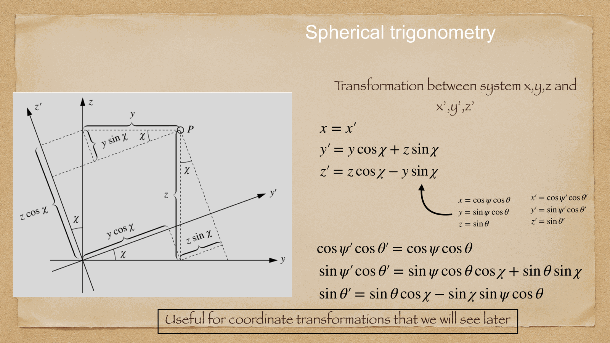

### applied to a spherical triangle

now think of the same setup as a spherical triangle on the celestial sphere, with $z$ pointing at vertex $A$ and $z'$ pointing at vertex $B$. the angles of the triangle are $A, B, C$, and the sides (arcs opposite each vertex) are $a, b, c$.

reading the diagram:
$$\psi = A - 90°, \qquad \theta = 90° - b, \qquad \chi = c$$
$$\psi' = 90° - B, \qquad \theta' = 90° - a$$

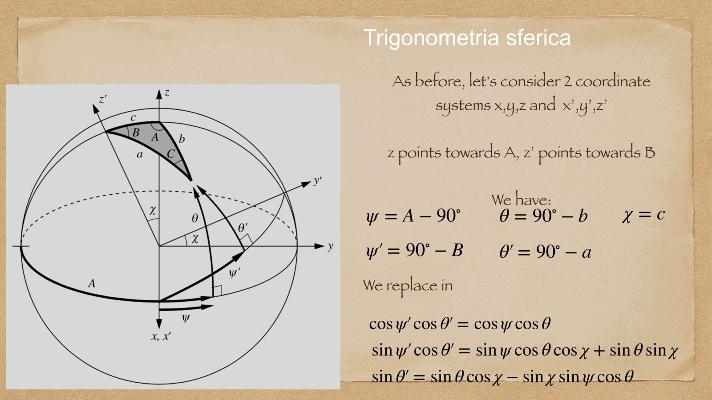

substituting in the master equations and using $\cos(90° - x) = \sin x$, $\sin(90° - x) = \cos x$:

$$\cos(90° - B)\cos(90° - a) = \cos(A - 90°)\cos(90° - b)$$
$$\sin(90° - B)\cos(90° - a) = \sin(A - 90°)\cos(90° - b)\cos c + \sin(90° - b)\sin c$$
$$\sin(90° - a) = -\sin(A - 90°)\cos(90° - b)\sin c + \sin(90° - b)\cos c$$

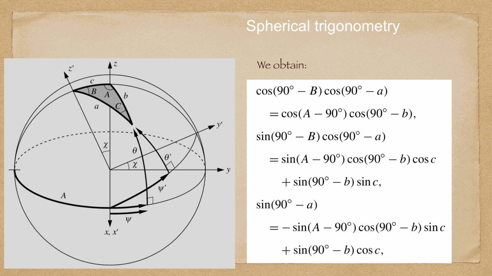

cleaning up:
$$\sin B \sin a = \sin A \sin b$$
$$\cos B \sin a = -\cos A \sin b \cos c + \cos b \sin c$$
$$\cos a = \cos A \sin b \sin c + \cos b \cos c$$

permuting indices on the first one:
$$\sin C \sin b = \sin B \sin c, \qquad \sin A \sin c = \sin C \sin a$$

stitching them together gives the **sine rule on the sphere**:
$$\boxed{\,\frac{\sin a}{\sin A} = \frac{\sin b}{\sin B} = \frac{\sin c}{\sin C}\,}$$

useful for distances between points on the sphere.

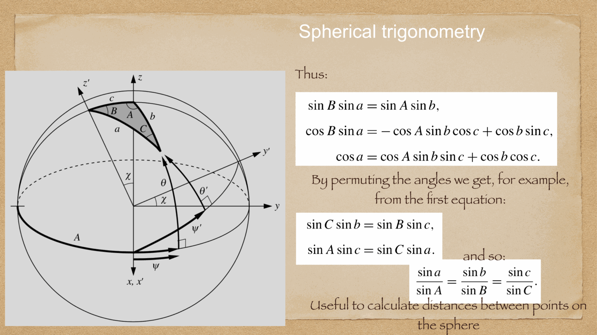

---

## Earth coordinates

the Earth's rotation axis defines its **two poles**. perpendicular to the axis, through the center, is the **equatorial plane**, and its intersection with the surface is the **equator**.

- a **parallel of latitude** is a small circle parallel to the equator
- a **meridian** is a half-great-circle joining the two poles

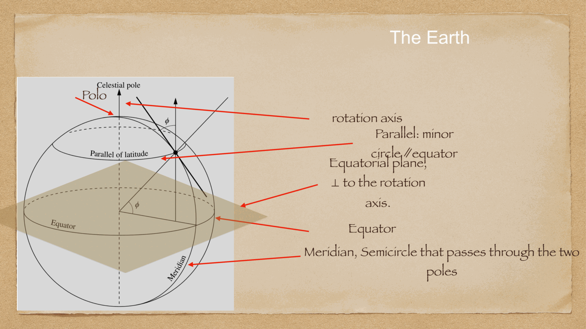

the two coordinates on the Earth's surface:
- **geographical latitude** $\phi$: the angle between the local vertical and the equatorial plane (positive northward, negative southward)
- **geographical longitude** $\theta$ (sometimes $\lambda$): the angle between the meridian through the point and the Greenwich meridian (positive east, negative west)

note: $\phi$ also equals **the altitude of the celestial pole on the local horizon**. this is the trick most navigation tables use.

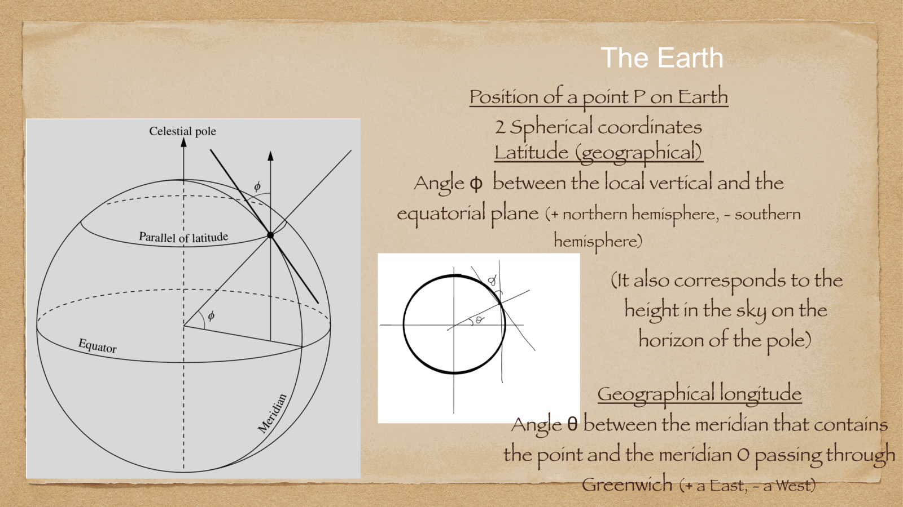

### worked example: Helsinki to La Palma

with $\phi_1 = 60°, \lambda_1 = 25°$ (Helsinki) and $\phi_2 = 28.7°, \lambda_2 = -17.5°$ (La Palma), the great-circle distance:

apply $\cos a = \cos A \sin b \sin c + \cos b \cos c$ with $A = \lambda_1 - \lambda_2 = 42.5°$, $b = 90° - \phi_1$, $c = 90° - \phi_2$.

substituting numbers (page from the slides): $\cos a = 0.732 \cdot 0.5 \cdot 0.877 + 0.866 \cdot 0.48 = 0.32 + 0.416 = 0.72$, so $a = 42.5° = 0.74$ rad. with Earth radius $R = 6400$ km:
$$d = a \cdot R = 4748~\text{km}$$

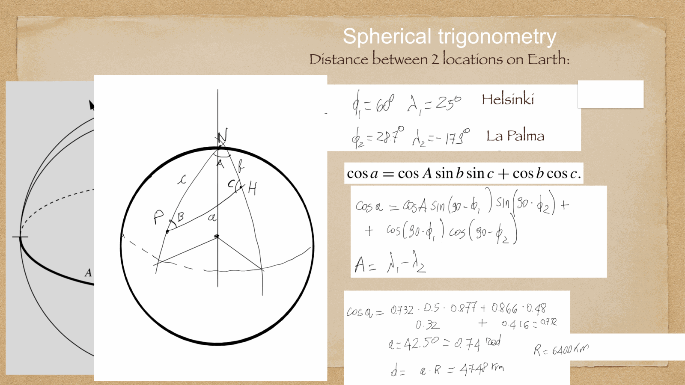

---

## the horizontal (alt-azimuth) system

the most natural one for a person standing on Earth: take the local horizontal plane as the reference plane.

- **zenith** $Z$: directly overhead
- **nadir**: opposite of zenith
- **horizon**: where the local horizontal plane meets the sky
- **vertical circle**: a great circle through the zenith
- **meridian**: the vertical circle through the celestial pole — passes through cardinal points N and S

a celestial body's coordinates:
- **azimuth** $A$: angle along the horizon from the cardinal point S (clockwise), $A \in [0°, 360°]$
- **height** (altitude) $a$: angle above the horizon along the body's vertical, $a \in [-90°, 90°]$
- **zenith distance** $z = 90° - a$

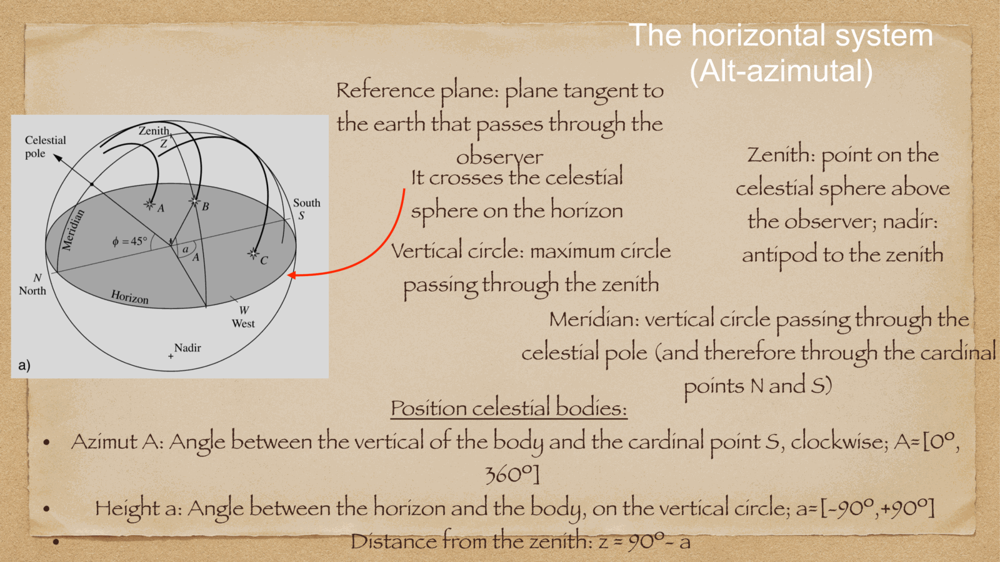

### the catch with alt-azimuth

these coordinates are **time-dependent and observer-dependent**. three stars A, B, C rising in the east, culminating in the meridian, and setting in the west have different coordinates depending on the observer's latitude:

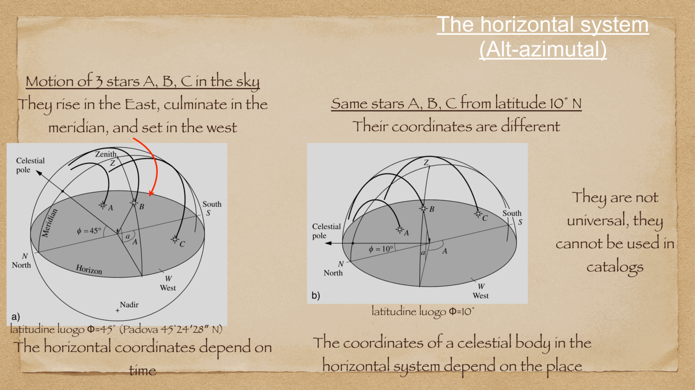

at $\phi = 45°$ N (Padova) the picture is one thing; at $\phi = 10°$ N it's another. and within a single night the same star moves continuously through different $(A, a)$ values. so alt-azimuth is **not a catalog system** — you cannot tabulate stars in this frame.

---

## the equatorial system

instead, use the Earth's rotation axis as the reference axis. it is (almost) constant in time, so the celestial pole and celestial equator are fixed relative to the stars.

- **astronomical meridian**: the great circle through the zenith and the (celestial) pole
- $\gamma$ **point** (vernal equinox, "punto gamma"): the spring intersection of the celestial equator with the ecliptic — the apparent position of the Sun on the sphere on March 21
- **right ascension** $\alpha$ (RA): angular distance of a star eastward from $\gamma$ along the equator
- **declination** $\delta$: angular distance of the star from the celestial equator

these are **independent of the Earth's rotation and of the observer's position**. a catalogable coordinate system.

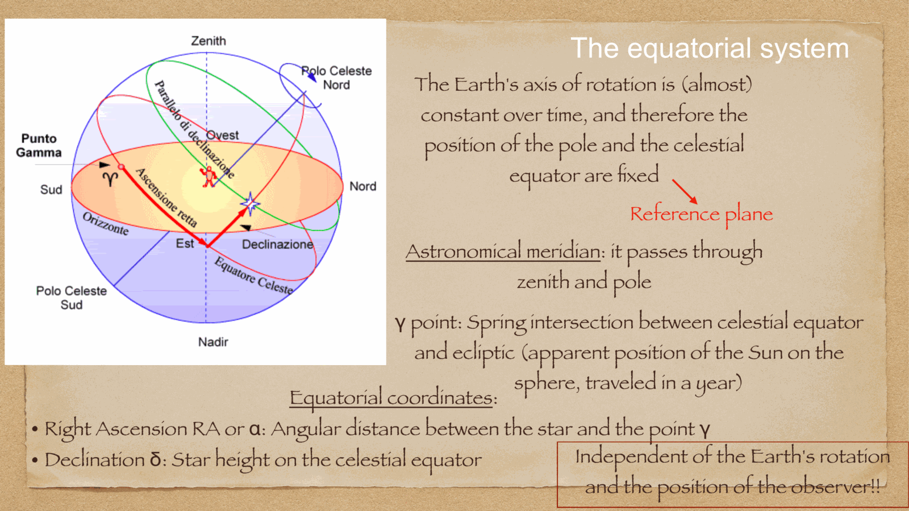

### what stars do over a night

during the night the stars *appear* to rotate around the celestial pole. the height of the pole on the horizon is the **observer's latitude**.

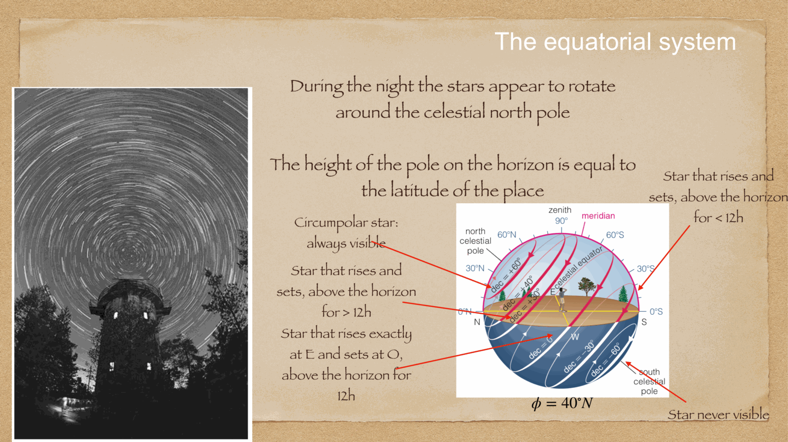

three categories of star:
- **circumpolar**: $\delta + \phi > 90°$, always above the horizon, visible 24 h
- **rises and sets**, above the horizon for **more than 12 h** (equator-side, intermediate $\delta$)
- **rises exactly at E and sets exactly at W**, above the horizon for exactly 12 h (declination zero)
- **rises and sets**, above the horizon for **less than 12 h** (low $\delta$, opposite hemisphere)
- **never visible**: $\delta < \phi - 90°$

### views from different latitudes

extreme cases give a clean intuition:

- **at the north pole**: the celestial pole is at the zenith. only half the sphere is visible. all visible stars are circumpolar and visible for 24 h.
- **at $30°$ S**: a generic latitude — some circumpolar stars (around the south celestial pole), some rise/set
- **at the equator**: you see the whole celestial sphere over a year. there are no circumpolar stars. all stars are visible for 12 h each day.

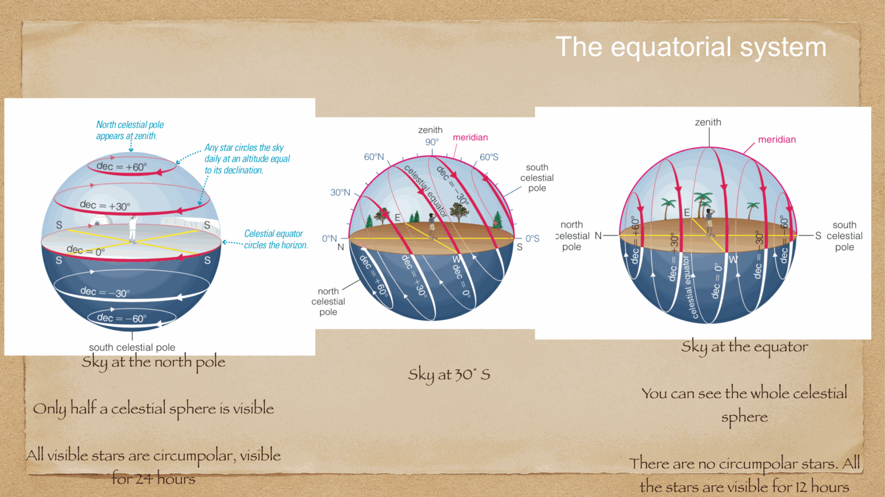

### hour angle and sidereal time

declination $\delta$ tells me which **circle of declination** an object travels on. but the $\gamma$ point itself moves across the sky during the night because of Earth's rotation, so I cannot simply use $\alpha$ to find a body in real time. I need a *local* coordinate that pairs with $\alpha$.

define the **hour angle** $h$: the angle measured along the celestial equator clockwise from the south meridian to the body's hour circle. then the **sidereal time** $\Theta$ (or LST, local sidereal time) is the hour angle of the $\gamma$ point itself, and:
$$\boxed{\,\Theta = h + \alpha\,}$$

practical use: I point at a star with known $(\alpha, \delta)$ and read $h$ off the hour wheel of the telescope. that gives me the local sidereal time.

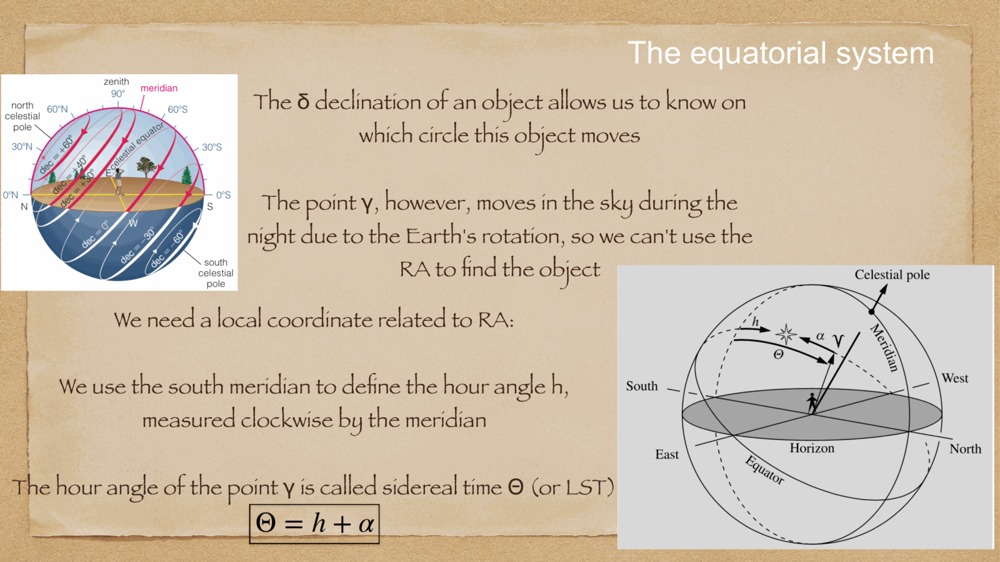

### sidereal day vs solar day

both $\Theta$ and $h$ change at the same rate. it is convenient to express RA and the hour angle in **time units**: $24$ h corresponds to $360°$, so $1$ h $\to 15°$, $1$ m $\to 15'$.

- **sidereal day**: time for the stars to return to the same position in the sky
- **solar day**: time for the Sun to return to the same position in the sky

these are *different*. solar time and sidereal time differ by the orbital motion of the Earth around the Sun:
$$\text{solar day} - \text{sidereal day} \approx 3\,\text{m}\,56\,\text{s}$$

so sidereal time runs $\sim 4$ minutes faster per day than solar time. one full year offset = $24$ h.

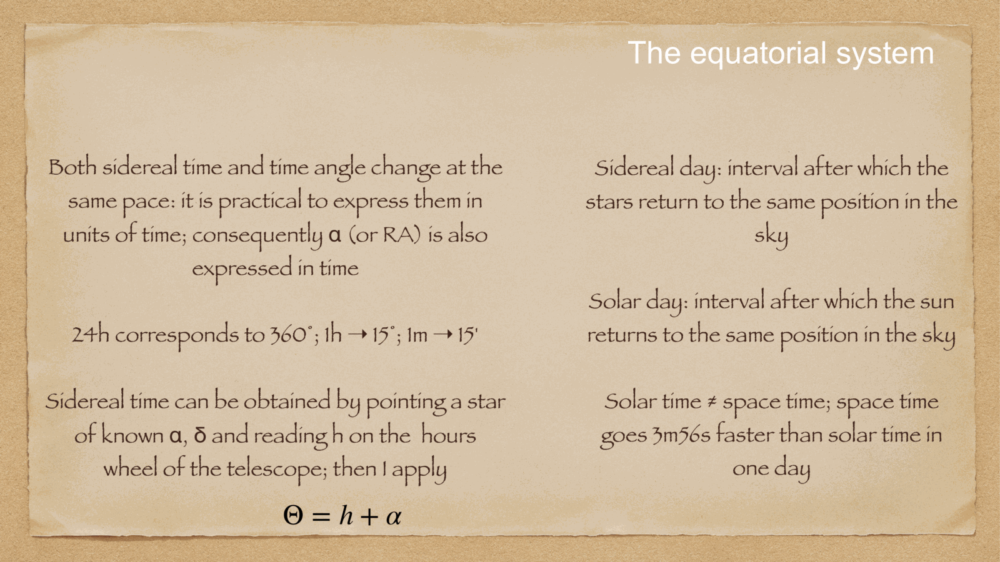

---

## transformations between alt-azimuth and equatorial

specialize the master spherical-trig equations to:
$$\psi = 90° - A, \qquad \theta = a, \qquad \chi = 90° - \phi$$
$$\psi' = 90° - h, \qquad \theta' = \delta$$

(reading off the spherical triangle with zenith Z, celestial pole P, and the star.)

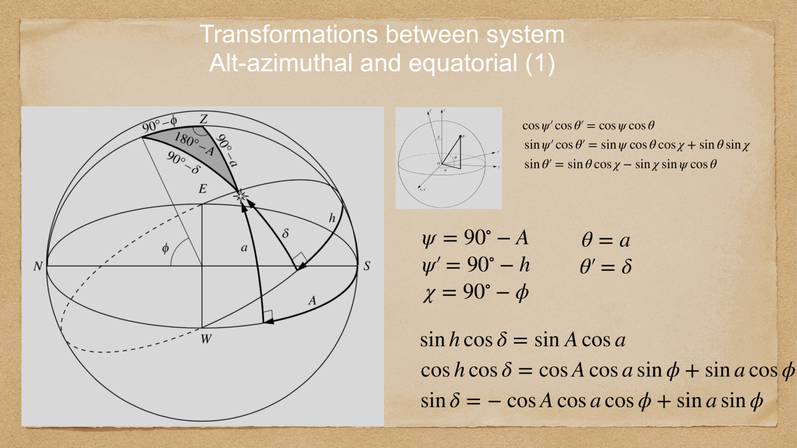

substituting in the master equations gives the alt-az → equatorial transformation:
$$\sin h \cos\delta = \sin A \cos a$$
$$\cos h \cos\delta = \cos A \cos a \sin\phi + \sin a \cos\phi$$
$$\sin\delta = -\cos A \cos a \cos\phi + \sin a \sin\phi$$

and the inverse (equatorial → alt-az), with $\chi \to -(90° - \phi)$:

$$\sin A \cos a = \sin h \cos\delta$$
$$\cos A \cos a = \cos h \cos\delta\sin\phi - \sin\delta\cos\phi$$
$$\sin a = \cos h \cos\delta\cos\phi + \sin\delta\sin\phi$$

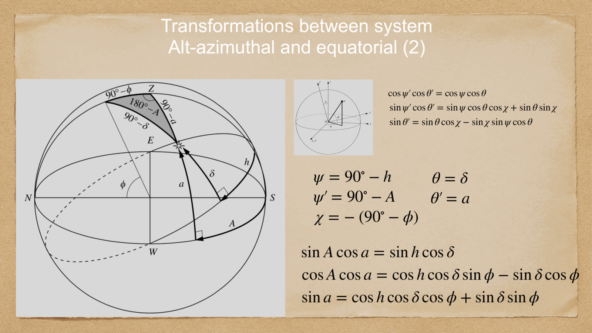

### upper culmination ($h = 0$)

the star is on the meridian. setting $h = 0$ in the third equation:
$$\sin a = \cos\delta\cos\phi + \sin\delta\sin\phi = \cos(\phi - \delta) = \sin(90° - \phi + \delta)$$
or equivalently $= \cos(\delta - \phi) = \sin(90° - \delta + \phi)$

so the maximum height is
$$a_{\max} = \begin{cases} 90° - \phi + \delta & \text{star culminates south of zenith} \\ 90° + \phi - \delta & \text{star culminates north of zenith} \end{cases}$$

$a_{\max} > 0$ iff $\delta > \phi - 90°$. otherwise the star is **never visible** from this latitude.

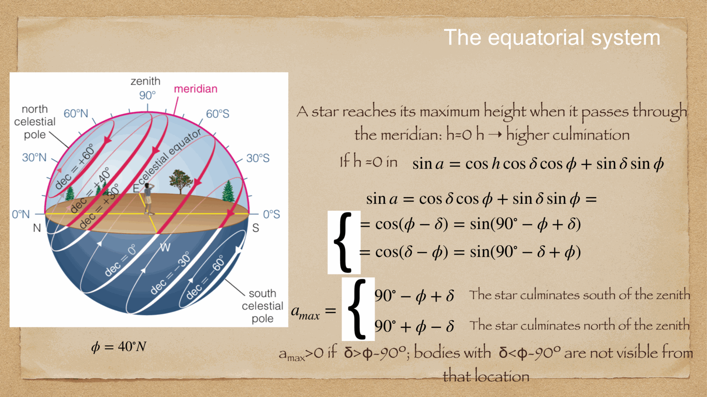

### lower culmination ($h = 12$ h)

$$\sin a = -\cos\delta\cos\phi + \sin\delta\sin\phi = -\cos(\phi + \delta) = \sin(\phi + \delta - 90°)$$
or $= -\cos(-\phi - \delta) = \sin(-\phi - \delta - 90°)$

so the minimum height is
$$a_{\min} = \begin{cases} \phi + \delta - 90° & \text{anti-culminates north of zenith} \\ -\phi - \delta - 90° & \text{anti-culminates south of zenith} \end{cases}$$

$a_{\min} > 0$ iff $\delta + \phi > 90°$. these stars are **circumpolar**.

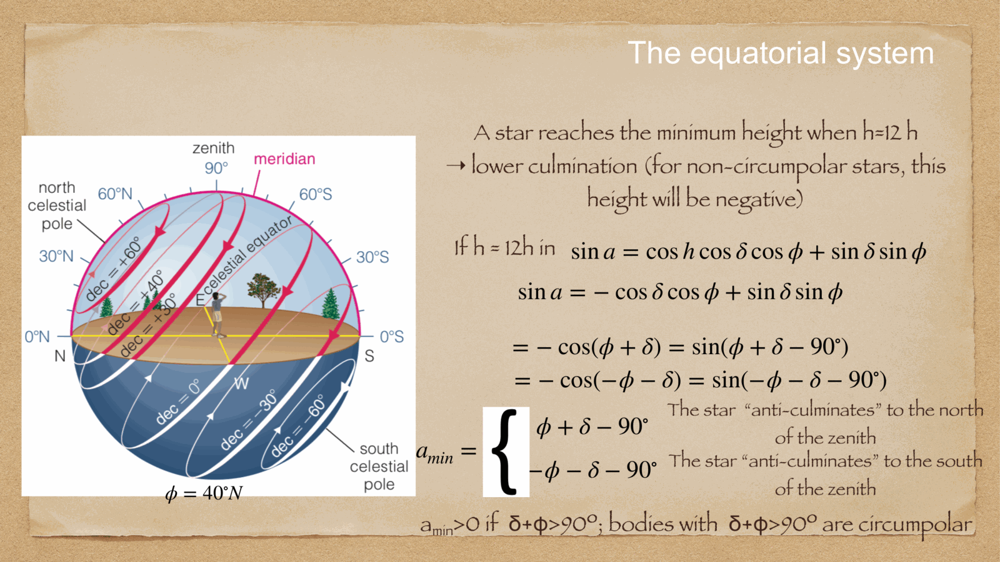

### determining $\alpha$ and $\delta$ from observations

for a circumpolar star culminating *north* of the zenith:
$$a_{\min} = \phi + \delta - 90°, \qquad a_{\max} = 90° + \phi - \delta$$
$$\Rightarrow \delta = \tfrac12(a_{\min} - a_{\max}) + 90°$$

for a circumpolar star culminating *south* of the zenith:
$$\delta = \tfrac12(a_{\min} + a_{\max})$$

at the same time, the position of the celestial pole is fixed, so I can get $\delta$ for any other body just from its angular distance to the pole. the position of the celestial equator follows. and as the **zero point of right ascension** I take the point where the Sun crosses the equator from south to north — that defines $\gamma$.

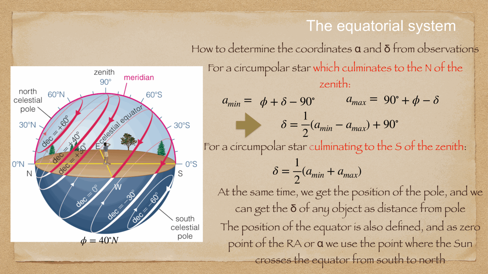

---

## rise and set

the star is on the horizon iff $a = 0$. plug into the third equation of equatorial → alt-az:
$$0 = \cos h \cos\delta\cos\phi + \sin\delta\sin\phi$$
$$\Rightarrow \boxed{\,\cos h_{s,t} = -\tan\delta\tan\phi\,}$$

then $\Theta_{s,t} = h_{s,t} + \alpha$ gives the sidereal time of rise and set.

note: this calculation does **not** account for atmospheric refraction (which lifts apparent positions of objects near the horizon by about 34').

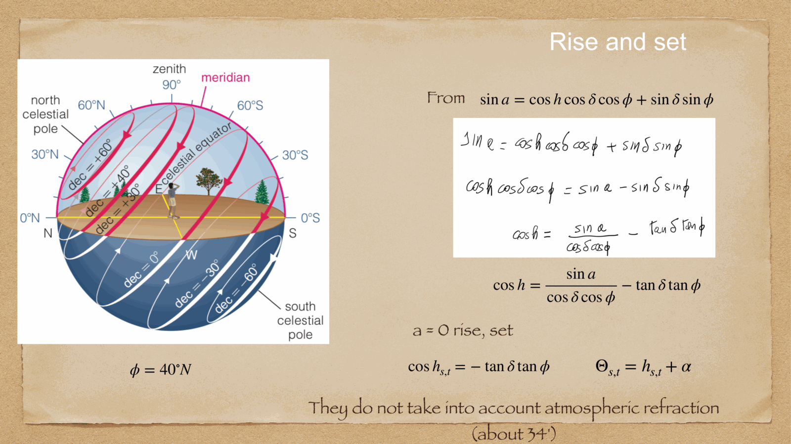

### worked examples (Padova, $\phi = 40°$ N)

- $\delta = -30°$: $\cos h = -0.839 \cdot 0.577 \approx -0.484$, $h = \pm 1.065$ rad $= \pm 61° = \pm 4.1$ h. star above horizon for $\sim 8.2$ h.
- $\delta = +30°$: $\cos h = +0.484$, $h = \pm 119° = \pm 7.93$ h. star above horizon for $\sim 15.9$ h.
- $\delta = +50°$: $\cos h = -1$, $h = 180° = 12$ h. star is **circumpolar** ($\delta + \phi = 90°$ on the boundary).
- $\delta = -50°$: $\cos h = +1$, $h = 0$ h. star is **never visible**.
- $\delta = 0°$: $\cos h = 0$, $h = \pm 90° = \pm 6$ h. star above horizon for exactly 12 h, rises exactly E, sets exactly W.

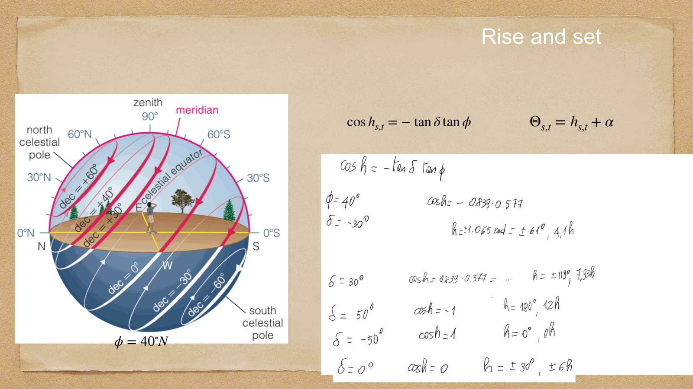

---

## takeaway

three coordinate systems matter for any practical observation:

| system | reference plane | coordinates | depends on |
|---|---|---|---|
| **alt-azimuth** | local horizon | $A, a$ | observer + time |
| **equatorial (catalog)** | celestial equator | $\alpha, \delta$ | nothing — universal |
| **equatorial (local)** | celestial equator + meridian | $h, \delta$ | observer + time, but $\delta$ universal |

with the master equations of spherical trigonometry I can transform between any pair, predict when a star rises and sets, and decide whether a target is even visible from a given latitude. that's the whole game.

---

## see also

- [Fundamentals_Astrophysics_Cosmology_MOC](../../00_Atlas/Fundamentals_Astrophysics_Cosmology_MOC.md)
- [Appendix E - Astronomical coordinates](../../02_Zettel/Theory/Appendix E - Astronomical coordinates.md) — short reference card, also covers vernal equinox, precession, J2000
- [Earth coordinates](../../02_Zettel/Theory/Earth coordinates.md)
- [Equatorial system](../../02_Zettel/Theory/Equatorial system.md)
- [Horizontal alt-azimuth system](../../02_Zettel/Theory/Horizontal alt-azimuth system.md)
