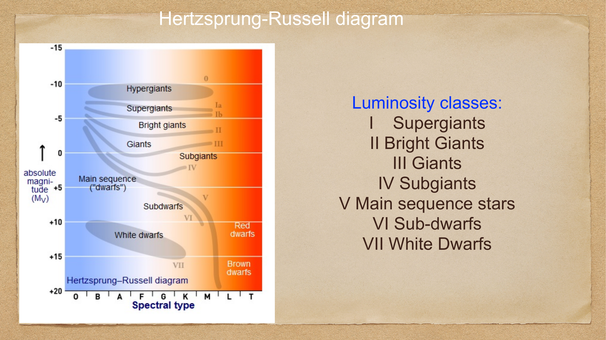

three characteristic timescales govern stellar life. their hierarchy controls *when* a star can change its structure and *how fast* it can do it.

$$t_{\rm dyn} \ll t_{\rm KH} \ll t_{\rm nuc}$$

---

## the dynamical (free-fall) timescale

the time for a self-gravitating object to collapse if the pressure support disappears:
$$t_{\rm dyn} \sim \sqrt{\frac{R^3}{GM}} \sim \frac{1}{\sqrt{G\bar\rho}}$$

for the Sun: $t_{\rm dyn,\odot} \sim 30$ minutes.

physical meaning: any structural disturbance (e.g. starting nuclear burning, a perturbation in pressure) propagates across the star at the **sound speed** in $\sim t_{\rm dyn}$. so on timescales longer than $t_{\rm dyn}$, hydrostatic equilibrium is maintained instantaneously — the star is in **mechanical equilibrium** to a very good approximation.

implication: the structure equations [Stellar structure equations](../../02_Zettel/Theory/Stellar structure equations.md) always assume hydrostatic equilibrium because all interesting processes happen on timescales much longer than $t_{\rm dyn}$.

---

## the Kelvin-Helmholtz (thermal) timescale

the time for the star to radiate away its own gravitational binding energy:
$$t_{\rm KH} \sim \frac{GM^2/R}{L}$$

for the Sun: $t_{\rm KH,\odot} \sim 10^7$ yr.

physical meaning: if nuclear burning suddenly stopped, the star would contract on this timescale, releasing gravitational potential energy as luminosity. this is what powers **pre-main-sequence** stars and **post-main-sequence** core contraction.

historical: in the 19th century, Kelvin and Helmholtz proposed that the Sun was powered by gravitational contraction. but $t_{\rm KH,\odot} \sim 10^7$ yr is much shorter than the geological age of the Earth ($> 10^9$ yr). so something else had to power the Sun — turned out to be nuclear fusion.

---

## the nuclear timescale

the time the star can sustain itself by nuclear burning:
$$t_{\rm nuc} \sim \frac{\eta\, M c^2}{L}$$

with $\eta \approx 0.007$ for H→He fusion (the fraction of rest mass converted to energy).

for the Sun: $t_{\rm nuc,\odot} \approx 10^{10}$ yr.

physical meaning: this is the **stellar lifetime** — how long the star can shine on a given fuel before running out. for the main sequence, $t_{\rm nuc} = t_{\rm MS}$.

---

## the hierarchy

for the Sun:
$$t_{\rm dyn} \sim 30\,\text{min} \quad \ll \quad t_{\rm KH} \sim 10^7\,\text{yr} \quad \ll \quad t_{\rm nuc} \sim 10^{10}\,\text{yr}$$

ratios are huge ($10^9, 10^3$). this hierarchy means:

- **mechanical equilibrium** is maintained on $t_{\rm nuc}$: the star is hydrostatic
- **thermal balance** between nuclear generation and radiative loss is maintained on $t_{\rm KH}$
- **structural changes** happen only on $t_{\rm nuc}$

so when we talk about the "evolution" of a star, we mean its motion across the HR diagram on the nuclear timescale. on shorter timescales, it just sits in equilibrium.

---

## stage-specific timescales

different burning stages have different timescales because $L$ and the available fuel differ:

| stage | timescale | dominant fuel |
|---|---|---|
| **MS** (Sun): $1\,M_\odot$ | $10^{10}$ yr | H |
| **MS**: $10\,M_\odot$ | $3 \times 10^7$ yr | H |
| **RGB**: $1\,M_\odot$ | $10^9$ yr | H shell |
| **He burning** (HB/AGB): $1\,M_\odot$ | $10^8$ yr | He core |
| **AGB**: $1\,M_\odot$ | $10^6$ yr | He shell, C envelope |
| **C burning** ($25\,M_\odot$) | $10^3$ yr | C core |
| **Si burning** ($25\,M_\odot$) | days | Si core |
| **core collapse**: | $\sim$ second | nothing — Fe core has no fuel |

each successive burning stage is much shorter than the previous because:
- less energy released per nucleon (approaching the iron peak)
- higher luminosity (often dominated by neutrino losses)

so a $25\,M_\odot$ star spends millions of years on the MS, then runs through C, O, Ne, Si burning in just **decades**, then collapses.

---

## a useful diagnostic

if you see a star whose internal structure is changing over the course of $\sim t_{\rm KH}$ but is not yet evolved across the HR diagram, you can infer:
- it is in a **thermal-relaxation phase**: e.g. PMS contraction, post-flash relaxation, etc.
- its structure is *not* in equilibrium (the structure equations need to include the time derivative of internal energy)

similarly, on **dynamical timescales**, you only see truly violent events: pulsations, supernova explosions, collapses.

---

## see also

- [Fundamentals_Astrophysics_Cosmology_MOC](../../00_Atlas/Fundamentals_Astrophysics_Cosmology_MOC.md)
- [Stellar scaling relations](../../02_Zettel/Theory/Stellar scaling relations.md)
- [Stellar structure equations](../../02_Zettel/Theory/Stellar structure equations.md)
- [Main sequence, giants, supergiants, white dwarfs](../../02_Zettel/Theory/Main sequence, giants, supergiants, white dwarfs.md)
- [HR diagram](../../02_Zettel/Theory/HR diagram.md)
- [Solar evolution and final stages](../../02_Zettel/Theory/Solar evolution and final stages.md)
