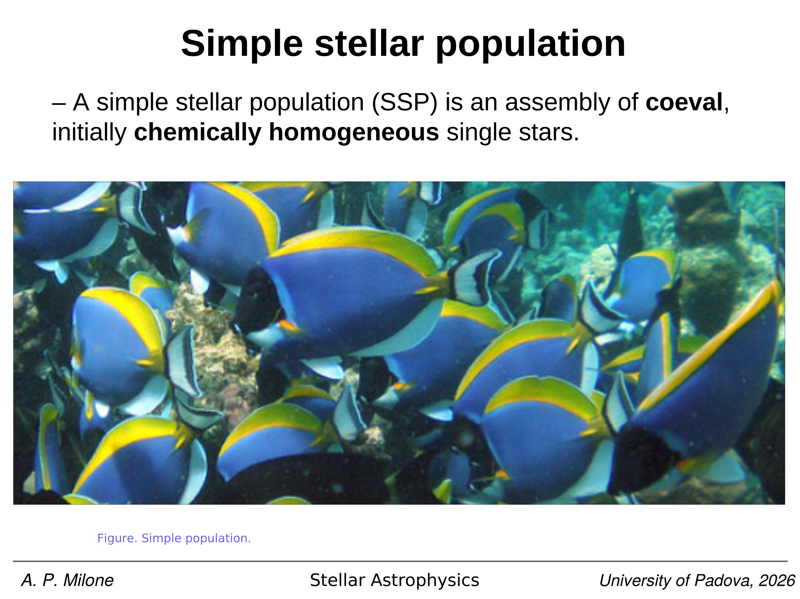

reading the [Color-magnitude diagrams of clusters](../../02_Zettel/Theory/Color-magnitude diagrams of clusters.md) of an old, populous cluster means recognising six evolutionary loci that each correspond to a specific interior burning configuration. the same six loci appear, suitably shifted, in the [HR diagram](../../02_Zettel/Theory/HR diagram.md) $(\log L, \log T_\mathrm{eff})$.

*the canonical CMD of an old globular cluster (Milone et al. 2025) showing all six evolutionary phases: MS, TO, SGB, RGB, HB, AGB, and the WD cooling sequence below.*

**main sequence (MS).** the diagonal locus from the faint-red lower MS to the bright-blue upper MS. interior physics: stable core hydrogen burning via the pp chain (low-mass, $M \lesssim 1.2 \, M_\odot$) or the CNO cycle (higher mass, with a convective core). lifetime $\tau_\mathrm{MS} \approx 10 \, (M/M_\odot)^{-2.5}$ Gyr. for an old GC the upper MS is empty because everything above $M_\mathrm{TO}$ has already evolved off (see [Main sequence on the CMD](../../02_Zettel/Theory/Main sequence on the CMD.md)).

**main-sequence turn-off (TO).** the bluest, brightest point on the MS, where central H is exhausted at $X_c = 0$. above $\sim 1.2 \, M_\odot$ the TO shows a small "hook" produced by overall contraction at H exhaustion in a convective core; below that mass the core is radiative and the hook is absent. the TO mass is the master age indicator: $M_\mathrm{TO} = 0.85 \, M_\odot$ for a 13 Gyr population (see [Main sequence turn-off as age indicator](../../02_Zettel/Theory/Main sequence turn-off as age indicator.md)).

**subgiant branch (SGB).** the near-horizontal stretch from the TO at constant $\log L$ (within $\Delta \log L \lesssim 0.3$) towards the base of the RGB, while $T_\mathrm{eff}$ drops. interior physics: H burning ignites in a thick shell around the now-inert isothermal helium core; the core is on its way to the Schönberg-Chandrasekhar limit at which it can no longer support the envelope and contracts (see [Subgiant branch SGB](../../02_Zettel/Theory/Subgiant branch SGB.md)).

**red giant branch (RGB).** the near-vertical, slightly red-leaning track climbing from the SGB to $L_\mathrm{tip} \approx 2300 \, L_\odot$ at $T_\mathrm{eff} \sim 3500$ K. interior physics: thin H-burning shell, electron-degenerate isothermal He core that grows by shell ashes; envelope expands and cools along the Hayashi limit. features along the way: the **first dredge-up** that mixes processed material to the surface, and the **RGB bump** (a small luminosity pile-up where the receding convective envelope crosses the chemical discontinuity left by the dredge-up), see [Red giant branch RGB](../../02_Zettel/Theory/Red giant branch RGB.md).

**helium flash and horizontal branch (HB).** when the He core mass reaches $M_c \approx 0.48 \, M_\odot$ at $T \sim 10^8$ K, helium ignites under degeneracy in an off-centre runaway, the **helium flash**. degeneracy is lifted, the core expands, and the star settles onto the HB at $L \approx 50 \, L_\odot$. its position along the HB in $T_\mathrm{eff}$ is set by the envelope mass left after RGB mass loss: small envelope = blue HB, large envelope = red HB. the RR Lyrae instability strip crosses the HB near $T_\mathrm{eff} \sim 6500$ K (see [Helium flash and horizontal branch](../../02_Zettel/Theory/Helium flash and horizontal branch.md)).

**asymptotic giant branch (AGB).** after core He exhaustion the star climbs a *second* giant branch at slightly bluer colour than the RGB at low $L$ but reaching higher luminosities at the tip ($L_\mathrm{tip} \sim 10^4 \, L_\odot$). interior physics: double shell burning, H shell + He shell, with thermal pulses every $\sim 10^4$ to $10^5$ yr (the **TP-AGB**), strong dust-driven mass loss, and **third dredge-up** events. termination: planetary nebula ejection and exposure of the C/O white dwarf core (see [Asymptotic giant branch AGB](../../02_Zettel/Theory/Asymptotic giant branch AGB.md)).

**white dwarf cooling sequence (WD).** below the HB and faint by $\sim 10$ mag from the TO sits a thin, blue-to-red diagonal of WD remnants, with $L$ set by residual thermal energy of the C/O core. the sequence runs from hot, blue young WDs ($T_\mathrm{eff} \sim 10^5$ K, $\log L/L_\odot \sim 0$) down to cool, red, faint old WDs ($T_\mathrm{eff} \sim 4000$ K) and shows a characteristic *blue hook* at the cool end from H$_2$ collision-induced absorption (see [White dwarf cooling sequence on the CMD](../../02_Zettel/Theory/White dwarf cooling sequence on the CMD.md)).

a useful summary table (canonical values for a $\sim 12$ Gyr, $[\mathrm{Fe}/\mathrm{H}] \sim -1.5$ GC):

- MS: $M = 0.1$ to $0.85 \, M_\odot$, $L = 10^{-3}$ to $1 \, L_\odot$, $\tau \sim 10^{10}$ yr
- TO: $M_\mathrm{TO} \approx 0.85 \, M_\odot$, $L \sim 1 \, L_\odot$
- SGB: $\Delta t \sim 10^9$ yr at this mass
- RGB: $\Delta t \sim 5 \times 10^8$ yr, ends at $L \sim 2300 \, L_\odot$
- HB: $\Delta t \sim 10^8$ yr at $L \sim 50 \, L_\odot$
- AGB: $\Delta t \sim 10^6$ yr at $L$ up to $10^4 \, L_\odot$
- WD: $\Delta t > 10^{10}$ yr cooling

each transition has a *clock-like* duration that the cluster CMD samples in proportion (fuel-consumption theorem, Renzini and Buzzoni 1986).

## see also
- [Stellar_Astrophysics_MOC](../../00_Atlas/Stellar_Astrophysics_MOC.md)
- [HR diagram](../../02_Zettel/Theory/HR diagram.md)
- [Color-magnitude diagrams of clusters](../../02_Zettel/Theory/Color-magnitude diagrams of clusters.md)
- [Isochrones and isochrone fitting](../../02_Zettel/Theory/Isochrones and isochrone fitting.md)
- [Single stellar population SSP](../../02_Zettel/Theory/Single stellar population SSP.md)
