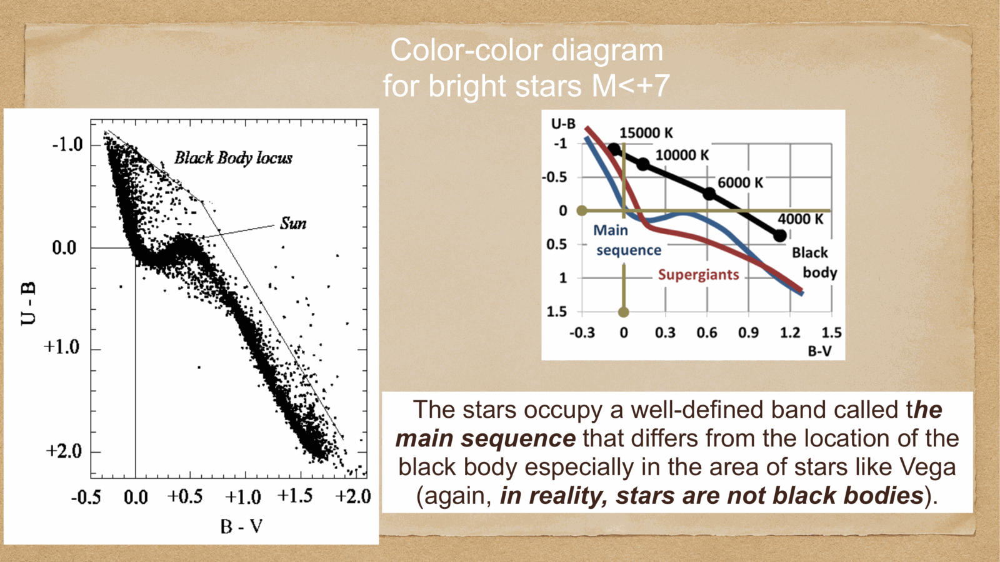

a star is a (nearly) hydrostatic ball of gas in radiative or convective equilibrium, generating energy by nuclear fusion in its core. four coupled differential equations describe its structure:

1. mass conservation
2. hydrostatic equilibrium
3. energy generation
4. energy transport

with appropriate boundary conditions and a constitutive equation of state, these uniquely determine the radial profile of $\rho(r), T(r), P(r), L(r)$ for a given mass and composition. this is the **Vogt-Russell theorem**.

---

## 1. mass conservation

definition of $M(r)$ as the total mass within radius $r$:
$$\frac{dM(r)}{dr} = 4\pi r^2 \rho(r)$$

trivially differential geometry. expresses that a shell of thickness $dr$ at radius $r$ contains mass $4\pi r^2 \rho\, dr$.

---

## 2. hydrostatic equilibrium

balance between gravity (compressing the star) and the pressure gradient (resisting compression):
$$\boxed{\,\frac{dP(r)}{dr} = -\frac{G M(r)\rho(r)}{r^2}\,}$$

derivation: a thin shell of mass $dm = \rho\, 4\pi r^2 dr$ feels a gravitational force $-(GM(r)/r^2)\rho\,4\pi r^2 dr$ pulling it inward, balanced by the difference of pressure forces $dP \cdot 4\pi r^2$.

equivalently, the pressure at the center of a star can be estimated by:
$$P_c \sim \frac{G M^2}{R^4} \sim \rho_c \cdot \frac{GM}{R}$$

for the Sun: $P_c \sim 10^{17}$ Pa $= 10^{12}$ atm. enormous.

---

## 3. energy generation

nuclear reactions in the core release energy at a specific rate $\epsilon(r)$ (erg/g/s):
$$\frac{dL(r)}{dr} = 4\pi r^2 \rho(r)\, \epsilon(r)$$

$\epsilon$ depends strongly on local temperature and density. for the **pp chain** (dominant in the Sun):
$$\epsilon_{pp} \propto \rho T^4$$

for the **CNO cycle** (dominant in massive stars):
$$\epsilon_{CNO} \propto \rho T^{18}$$

→ extreme temperature sensitivity of CNO. that's why slightly more massive stars have *much* hotter cores and burn through hydrogen far faster.

→ see [Stellar nucleosynthesis](../../02_Zettel/Theory/Stellar nucleosynthesis.html) for the full chain of fusion processes.

---

## 4. energy transport

energy generated in the core must be transported to the surface. there are three mechanisms:

### radiative transport
photons random-walk through the gas, with a mean free path set by opacity $\kappa$:
$$\frac{dT(r)}{dr} = -\frac{3\kappa\rho L(r)}{16\pi a c r^2 T^3(r)}$$

where $a$ is the radiation constant, $\kappa$ is the **opacity** (cm$^2$/g, depending on $T, \rho$, composition).

→ see [Radiative transport](../../02_Zettel/Theory/Radiative transport.html).

### convective transport
when the radiative gradient becomes too steep, the gas becomes **convectively unstable** — hot bubbles rise, cool ones sink, transporting energy via macroscopic motions.

**Schwarzschild criterion** for convection:
$$\nabla_{\rm rad} > \nabla_{\rm ad}$$

i.e. the gradient required to carry the luminosity radiatively exceeds the adiabatic gradient.

low-mass stars: convective envelope, radiative core. the Sun has both.
high-mass stars: convective core, radiative envelope.

### conductive transport
electronic thermal conduction. negligible in MS stars but important in degenerate cores (white dwarfs, neutron stars).

---

## boundary conditions

at the **center** ($r = 0$): $M = 0, L = 0$.

at the **surface** ($r = R$): $P \to 0, T \to T_{\rm eff}$ (defined by the photospheric layer where most photons escape).

with these conditions, the four equations + an equation of state $P = P(\rho, T, X_i)$ + opacity law $\kappa(T, \rho, X_i)$ + nuclear rate law $\epsilon(T, \rho, X_i)$ uniquely determine the structure for given total mass $M$ and composition $X_i$.

---

## the Vogt-Russell theorem

> **the structure of a star in equilibrium is uniquely determined by its total mass and chemical composition.**

so once you fix $M$ and $X$ (mass fractions of H, He, metals), the entire run of $\rho(r), T(r), P(r), L(r)$ follows uniquely. this is why MS stars trace out a *one-parameter* family — every property correlates with mass (see [Stellar scaling relations](../../02_Zettel/Theory/Stellar scaling relations.html)).

after the star evolves and the composition becomes inhomogeneous, you need additional information (e.g. the composition profile $X(r)$) to specify the structure. so post-MS stars are richer.

---

## numerical solutions

the four equations are stiff and nonlinear, with eigenvalue-style boundary conditions (you have to find the right central conditions to make $M, L \to $ specified values at $r = R$). they are solved numerically using shooting methods or relaxation methods. modern stellar evolution codes (MESA, the venerable EZ-AMB, Ferguson opacity tables) integrate them with sub-second computer time per star.

starting from the ZAMS (zero-age main sequence), the structure evolves as composition changes due to nuclear burning. the time evolution is typically discretized with $\Delta t \ll t_{\rm thermal}$, allowing the structure to update quasi-statically.

---

## see also

- [Fundamentals_Astrophysics_Cosmology_MOC](../../00_Atlas/Fundamentals_Astrophysics_Cosmology_MOC.html)
- [Stellar scaling relations](../../02_Zettel/Theory/Stellar scaling relations.html)
- [Radiative transport](../../02_Zettel/Theory/Radiative transport.html)
- [Stellar nucleosynthesis](../../02_Zettel/Theory/Stellar nucleosynthesis.html)
- [Stellar evolution timescales](../../02_Zettel/Theory/Stellar evolution timescales.html)
- [Main sequence, giants, supergiants, white dwarfs](../../02_Zettel/Theory/Main sequence, giants, supergiants, white dwarfs.html)
- [Jeans theory and protostellar formation](../../02_Zettel/Theory/Jeans theory and protostellar formation.html)
