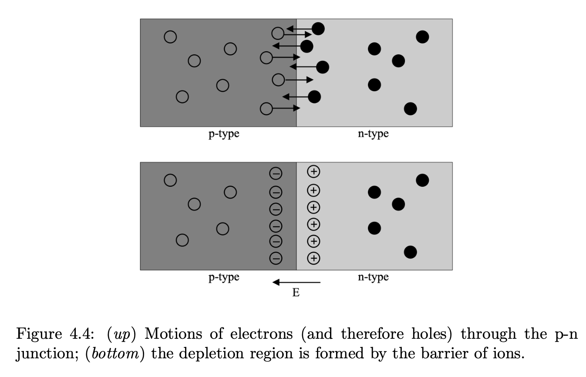
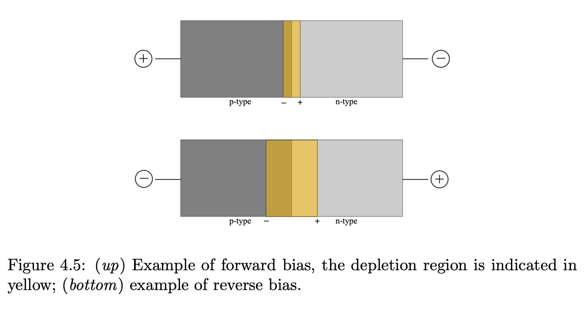

## Doping

Semiconductors can be improved by adding **impurities** — a method called **doping**

When the impurity has **more** valence electrons than silicon:
	it donates electrons to the conduction band
		named **donor** or **n-type** silicon
			examples: phosphorus ($Z_P = 15$, 5 valence electrons), arsenic ($Z_{As} = 33$)

When the impurity has **fewer** valence electrons than silicon:
	it leaves positively charged holes in the valence band
		named **acceptor** or **p-type** silicon
			examples: boron ($Z_B = 5$, 3 valence electrons), aluminum ($Z_{Al} = 13$), gallium ($Z_{Ga} = 31$)

Note: extra electrons or extra holes do **not** make the materials electrically charged
	they are electrically neutral
		what happens is only that there are more free carriers available for conduction

---

## The p-n junction

When a p-type and an n-type material are placed in contact, the **p-n junction** forms

At the interface:
	**diffusion**: excess electrons from the n-type diffuse into the p-type, filling holes
		excess holes from the p-type diffuse into the n-type, capturing electrons
	**recombination**: electrons and holes annihilate at the junction
	**electric field**: the departing carriers leave behind fixed charged ions
		n-type side becomes **positively charged** (donor ions)
		p-type side becomes **negatively charged** (acceptor ions)
		this creates a built-in electric field pointing from n to p

When diffusion and the built-in field reach equilibrium:
	a **depletion region** forms — a zone depleted of free carriers
		any electron appearing in this zone is immediately swept toward the n-type side
			any hole is swept toward the p-type side

The p-n junction in equilibrium. Diffusion of carriers creates a depletion region with a built-in electric field. The potential barrier prevents further diffusion.

---

## Biasing the junction

Applying an external voltage modifies the depletion region:

**Forward bias** (positive voltage on p-type):
	reduces the potential barrier
		more carriers cross the junction → current flows
		depletion region becomes narrower

**Reverse bias** (positive voltage on n-type):
	increases the potential barrier
		fewer carriers cross → very small leakage current (ideal: no current)
		depletion region becomes **wider**

Left: forward bias narrows the depletion region. Right: reverse bias widens the depletion region, which is the operating condition for detector applications.

---

## The p-n junction as a detector

For radiation detection, the junction operates under **reverse bias**:
	the wide depletion region is the **active detection volume**
	the electric field is strong enough to sweep out any electron-hole pairs created by ionizing radiation
		before they can recombine

When an X-ray photon is absorbed in the depletion region:
	it creates a **charge cloud** of $N_e = E_{ph}/w$ electron-hole pairs (where $w = 3.68~\text{eV}$ for silicon)
	the built-in + applied electric field sweeps electrons toward the n-type side
	this charge is collected and measured — that is the detector signal

The depletion depth $d$ under reverse bias voltage $V_R$ for a doping concentration $N_D$:
$$d = \sqrt{\frac{2\varepsilon_0 \varepsilon_r V_R}{eN_D}}$$

Increasing the reverse bias → deeper depletion → higher energy photons can be absorbed → better QE at high E

---

## Buried channel CCD

All scientific X-ray CCDs are **buried-channel devices**:
	a thin n-type layer is implanted under the surface oxide
		this buries the depletion region well below the silicon surface
			so the charge is transported far from surface traps (interface states)
				which would otherwise capture and scatter the signal electrons

The depletion region is devoid of free electrons at equilibrium
	so any electron appearing there was produced by an incident photon — not by thermal fluctuations
		this is what makes the CCD a clean single-photon detector

---

## Connection to the full CCD

The p-n junction is the fundamental detecting unit
	the full CCD is an array of MOS capacitors (each a reverse-biased junction)
		fabricated in a 2D grid on a silicon wafer
			the charge is shifted out via the 3-phase clocking described in [CCD readout](../../02_Zettel/Theory/CCD readout.html)
				and the energy is recovered as in [CCDs for X-rays](../../02_Zettel/Theory/CCDs for X-rays.html)
