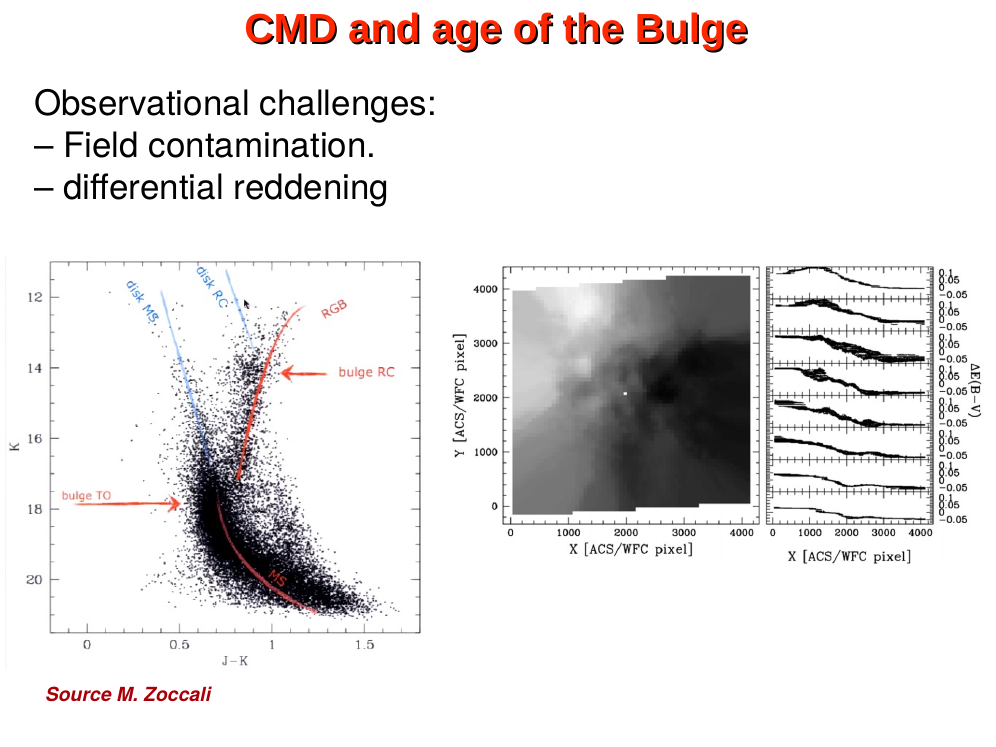

milone et al. 2017 (HST UV Legacy Survey) found that ~17% of galactic GCs show a chromosome map structure that is qualitatively different from the rest. these clusters host not only a 1G + 2G split (the canonical multiple-population signature) but also a **second, redder + parallel chromosome map sequence** that itself contains its own 1G + 2G populations + is enhanced in iron + s-process elements. milone called these **Type II GCs**, contrasting with the canonical **Type I GCs**.

*Terzan 5 — possibly the most extreme Type II case. Ferraro et al. 2009 and Massari et al. 2014 found two metal populations ([Fe/H] $\sim -0.2$ and $\sim +0.3$) in this bulge GC, suggesting it may be a fossil bulge fragment rather than a true GC.*

the distinction is now standard + carries strong implications for GC formation: type II GCs are likely **stripped nuclei of disrupted dwarf galaxies**, while type I GCs are clusters formed in single massive star-forming events.

## defining the two types

**Type I** (canonical, ~83% of GCs):
- single locus on the chromosome map containing a 1G clump + 2G stream
- no [Fe/H] spread (homogeneous to ~0.05 dex)
- no s-process spread
- examples: 47 Tuc, NGC 6752, NGC 6397, M3, M5, M13, NGC 6121

**Type II** (~17% of GCs):
- chromosome map shows a second parallel locus, redder in $\Delta_{F275W,F814W}$, displaced + sometimes itself split into 1G/2G
- the redder sequence has higher [Fe/H] by 0.1-0.3 dex + enhanced s-process abundances (Ba, Sr, Y) by similar magnitudes
- shows a "split SGB" in optical photometry (anomalous bright SGB + faint SGB)
- examples: NGC 1851, M22 (NGC 6656), M2 (NGC 7089), NGC 6934, NGC 5286, $\omega$ Cen (NGC 5139), M54 (NGC 6715)

## the iron + s-process spread

the smoking gun for type II is a real $[\text{Fe/H}]$ variation. type I GCs are iron-homogeneous: their 1G + 2G have identical [Fe/H], because the polluter (AGB, FRMS, SMS) does not produce iron. type II GCs show [Fe/H] inhomogeneity at the level of $0.1$-$0.3$ dex, with the more metal-rich subpopulation also being s-process-enhanced. this requires a **second epoch of star formation** in the same cluster after type Ia or AGB s-process enrichment had occurred, which means:
- the cluster was massive enough to retain SN Ia ejecta + AGB s-process products
- formation lasted long enough ($\sim 1$ Gyr) to host multiple chemical generations

ordinary GCs with potential wells too shallow to retain SN ejecta cannot do this. the natural site is a **dwarf galaxy**: a deeper potential well that retains successive enrichment, ultimately stripped of its outer stars to leave only the dense nucleus.

## ω Centauri: the prototype

$\omega$ Cen has long been the odd-one-out. it shows:
- $[\text{Fe/H}]$ from $-2.0$ to $-0.5$, a full 1.5 dex spread (no other GC comes close)
- multiple discrete sub-populations identified via spectroscopy + photometry
- s-process enhancement in the metal-rich populations
- a heliocentric retrograde + tilted orbit consistent with infall from a satellite

bekki + freeman 2003 + others proposed it is the stripped nucleus of a disrupted dwarf, the "gaia-sausage / sequoia" / kraken-type accretion event. modern gaia DR3 + spectroscopic data support this: $\omega$ Cen's orbit + chemistry tie it to a major accretion ~10 Gyr ago.

## M54 + the sagittarius dwarf

M54 sits **inside** the sagittarius dwarf galaxy + is its nucleus. we are catching this case mid-disruption: the dwarf is being stripped now + M54 is the surviving core. M54 shows a chemically complex chromosome map with type II morphology + a pronounced metallicity spread. it is the rosetta stone for the type II = stripped nucleus interpretation.

## NGC 1851, M22 + the others

NGC 1851 has long had an "anomalous SGB": the SGB splits into two sequences, with the fainter being s-process-enhanced + slightly more metal-rich. early interpretations invoked a merger of two clusters, but the type II framework reinterprets it as a chemical evolution artifact within an originally larger system.

similarly M22 + M2 show split SGBs + dual chromosome map sequences.

## why the classification matters for galactic archaeology

if type II GCs are accreted nuclei, then ~17% of the galactic GC system is **ex situ**, deposited by past minor mergers. this dovetails with gaia-era results:
- the gaia-enceladus / gaia-sausage merger (helmi et al. 2018) deposited ~20 GCs
- the sagittarius merger deposits ongoing
- kraken / heracles + sequoia each contribute clusters
- the type II classification is morphological evidence consistent with the accreted-origin kinematic + chemical evidence

massari, mucciarelli, koppelman + others have built classifications based on energy-action space + GC chemistry that broadly agree with milone's type II identification.

## type II within the chromosome map framework

operationally the type II signature is read off the chromosome map directly:
- run UV legacy photometry
- if the map shows a single 1G + 2G structure → type I
- if it shows two parallel sequences offset in $\Delta_{F275W,F814W}$ → type II
- the magnitude of the offset correlates with the [Fe/H] spread

this is one more reason the chromosome map is the centerpiece of the field: it is also the cleanest classifier for GC origin.

## see also

- [Multiple populations in GCs discovery](../../02_Zettel/Theory/Multiple populations in GCs discovery.html)
- [Photometric chromosome maps](../../02_Zettel/Theory/Photometric chromosome maps.html)
- [Helium spread in GCs](../../02_Zettel/Theory/Helium spread in GCs.html)
- [Na O anticorrelation](../../02_Zettel/Theory/Na O anticorrelation.html)
- [CN CH MgAl anticorrelations](../../02_Zettel/Theory/CN CH MgAl anticorrelations.html)
- [Mass dependence of multiple populations](../../02_Zettel/Theory/Mass dependence of multiple populations.html)
- [GC formation models with MPs](../../02_Zettel/Theory/GC formation models with MPs.html)
- [Multiple populations in extragalactic GCs](../../02_Zettel/Theory/Multiple populations in extragalactic GCs.html)
- [Polluter scenarios for second-generation GC stars](../../02_Zettel/Theory/Polluter scenarios for second-generation GC stars.html)
- s-process nucleosynthesis
- Galactic archaeology with Gaia
- [Stellar populations I II III](../../02_Zettel/Theory/Stellar populations I II III.html)
- [Stellar_Astrophysics_MOC](../../00_Atlas/Stellar_Astrophysics_MOC.html)
