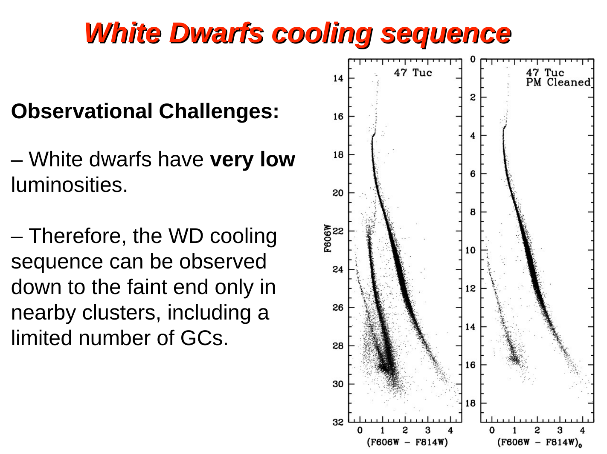

# white dwarf types he, co, oneMg

white dwarfs are not all the same inside. the chemical composition of the degenerate core is set by which nuclear burning stage the progenitor reached before mass loss exposed the core. three classes of white dwarf are distinguished by core composition:

**helium white dwarfs (he WDs).** the progenitor never ignites helium. its hydrogen-burning core grows on the red giant branch but the envelope is stripped (typically by binary mass transfer) before the helium flash, so the core never reaches the temperature needed to fuse 4He. the surviving remnant is essentially a degenerate helium core, with masses of order $0.3\text{-}0.5\,M_\odot$. these are unusual for single-star evolution at solar age because the universe is not yet old enough for very low-mass single stars to have produced them naturally; they appear preferentially in binary systems through mass transfer (see also [Initial-final mass relation IFMR](../../02_Zettel/Theory/Initial-final mass relation IFMR.md)). they were invoked by Hansen (2005) to explain the anomalous WDCS of the open cluster NGC 6791 (see [WDCS vs MSTO ages comparison](../../02_Zettel/Theory/WDCS vs MSTO ages comparison.md)).

**carbon-oxygen white dwarfs (co WDs).** this is the dominant class. the progenitor ignites helium quietly on the horizontal branch (or violently in a He flash for low-mass stars) and burns it to a C-O mixture in the core. the AGB envelope is later lost, exposing a degenerate C-O core. progenitors lie roughly in the range $0.5 \lesssim M/M_\odot \lesssim 8$, producing WDs with masses in the range $0.5\text{-}1.0\,M_\odot$ and a peak near $0.6\,M_\odot$. the sun is on this track.

**oxygen-neon-magnesium white dwarfs (oneMg WDs).** for stars near the upper mass cutoff for forming a WD ($\sim 8\text{-}10\,M_\odot$, the so-called super-AGB regime), the central temperature becomes high enough to ignite carbon (off-centre, in a flame) but not neon. the resulting core is a O-Ne-Mg mixture rather than C-O. these are the most massive WDs, with $M \gtrsim 1.05\,M_\odot$, and accordingly the smallest in radius (see [White dwarf mass-radius relation](../../02_Zettel/Theory/White dwarf mass-radius relation.md)).

the progenitor mass that maps to a final WD mass is encoded in the [Initial-final mass relation IFMR](../../02_Zettel/Theory/Initial-final mass relation IFMR.md). mass loss on the RGB and AGB is the bottleneck: for a single star the mapping is $M_{\rm ZAMS} \to M_{\rm WD}$, and going from $\sim 1$ to $\sim 8\,M_\odot$ at the start gives a final mass between $\sim 0.5$ and $\sim 1\,M_\odot$ at the end.

a useful summary picture is the post-MS evolutionary track of the sun in the [HR diagram](../../02_Zettel/Theory/HR diagram.md): it follows the RGB to the helium flash, descends to the HB to burn He, climbs the AGB, ejects a planetary nebula, and the exposed core contracts and cools as a CO white dwarf. 

atmospheric composition is largely independent of core type: gravitational settling at $\log g \sim 8$ leaves a thin H layer (DA WDs, $\sim 80\%$) or a He-dominated atmosphere (DB, DO, etc.) sitting on top of any core composition.

## see also
- [White dwarf overview](../../02_Zettel/Theory/White dwarf overview.md)
- [Initial-final mass relation IFMR](../../02_Zettel/Theory/Initial-final mass relation IFMR.md)
- [Chandrasekhar mass limit](../../02_Zettel/Theory/Chandrasekhar mass limit.md)
- [White dwarf mass-radius relation](../../02_Zettel/Theory/White dwarf mass-radius relation.md)
- [White dwarf cooling theory](../../02_Zettel/Theory/White dwarf cooling theory.md)
- [HR diagram](../../02_Zettel/Theory/HR diagram.md)
- [Stellar_Astrophysics_MOC](../../00_Atlas/Stellar_Astrophysics_MOC.md)
