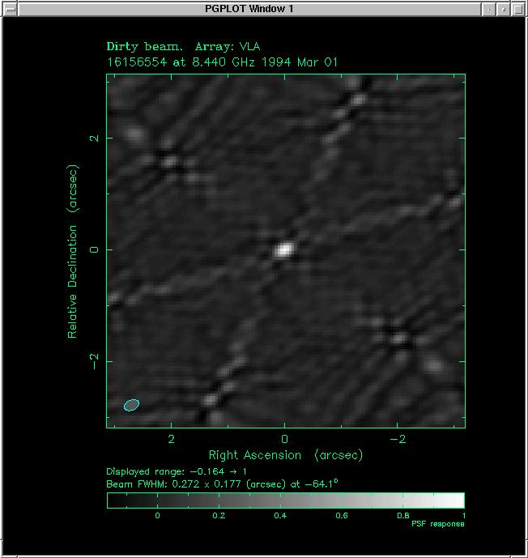
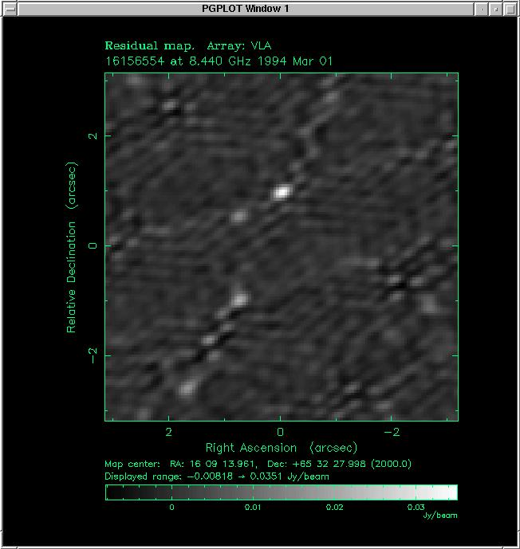

# Dirty beam and dirty image

the raw output of an aperture-synthesis interferometer, before deconvolution. the **dirty image** is the inverse Fourier transform of the (u, v) data; the **dirty beam** is the inverse Fourier transform of the *sampling pattern*. CLEAN's job is to deconvolve the dirty image with the dirty beam.

## the math

let the visibility be $V(\mathbf u)$ and the sampling function be $S(\mathbf u)$:
$$S(\mathbf u) = \sum_k \delta(\mathbf u - \mathbf u_k)$$

(a sum of delta functions at every measured (u, v) point).

the **measured visibility** is $V_{\rm meas}(\mathbf u) = V(\mathbf u) \cdot S(\mathbf u)$ — the true visibility *sampled* by the array.

inverse FT:
$$I_{\rm dirty}(\mathbf l) = \mathcal F^{-1}[V \cdot S] = I_{\rm true}(\mathbf l) * B_{\rm dirty}(\mathbf l)$$

where $B_{\rm dirty}(\mathbf l) = \mathcal F^{-1}[S]$ is the **dirty beam** (sometimes called the **synthesized beam** or **PSF**).

so the dirty image is the *true image convolved with the dirty beam*.

## what the dirty beam looks like

three regimes:

### 1. (u, v) plane fully covered

$S(\mathbf u) = 1$ everywhere → $B_{\rm dirty}(\mathbf l) = \delta(\mathbf l)$. dirty image = true image. perfect!

never achieved in practice.

### 2. (u, v) plane sparsely sampled

$S$ has large gaps → $B_{\rm dirty}$ has a central peak surrounded by a forest of **sidelobes**. dirty image = true image plus sidelobes from each true source. messy.

this is the typical case for VLBI snapshot observations.

### 3. (u, v) plane filled with arcs (Earth-rotation synthesis)

$S$ is fairly uniform inside a disk → $B_{\rm dirty}$ has a tight central peak and modest sidelobes. dirty image is *close to* the true image with minor artifacts. CLEAN handles the rest.

this is the typical case for VLA, ALMA, etc. with full Earth-rotation tracks.

## why the dirty beam has sidelobes

in the (u, v) plane, *gaps* in the sampling correspond to spatial frequencies that the array does not measure. those frequencies are missing from the dirty image, but the missing power leaks into other parts of the image as sidelobes.

specifically, a sampling function $S$ with sharp edges produces a dirty beam with strong oscillating sidelobes (Gibbs-like). a sampling function with smooth, tapered density produces a dirty beam with weaker, more localized sidelobes.

this is why **weighting** matters in interferometric imaging. by tapering $S$ (down-weighting samples near the edges), I get a cleaner dirty beam at the cost of slightly reduced resolution.

## the natural-weighted dirty beam

with **natural weighting** (each visibility weighted by $1/\sigma^2$ noise variance), the dirty beam is the FT of the actual data density. this gives the **lowest-noise** image but a *broader* dirty-beam main lobe.

## the uniform-weighted dirty beam

with **uniform weighting**, every (u, v) cell gets equal weight regardless of how many samples fall in it. the dirty beam is more like the FT of a uniform disk → narrower main lobe, more uniform sidelobes. *higher* resolution but *higher* noise.

## the briggs / robust weighting

a continuous parameter $r \in [-2, +2]$ interpolates between uniform ($r = -2$) and natural ($r = +2$). $r = 0$ is the practical default, balancing resolution and sensitivity.

## reading the dirty image

a typical dirty image of a point source:

- bright central spot (the true source)
- circular halo of low-amplitude sidelobes
- 2D oscillations at the spatial frequencies of the gaps in the (u, v) plane

a dirty image of an extended source:

- the source itself, with smeared edges
- sidelobe ringing around bright features
- "negative bowls" (artifacts from missing zero-spacing flux)

both are corrected by CLEAN.

## the dirty-beam properties to know

- **main-lobe FWHM**: the resolution of the array, $\theta \sim \lambda/B_{\max}$
- **first sidelobe ratio**: typical 5-20% of main lobe peak. high sidelobes mean dirty-image artifacts
- **integrated sidelobe ratio**: total sidelobe power divided by main-lobe power. needs to be small for clean imaging
- **shape**: depends on (u, v) coverage; can be elongated for arrays like the VLA (north-south asymmetry)

## the FT pair

| (u, v) plane | sky plane |
|---|---|
| sampling function $S$ | dirty beam $B_{\rm dirty}$ |
| measured visibility $V \cdot S$ | dirty image |
| weighted sampling | weighted dirty beam |
| true visibility $V$ | true image |

CLEAN tries to undo the convolution with the dirty beam, recovering the true image.

## the alternative: model-based imaging

instead of deconvolving the dirty image, fit a *parametric model* directly to the (u, v) data:
- point source: 2 parameters per source (position, flux)
- gaussian: 5 parameters (position, flux, FWHMs, PA)
- uniform disk: 3 parameters (position, flux, diameter)

minimize $\chi^2$ between predicted visibilities and measured visibilities. for sparse (u, v) coverage with simple sources (binary stars, simple disks), model fitting is more accurate than CLEAN of a dirty image.

this is what GRAVITY does for the Galactic Center S-stars: each frame gives only a few visibilities, but a parametric model with the orbit + image positions fits them all simultaneously.

## scientific figures

reading cue: the dirty beam is not a mysterious artifact; it is the Fourier transform of the sampling mask. this is why the same source can look different under different array configurations.

source: first figure is a local synthetic demo; NRAO figures are from S. T. Myers, NRAO Synthesis Imaging Summer School page on a 30 s VLA A-configuration snapshot.

## see also

- [The (u, v) plane](../../../02_Zettel/Theory/interf/The (u, v) plane.md)
- [Aperture synthesis principle](../../../02_Zettel/Theory/interf/Aperture synthesis principle.md)
- [CLEAN algorithm](../../../02_Zettel/Theory/interf/CLEAN algorithm.md)
- [Maximum entropy method](../../../02_Zettel/Theory/Maximum entropy method.md)
- [Imaging artifacts](../../../02_Zettel/Theory/interf/Imaging artifacts.md)
- [Astronomical_Interferometry_MOC](../../../00_Atlas/Astronomical_Interferometry_MOC.md)
