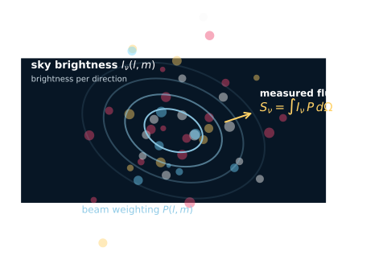

# Radio astronomy basics

radio astronomy is *the* astronomy of long wavelengths — from cm to m, occasionally km. the techniques are very different from optical: heterodyne electronics, antenna temperatures, brightness temperatures, RFI, polarization. this zettel surveys the foundations needed before tackling radio interferometry.

## the spectrum

radio astronomy roughly spans:
- **mm-wave**: 0.1-10 mm (sub-mm to mm), 30-3000 GHz. ALMA territory
- **cm-wave**: 1-50 cm, 600 MHz - 30 GHz. VLA territory
- **m-wave**: 0.5-100 m, 3-600 MHz. LOFAR, GMRT, SKA territory

each band has distinct physics, instrumentation, and atmospheric considerations:
- mm: mostly thermal sources (dust, molecular clouds), atmospheric water absorption is crucial
- cm: synchrotron, free-free, HI 21cm, atmospheric ionosphere mostly transparent
- m: ionospheric refraction, Galactic synchrotron background dominates

## brightness temperature

a useful unit. for a thermal source at temperature $T$ with high optical depth, the **brightness** $B_\nu$ at frequency $\nu$ is given by Planck's law:

$$B_\nu(T) = \frac{2 h \nu^3/c^2}{e^{h\nu/k_BT} - 1}$$

at radio frequencies, $h\nu \ll k_B T$ for any astronomical source. expand the exponential:

$$B_\nu(T) \approx \frac{2 \nu^2 k_B T}{c^2} = \frac{2 k_B T}{\lambda^2}$$

this is the **Rayleigh-Jeans limit**. it is *linear* in temperature, much simpler than Planck.

so at radio wavelengths, "brightness" is essentially synonymous with "temperature" (up to a $2 k_B/\lambda^2$ factor).

## brightness temperature, defined

we *invert* the Rayleigh-Jeans formula to define a **brightness temperature** for any source:

$$T_b = \frac{\lambda^2 B_\nu}{2 k_B}$$

even non-thermal sources (synchrotron, masers) have $T_b$, just not connected to a physical temperature.

typical $T_b$ values:
- CMB: 2.725 K
- HI emission in galaxies: 100 K
- Galactic continuum: $\sim 10^3$-$10^4$ K
- AGN cores (synchrotron): $\sim 10^{10}$-$10^{12}$ K (clearly non-thermal)
- pulsars (coherent emission): up to $10^{30}$ K

so brightness temperature is a useful *unit* even when not literally a temperature.

## antenna temperature

a single-dish radio measurement gives $T_A$ — the **antenna temperature**, the equivalent temperature a matched resistor at the antenna's terminals would have to produce the same noise power. related to source brightness temperature by:

$$T_A = T_b \cdot \frac{\Omega_{\rm src}}{\Omega_{\rm beam}}$$

(if source is smaller than the beam) or $T_A = T_b$ (if source fills the beam).

so a small unresolved source contributes $T_A < T_b$ in proportion to the source-to-beam solid-angle ratio.

## system temperature

the *total* noise from antenna + receiver + atmosphere:

$$T_{\rm sys} = T_{\rm rec} + T_{\rm atm} + T_{\rm spill} + T_{\rm CMB} + T_{\rm gnd}$$

components:
- $T_{\rm rec}$: receiver noise (~10-50 K for cm, 30-100 K for mm)
- $T_{\rm atm}$: atmospheric thermal emission (~5-30 K)
- $T_{\rm spill}$: spillover (light from beyond the antenna pattern)
- $T_{\rm CMB} = 2.725$ K: cosmic microwave background
- $T_{\rm gnd}$: ground (reflected from ground or horizon)

modern receivers approach the *quantum noise limit* $T_{\rm rec} \sim h\nu/k_B$. ALMA Band 6 receivers have $T_{\rm rec} \sim 30$ K, near the quantum limit.

## the radiometer equation

rms noise in a measurement of $T_A$ over bandwidth $\Delta\nu$ for time $\tau$:

$$\sigma_{T_A} = \frac{T_{\rm sys}}{\sqrt{\Delta\nu \, \tau}}$$

so SNR scales as $\sqrt{\Delta\nu \cdot \tau}$.

at the VLA, $T_{\rm sys} \sim 100$ K, $\Delta\nu = 4$ GHz, $\tau = 1$ hour: $\sigma \sim 0.5$ mK in $T_A$. for a well-defined source, $T_A \sim$ K means SNR $\sim 1000$ in 1 hour — pretty sensitive!

## flux density and the Jansky

instead of brightness temperature, often expressed as **flux density**:

$$S_\nu = \int B_\nu \, d\Omega$$

units: **Jansky** = $10^{-26}$ W m$^{-2}$ Hz$^{-1}$. a typical bright radio source has $S \sim$ Jy. weak ones $\sim$ μJy.

conversion to brightness temperature for a source filling a beam:
$$T_b = \frac{\lambda^2 S_\nu}{2 k_B \Omega_{\rm beam}}$$

with $\Omega_{\rm beam}$ the beam solid angle.

## the radio quiet zones

unlike optical, radio is *not* typically background-limited by sky brightness. instead, the noise floor is set by:
- **receiver thermal noise** (always present)
- **radio frequency interference (RFI)**: terrestrial transmitters, satellites, mobile phones, microwave ovens

RFI motivates **radio quiet zones**: legally protected areas around major observatories (Green Bank, Western Australia for SKA) where transmitter use is restricted. essential for cm-wave observatories.

## the frequency-domain view

radio observations naturally produce *spectra* — the receiver-correlator chain digitizes the signal in frequency channels. each channel can be processed independently for spectral-line work or combined for continuum.

modern correlators (ALMA, JVLA, MeerKAT) handle GHz-wide bands with millions of frequency channels. this enables:
- precision spectroscopy (HI 21cm at high resolution)
- molecular-line surveys (ALMA)
- pulsar dispersion-measure correction
- RFI excision (flagging contaminated channels)

## BookAI expansion

BookAI starts radio astronomy from the radiation quantities before the receiver. this is useful because it makes clear what the interferometer is eventually trying to reconstruct.

specific intensity:

$$I_\nu=\frac{dE}{dA\,dt\,d\nu\,d\Omega}$$

flux density:

$$S_\nu=\int I_\nu\,d\Omega$$

Jansky:

$$1\,\mathrm{Jy}=10^{-26}\,\mathrm{W\,m^{-2}\,Hz^{-1}}$$

brightness temperature can be written either with wavelength or frequency:

$$T_b=\frac{\lambda^2 I_\nu}{2k_B}=\frac{c^2 I_\nu}{2k_B\nu^2}$$

BookAI also makes explicit that a telescope measures sky brightness through a beam pattern:

$$T_A\propto\int I(\theta,\phi)P(\theta,\phi)d\Omega$$

so the natural chain is:

$$I_\nu\rightarrow \text{beam-weighted antenna signal}\rightarrow \text{voltage}\rightarrow \text{visibility}\rightarrow \text{image}$$

for the detailed pieces, see [Specific intensity and flux density](../../../02_Zettel/Theory/interf/Specific intensity and flux density.html), [Antenna effective area and gain](../../../02_Zettel/Theory/interf/Antenna effective area and gain.html), [Beam power pattern of a radio telescope](../../../02_Zettel/Theory/interf/Beam power pattern of a radio telescope.html), and [Radiometer equation and SEFD](../../../02_Zettel/Theory/interf/Radiometer equation and SEFD.html).

## scientific figure

reading cue: radio astronomy begins with brightness and flux density, but the instrument always sees a beam-weighted sky. this figure is the mental bridge between $I_\nu$, Jy, antenna temperature, and interferometric imaging.

source: local study diagram generated from the standard brightness-to-flux relation.

## see also

- [Radio interferometer architecture](../../../02_Zettel/Theory/interf/Radio interferometer architecture.html)
- [Two-element correlator](../../../02_Zettel/Theory/interf/Two-element correlator.html)
- [Major radio interferometers](../../../02_Zettel/Theory/interf/Major radio interferometers.html)
- [Heterodyne vs direct detection](../../../02_Zettel/Theory/interf/Heterodyne vs direct detection.html)
- [Astronomical_Interferometry_MOC](../../../00_Atlas/Astronomical_Interferometry_MOC.html)
