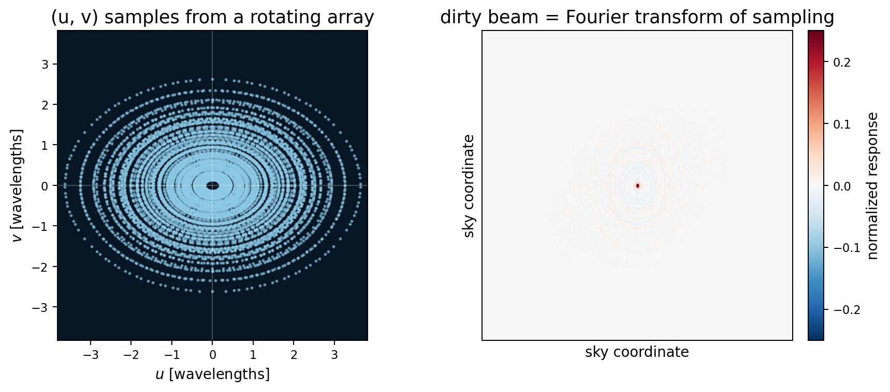
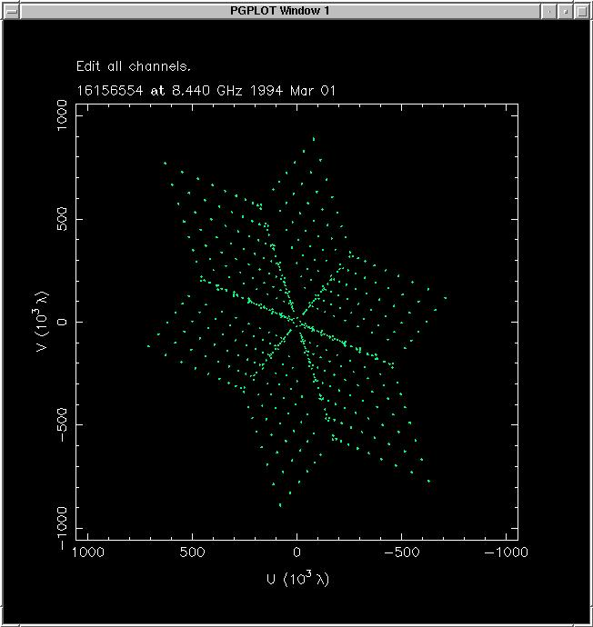

# The (u, v) plane

the spatial-frequency domain of interferometry. each baseline samples one point in this plane; arrays with many baselines sample many points; Earth's rotation drags those points along elliptical arcs over the night, filling the plane with coverage. the (u, v) plot is the *single most diagnostic image* in interferometric design and analysis.

## the coordinates

let the line of sight to the source define the local "z" axis. the plane perpendicular is the *aperture plane*. project every baseline vector onto this plane:

$$\mathbf B_\perp = $$ baseline projected on the aperture plane

then the **spatial frequency** sampled by that baseline is
$$\mathbf u = \mathbf B_\perp/\lambda$$

units: wavelengths, or wavelengths per radian (since the FT pair $\mathbf u, \mathbf l$ has $\mathbf l$ in radians of direction cosine, $\mathbf u$ has units of wavelengths-per-radian, equivalently wavelengths).

we usually write $\mathbf u = (u, v)$ with components along east-west and north-south (or any two orthogonal directions).

## the geometry: why (u, v) changes during the night

the *physical* baseline between two telescopes is fixed (it is the vector pointing from one to the other). but as the Earth rotates, the *projection* onto the plane perpendicular to the line of sight changes.

specifically: at hour angle $H$ and declination $\delta$, with the baseline expressed in the equatorial frame as $(B_x, B_y, B_z)$, the projected (u, v) is

$$u = (B_x \sin H + B_y \cos H)/\lambda$$
$$v = (-B_x \sin\delta \cos H + B_y \sin\delta \sin H + B_z \cos\delta)/\lambda$$

over a full night, $H$ ranges from $-12$h to $+12$h, and $(u, v)$ traces an **ellipse** centered at $(0, B_z \cos\delta/\lambda)$ with semi-axes $|B_x|/\lambda$ and $|B_y|/\lambda \cdot \sin\delta$.

## the ellipse pattern

for a source at declination $\delta$:

- $\delta = 90°$ (celestial pole): $\sin\delta = 1$, the ellipse becomes a *circle*. perfect symmetric (u, v) coverage
- $\delta = 0$ (celestial equator): $\sin\delta = 0$, the ellipse degenerates to a *line* along $u$. only 1D (u, v) coverage from each baseline — much harder to image

most interferometers are at moderate northern (VLA, +34°) or southern (ALMA, -23°) latitudes and prefer sources at high declination for round (u, v) tracks.

## the (u, v) plot

the standard diagnostic. plot every measured visibility as a dot at $(u, v)$, possibly colored by visibility amplitude. typical features:

- **gaps**: regions of (u, v) plane with no data → corresponding spatial frequencies of the source are unconstrained → image artifacts
- **central hole**: short-baseline data missing → "zero-spacing problem" → extended emission lost
- **arcs**: elliptical tracks from Earth-rotation synthesis
- **point clusters**: snapshot data (no rotation) or fixed VLBI baselines

an interferometer designer's main goal: maximize uniform (u, v) coverage across as wide a range of $|\mathbf u|$ as possible.

## the resolution

the *highest* spatial frequency sampled is $|\mathbf u|_{\max} = B_{\max}/\lambda$. corresponding angular resolution:
$$\theta_{\rm res} \sim \frac{1}{|\mathbf u|_{\max}} = \frac{\lambda}{B_{\max}}$$

the *lowest* spatial frequency sampled is $|\mathbf u|_{\min} = B_{\min}/\lambda$, which sets the *largest angular scale* the interferometer can recover:
$$\theta_{\rm largest} \sim \frac{\lambda}{B_{\min}}$$

structures larger than $\theta_{\rm largest}$ are "resolved out" — the array does not see them.

## natural vs uniform weighting

when reconstructing an image from (u, v) data, we choose how to weight different samples:

- **natural weighting**: each visibility weighted by $1/\sigma^2$. dense regions of (u, v) plane dominate. produces the lowest-noise image, but with broader synthesized beam (lower resolution)
- **uniform weighting**: each (u, v) "cell" gets equal weight regardless of how many samples fall in it. produces the highest-resolution image, but at higher noise
- **briggs / robust weighting**: tunable in between, the practical default

choosing weighting is a science-driven tradeoff between resolution and sensitivity.

## the famous "Y" geometry

the **VLA** uses a Y-shaped array of 27 dishes. why a Y?

three arms separated by 120° each contribute different orientations of baselines. as Earth rotates, each arm's baselines trace partial ellipses that, combined, fill the (u, v) plane with relatively uniform density.

Y is a compromise: less compact than a circular array (which gives a more uniform (u, v) density at one instant) but easier to lay out on real ground. ALMA uses spiral configurations for similar reasons.

## the sampling theorem in (u, v)

if I sample the (u, v) plane on a grid with spacing $\Delta u$, the inverse FT produces a *periodic* image in the sky plane: replicas at angular spacing $1/\Delta u$. as long as my source is smaller than $1/\Delta u$, the replicas don't overlap and the image is fine.

this gives the **field of view**: $\theta_{\rm FoV} \sim 1/\Delta u$ where $\Delta u$ is the (u, v) sampling density. for VLA-A configuration: $\Delta u \sim 100$ wavelengths → FoV $\sim 0.6°$. fine for compact sources, restrictive for wide-field surveys.

## the importance of "snapshots"

a *snapshot* observation freezes the (u, v) plane at one instant (no Earth-rotation synthesis). useful for: very fast transients, sources that move (solar system bodies), or quick characterization before deciding to commit a full track.

snapshot (u, v) coverage is the union of just $N(N-1)/2$ points — much sparser than a full track. snapshot images have much higher sidelobes and less imaging fidelity.

## scientific figures

reading cue: each dot is one measured spatial frequency. the Fourier transform of that sampling pattern is the dirty beam, so gaps in the $(u,v)$ plane become sidelobes in the image.

source: first figure is a local synthetic demo; second figure is from S. T. Myers, NRAO Synthesis Imaging Summer School page on snapshot imaging.

## see also

- [Aperture synthesis principle](../../../02_Zettel/Theory/interf/Aperture synthesis principle.md)
- [Earth-rotation aperture synthesis](../../../02_Zettel/Theory/interf/Earth-rotation aperture synthesis.md)
- [Optimal array geometry](../../../02_Zettel/Theory/interf/Optimal array geometry.md)
- [Dirty beam and dirty image](../../../02_Zettel/Theory/interf/Dirty beam and dirty image.md)
- [Van Cittert-Zernike theorem](../../../02_Zettel/Theory/interf/Van Cittert-Zernike theorem.md)
- [Astronomical_Interferometry_MOC](../../../00_Atlas/Astronomical_Interferometry_MOC.md)
