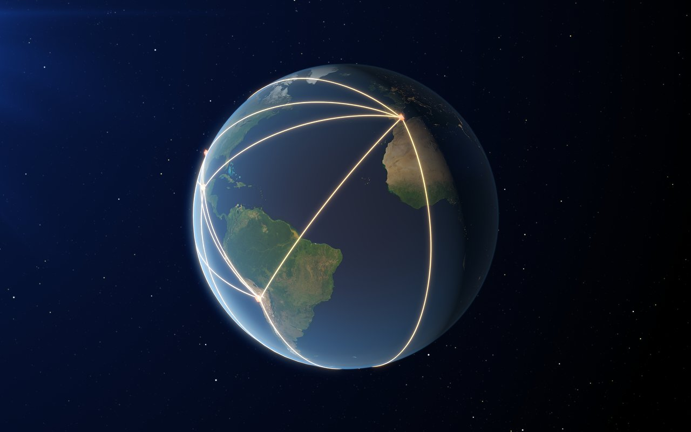

# Very Long Baseline Interferometry (VLBI)

radio interferometry with antennas spread across continents (or even between Earth and space). achieves the highest angular resolutions in astronomy — μarcseconds at mm wavelengths. signals are recorded at each station with atomic-clock timing and correlated post-hoc.

## the architecture

- **stations**: distributed individual telescopes around the world, sometimes in space
- **atomic clocks**: each station has a hydrogen maser, providing $\sim 10^{-15}$ stability
- **recording**: each station digitizes the IF signal and records to massive arrays of hard drives
- **shipping** (originally) or **fiber transfer** (now): drives are shipped or data streamed to a central correlator
- **central correlator**: applies station-by-station delays and computes pairwise visibilities

baseline limit: only the diameter of the Earth (or the size of an Earth-spacecraft system). EVN baselines: ~10000 km. EHT: ~10000 km (similar).

## the central insight: independent timing

unlike CEIs where a common LO synchronizes all antennas, VLBI stations operate *independently*. each station's recording carries its own timestamp from its own H-maser.

at the correlator, the recordings are aligned in time using:
1. predicted *geometric* delay (computed from the source ephemeris)
2. predicted *clock-offset* delay (from comparison of the H-masers via portable clocks or GPS)
3. a fine fringe-search (try delays around the predicted to maximize correlated power)

once aligned, correlation produces visibilities just like any other interferometer.

## the science

VLBI excels at:

### AGN cores

at $\lambda = 7$ mm and 10000 km baselines: $\theta_{\rm res} \sim 10$ μas. resolves the cores of AGN (the central black hole vicinity, jets at sub-pc scales).

flagship: **EHT 2019 image** of M87's central black hole shadow at 1.3 mm. earlier VLBI imaged the M87 jet at ~mas scales.

### masers

OH, water, methanol masers in star-forming regions. their high brightness temperatures ($T_b \sim 10^{14}$ K) make them ideal VLBI targets. resolved maser images map molecular cloud kinematics.

flagship: NGC 4258's 22 GHz water masers. the masers' Keplerian motion mapped a SMBH mass via VLBI; the geometric distance (from Doppler-tracking the maser positions) anchored the local distance scale.

### pulsars

precise pulsar positions and proper motions via VLBI. pulsar **timing arrays** (NANOGrav, EPTA, PPTA) use VLBI to update pulsar models.

### geodesy

VLBI to extragalactic point sources defines the **International Celestial Reference Frame (ICRF)** — the most accurate angular reference frame in astronomy. pinned to SMBHs that don't move on observable timescales.

### spacecraft tracking

JPL uses VLBI to track interplanetary spacecraft (Voyager, New Horizons) for navigation.

## major arrays

### EVN (European VLBI Network)

- ~25 antennas in Europe + a few global partners
- baselines to 10000 km
- frequency: 1-50 GHz
- dominant European VLBI

### VLBA (Very Long Baseline Array)

- 10 antennas across the United States
- baselines 200-8000 km
- frequency: 1-90 GHz
- the workhorse North American VLBI

### EAVN / KaVA

- East Asia VLBI: Japan, Korea, China antennas
- baselines to ~3000 km
- emerging high-resolution capability

### EHT (Event Horizon Telescope)

- 8 globally-distributed mm-wave telescopes (ALMA, IRAM 30m, JCMT, SMT, SMA, etc.)
- baselines ~8000-13000 km
- frequency: 230 GHz, 345 GHz
- the highest-resolution astronomical instrument ever built

## the data volumes

VLBI is data-intensive. typical 24-hour observation:
- 16 stations × 8 GHz bandwidth × 16 bits/sample × 3600s × 24 → $\sim 10^{14}$ bytes raw

= 100 TB per session per array. originally shipped on hard drives ("sneakernet"); now mostly transferred via dedicated fiber links to central correlators (e.g. JIVE in the Netherlands, Bonn in Germany, Haystack in the US).

## the calibration

VLBI calibration is harder than CEI calibration:
- no shared LO → frequency-dependent delay errors per station
- different atmospheric conditions at each station
- fringe-search needed to find the geometric delay

modern pipeline (AIPS, CASA, DiFX): multi-pass calibration, fringe fitting, self-calibration on bright sources. modern Bayesian methods are increasingly used.

## space VLBI

extending baselines beyond Earth's diameter:

- **HALCA / VSOP** (Japan, 1997-2003): first dedicated space VLBI satellite, 8m antenna in elliptical orbit
- **RadioAstron** (Russia, 2011-2019): 10m antenna in highly elliptical orbit, baselines up to 3 × Earth diameter
- **planned**: ngEHT (next-gen EHT) may include space-based stations to enable diameter-scale baselines, $\sim 1$ μas resolution

## scientific figure

reading cue: VLBI is the extreme radio version of aperture synthesis: the baselines are continental or planetary, and timing is preserved by atomic clocks rather than by physical cables.

source: ESO image eso1907j, EHT planet-scale array illustration.

## see also

- [Connected element interferometer](../../../02_Zettel/Theory/interf/Connected element interferometer.md)
- [Major radio interferometers](../../../02_Zettel/Theory/interf/Major radio interferometers.md)
- [Event Horizon Telescope EHT](../../../02_Zettel/Theory/interf/Event Horizon Telescope EHT.md)
- [Earth rotation synthesis in radio](../../../02_Zettel/Theory/interf/Earth rotation synthesis in radio.md)
- [Astronomical_Interferometry_MOC](../../../00_Atlas/Astronomical_Interferometry_MOC.md)
