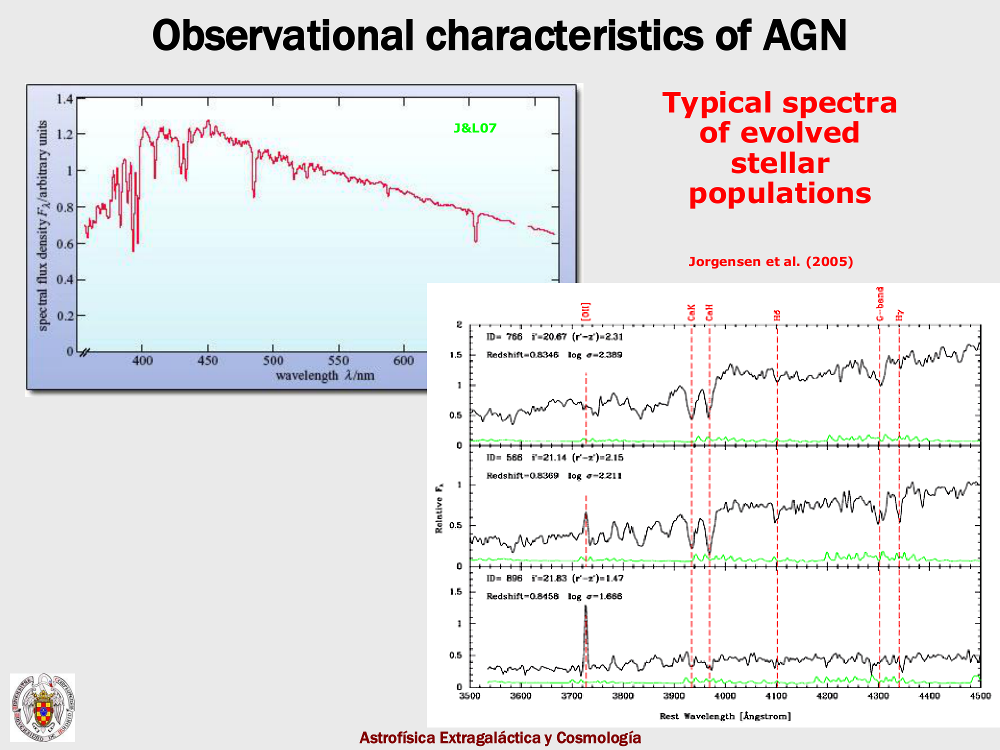
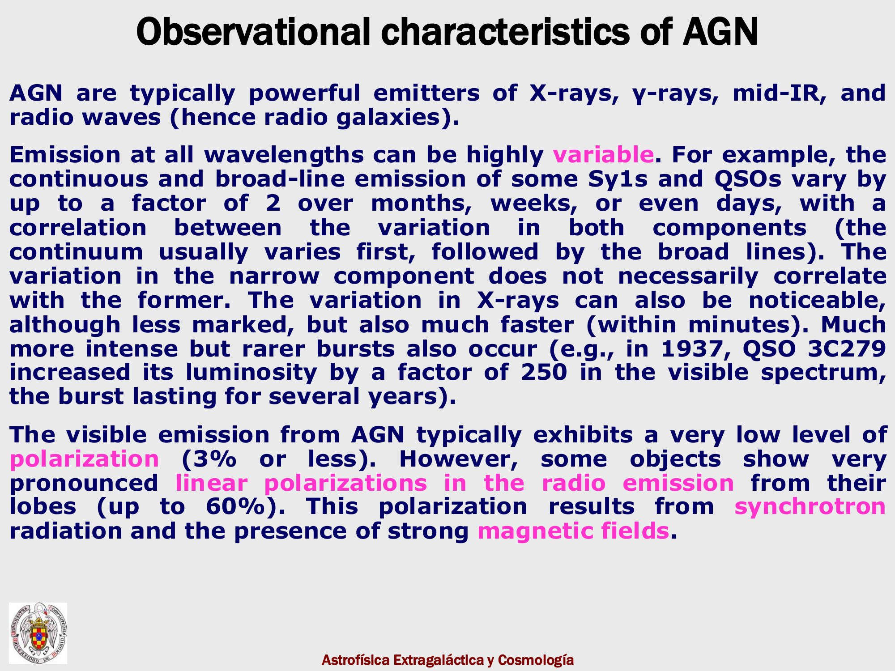
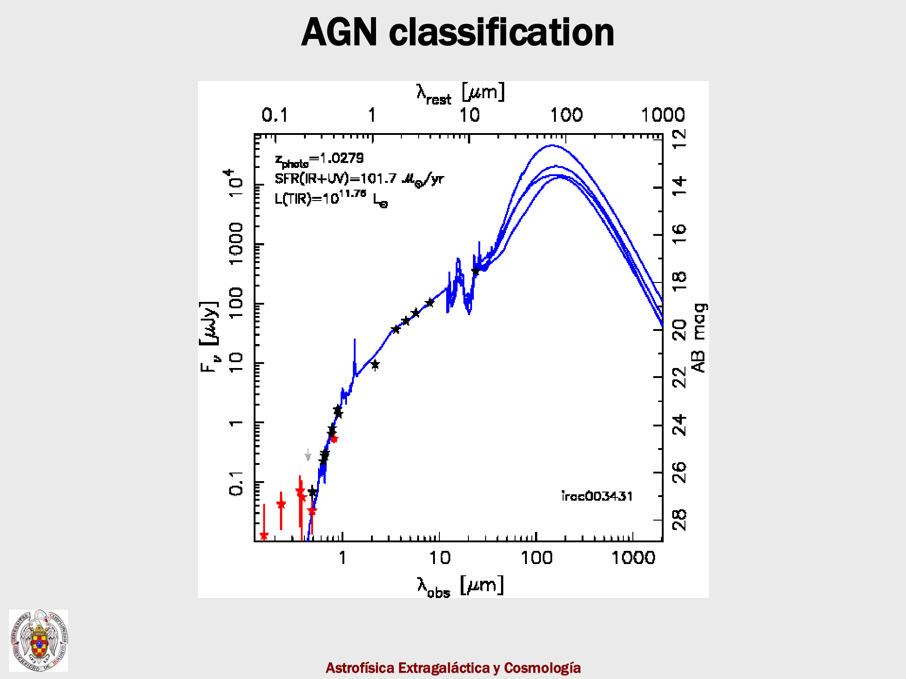
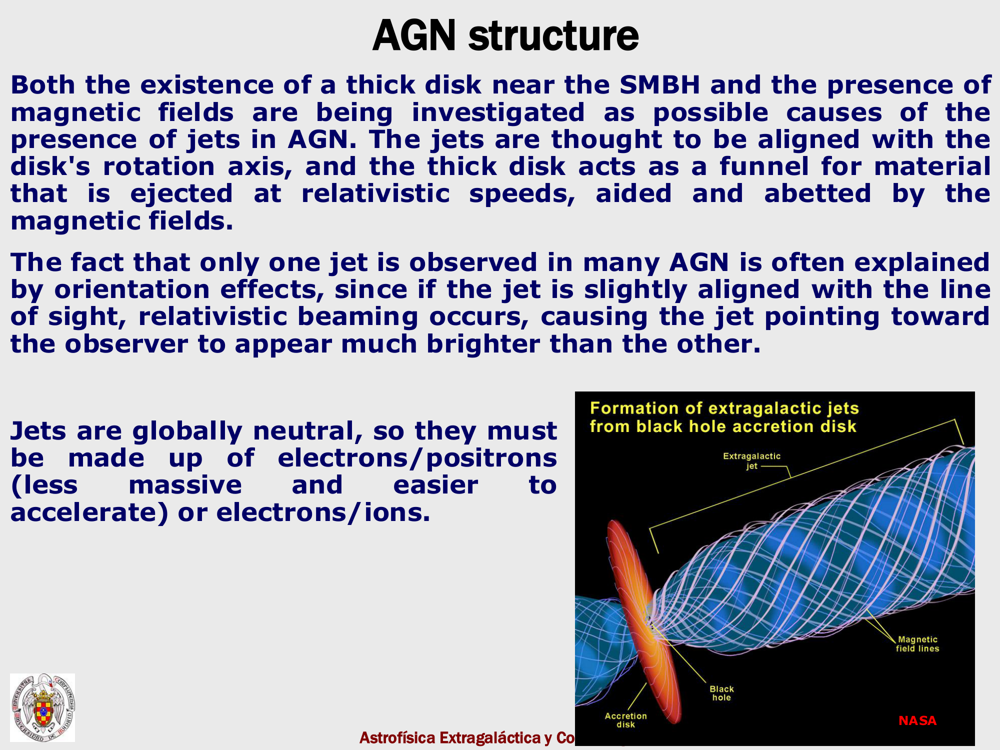

Active Galactic Nuclei (AGN) are powered by the accretion of matter onto supermassive black holes ($M_{\text{BH}} \sim 10^6 - 10^{10} M_\odot$) at galactic centers, converting gravitational potential energy into radiation with radiative efficiency $\eta \approx 0.06 - 0.42$ ($L_{\text{bol}} = \eta \dot{M} c^2$).

## the eddington limit and black hole growth

radiation pressure on free electrons sets the maximum steady-state spherical accretion luminosity:

$$L_{\text{Edd}} = \frac{4\pi G M_{\text{BH}} m_p c}{\sigma_T} \approx 1.26 \times 10^{38}\text{ erg s}^{-1} \left( \frac{M_{\text{BH}}}{M_\odot} \right)$$

assuming growth at the Eddington limit ($L = L_{\text{Edd}}$), black hole mass grows exponentially with the Salpeter e-folding timescale:

$$M_{\text{BH}}(t) = M_0 \exp\left( \frac{t}{\tau_{\text{Salpeter}}} \right), \quad \tau_{\text{Salpeter}} = \frac{\eta \sigma_T c}{4\pi G m_p (1 - \eta)} \approx 45\text{ Myr}$$

## the unified model (antonucci 1993, urry & padovani 1995)

all radio-quiet AGNs share an identical physical engine, with observed observational differences arising primarily from the viewing angle $\theta$ relative to an obscuring, dusty molecular torus:
- **Type 1 AGN (Seyfert 1, Quasars)**: viewed along pole (face-on, $\theta < \theta_{\text{torus}}$). direct line of sight to the central engine reveals both the high-velocity Broad-Line Region (BLR: FWHM $> 2000\text{ km s}^{-1}$) and the extended Narrow-Line Region (NLR: FWHM $\sim 500\text{ km s}^{-1}$).
- **Type 2 AGN (Seyfert 2)**: viewed edge-on through the obscuring dusty torus ($\theta > \theta_{\text{torus}}$). the central continuum and BLR are obscured; only narrow forbidden lines from the extended NLR are visible in direct light (broad lines appear only in polarized scattered light).

## smbh-host coevolution and feedback

supermassive black holes scale tightly with their host galaxy spheroids:
- **Magorrian relation**: $M_{\text{BH}} \approx 0.001 - 0.002 M_{\text{bulge}}$.
- **$M_{\text{BH}} - \sigma$ relation**: $M_{\text{BH}} \propto \sigma^{4 - 5}$.

because the energy released by black hole growth ($E_{\text{BH}} = \eta M_{\text{BH}} c^2$) exceeds the binding energy of the galactic bulge ($E_{\text{bind}} \sim M_{\text{bulge}} \sigma^2$) by over an order of magnitude, **AGN feedback** regulates galaxy evolution:

1. **Quasar mode (radiative / wind mode)**:
   at high accretion rates near the peak of cosmic star formation ($z \sim 2$), radiation pressure drives multi-phase galactic winds with mass outflow rates $\dot{M}_{\text{out}} \sim 100 - 1000 M_\odot\text{ yr}^{-1}$, expelling cold molecular gas and terminating star formation.
2. **Radio mode (kinetic / jet mode)**:
   at low accretion rates in massive halos, relativistic radio jets inject mechanical energy into the intra-cluster medium (ICM), creating X-ray cavities and preventing cooling flows, keeping massive ellipticals "red and dead".

## see also

- [[Observational_Cosmology_MOC]]
- [[Pablo_04_Nuclear_activity_in_galaxies]]
- [[BPT emission line diagnostic diagram]]
- [[AGN and supermassive black holes]]
- [[Stellar mass function]]

---

### Observational Cosmology Data Panels & Visual Evidence

*Unified model of AGN: supermassive black hole, accretion disk, broad-line region (BLR), dusty torus, narrow-line region (NLR), and relativistic jets.*

*Quasar luminosity function evolution: cosmic downsizing and peak AGN activity at $z \sim 2$.*

*Radiative vs kinetic AGN feedback modes in galaxy cluster heating and star formation quenching.*

*Soltan argument: integrated quasar light energy density accounting for the local supermassive black hole mass density $\rho_\bullet$.*

## Linked References

- [[BPT emission line diagnostic diagram]]
- [[Cosmic dawn and high-redshift galaxies with JWST]]
- [[Observational_Cosmology_MOC]]

