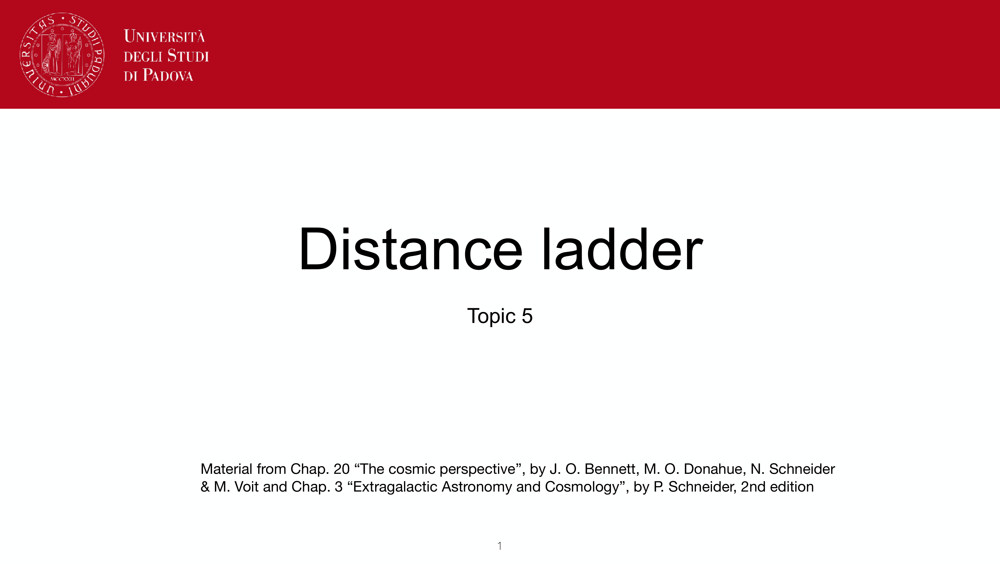
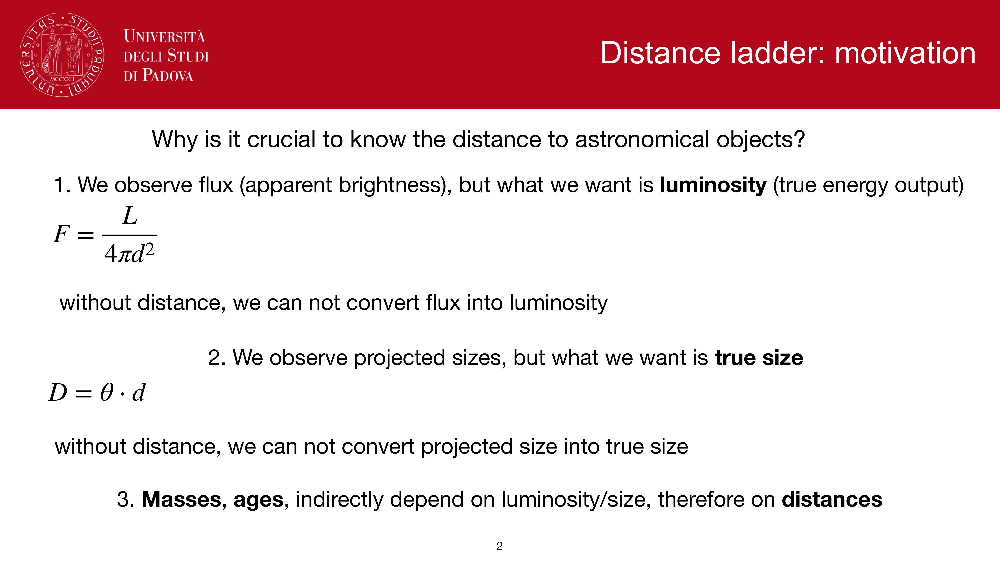
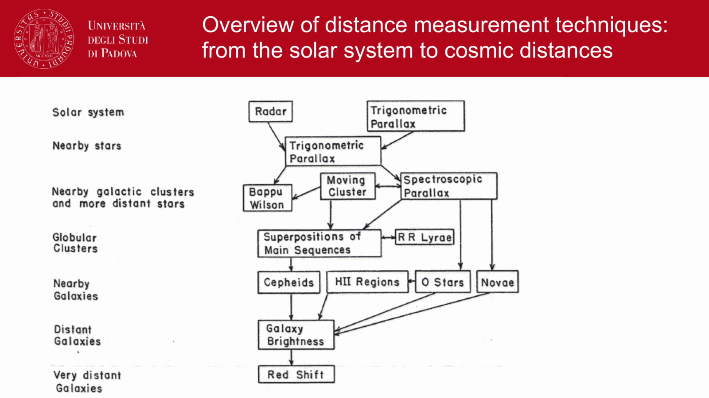
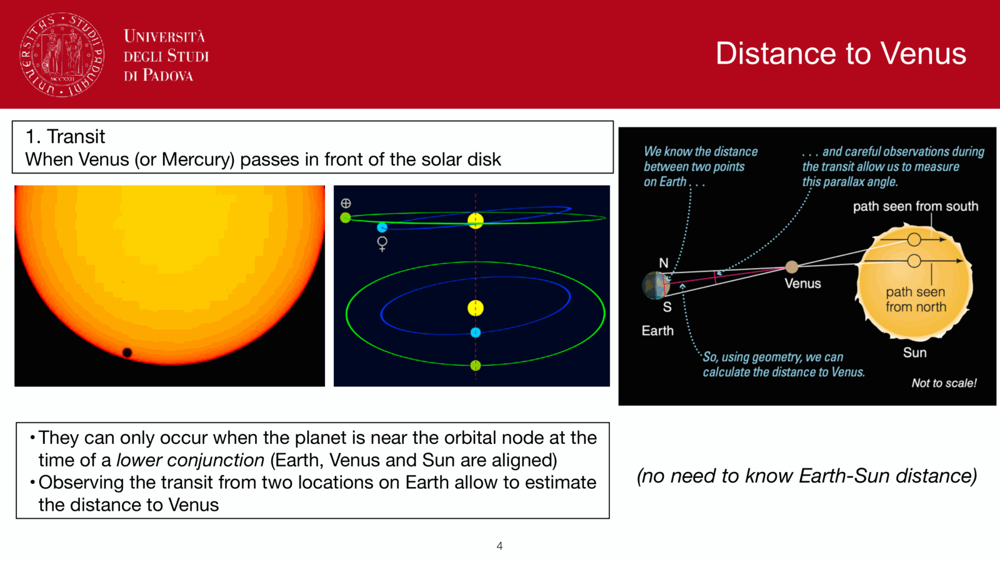
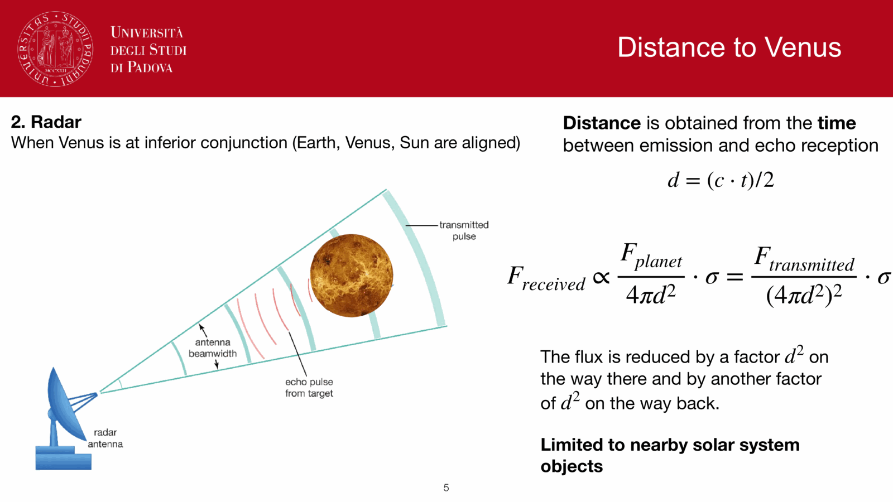
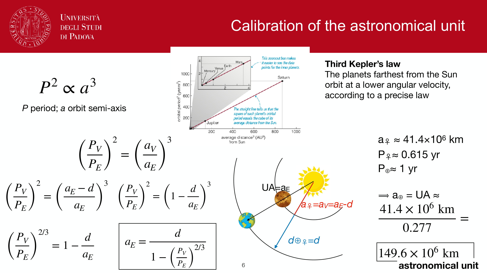
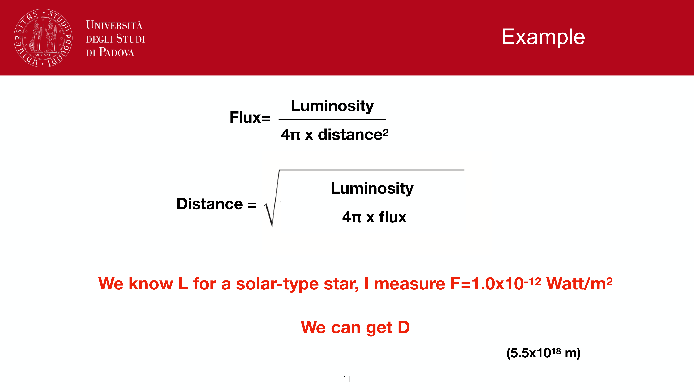
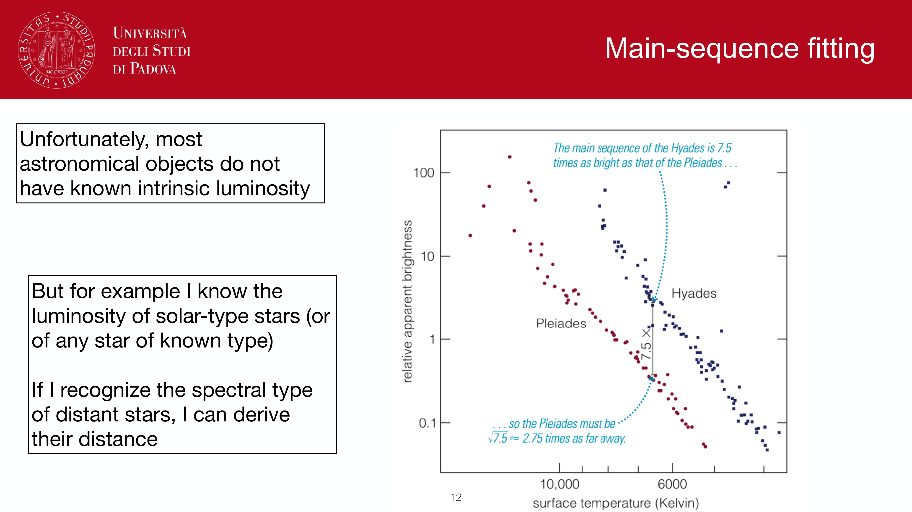


the bottom rung of the distance ladder. before any other distance method, we need to know how big $1$ AU is in km. then the same geometry that fixes the AU defines the parsec. answer to `obs1.pdf`.

## historical: AU from a Venus transit

a **transit of Venus** across the solar disk is observed simultaneously from two locations on Earth separated by a known baseline $B$ (typically Earth's diameter projected onto the line of sight). the two observers see Venus tracking slightly different chords across the Sun.

geometry: at inferior conjunction, Venus, Sun, and the two observers form a parallax triangle. the angular shift $\theta$ of Venus's apparent position is related to the Earth-Venus distance $d_{EV}$ by
$$\theta = \frac{B}{d_{EV}} \cdot \left(1 - \frac{a_V}{a_E}\right)^{-1}$$

the factor $(1 - a_V/a_E)$ accounts for the fact that the Sun behind Venus is also at finite distance, so the "effective baseline" is shortened. with the orbital radius ratio $a_V/a_E$ known from periods (Kepler, next step), this is solvable.

historical Venus transits used: $1761$, $1769$ (Captain Cook to Tahiti), $1874$, $1882$. Mercury transits work too with smaller signal.

## modern: AU from radar

since the 1960s, a radar pulse is sent from Earth to Venus, bounces off the surface, and the round-trip travel time $t$ is measured at high precision. with the speed of light known to nine digits:
$$d_{EV} = \frac{c\, t}{2}$$

direct, geometric, and now defines the AU at $\sim 1$ part in $10^{11}$.

a side note on signal strength: received radar power scales as $1/d^4$ because the pulse spreads on the way out and again on the way back. for Earth-Venus ($\sim 0.3$ AU at inferior conjunction) this is feasible with a few-MW transmitter; pushing radar much further out runs into the inverse-fourth-power wall.

## Kepler converts $d_{EV}$ to AU

Kepler's third law for the solar system, with $G(M_\odot + m) \approx GM_\odot$ for any planet:
$$P^2 \propto a^3$$

ratio for Earth and Venus:
$$\left(\frac{P_V}{P_E}\right)^2 = \left(\frac{a_V}{a_E}\right)^3$$

so the orbital ratio is known from periods alone, observable to high precision over centuries. with $P_V = 224.7$ days and $P_E = 365.25$ days:
$$a_V/a_E \approx 0.7233$$

at **inferior conjunction** (Venus between Earth and Sun, collinear): $d_{EV} = a_E - a_V$. so
$$a_E = \frac{d_{EV}}{1 - a_V/a_E} = \frac{d_{EV}}{0.2767}$$

plug in $d_{EV}$ in km from radar, get $a_E = 1$ AU $\approx 1.496 \times 10^8$ km.

modern value, defined exactly by IAU 2012:
$$1\,\text{AU} \equiv 149\,597\,870\,700\,\text{m}$$

## the parsec, defined geometrically

Earth's orbit is itself a $2$ AU baseline. observe a nearby star from two opposite points six months apart; it appears to shift against distant background by the **parallax angle** $p$.

small-angle geometry:
$$\tan p \approx p = \frac{1\,\text{AU}}{d}$$

definition: the **parsec** is the distance at which $1$ AU subtends $1$ arcsecond.
$$1\,\text{pc} \equiv \frac{1\,\text{AU}}{1''} \cdot \frac{180 \cdot 3600}{\pi} = 3.086 \times 10^{16}\,\text{m} = 3.262\,\text{light-years}$$

practical formula:
$$\boxed{\, d(\text{pc}) = 1/p(\text{arcsec}) \,}$$

a star at $10$ pc has $p = 0.1''$. at $100$ pc, $p = 0.01''$. at $1$ kpc, $p = 1$ mas.

## why this rung is special

parallax is the **only fully geometric distance method** in the entire ladder. every rung above it is a standard-candle method calibrated against parallax-known objects. when Hipparcos and then Gaia released their parallax catalogs, every rung above tightened simultaneously.

range of geometric parallax:
- naked eye + photographic plates (Bessel 1838 for 61 Cygni): $\sim 10$ pc.
- Hipparcos (1989-1993): $\sim 100$ pc, $\sim 1$ mas precision.
- Gaia DR3 (2022): $\sim 1$ to $10$ kpc, $\sim 10\,\mu$as precision for bright stars.
- Gaia DR5 expected: $\sim 30$ kpc.

## see also

- [Annual stellar parallax](./Annual%20stellar%20parallax.html)
- [Distance ladder derivations](./Distance%20ladder%20derivations.html)
- [Distance modulus](./Distance%20modulus.html)
- [Cepheid period-luminosity relation](./Cepheid%20period-luminosity%20relation.html)
- [Spectroscopic parallax and main-sequence fitting](./Spectroscopic%20parallax%20and%20main-sequence%20fitting.html)
- [Hubble law](./Hubble%20law.html)
- [Earth coordinates](./Earth%20coordinates.html)
- [Precession nutation aberration parallax](./Precession%20nutation%20aberration%20parallax.html)

---

## observational astrophysics course slides (Prof. Paolo Cassata)

*Lecture 5: The Cosmic Distance Ladder.*

*Principle of the distance ladder: each rung calibrates the next.*

*Rung 0: Astronomical Unit (AU) determination via Venus transit and radar ranging.*

*Kepler third law: a^3 / P^2 = G (M_Sun + M_planet) / (4 pi^2).*

*Radar echo time delay Delta t: distance = c * Delta t / 2.*

*Current IAU definition: 1 AU = 149,597,870,700 m exactly.*

*Definition of parsec: baseline of 1 AU subtending an angle of 1 arcsecond.*

*Obs1 exam question: Full model answer on AU calibration, parallax, and parsec definition.*


  <h4 class="backlinks-title">Linked References (1)</h4>
  <ul class="backlinks-list">
    <li class="backlink-item-wrap"><a href="../../04_Atlas/Observational_Astrophysics_MOC.html" class="backlink-item">Observational_Astrophysics_MOC</a></li>
  </ul>

