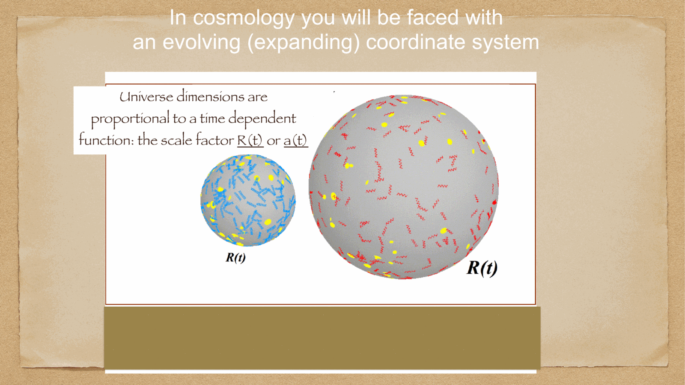
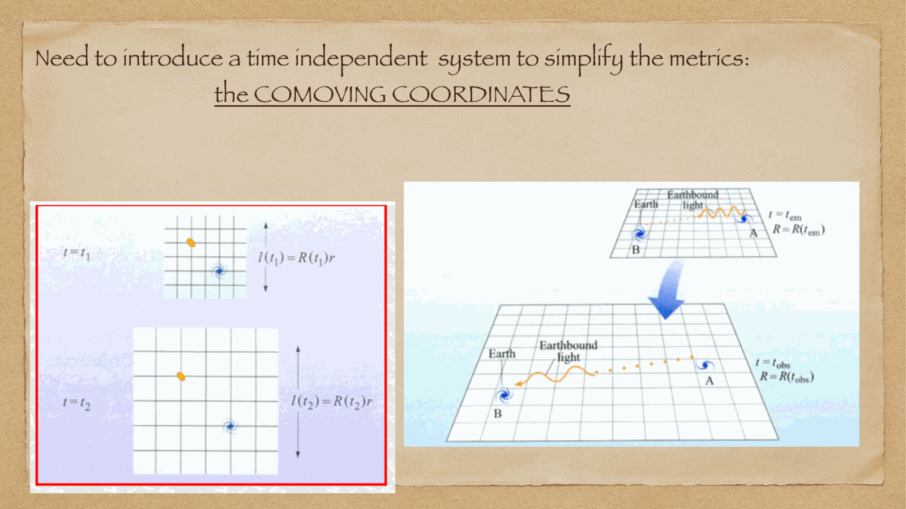
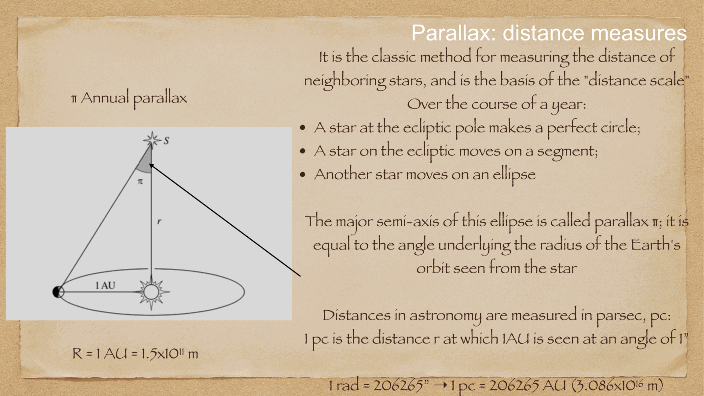

the **aberration of light** is the apparent displacement of a celestial source in the direction of the instantaneous motion of the observer. discovered in 1728 by **James Bradley** while attempting to measure stellar parallax, aberration provided the very first direct observational proof of Earth's orbital revolution around the Sun and confirmed the finite speed of light $c$.

---

## the physical mechanism: rain in a moving carriage

the classic analogy: if rain falls vertically with speed $c$, and you run forward with horizontal speed $v$, the raindrops appear to strike you at an angle tilted toward your direction of motion. you must tilt your umbrella forward by an angle $\theta \approx v/c$.

similarly, a telescope moving with Earth's orbital velocity $\vec{v}$ must be inclined forward in the direction of motion for photons traveling down the tube to strike the detector without hitting the tube walls.

---

## the aberration formula

in classical vector mechanics:
$$\vec{c}' = \vec{c} - \vec{v}$$
where $\vec{c}$ is the velocity of light in the solar-system barycentric frame, and $\vec{v}$ is Earth's orbital velocity ($v \approx 29.8$ km/s $\approx 30$ km/s).

for $v \ll c$, the angular displacement $\theta$ between the true position and the apparent position is:
$$\tan\theta \approx \sin\theta \approx \frac{v}{c} \sin\psi$$
where $\psi$ is the angle between the line of sight to the star and Earth's velocity vector $\vec{v}$.

the maximum displacement occurs when the star is perpendicular to Earth's velocity vector ($\psi = 90^\circ$). this defines the **aberration constant** $\kappa$:
$$\boxed{\, \kappa = \frac{v}{c} = \frac{29.78 \times 10^3 \text{ m/s}}{2.998 \times 10^8 \text{ m/s}} \approx 9.93 \times 10^{-5} \text{ rad} \approx 20.4955'' \approx 20.5'' \,}$$

---

## the annual aberration ellipse

as Earth orbits the Sun over one year, its velocity vector $\vec{v}(t)$ sweeps through a full $360^\circ$ circle in the ecliptic plane. consequence: every star on the sky appears to describe an **aberration ellipse** over the course of a year:
- **semi-major axis**: always equal to $\kappa \approx 20.5''$, parallel to the ecliptic plane.
- **semi-minor axis**: equal to $\kappa \sin\beta$, where $\beta$ is the star's ecliptic latitude.

### limiting cases:
1. **at the Ecliptic Pole ($\beta = \pm 90^\circ$)**: the apparent path is a perfect **circle** of radius $\kappa = 20.5''$.
2. **in the Ecliptic Plane ($\beta = 0^\circ$)**: the path degenerates into a **line segment** of length $2\kappa \approx 41''$.
3. **intermediate latitudes**: an **ellipse** of semi-axes $a = \kappa$ and $b = \kappa\sin\beta$.

---

## fundamental differences: aberration vs parallax

students frequently confuse aberration and parallax. they must be rigorously distinguished on the oral exam:

| feature | stellar aberration | annual stellar parallax |
|---|---|---|
| **cause** | **velocity** of the observer $\vec{v}$ (finite speed of light) | **position** of the observer (geometric baseline $2$ AU) |
| **distance dependence** | **independent of distance!** all stars have $a = 20.5''$ | **inversely proportional to distance**: $p = 1/d$ |
| **typical amplitude** | huge: $\approx 20.5''$ | tiny: $\le 0.77''$ (Proxima Cen), $< 0.01''$ for $d > 100$ pc |
| **phase of maximum shift** | displaced in direction of Earth's **velocity** $\vec{v}$ | displaced opposite to Earth's **displacement** $\vec{r}$ |
| **phase difference** | $\vec{v}$ leads $\vec{r}$ by $90^\circ$ (quarter of a year, $\sim 3$ months) | $90^\circ$ out of phase with aberration! |

---

## other forms of aberration

- **diurnal aberration**: caused by Earth's daily axial rotation ($v_{\text{rot}} \approx 0.46 \cos\phi$ km/s). amplitude $\approx 0.32'' \cos\phi$, directed toward the east.
- **secular aberration**: caused by the Sun's orbit around the Galactic Center ($v_0 \approx 220$ km/s). amplitude $\approx 2.5'$, but changes on a $\sim 230$-million-year timescale, so it produces an unnoticeable constant shift except for tiny accelerations measured by Gaia ($5$ $\mu$as/yr/kpc).

---

## see also

- [[Fundamentals_Astrophysics_Cosmology_MOC]]
- [[Annual stellar parallax]]
- [[Proper motion and stellar kinematics]]
- [[Precession and nutation]]
- [[Equatorial system]]
- [[Ecliptic system]]

## Linked References

- [[Annual stellar parallax]]
- [[Atmospheric refraction]]
- [[Precession and nutation]]
- [[Proper motion and stellar kinematics]]
- [[Fundamentals_Astrophysics_Cosmology_MOC]]

