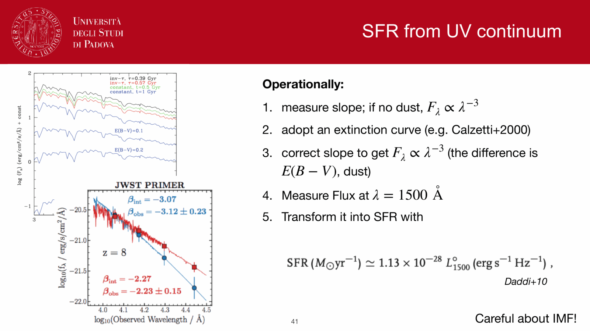
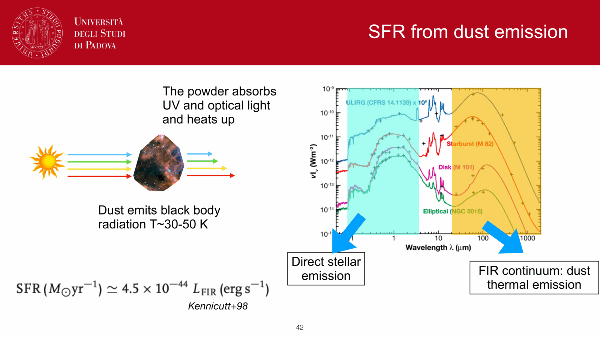
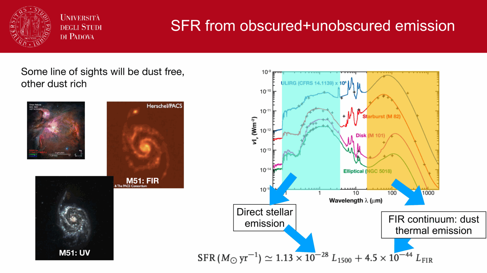
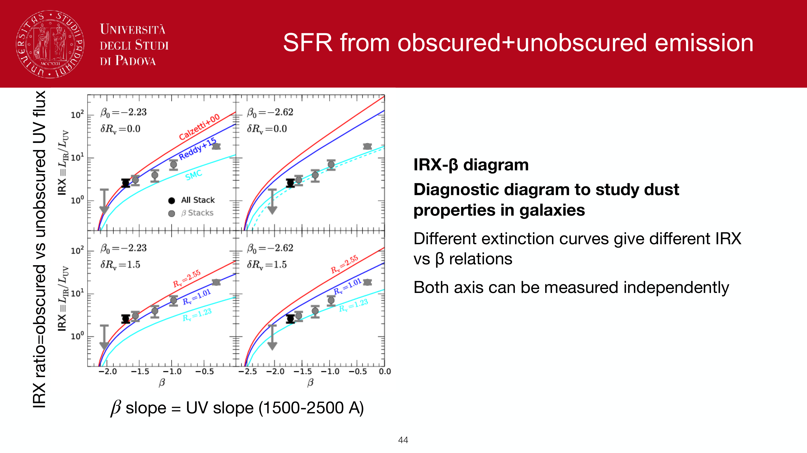
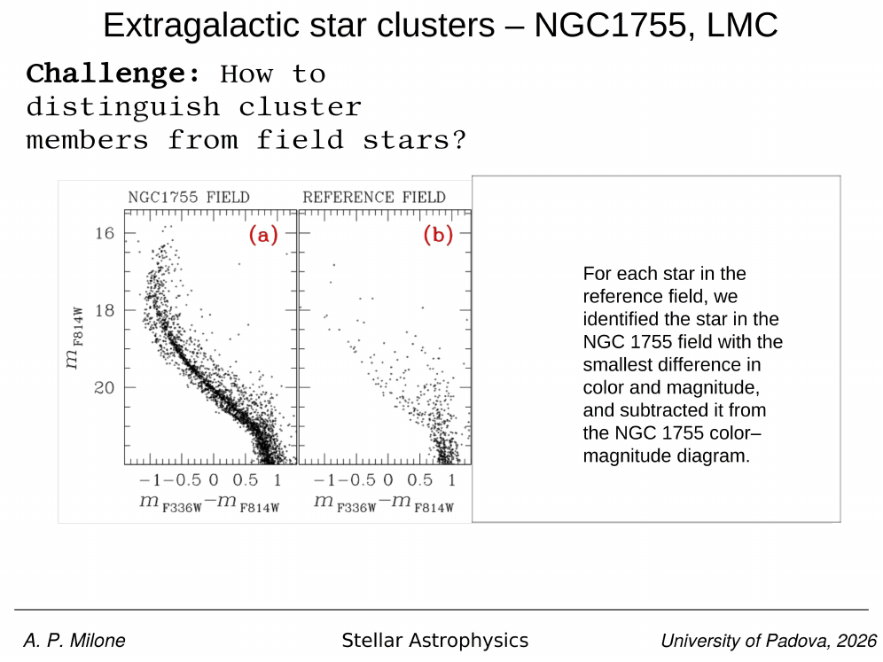
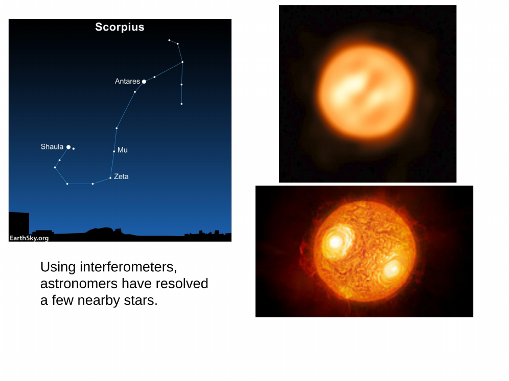
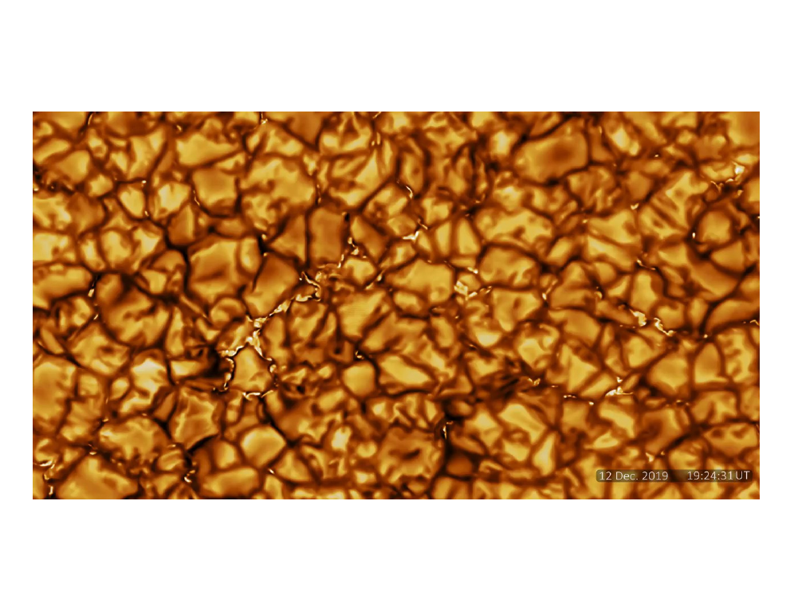
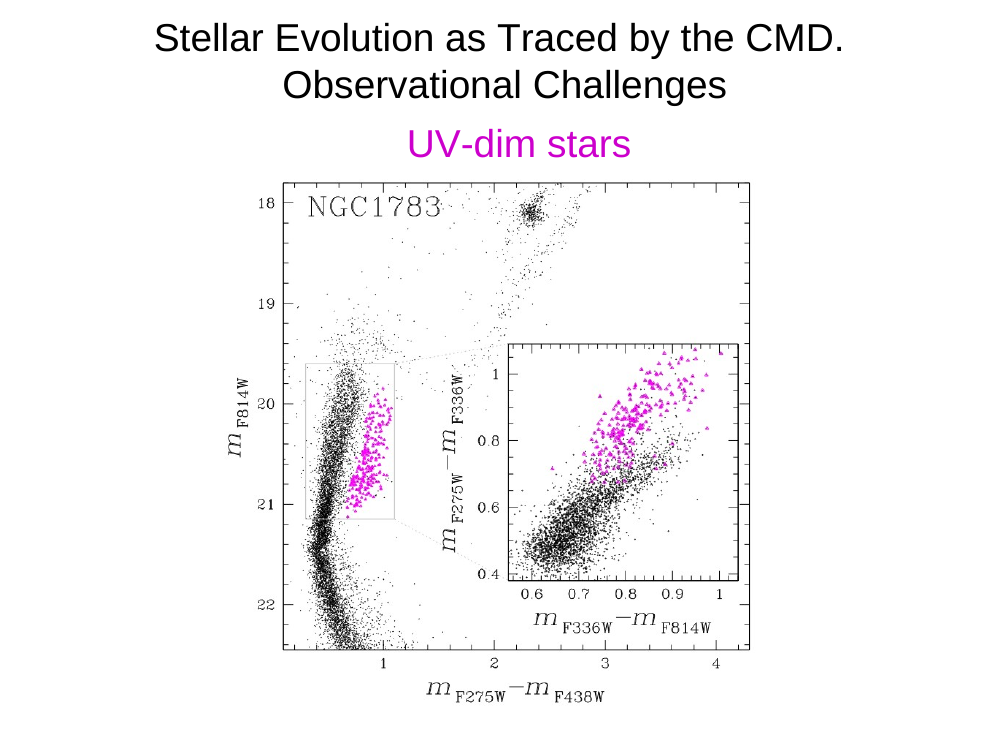

in integrated broadband photometry and low-resolution spectroscopy, an **older, metal-poor** stellar population displays colors, spectral slope, and continuum breaks nearly indistinguishable from a **younger, metal-rich** one. This **age-metallicity degeneracy** is the primary systematic challenge in determining the evolutionary histories, formation epochs, and chemical evolution of unresolved galaxies.

---

### physical origin

the degeneracy arises because increasing age and increasing metallicity alter stellar evolution and stellar atmospheres in qualitatively identical directions:

1. **effect of increasing age ($\tau$)**:
   - the main-sequence turn-off mass decreases ($M_{\rm TO} \propto \tau^{-0.4}$).
   - the effective temperature of the turn-off drops ($T_{\rm TO} \propto \tau^{-0.15}$).
   - hot, luminous O, B, and A stars die out, leaving the integrated light dominated by cooler, redder low-mass main-sequence dwarfs and red giant branch (RGB) stars.
   - the continuum shifts redward and the $4000$ Å break strengthens.

2. **effect of increasing metallicity ($Z$)**:
   - higher heavy-element abundance increases interior atomic opacity (free-bound and bound-bound transitions), reducing the efficiency of radiative energy transport. Stars of a given mass must expand and cool, shifting the entire isochrone to lower $T_{\rm eff}$.
   - in stellar atmospheres, higher metal abundance drastically amplifies line blanketing in the ultraviolet and blue regions ($\lambda < 4500$ Å), absorbing blue continuum flux and re-radiating it at longer, optical and near-infrared wavelengths.
   - the continuum shifts redward and line-blanketed absorption troughs deepen.

because both mechanisms reduce the effective temperature of the dominant stars and suppress blue light relative to red light, broadband optical colors (such as $U-B$, $B-V$, $V-R$, $V-I$) and simple color indices move along virtually parallel vectors in color space.

---

### quantitative formulation: worthey's 3/2 rule

in his seminal work, Worthey (1994) quantified the relative sensitivities of optical broadband colors and spectral energy distributions to changes in age versus metallicity for intermediate-to-old stellar populations ($\tau > 1.5$ Gyr):

$$\left( \frac{\Delta \log \tau}{\Delta \log Z} \right)_{\rm colors} \approx \frac{3}{2} = 1.5$$

expressed in astronomical terms:
- a **factor of $2$ increase in age** ($\Delta \log \tau \approx 0.30$ dex) shifts optical broadband colors by approximately the same magnitude as a **$0.20$ dex increase in metallicity** ($\Delta [Z/\mathrm{H}] \approx +0.20$).
- a factor of $3$ change in age ($\Delta \log \tau \approx 0.48$) is completely masked by a $0.32$ dex change in metallicity.
- without independent constraints, optical colors alone cannot distinguish whether a red galaxy formed $12$ Gyr ago with sub-solar metallicity or $4$ Gyr ago with super-solar metallicity.

---

### strategies for breaking the degeneracy

to decouple age from metallicity, one must exploit spectral features that depend on stellar surface temperature (set by turn-off mass) rather than atmospheric opacity, or observe in wavelength regimes where opacity mechanisms diverge:

#### 1. orthogonal lick/IDS absorption indices
- **Balmer absorption lines ($\mathrm{H}\beta, \mathrm{H}\gamma_A, \mathrm{H}\delta_A$)**:
  - Balmer line equivalent widths peak sharply at $T_{\rm eff} \approx 9000$ K (A-type stars). In old populations ($\tau > 2$ Gyr), Balmer absorption is almost exclusively governed by the temperature of the main-sequence turnoff $T_{\rm TO}$, making it a clean chronometer that is nearly independent of metallicity.
- **Metal indices ($\mathrm{Mg}_b, \mathrm{Fe5270}, \mathrm{Fe5335}$, $[\mathrm{MgFe}]'$)**:
  - trace the atmospheric opacity and elemental abundances of red giants.
- **index-index diagnostic grids**:
  - plotting $\mathrm{H}\beta$ versus the composite metallicity index $[\mathrm{MgFe}]'$ forms a non-degenerate, nearly rectangular coordinate grid where age and metallicity run orthogonally.

#### 2. the $4000$ Å break vs higher-order balmer lines
- the narrow $4000$ Å break index $D_n4000$ is sensitive to both age and metallicity.
- pairing $D_n4000$ against the equivalent width of $\mathrm{H}\delta_A$ (Kauffmann et al. 2003) breaks the degeneracy for star-forming and post-starburst galaxies, constraining the burst fraction and time elapsed since the last major burst.

#### 3. optical-to-near-infrared color combinations
- in the near-infrared ($\lambda > 1\,\mu\mathrm{m}$, e.g., $J, H, K$ bands), line blanketing effects become minimal.
- color-color diagrams combining optical and NIR baselines (e.g., $B-V$ vs $V-K$, or $B-H$ vs $J-K$) exhibit curved SSP tracks that separate metal-poor old populations from metal-rich young populations.

#### 4. full-spectrum stellar population fitting
- utilizing the full pixel information of intermediate-to-high resolution spectra ($R \ge 2000$) via penalized pixel-fitting (**pPXF**) or Bayesian codes (**Prospector**, **FIREFLY**).
- simultaneously fits hundreds of individual absorption features, the continuum shape, and kinematic broadening, extracting joint posterior distributions that break the degeneracy with high statistical precision.

#### 5. resolved color-magnitude diagrams (CMDs)
- for Milky Way globular clusters and nearby galaxies (e.g., Magellanic Clouds, M31):
  - resolving individual stars on the CMD completely dissolves the degeneracy: the **main-sequence turnoff luminosity** fixes age, while the **slope and color of the red giant branch (RGB)** independently fixes metallicity.

---

### consequences for galaxy evolution

- **downsizing and galaxy ages**: early claims that massive elliptical galaxies were young ($2\text{--}4$ Gyr) were artifacts of the age-metallicity degeneracy compounded by non-solar $[\alpha/\mathrm{Fe}]$ enhancement. Breaking the degeneracy proved that massive early-type galaxies formed the bulk of their stars early ($z > 2$) and quenched rapidly.
- **stellar mass estimates**: fortunately, the stellar mass-to-light ratio $\Upsilon_*$ correlates with color in a manner that partially compensates for the degeneracy; an older-metal-poor population and a younger-metal-rich population have comparable $\Upsilon_K$, keeping inferred galaxy masses relatively stable ($\sim 0.1\text{--}0.2$ dex).

---

## see also

- [Observational_Astrophysics_MOC](../../04_Atlas/Observational_Astrophysics_MOC.html)
- [Stellar_Astrophysics_MOC](../../04_Atlas/Stellar_Astrophysics_MOC.html)
- [Lick indices](Lick%20indices.html)
- [Stellar population synthesis](Stellar%20population%20synthesis.html)
- [Single stellar population SSP](Single%20stellar%20population%20SSP.html)
- [SPS code families](SPS%20code%20families.html)
- [SED fitting basics](SED%20fitting%20basics.html)
- [Color-magnitude diagrams of clusters](Color-magnitude%20diagrams%20of%20clusters.html)
- [Cluster ages from CMD turnoff](Cluster%20ages%20from%20CMD%20turnoff.html)
- [Age estimation in unresolved populations](Age%20estimation%20in%20unresolved%20populations.html)
- [Metallicity and chemical evolution](Metallicity%20and%20chemical%20evolution.html)

---

## observational astrophysics course slides (Prof. Paolo Cassata)

*The 3/2 rule of Worthey (1994): Delta log(age) ~ 1.5 * Delta log(Z) produces identical broadband colors.*

*Decoupling the degeneracy using diagnostic grids: [MgFe] prime vs H-beta.*

*Composite index [MgFe] prime = sqrt(Mg_b * (0.72 Fe5270 + 0.28 Fe5335)) independent of [alpha/Fe].*

*Measuring [alpha/Fe] enhancement in giant elliptical galaxies: evidence for rapid star formation (< 1 Gyr).*

---

## Complete Lecture Slide Panels & Observational Evidence (Lecture 03 — Reading the CMD III: Metallicity & Horizontal Branch)

> **Context**: *Metallicity [Fe/H] shifts, helium abundance Y, Horizontal Branch morphology, Lee-Zinn morphology index, and breaking the age-metallicity degeneracy.*

The following slides from Prof. Antonino Milone's lecture series provide the direct observational, photometric, and theoretical foundations for this topic:

*Figure P03-01: LAntonino_p03_01.png — Observational data, CMD morphology, and diagnostics from Lecture 03 — Reading the CMD III: Metallicity & Horizontal Branch.*

*Figure P03-02: LAntonino_p03_02.png — Observational data, CMD morphology, and diagnostics from Lecture 03 — Reading the CMD III: Metallicity & Horizontal Branch.*

*Figure P03-03: LAntonino_p03_03.png — Observational data, CMD morphology, and diagnostics from Lecture 03 — Reading the CMD III: Metallicity & Horizontal Branch.*

*Figure P03-04: LAntonino_p03_04.png — Observational data, CMD morphology, and diagnostics from Lecture 03 — Reading the CMD III: Metallicity & Horizontal Branch.*

*Figure P03-05: LAntonino_p03_05.png — Observational data, CMD morphology, and diagnostics from Lecture 03 — Reading the CMD III: Metallicity & Horizontal Branch.*

*Figure P03-06: LAntonino_p03_06.png — Observational data, CMD morphology, and diagnostics from Lecture 03 — Reading the CMD III: Metallicity & Horizontal Branch.*

*Figure P03-07: LAntonino_p03_07.png — Observational data, CMD morphology, and diagnostics from Lecture 03 — Reading the CMD III: Metallicity & Horizontal Branch.*

*Figure P03-08: LAntonino_p03_08.png — Observational data, CMD morphology, and diagnostics from Lecture 03 — Reading the CMD III: Metallicity & Horizontal Branch.*

*Figure P03-09: LAntonino_p03_09.png — Observational data, CMD morphology, and diagnostics from Lecture 03 — Reading the CMD III: Metallicity & Horizontal Branch.*

*Figure P03-10: LAntonino_p03_10.png — Observational data, CMD morphology, and diagnostics from Lecture 03 — Reading the CMD III: Metallicity & Horizontal Branch.*

*Figure P03-11: LAntonino_p03_11.png — Observational data, CMD morphology, and diagnostics from Lecture 03 — Reading the CMD III: Metallicity & Horizontal Branch.*

*Figure P03-12: LAntonino_p03_12.png — Observational data, CMD morphology, and diagnostics from Lecture 03 — Reading the CMD III: Metallicity & Horizontal Branch.*

*Figure P03-13: LAntonino_p03_13.png — Observational data, CMD morphology, and diagnostics from Lecture 03 — Reading the CMD III: Metallicity & Horizontal Branch.*

*Figure P03-14: LAntonino_p03_14.png — Observational data, CMD morphology, and diagnostics from Lecture 03 — Reading the CMD III: Metallicity & Horizontal Branch.*

*Figure P03-15: LAntonino_p03_15.png — Observational data, CMD morphology, and diagnostics from Lecture 03 — Reading the CMD III: Metallicity & Horizontal Branch.*

*Figure P03-16: LAntonino_p03_16.png — Observational data, CMD morphology, and diagnostics from Lecture 03 — Reading the CMD III: Metallicity & Horizontal Branch.*

*Figure P03-17: LAntonino_p03_17.png — Observational data, CMD morphology, and diagnostics from Lecture 03 — Reading the CMD III: Metallicity & Horizontal Branch.*

*Figure P03-18: LAntonino_p03_18.png — Observational data, CMD morphology, and diagnostics from Lecture 03 — Reading the CMD III: Metallicity & Horizontal Branch.*

*Figure P03-19: LAntonino_p03_19.png — Observational data, CMD morphology, and diagnostics from Lecture 03 — Reading the CMD III: Metallicity & Horizontal Branch.*

*Figure P03-20: LAntonino_p03_20.png — Observational data, CMD morphology, and diagnostics from Lecture 03 — Reading the CMD III: Metallicity & Horizontal Branch.*

*Figure P03-21: LAntonino_p03_21.png — Observational data, CMD morphology, and diagnostics from Lecture 03 — Reading the CMD III: Metallicity & Horizontal Branch.*

*Figure P03-22: LAntonino_p03_22.png — Observational data, CMD morphology, and diagnostics from Lecture 03 — Reading the CMD III: Metallicity & Horizontal Branch.*

*Figure P03-23: LAntonino_p03_23.png — Observational data, CMD morphology, and diagnostics from Lecture 03 — Reading the CMD III: Metallicity & Horizontal Branch.*

*Figure P03-24: LAntonino_p03_24.png — Observational data, CMD morphology, and diagnostics from Lecture 03 — Reading the CMD III: Metallicity & Horizontal Branch.*

*Figure P03-25: LAntonino_p03_25.png — Observational data, CMD morphology, and diagnostics from Lecture 03 — Reading the CMD III: Metallicity & Horizontal Branch.*

*Figure P03-26: Lecture03_p15-15.png — Observational data, CMD morphology, and diagnostics from Lecture 03 — Reading the CMD III: Metallicity & Horizontal Branch.*

*Figure P03-27: Lecture03_p25-25.png — Observational data, CMD morphology, and diagnostics from Lecture 03 — Reading the CMD III: Metallicity & Horizontal Branch.*

*Figure P03-28: Lecture03_p35-35.png — Observational data, CMD morphology, and diagnostics from Lecture 03 — Reading the CMD III: Metallicity & Horizontal Branch.*

*Figure P03-29: Lecture03_p5-05.png — Observational data, CMD morphology, and diagnostics from Lecture 03 — Reading the CMD III: Metallicity & Horizontal Branch.*

  <h4 class="backlinks-title">Linked References (14)</h4>
  <ul class="backlinks-list">
    <li class="backlink-item-wrap"><a href="Age%20estimation%20in%20unresolved%20populations.html" class="backlink-item">Age estimation in unresolved populations</a></li>
    <li class="backlink-item-wrap"><a href="Isochrones%20and%20isochrone%20fitting.html" class="backlink-item">Isochrones and isochrone fitting</a></li>
    <li class="backlink-item-wrap"><a href="Lick%20indices.html" class="backlink-item">Lick indices</a></li>
    <li class="backlink-item-wrap"><a href="Main%20sequence%20turn-off%20as%20age%20indicator.html" class="backlink-item">Main sequence turn-off as age indicator</a></li>
    <li class="backlink-item-wrap"><a href="Metallicity%20and%20chemical%20evolution.html" class="backlink-item">Metallicity and chemical evolution</a></li>
    <li class="backlink-item-wrap"><a href="Photometric%20redshifts.html" class="backlink-item">Photometric redshifts</a></li>
    <li class="backlink-item-wrap"><a href="Population%20I%20and%20II%20stars.html" class="backlink-item">Population I and II stars</a></li>
    <li class="backlink-item-wrap"><a href="Resolved%20vs%20unresolved%20stellar%20populations.html" class="backlink-item">Resolved vs unresolved stellar populations</a></li>
    <li class="backlink-item-wrap"><a href="SED%20fitting%20basics.html" class="backlink-item">SED fitting basics</a></li>
    <li class="backlink-item-wrap"><a href="Single%20stellar%20population%20SSP.html" class="backlink-item">Single stellar population SSP</a></li>
    <li class="backlink-item-wrap"><a href="Stellar%20population%20synthesis.html" class="backlink-item">Stellar population synthesis</a></li>
    <li class="backlink-item-wrap"><a href="White%20dwarf%20cooling%20sequence%20on%20the%20CMD.html" class="backlink-item">White dwarf cooling sequence on the CMD</a></li>
    <li class="backlink-item-wrap"><a href="../../04_Atlas/Observational_Astrophysics_MOC.html" class="backlink-item">Observational_Astrophysics_MOC</a></li>
    <li class="backlink-item-wrap"><a href="../../04_Atlas/Stellar_Astrophysics_MOC.html" class="backlink-item">Stellar_Astrophysics_MOC</a></li>
  </ul>

