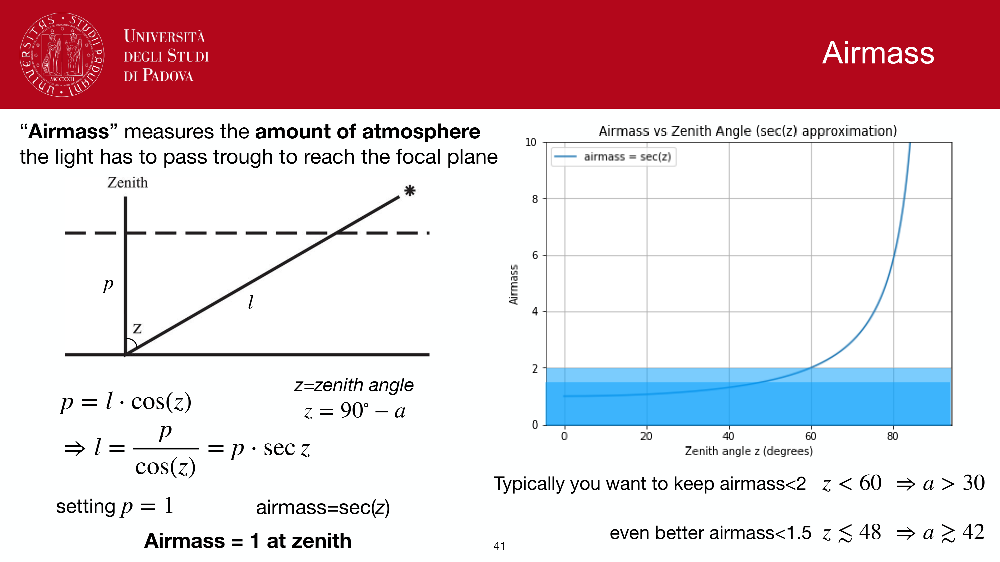
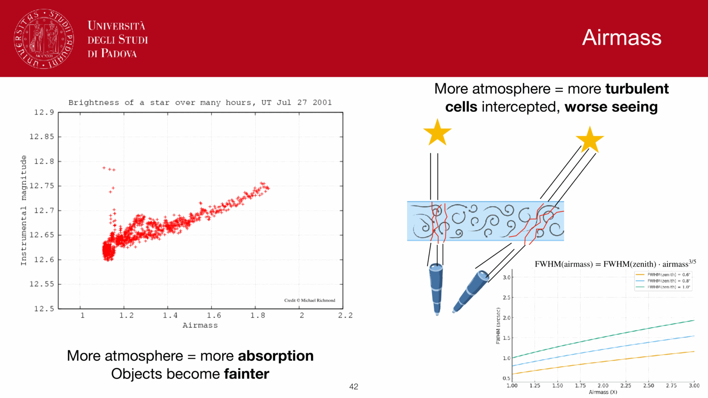
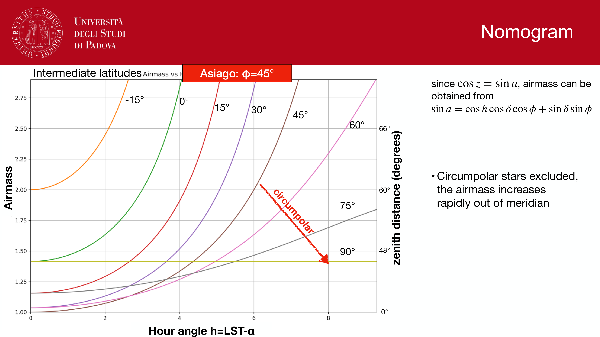
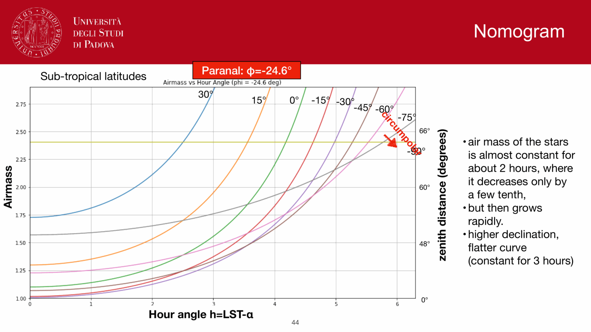
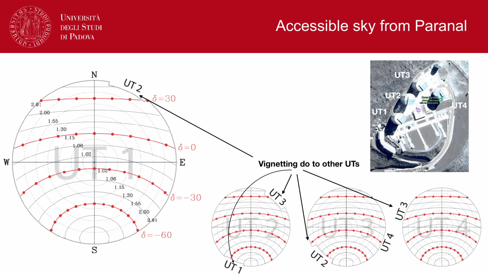
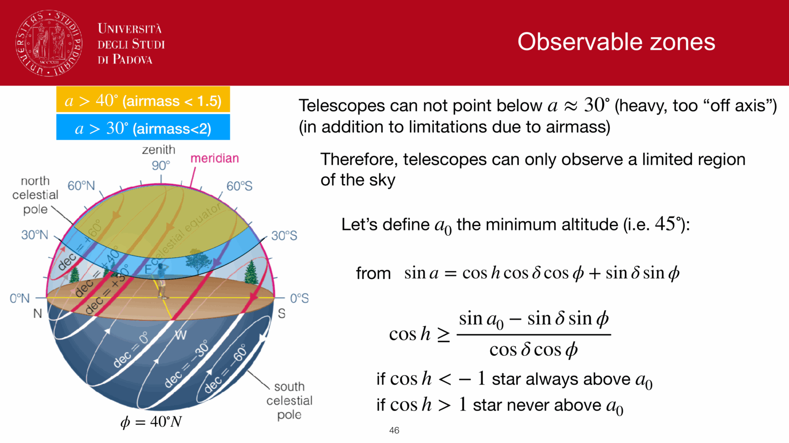
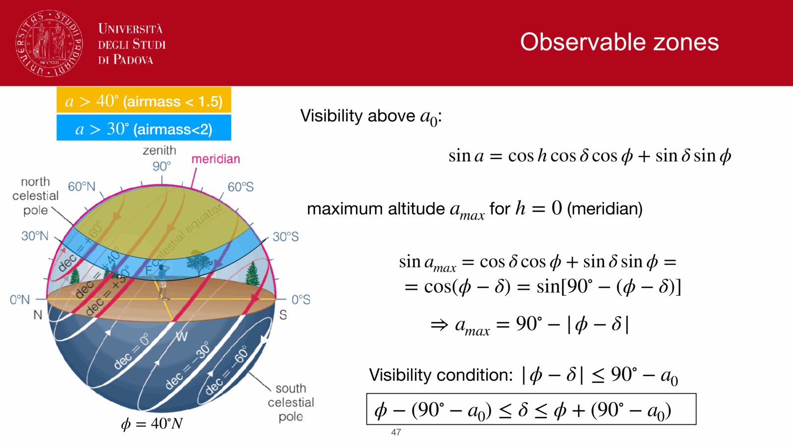
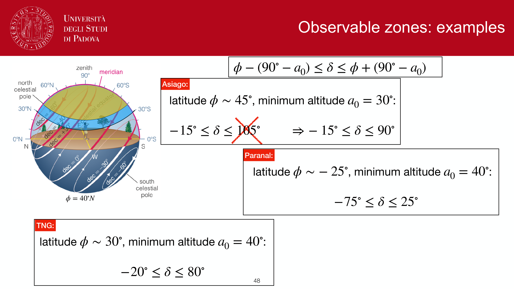


the spherical triangle linking the zenith $Z$, the celestial pole $P$, and the body has sides $90° - \phi$ (Z to pole, equal to the latitude's complement), $90° - a$ (Z to body), and $90° - \delta$ (pole to body), with internal angles related to $A, h$.

so the alt-azimuth ↔ equatorial transformation is just the master spherical-trig equations applied with specific substitutions.

---

## alt-azimuth → equatorial

substitute into the master equations (see [Spherical trigonometry](./Spherical%20trigonometry.html)):
$$\psi = 90° - A, \qquad \theta = a, \qquad \chi = 90° - \phi$$
$$\psi' = 90° - h, \qquad \theta' = \delta$$

resulting transformation:

$$\boxed{\,\sin h\cos\delta = \sin A\cos a\,}$$
$$\boxed{\,\cos h\cos\delta = \cos A\cos a\sin\phi + \sin a\cos\phi\,}$$
$$\boxed{\,\sin\delta = -\cos A\cos a\cos\phi + \sin a\sin\phi\,}$$

given $(A, a, \phi)$ I get $(h, \delta)$. then the local sidereal time gives me $\alpha = \Theta - h$.

---

## equatorial → alt-azimuth

now I want to invert. the same triangle, but reading the other way:
$$\psi = 90° - h, \qquad \theta = \delta, \qquad \chi = -(90° - \phi)$$
$$\psi' = 90° - A, \qquad \theta' = a$$

(the sign of $\chi$ flips because we're rotating the *other* way.)

resulting transformation:

$$\boxed{\,\sin A\cos a = \sin h\cos\delta\,}$$
$$\boxed{\,\cos A\cos a = \cos h\cos\delta\sin\phi - \sin\delta\cos\phi\,}$$
$$\boxed{\,\sin a = \cos h\cos\delta\cos\phi + \sin\delta\sin\phi\,}$$

given $(h, \delta, \phi)$ I get $(A, a)$.

---

## what each equation is good for

- **first equation** $\sin h\cos\delta = \sin A\cos a$: the basic angular relation. useful when I know $h$ and $\delta$ and want $A$, given $a$.
- **third equation** $\sin a = \cos h\cos\delta\cos\phi + \sin\delta\sin\phi$: this is the workhorse. set $h = 0$ to get the upper-culmination height. set $a = 0$ to get the rise/set hour angle. at the meridian transit it directly tells me how high the star will get.
- **second equation**: needed to disambiguate the quadrant of $A$ once you've found $\sin A$ and $\cos A$.

---

## see also

- [Fundamentals_Astrophysics_Cosmology_MOC](../../04_Atlas/Fundamentals_Astrophysics_Cosmology_MOC.html)
- [Spherical_astronomy_complete](./Spherical_astronomy_complete.html)
- [Spherical trigonometry](./Spherical%20trigonometry.html)
- [Equatorial system](./Equatorial%20system.html)
- [Horizontal alt-azimuth system](./Horizontal%20alt-azimuth%20system.html)
- Culmination and rise/set

---

## observational astrophysics course slides (Prof. Paolo Cassata)

*The navigational spherical triangle: Zenith - North Pole - Star.*

*Applying cosine law to find zenith distance z: cos z = sin phi sin delta + cos phi cos delta cos h.*

*Applying sine law to find azimuth A: sin A cos a = sin h cos delta.*

*Transformation equation for cos A cos a.*

*Inverse transformation: converting (A, a) to (h, delta).*

*Parallactic angle q definition and derivation.*

*Field rotation angle for alt-azimuth telescopes: d q / d t.*

*Summary of alt-azimuth to equatorial transformation formulas.*


  <h4 class="backlinks-title">Linked References (6)</h4>
  <ul class="backlinks-list">
    <li class="backlink-item-wrap"><a href="./Culmination%20and%20rise-set.html" class="backlink-item">Culmination and rise-set</a></li>
    <li class="backlink-item-wrap"><a href="./Equatorial%20system.html" class="backlink-item">Equatorial system</a></li>
    <li class="backlink-item-wrap"><a href="../../04_Atlas/Fundamentals_Astrophysics_Cosmology_MOC.html" class="backlink-item">Fundamentals_Astrophysics_Cosmology_MOC</a></li>
    <li class="backlink-item-wrap"><a href="./Horizontal%20alt-azimuth%20system.html" class="backlink-item">Horizontal alt-azimuth system</a></li>
    <li class="backlink-item-wrap"><a href="../../04_Atlas/Observational_Astrophysics_MOC.html" class="backlink-item">Observational_Astrophysics_MOC</a></li>
    <li class="backlink-item-wrap"><a href="./Spherical%20trigonometry.html" class="backlink-item">Spherical trigonometry</a></li>
  </ul>

