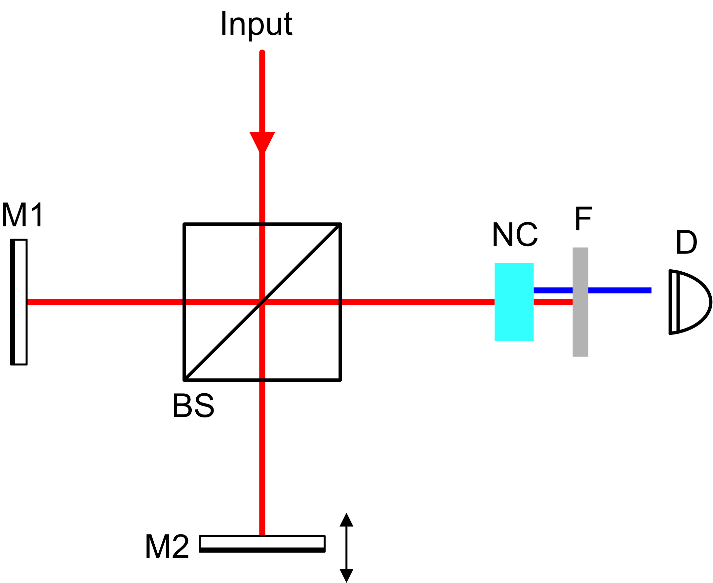

# Amplitude-division interferometers

a class of interferometers where a beam splitter — a partially-reflective optical element — splits an incoming beam into two beams of reduced amplitude that travel different paths and then recombine. **the dominant family** in laboratory optics, metrology, quantum optics, and gravitational-wave detection.

contrast with [Wavefront-division interferometers](interf/Wavefront-division%20interferometers.html), where different *parts* of a wavefront are sent along different paths.

## the basic setup

a beam splitter is typically a half-silvered mirror (or a thin dielectric coating) that:
- transmits ~50% of the incident intensity
- reflects ~50% of the incident intensity
- introduces a $\pi$ phase shift on one of the two outputs (typically reflection vs transmission asymmetry)

the result: two beams of equal amplitude (in the ideal 50/50 case) travel along separate paths. mirrors send them back to a second meeting point, where they recombine.

## the four classical examples

### 1. Michelson laboratory interferometer

a beam splitter sends light to two mirrors. each mirror reflects light back to the beam splitter, where the two beams recombine. one output goes to a detector, the other returns toward the source.

**the workhorse of metrology**. one arm typically has a movable mirror; counting fringes as the mirror moves measures distance to a fraction of a wavelength.

historical importance:
- Michelson-Morley 1887: searched for the "luminiferous aether," found null result → SR
- Michelson stellar interferometer 1920: applied to astronomy
- LIGO (modern): detects gravitational waves via path-length changes

see [Michelson laboratory interferometer](interf/Michelson%20laboratory%20interferometer.html) for the optical setup, [Michelson stellar interferometer](interf/Michelson%20stellar%20interferometer.html) for the astronomical adaptation.

### 2. Mach-Zehnder interferometer

a beam splitter splits the input. mirrors send each path to a *second* beam splitter, where they recombine. unlike Michelson, the input and output ports are physically separated — light doesn't return toward the source.

useful for:
- quantum-optics experiments (single-photon interference)
- balanced detection
- displaying both interference outputs simultaneously (one constructive, one destructive)

see [Mach-Zehnder interferometer](interf/Mach-Zehnder%20interferometer.html).

### 3. Sagnac interferometer

a beam splitter sends light around a *closed loop* in two opposite directions (clockwise and counter-clockwise). after one full circuit, both beams return to the beam splitter and interfere.

**rotation-sensitive**: if the apparatus rotates, the two paths have slightly different lengths in the rotating frame (Sagnac effect). used in fiber-optic gyroscopes for navigation.

see [Sagnac interferometer](interf/Sagnac%20interferometer.html).

### 4. Fabry-Perot interferometer

two parallel partially-reflective mirrors. light bounces *many times* between them. at the output, infinite series of beams with progressively smaller amplitudes interfere.

result: very *sharp* transmission peaks at wavelengths satisfying $2nd = m\lambda$ (constructive on every pass). between peaks, near-total destructive interference.

used as:
- laser cavities (the mode selector)
- spectroscopic filters with very high resolution
- standards for wavelength measurement

see [Fabry-Perot interferometer](interf/Fabry-Perot%20interferometer.html).

## what they share

three features:

### 1. beam splitter is the heart

every amplitude-division interferometer pivots on the beam splitter. its quality (50/50 ratio, $\pi$ phase relationship, low loss, smoothness) determines the instrument quality.

see [Beam splitter physics](interf/Beam%20splitter%20physics.html).

### 2. two beams (or many)

unlike wavefront division (which produces 2 virtual sources), amplitude division produces 2 (or in Fabry-Perot, infinitely many) actual beams of progressively reduced amplitude.

### 3. coherence requirements

both beams come from the *same source* via the beam splitter, so spatial coherence is guaranteed. *temporal* coherence determines the maximum useful OPD — fringes wash out for OPD > $\ell_c = c/\Delta\nu$.

## the energy-conservation puzzle

a 50/50 beam splitter sends 50% to one output and 50% to the other. but at the recombination point, *constructive interference* would seem to give 100% on one output and 0% on the other. where did the energy go?

answer: the *other* output (destructive interference at the constructive port has the energy going to the unused port at 100% intensity). the beam splitter has *two* output ports; energy conservation requires that what's lost from one is gained by the other. the two outputs are *complementary*.

this is why Mach-Zehnder + balanced detection (using both outputs) is more sensitive than Michelson (one output): you don't waste light to the "bright" port.

## the photon-counting view

at low photon counts, where each photon goes through one at a time:
- 50% probability of taking each path
- 50/50 statistics on the detected output port

but the *interference pattern* persists even at single-photon level. each photon "interferes with itself." the beam-splitter sends a quantum superposition of the two paths through the apparatus.

for astronomy, where photons are abundant, this distinction is not practically important. but for quantum-optics and quantum-information, amplitude-division interferometers are the workbench.

## comparison with wavefront division

| feature | amplitude-division | wavefront-division |
|---|---|---|
| how light is split | partial reflection | spatial division |
| photon efficiency | ≥ 50% lost per split (single pass) | uses all of each chosen path |
| number of beams | 2 (or many for Fabry-Perot) | 2 |
| typical use | lab metrology, quantum optics | stellar interferometry, demonstration |
| modern role | LIGO, optical clocks, cavity QED | CHARA, VLTI |

## the modern frontier

- **LIGO and Virgo**: 4-km Michelson interferometers detect gravitational waves at $h \sim 10^{-21}$
- **squeezed-light interferometers**: quantum-noise-limited LIGO, sub-shot-noise sensitivity
- **frequency combs**: laser sources for ultra-precise distance measurement
- **JWST's NIRSpec spectrograph**: uses Fabry-Perot etalons for high spectral resolution

amplitude-division interferometry has not stopped evolving. it is one of the most active fields of modern optical engineering.

## see also

- [Wavefront-division interferometers](interf/Wavefront-division%20interferometers.html)
- [Beam splitter physics](interf/Beam%20splitter%20physics.html)
- [Michelson laboratory interferometer](interf/Michelson%20laboratory%20interferometer.html)
- [Mach-Zehnder interferometer](interf/Mach-Zehnder%20interferometer.html)
- [Sagnac interferometer](interf/Sagnac%20interferometer.html)
- [Fabry-Perot interferometer](interf/Fabry-Perot%20interferometer.html)
- [Astronomical_Interferometry_MOC](../../04_Atlas/Astronomical_Interferometry_MOC.html)

---

### Observational & Instrumental Diagnostics

*Optical schematic of amplitude-division stellar interferometry showing beam splitter, optical delay lines, and beam combination recombining split wavefronts.*

  <h4 class="backlinks-title">Linked References (21)</h4>
  <ul class="backlinks-list">
    <li class="backlink-item-wrap"><a href="Beam%20splitter%20physics.html" class="backlink-item">Beam splitter physics</a></li>
    <li class="backlink-item-wrap"><a href="Fabry-Perot%20interferometer.html" class="backlink-item">Fabry-Perot interferometer</a></li>
    <li class="backlink-item-wrap"><a href="Fringes%20of%20equal%20inclination.html" class="backlink-item">Fringes of equal inclination</a></li>
    <li class="backlink-item-wrap"><a href="Fringes%20of%20equal%20thickness.html" class="backlink-item">Fringes of equal thickness</a></li>
    <li class="backlink-item-wrap"><a href="Mach-Zehnder%20interferometer.html" class="backlink-item">Mach-Zehnder interferometer</a></li>
    <li class="backlink-item-wrap"><a href="Michelson%20laboratory%20interferometer.html" class="backlink-item">Michelson laboratory interferometer</a></li>
    <li class="backlink-item-wrap"><a href="Newton%27s%20rings.html" class="backlink-item">Newton's rings</a></li>
    <li class="backlink-item-wrap"><a href="Optical%20path%20difference%20OPD.html" class="backlink-item">Optical path difference OPD</a></li>
    <li class="backlink-item-wrap"><a href="Sagnac%20interferometer.html" class="backlink-item">Sagnac interferometer</a></li>
    <li class="backlink-item-wrap"><a href="Wavefront-division%20interferometers.html" class="backlink-item">Wavefront-division interferometers</a></li>
    <li class="backlink-item-wrap"><a href="interf/Beam%20splitter%20physics.html" class="backlink-item">Beam splitter physics</a></li>
    <li class="backlink-item-wrap"><a href="interf/Fabry-Perot%20interferometer.html" class="backlink-item">Fabry-Perot interferometer</a></li>
    <li class="backlink-item-wrap"><a href="interf/Fringes%20of%20equal%20inclination.html" class="backlink-item">Fringes of equal inclination</a></li>
    <li class="backlink-item-wrap"><a href="interf/Fringes%20of%20equal%20thickness.html" class="backlink-item">Fringes of equal thickness</a></li>
    <li class="backlink-item-wrap"><a href="interf/Mach-Zehnder%20interferometer.html" class="backlink-item">Mach-Zehnder interferometer</a></li>
    <li class="backlink-item-wrap"><a href="interf/Michelson%20laboratory%20interferometer.html" class="backlink-item">Michelson laboratory interferometer</a></li>
    <li class="backlink-item-wrap"><a href="interf/Newton%27s%20rings.html" class="backlink-item">Newton's rings</a></li>
    <li class="backlink-item-wrap"><a href="interf/Optical%20path%20difference%20OPD.html" class="backlink-item">Optical path difference OPD</a></li>
    <li class="backlink-item-wrap"><a href="interf/Sagnac%20interferometer.html" class="backlink-item">Sagnac interferometer</a></li>
    <li class="backlink-item-wrap"><a href="interf/Wavefront-division%20interferometers.html" class="backlink-item">Wavefront-division interferometers</a></li>
    <li class="backlink-item-wrap"><a href="../../04_Atlas/Astronomical_Interferometry_MOC.html" class="backlink-item">Astronomical_Interferometry_MOC</a></li>
  </ul>

