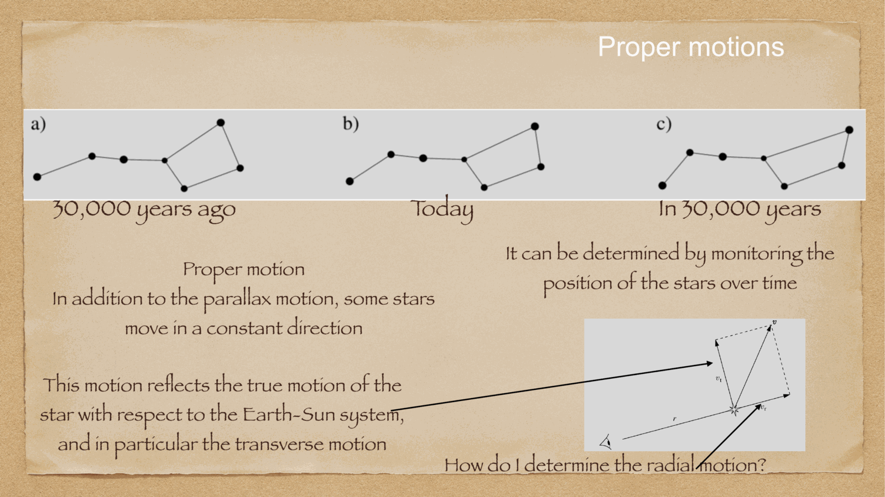
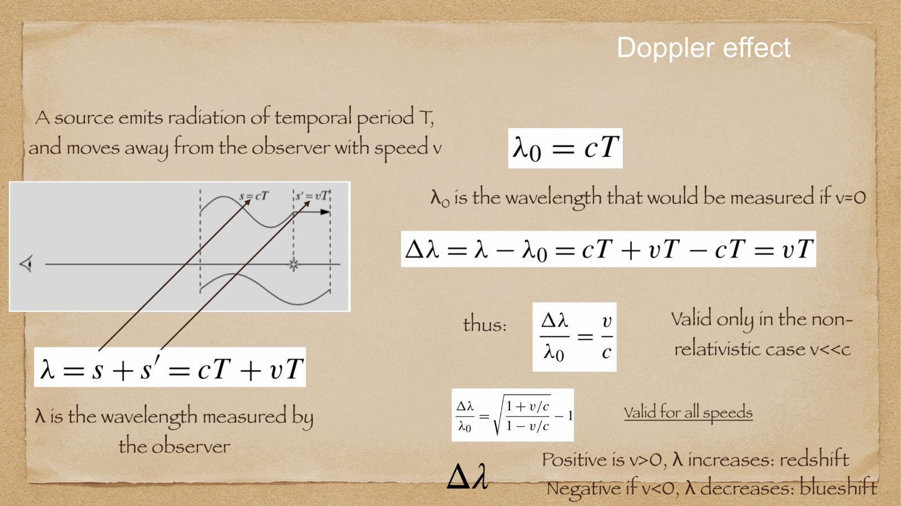
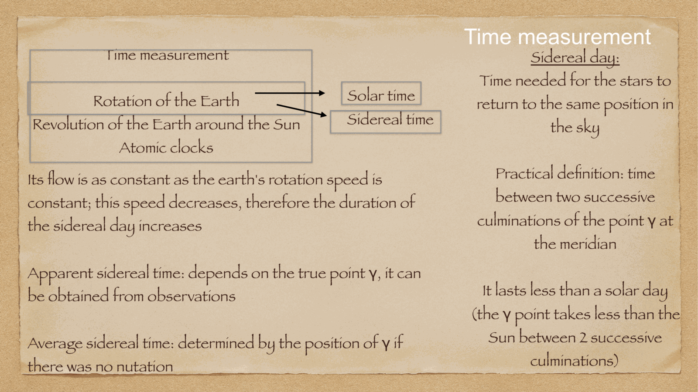
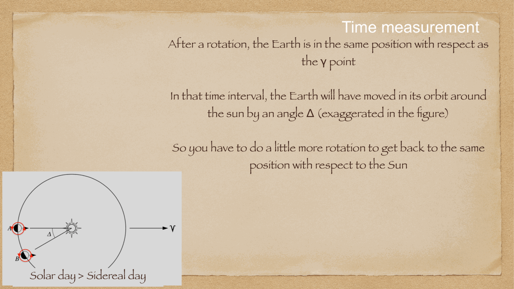
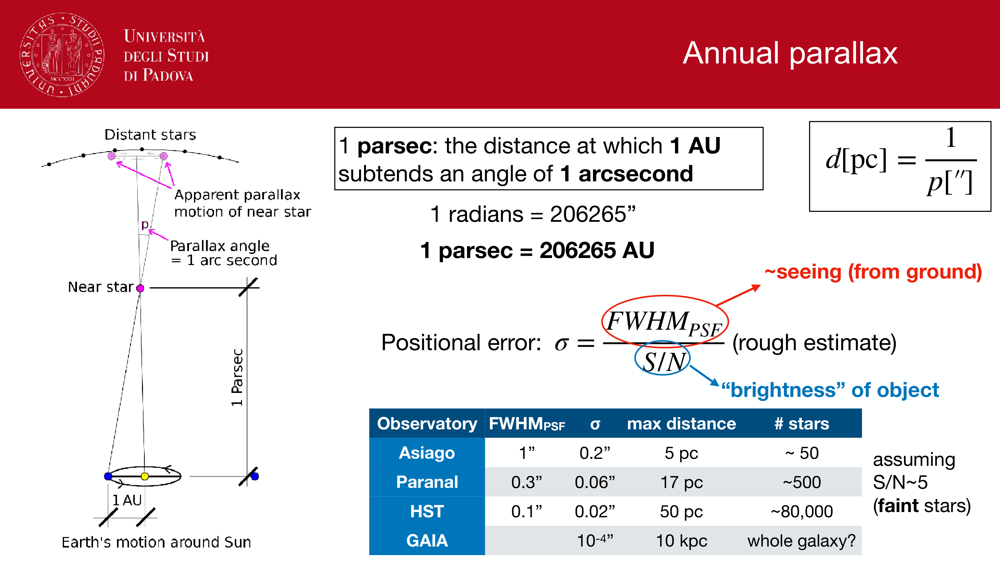
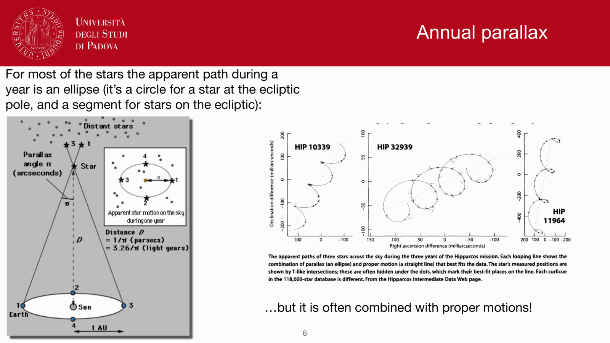
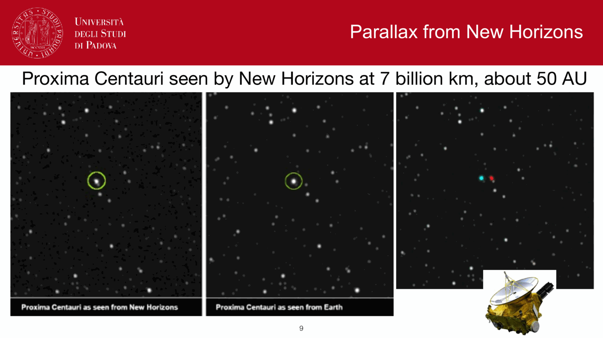
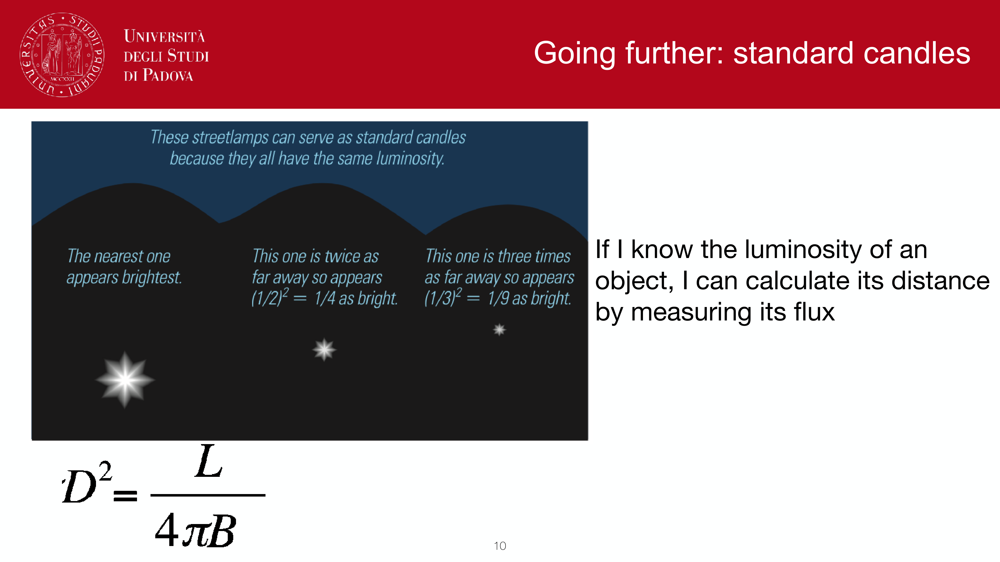


the second rung of the cosmic distance ladder, calibrated entirely by Euclidean geometry. **annual stellar parallax** is the only direct, assumption-free geometric method for measuring distances to stars outside the solar system; every subsequent rung of the distance scale rests upon it.

---

## the geometric definition

as Earth orbits the Sun, an observer's position shifts by a baseline of $2$ AU over six months. nearby stars therefore appear to shift periodically against the distant, essentially fixed background of distant stars and quasars.

the **annual parallax** $p$ (or $\pi$) is defined as the semi-angle subtended by Earth's mean orbital radius ($1$ AU) as seen from the star:
$$\sin p \approx p = \frac{1\,\text{AU}}{d}$$

---

## the definition of the parsec

the parallax angle is so small that astronomers define a dedicated unit of astronomical distance: the **parsec** (parallax-arcsecond, pc). 
one parsec is defined as the distance at which a baseline of $1$ AU subtends an angle of exactly $1$ arcsecond ($1''$):
$$1\text{ pc} = \frac{1\,\text{AU}}{1''\text{ in radians}} = \frac{1.4959787 \times 10^{11}\text{ m}}{\frac{1}{3600} \times \frac{\pi}{180}} \approx 3.0857 \times 10^{16}\text{ m} \approx 3.26\,\text{light-years}$$

this yields the celebrated relation:
$$\boxed{\, d(\text{pc}) = \frac{1}{p(\text{arcsec})} \,}$$

### key benchmark distances:
- **nearest star**: Proxima Centauri: $p = 0.7687'' \implies d = 1.30$ pc ($4.24$ ly).
- **historical landmark**: in 1838, **Friedrich Bessel** measured the first stellar parallax for $61$ Cygni ($p = 0.286'' \implies d = 3.5$ pc), ending a 2000-year search since Aristotle.
- $d = 10$ pc $\implies p = 0.1'' = 100$ mas.
- $d = 100$ pc $\implies p = 0.01'' = 10$ mas.
- $d = 1000$ pc ($1$ kpc) $\implies p = 0.001'' = 1$ mas.
- $d = 8$ kpc (Galactic Center) $\implies p = 0.125$ mas $= 125\,\mu$as.

---

## the parallactic ellipse

similar to aberration, the annual motion of Earth causes a star to trace out a **parallactic ellipse** on the sky over one year:
- **semi-major axis**: equal to $p$, parallel to the ecliptic plane.
- **semi-minor axis**: equal to $p\sin\beta$, where $\beta$ is the ecliptic latitude.
  - at the ecliptic pole ($\beta = 90^\circ$): a circle of radius $p$.
  - in the ecliptic plane ($\beta = 0^\circ$): an oscillating straight line segment of length $2p$.

---

## the space astrometry revolution: Hipparcos to Gaia

ground-based telescopes are fundamentally limited by atmospheric turbulence (seeing, $\theta \sim 0.5''-1''$), restricting ground parallax measurements to $d \lesssim 20-50$ pc with accuracies of $\sim 5-10$ mas.

space astrometry removed the atmosphere:
1. **ESA Hipparcos (1989-1993)**: measured $\sim 118,000$ stars with $1$ mas precision, reaching reliably to $\sim 100$ pc.
2. **ESA Gaia (2013-present)**: measured parallaxes, proper motions, and photometry for over **1.8 billion stars** across the entire Milky Way, with astrometric precision reaching **$10-20\,\mu\text{as}$** for bright stars! Gaia directly calibrates Cepheids, RR Lyrae, and open cluster isochrones across the Galactic disk.

---

## see also

- [Fundamentals_Astrophysics_Cosmology_MOC](../../04_Atlas/Fundamentals_Astrophysics_Cosmology_MOC.html)
- [Parallax and standard candles](./Parallax%20and%20standard%20candles.html)
- [Distance ladder derivations](./Distance%20ladder%20derivations.html)
- [Cepheids and supernovae](./Cepheids%20and%20supernovae.html)
- [Proper motion and stellar kinematics](./Proper%20motion%20and%20stellar%20kinematics.html)
- [Aberration of light](./Aberration%20of%20light.html)

---

## observational astrophysics course slides (Prof. Paolo Cassata)

*Trigonometric parallax geometry: d(pc) = 1 / p(arcsec).*

*Historical breakthrough: Bessel 1838 measurement of 61 Cygni (p = 0.314 arcsec).*

*Space astrometry missions: Hipparcos (1 mas) and Gaia (10 micro-arcsec).*

*Lutz-Kelker statistical bias in parallax distance inversion d = 1/p.*


  <h4 class="backlinks-title">Linked References (15)</h4>
  <ul class="backlinks-list">
    <li class="backlink-item-wrap"><a href="./AU%20calibration%20parallax%20and%20parsec.html" class="backlink-item">AU calibration parallax and parsec</a></li>
    <li class="backlink-item-wrap"><a href="./Aberration%20of%20light.html" class="backlink-item">Aberration of light</a></li>
    <li class="backlink-item-wrap"><a href="./Atmospheric%20refraction.html" class="backlink-item">Atmospheric refraction</a></li>
    <li class="backlink-item-wrap"><a href="./Cepheid%20period-luminosity%20relation.html" class="backlink-item">Cepheid period-luminosity relation</a></li>
    <li class="backlink-item-wrap"><a href="../../04_Atlas/Fundamentals_Astrophysics_Cosmology_MOC.html" class="backlink-item">Fundamentals_Astrophysics_Cosmology_MOC</a></li>
    <li class="backlink-item-wrap"><a href="./Moving%20cluster%20method.html" class="backlink-item">Moving cluster method</a></li>
    <li class="backlink-item-wrap"><a href="../../04_Atlas/Observational_Astrophysics_MOC.html" class="backlink-item">Observational_Astrophysics_MOC</a></li>
    <li class="backlink-item-wrap"><a href="./Parallax%20and%20standard%20candles.html" class="backlink-item">Parallax and standard candles</a></li>
    <li class="backlink-item-wrap"><a href="./Precession%20and%20nutation.html" class="backlink-item">Precession and nutation</a></li>
    <li class="backlink-item-wrap"><a href="./Precession%20nutation%20aberration%20parallax.html" class="backlink-item">Precession nutation aberration parallax</a></li>
    <li class="backlink-item-wrap"><a href="./Proper%20motion%20and%20stellar%20kinematics.html" class="backlink-item">Proper motion and stellar kinematics</a></li>
    <li class="backlink-item-wrap"><a href="./Radial%20velocity%20from%20stellar%20spectra.html" class="backlink-item">Radial velocity from stellar spectra</a></li>
    <li class="backlink-item-wrap"><a href="./Spectroscopic%20parallax%20and%20main-sequence%20fitting.html" class="backlink-item">Spectroscopic parallax and main-sequence fitting</a></li>
    <li class="backlink-item-wrap"><a href="./Stellar%20velocity%20from%20Doppler%20shift.html" class="backlink-item">Stellar velocity from Doppler shift</a></li>
    <li class="backlink-item-wrap"><a href="./Variable%20stars%20as%20standard%20candles.html" class="backlink-item">Variable stars as standard candles</a></li>
  </ul>

