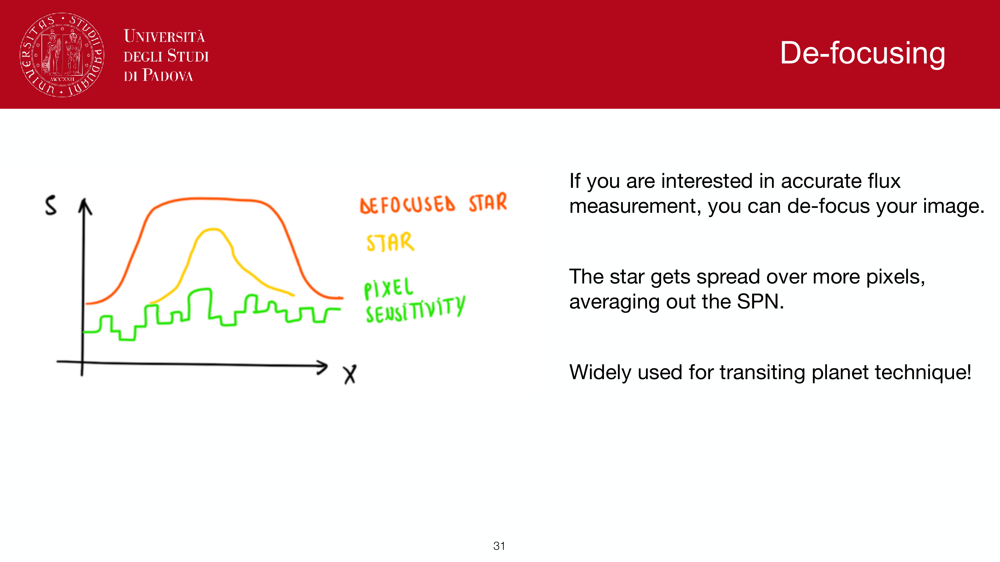
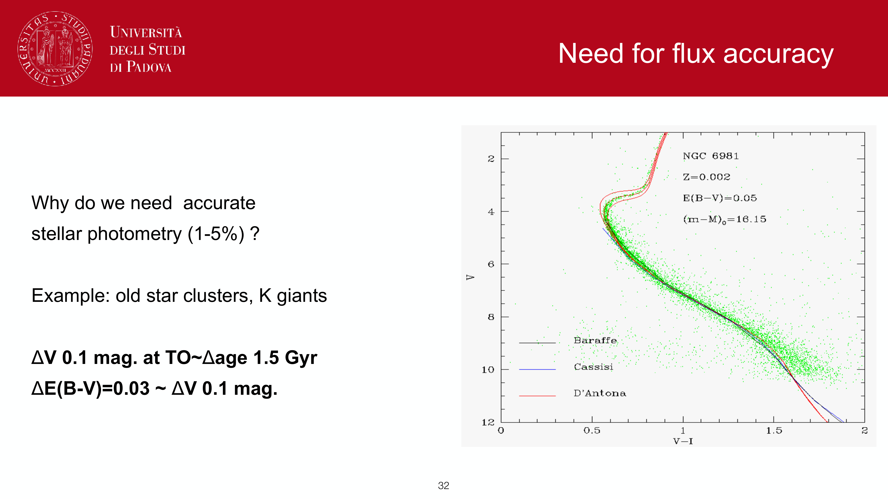

**aperture photometry** is the simplest way to extract a magnitude from a calibrated image: sum the pixel counts inside a circular aperture around the source, subtract a sky estimate from a surrounding annulus.

## the algorithm

1. **center the aperture** on the source using a centroid (intensity-weighted or PSF-fit position).
2. **sum** all pixel counts inside the aperture of radius $r_{\rm ap}$:
$$F_{\rm raw} = \sum_{\rm pixels\ in\ aperture} \mathrm{counts}$$
3. **estimate the sky** from a surrounding annulus (inner radius $r_{\rm in}$, outer $r_{\rm out}$):
$$\bar S = \mathrm{median}_{r_{\rm in} < r < r_{\rm out}}\,(\mathrm{counts/pixel})$$
the median is more robust than the mean against contamination by faint background sources.
4. **subtract sky** times the aperture area $A_{\rm ap}$:
$$F_{\rm src} = F_{\rm raw} - \bar S \cdot A_{\rm ap}$$
5. **convert to magnitude** via the system zeropoint $Z$:
$$m = -2.5 \log_{10}(F_{\rm src}) + Z$$

## choosing the aperture radius

trade-off:
- **small aperture**: misses flux in the PSF wings.
- **large aperture**: captures all source flux but more sky pixels = more noise.

for a Gaussian PSF on a flat sky background, the SNR-optimising radius is
$$r_{\rm opt} \approx 1.4 \cdot \mathrm{FWHM}$$
about $93\%$ enclosed flux. for sharper-cored PSFs (Moffat with low $\beta$), the optimum is slightly smaller; for broader PSFs, slightly larger.

a common default: $r_{\rm ap} =$ FWHM (about $76\%$ enclosed flux for Gaussian) for SNR-balanced photometry, and **aperture corrections** to recover the rest.n 

## aperture corrections

if you use $r_{\rm ap}$ smaller than infinity, you systematically lose a fraction of the source flux. **aperture correction** measures the fractional loss using bright isolated stars (whose photometry should be the same at any radius), then applies the correction to faint sources.

procedure:
1. measure several bright stars at small aperture $r_1$ and large aperture $r_2 \gg \mathrm{FWHM}$.
2. compute $\Delta m = m(r_1) - m(r_2)$, assumed source-independent.
3. apply $\Delta m$ to faint targets measured at $r_1$.

assumption: the PSF is uniform across the image. fails for spatially varying PSFs, which need pixel-by-pixel correction.

## strengths and weaknesses

### strengths
- **simple**: implementation in $\sim 20$ lines (photutils, sep).
- **robust**: works with any well-isolated source, no PSF model needed.
- **direct**: no model assumptions about the source profile.

### weaknesses
- **bad in crowded fields**: nearby sources contaminate the aperture and the sky annulus.
- **suboptimal SNR**: pixel weighting is uniform inside the aperture; PSF photometry weights pixels by the PSF and gets better SNR.
- **sensitive to aperture choice and centring**: a few-pixel offset can change the magnitude.

for crowded fields (globular clusters, nuclear regions), use [PSF photometry](PSF%20photometry.html) instead.

## standard tools

- **astropy.photutils** in python
- **sep** (Source Extractor Python wrapper)
- **DAOPHOT** (IRAF era)
- **SExtractor** (Bertin & Arnouts 1996)

most provide circular, elliptical, and Kron-style apertures, plus background estimation algorithms.

## elliptical / Kron apertures

for galaxies and extended sources, circular apertures truncate flux. Kron radii (defined as the first moment of the brightness profile) and elliptical apertures aligned with the source's intrinsic shape recover more flux. Petrosian apertures define the radius from a profile-shape criterion ($\eta(r) = 0.2$ in SDSS).

## see also

- [The CCD equation](The%20CCD%20equation.html)
- [PSF photometry](PSF%20photometry.html)
- [CCD calibration steps](CCD%20calibration%20steps.html)
- [Sky brightness](Sky%20brightness.html)
- [Magnitudes and photometric systems](Magnitudes%20and%20photometric%20systems.html)
- [Galaxy size-luminosity relation](Galaxy%20size-luminosity%20relation.html)

---

## observational astrophysics course slides (Prof. Paolo Cassata)

*Synthetic aperture photometry: summing counts inside radius r_ap.*

*Background subtraction using sky annulus: N_* = C_ap - n_pix * <C_sky>.*

  <h4 class="backlinks-title">Linked References (11)</h4>
  <ul class="backlinks-list">
    <li class="backlink-item-wrap"><a href="CCD%20calibration%20steps.html" class="backlink-item">CCD calibration steps</a></li>
    <li class="backlink-item-wrap"><a href="CCD%20detectors%20and%20SNR.html" class="backlink-item">CCD detectors and SNR</a></li>
    <li class="backlink-item-wrap"><a href="Cosmic%20rays%20and%20bad%20pixels.html" class="backlink-item">Cosmic rays and bad pixels</a></li>
    <li class="backlink-item-wrap"><a href="Linearity%20and%20saturation.html" class="backlink-item">Linearity and saturation</a></li>
    <li class="backlink-item-wrap"><a href="PSF%20photometry.html" class="backlink-item">PSF photometry</a></li>
    <li class="backlink-item-wrap"><a href="Photometric%20standard%20stars.html" class="backlink-item">Photometric standard stars</a></li>
    <li class="backlink-item-wrap"><a href="Python%20and%20IRAF%20tools%20for%20photometry.html" class="backlink-item">Python and IRAF tools for photometry</a></li>
    <li class="backlink-item-wrap"><a href="Sersic%20profile.html" class="backlink-item">Sersic profile</a></li>
    <li class="backlink-item-wrap"><a href="Spectrum%20reduction%20pipeline.html" class="backlink-item">Spectrum reduction pipeline</a></li>
    <li class="backlink-item-wrap"><a href="The%20CCD%20equation.html" class="backlink-item">The CCD equation</a></li>
    <li class="backlink-item-wrap"><a href="../../04_Atlas/Observational_Astrophysics_MOC.html" class="backlink-item">Observational_Astrophysics_MOC</a></li>
  </ul>

