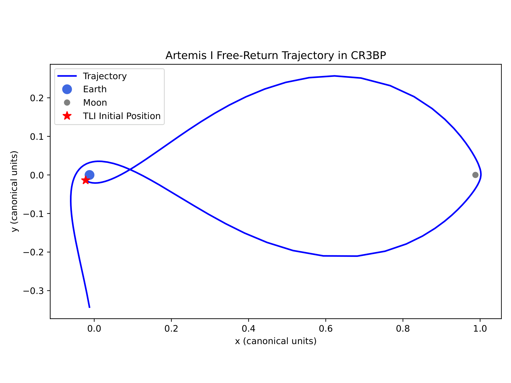
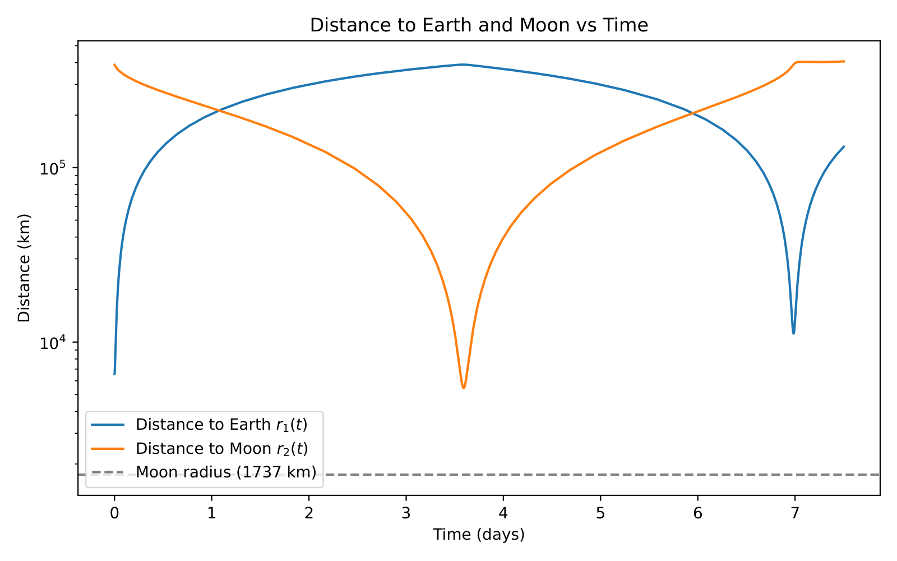
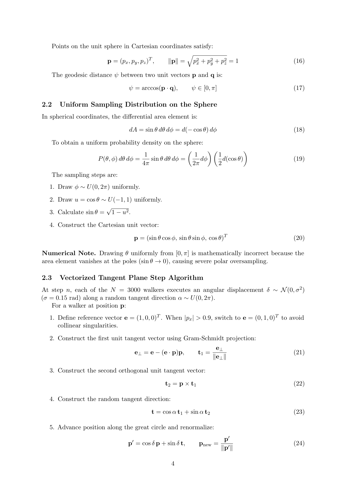


# Astrophysical N-body problem formulation

the N-body problem: $N$ point masses interacting only through Newtonian gravity. write down the equations of motion, integrate them, see what happens. this is *the* test problem for ODE integrators in astrophysics, and an entire research field on its own.

## the equations

for particle $i$ with mass $m_i$ at position $\mathbf{r}_i$:

$$\ddot{\mathbf{r}}_i = -G \sum_{j \neq i} m_j \frac{\mathbf{r}_i - \mathbf{r}_j}{|\mathbf{r}_i - \mathbf{r}_j|^3}$$

equivalent first-order form for an integrator:

$$\dot{\mathbf{r}}_i = \mathbf{v}_i$$
$$\dot{\mathbf{v}}_i = \mathbf{a}_i = -G \sum_{j \neq i} m_j \frac{\mathbf{r}_i - \mathbf{r}_j}{|\mathbf{r}_i - \mathbf{r}_j|^3}$$

the state vector is $(\mathbf{r}_i, \mathbf{v}_i)$ for $i = 1, \ldots, N$, total dimension $6N$.

## conserved quantities

the N-body system has several Noether-related conservation laws that I exploit as diagnostics:

- **energy** $E = \tfrac12 \sum m_i v_i^2 - G\sum_{i<j} m_i m_j/|\mathbf{r}_i - \mathbf{r}_j|$ (time-translation symmetry)
- **linear momentum** $\mathbf{P} = \sum m_i \mathbf{v}_i$ (translation symmetry)
- **angular momentum** $\mathbf{L} = \sum m_i \mathbf{r}_i \times \mathbf{v}_i$ (rotation symmetry)

for an isolated system, $E$, $\mathbf{P}$, $\mathbf{L}$ are constant. the integrator's quality is measured by how well it preserves them. see [Energy conservation as a diagnostic](./Energy%20conservation%20as%20a%20diagnostic.html).

## the force computation

the dominant cost. each particle feels the sum of $N - 1$ forces, so computing all accelerations is $O(N^2)$. for $N = 1000$ this is $\sim 10^6$ operations per timestep; for $N = 10^6$ it is $\sim 10^{12}$, which limits direct N-body to small clusters.

vectorized python:

```python
def acceleration(positions, masses, G=1.0, eps=0.0):
    """positions: (N, 3) array, masses: (N,) array. eps is softening."""
    N = len(masses)
    a = np.zeros_like(positions)
    for i in range(N):
        dr = positions - positions[i]              # (N, 3)
        r2 = np.sum(dr**2, axis=1) + eps**2        # (N,)
        r2[i] = 1.0                                 # avoid self
        inv_r3 = 1.0 / r2**1.5
        inv_r3[i] = 0.0
        a[i] = G * np.sum((masses * inv_r3)[:, None] * dr, axis=0)
    return a
```

fully vectorized (avoiding the loop), uses $O(N^2)$ memory:

```python
def acceleration_vec(r, m, G=1.0, eps=0.0):
    dr = r[None, :, :] - r[:, None, :]              # (N, N, 3)
    r2 = np.sum(dr**2, axis=-1) + eps**2           # (N, N)
    np.fill_diagonal(r2, 1.0)
    inv_r3 = 1.0 / r2**1.5
    np.fill_diagonal(inv_r3, 0.0)
    a = G * np.sum((m[None, :, None] * inv_r3[:, :, None]) * dr, axis=1)
    return a
```

for $N \sim 100$ this is fast; for $N \sim 10^4$ memory becomes the bottleneck (the $(N, N, 3)$ array is $24 N^2$ bytes = 2.4 GB for $N = 10^4$).

## softening

at small separations $|\mathbf{r}_i - \mathbf{r}_j| \to 0$, the force diverges as $1/r^2$. this is unphysical for "smooth" simulations (galaxies, where particles represent fluid elements, not real point masses). add a **softening length** $\epsilon$:

$$\mathbf{a}_i = -G \sum_{j \neq i} m_j \frac{\mathbf{r}_i - \mathbf{r}_j}{(|\mathbf{r}_i - \mathbf{r}_j|^2 + \epsilon^2)^{3/2}}$$

$\epsilon$ is the "minimum resolved scale" of the simulation. for a galaxy with $N = 10^9$ tracers covering 100 kpc, $\epsilon \sim 100$ pc. softening prevents close-encounter blowups but smears out real two-body relaxation; it is a deliberate physics choice, not a numerical hack.

for **collisional** systems (globular clusters, planetary systems) $\epsilon = 0$ — close encounters *are* the physics. the integrator must handle them with adaptive timesteps. see [Collisional vs collisionless N-body](./Collisional%20vs%20collisionless%20N-body.html).

## units

physicists usually set $G = 1$ and pick units so the typical mass is 1 and the typical length is 1. the time unit is then the dynamical time of a system of those masses at that scale. concrete: for a stellar-cluster-sized N-body, $G = M_\odot = 1$ pc gives a time unit of $\sim 1.5 \times 10^7$ yr.

## the Pythagorean three-body problem (exam-template setup)

three masses $m_1 = 3$, $m_2 = 4$, $m_3 = 5$ at the apexes of a 3-4-5 right triangle (sides 3, 4, 5). $G = 1$. all initial velocities zero. integrate with the midpoint method, $h = 10^{-5}$, $t_{\rm end} = 5$.

what happens: the masses fall toward each other, undergo a violent close-triple encounter, eject the lightest mass (often $m_1$) on a hyperbolic trajectory, leaving the other two in a binary. this is a *classic chaos demonstrator* — tiny changes in initial conditions or integration scheme give wildly different orbits. it has been studied since Burrau (1913) and Szebehely & Peters (1967).

the energy diagnostic: total energy should stay constant within the integrator's accuracy. for midpoint with $h = 10^{-5}$, expect $\Delta E/E \sim 10^{-10}$ in smooth phases, jumping to $\sim 10^{-5}$ during close encounters (where the timestep is too coarse).

## algorithm zoo

- **direct summation**: $O(N^2)$, exact, used for $N \lesssim 10^5$
- **Barnes-Hut tree code**: $O(N \log N)$, approximate, used for cosmological simulations
- **Particle-Mesh (PM)**: $O(N + N_g \log N_g)$, FFT-based, very fast for smooth backgrounds
- **TreePM hybrid**: tree for short range, mesh for long range
- **Fast Multipole Method (FMM)**: $O(N)$, the asymptotic king for large $N$

## see also

- [Energy conservation as a diagnostic](./Energy%20conservation%20as%20a%20diagnostic.html)
- [Collisional vs collisionless N-body](./Collisional%20vs%20collisionless%20N-body.html)
- [Leapfrog integrator](./Leapfrog%20integrator.html)
- [Fourth-order Hermite predictor-corrector](./Fourth-order%20Hermite%20predictor-corrector.html)
- [Adaptive step size control](./Adaptive%20step%20size%20control.html)
- [Mathematical_Numerical_Methods_MOC](../../04_Atlas/Mathematical_Numerical_Methods_MOC.html)

---

### Numerical Methods & Algorithmic Diagnostics


*Artemis orbital trajectory simulation in the Earth-Moon rotating frame, integrating gravitational forces of Earth and Moon using RK4/Leapfrog.*



*Distance profile of Artemis spacecraft from Earth and Moon as a function of mission elapsed time, resolving close lunar flyby pericenter.*



*Exam Model Solution: Direct summation N-body acceleration loop with Plummer softening parameter $\epsilon$ preventing divergence during close encounters: $\vec{a}_i = \sum_{j \ne i} \frac{G m_j (\vec{r}_j - \vec{r}_i)}{(|\vec{r}_j - \vec{r}_i|^2 + \epsilon^2)^{3/2}}$.*


*Two-body Kepler problem orbit integration and phase-space trajectory.*


*Close binary encounter softening and regularized coordinates (Kustaanheimo-Stiefel).*


*Smoothed Particle Hydrodynamics (SPH) kernel function $W(r, h)$ and smoothing length $h$.*


*SPH density summation over neighboring particles: $\rho_i = \sum_j m_j W(\vec{r}_i - \vec{r}_j, h)$.*


<div class="backlinks-section">
  <h4 class="backlinks-title">Linked References (13)</h4>
  <ul class="backlinks-list">
    <li class="backlink-item-wrap"><a href="./Adaptive%20step%20size%20control.html" class="backlink-item">Adaptive step size control</a></li>
    <li class="backlink-item-wrap"><a href="./Adaptive%20timesteps%20near%20close%20encounters.html" class="backlink-item">Adaptive timesteps near close encounters</a></li>
    <li class="backlink-item-wrap"><a href="./Collisional%20vs%20collisionless%20N-body.html" class="backlink-item">Collisional vs collisionless N-body</a></li>
    <li class="backlink-item-wrap"><a href="./Energy%20conservation%20as%20a%20diagnostic.html" class="backlink-item">Energy conservation as a diagnostic</a></li>
    <li class="backlink-item-wrap"><a href="./Fourth-order%20Hermite%20predictor-corrector.html" class="backlink-item">Fourth-order Hermite predictor-corrector</a></li>
    <li class="backlink-item-wrap"><a href="./Hint%20-%20TODO%204.1%20Vectorized%20N-Body%20Acceleration.html" class="backlink-item">Hint - TODO 4.1 Vectorized N-Body Acceleration</a></li>
    <li class="backlink-item-wrap"><a href="./Leapfrog%20integrator.html" class="backlink-item">Leapfrog integrator</a></li>
    <li class="backlink-item-wrap"><a href="../../04_Atlas/Mathematical_Numerical_Methods_MOC.html" class="backlink-item">Mathematical_Numerical_Methods_MOC</a></li>
    <li class="backlink-item-wrap"><a href="./N-body%20simulations.html" class="backlink-item">N-body simulations</a></li>
    <li class="backlink-item-wrap"><a href="./N-body%20with%20Euler%20vs%20midpoint%20vs%20leapfrog.html" class="backlink-item">N-body with Euler vs midpoint vs leapfrog</a></li>
    <li class="backlink-item-wrap"><a href="./Runge-Kutta%202%20midpoint%20method.html" class="backlink-item">Runge-Kutta 2 midpoint method</a></li>
    <li class="backlink-item-wrap"><a href="./Systems%20of%20ODEs%20and%20higher-order%20ODEs.html" class="backlink-item">Systems of ODEs and higher-order ODEs</a></li>
    <li class="backlink-item-wrap"><a href="./The%20Pythagorean%20three-body%20problem.html" class="backlink-item">The Pythagorean three-body problem</a></li>
  </ul>
</div>
