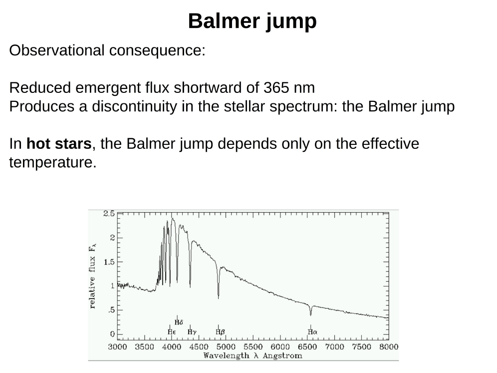
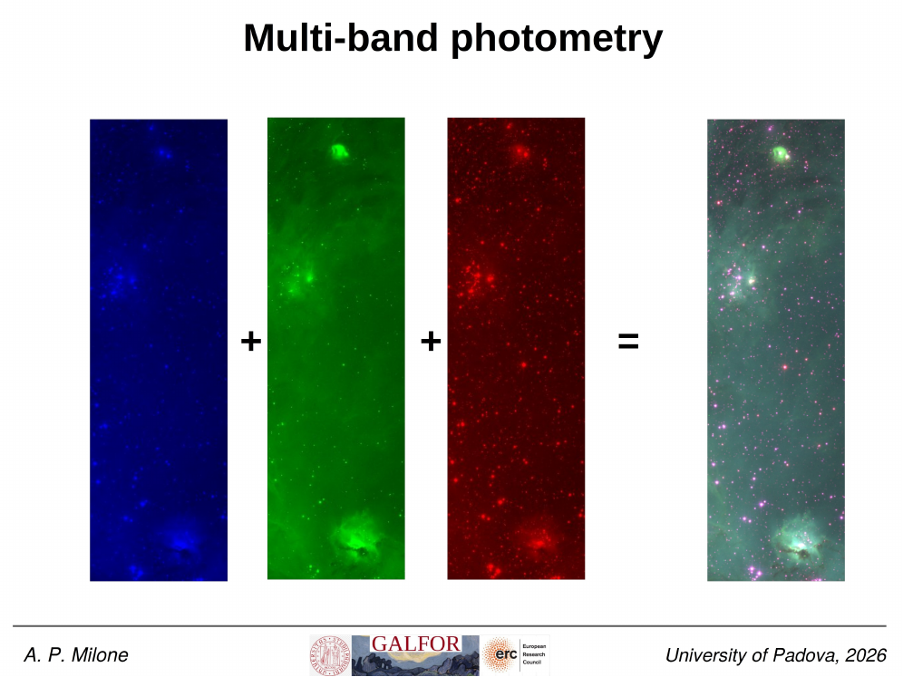
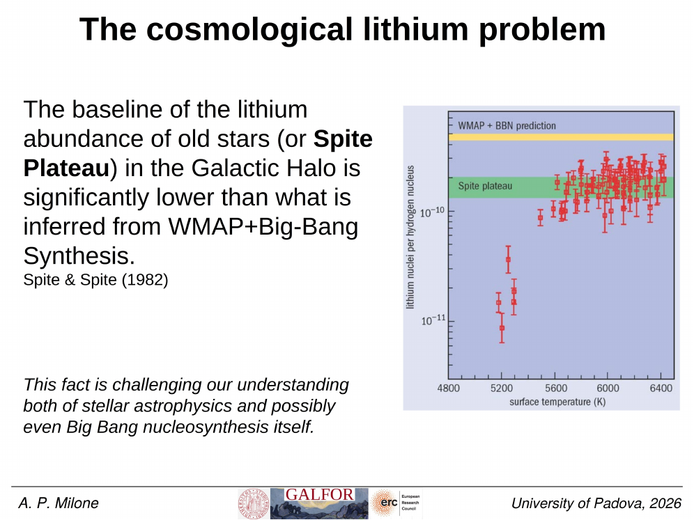
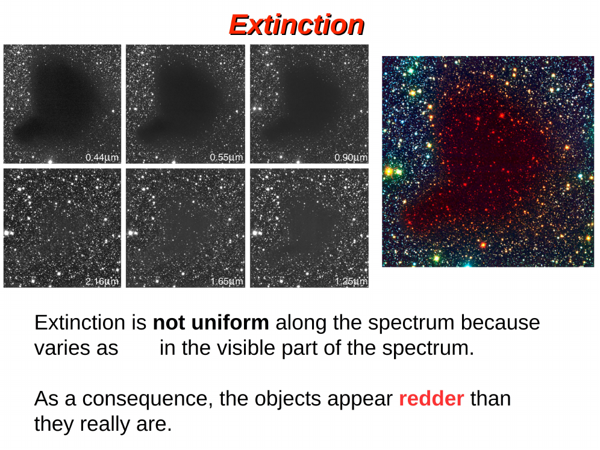
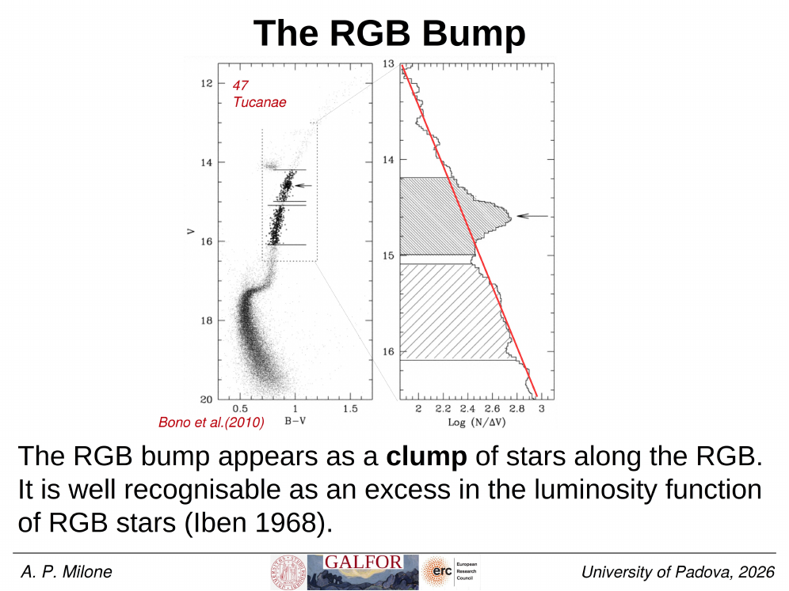
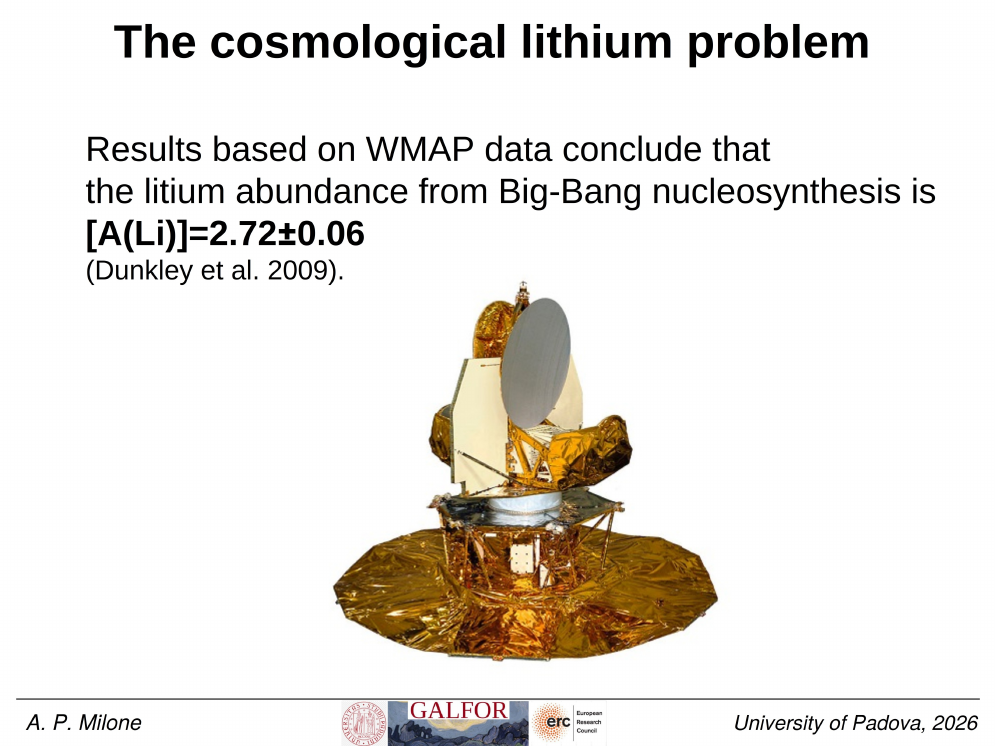


# atmospheric parameters: Teff, log g, [Fe/H], vmicro

a stellar atmosphere is, to first approximation, a 1D plane-parallel radiative-convective slab characterised by **four numbers**: the effective temperature $T_{\rm eff}$, the surface gravity $\log g$, the metallicity (typically [Fe/H]), and the microturbulent velocity $\xi_t$. these are the "atmospheric parameters". together they define a model atmosphere and any synthetic spectrum computed from it. determining them from observations is the first step in any spectroscopic analysis.

## the four parameters

**effective temperature $T_{\rm eff}$.** the temperature of a blackbody with the same total luminosity and radius as the real star,
$$L = 4\pi R^2 \sigma T_{\rm eff}^4.$$
typical range: 2500 K (late M dwarfs) to 50{,}000+ K (O stars). it sets the shape of the continuum and the populations of atomic levels (via Boltzmann), hence the relative line strengths. see [Spectroscopic determination of Teff](./Spectroscopic%20determination%20of%20Teff.html).

**surface gravity $\log g$.** the local gravitational acceleration at the photosphere,
$$g = \frac{GM}{R^2},$$
expressed in cgs and $\log_{10}$. typical values:
- $\log g \approx 4.4$ for the sun and other dwarfs;
- $\log g \approx 2\text{-}3$ for red giants;
- $\log g \approx 0\text{-}1$ for supergiants;
- $\log g \approx 7\text{-}9$ for white dwarfs (see [White dwarf overview](./White%20dwarf%20overview.html)).
$\log g$ controls the photospheric pressure (because hydrostatic equilibrium gives $P \propto g$), and therefore pressure broadening (Stark, van der Waals) and the ionisation balance through the [Saha ionisation equation](./Saha%20ionisation%20equation.html). see [Spectroscopic determination of log g](./Spectroscopic%20determination%20of%20log%20g.html).

**metallicity [Fe/H].** the abundance of iron, typically used as a proxy for "all metals". defined as
$$[\text{Fe/H}] = \log_{10}\!\frac{(N_{\rm Fe}/N_{\rm H})_*}{(N_{\rm Fe}/N_{\rm H})_\odot},$$
so [Fe/H] $= 0$ is solar, [Fe/H] $= -2$ is one hundredth of solar (a metal-poor halo star), [Fe/H] $= +0.4$ is a metal-rich open cluster. there is also the "12 scale" $\log\varepsilon(X) = \log(N_X/N_H) + 12$, with $\log\varepsilon(\text{Fe})_\odot \approx 7.5$. metallicity sets the strength of all metallic lines and shifts the [Color-magnitude diagrams of clusters](./Color-magnitude%20diagrams%20of%20clusters.html) main-sequence position. see [Spectroscopic determination of metallicity](./Spectroscopic%20determination%20of%20metallicity.html).

**microturbulent velocity $\xi_t$ (vmicro).** an empirical fudge representing small-scale, sub-resolution velocity fields in the photosphere that broaden lines beyond what thermal motion alone would do. typical values are 0.5-2 km/s for dwarfs, up to 5 km/s for giants and supergiants. it is determined by demanding that strong and weak lines of the same species give the same abundance (see [Microturbulence](./Microturbulence.html)).

## why all four are needed (and coupled)

the parameters are not independent. ionisation balance depends on both $T_{\rm eff}$ and $\log g$ (through Saha). line strengths depend on temperature, abundance, and microturbulence. so spectroscopic analysis is **iterative**: start with photometric estimates, refine $T_{\rm eff}$ and $\log g$ from spectra, fix [Fe/H] and microturbulence, return.

a fifth quantity, the projected rotation $v\sin i$, is often added to the parameter set because it broadens all lines uniformly (see [Stellar rotation v sini](./Stellar%20rotation%20v%20sini.html)).

## typical uncertainties

for late-type stars (G, K), state-of-the-art high-resolution spectroscopy reaches:
- $T_{\rm eff}$: 100-300 K absolute, 10-50 K differential
- $\log g$: 0.1-0.3 dex (strong lines), 0.1-1.0 dex (ionisation balance)
- [Fe/H]: 0.1-0.5 dex absolute, 0.01-0.05 dex differential

uncertainties are larger for hot stars (where line forests are sparser), giants, and metal-poor stars (where lines are weak).

## see also
- [Spectroscopic determination of Teff](./Spectroscopic%20determination%20of%20Teff.html)
- [Spectroscopic determination of log g](./Spectroscopic%20determination%20of%20log%20g.html)
- [Spectroscopic determination of metallicity](./Spectroscopic%20determination%20of%20metallicity.html)
- [Microturbulence](./Microturbulence.html)
- [Stellar rotation v sini](./Stellar%20rotation%20v%20sini.html)
- [Stellar atmosphere structure](./Stellar%20atmosphere%20structure.html)
- [Stellar spectral types OBAFGKM](./Stellar%20spectral%20types%20OBAFGKM.html)
- [Local thermodynamic equilibrium LTE](./Local%20thermodynamic%20equilibrium%20LTE.html)
- [Stellar_Astrophysics_MOC](../../04_Atlas/Stellar_Astrophysics_MOC.html)

---

## Complete Lecture Slide Panels & Observational Evidence (Lecture 09 — Atmospheric Parameters & Chemical Abundances)

> **Context**: *Determining Teff from Balmer wings, log g from pressure-broadened wings (Mg I b, Ca II), [Fe/H] from Fe I/II equilibrium, and alpha-element enhancement [alpha/Fe].*

The following slides from Prof. Antonino Milone's lecture series provide the direct observational, photometric, and theoretical foundations for this topic:

*Figure P09-01: LAntonino_p09_01.png — Observational data, CMD morphology, and diagnostics from Lecture 09 — Atmospheric Parameters & Chemical Abundances.*

*Figure P09-02: LAntonino_p09_02.png — Observational data, CMD morphology, and diagnostics from Lecture 09 — Atmospheric Parameters & Chemical Abundances.*

*Figure P09-03: LAntonino_p09_03.png — Observational data, CMD morphology, and diagnostics from Lecture 09 — Atmospheric Parameters & Chemical Abundances.*

*Figure P09-04: LAntonino_p09_04.png — Observational data, CMD morphology, and diagnostics from Lecture 09 — Atmospheric Parameters & Chemical Abundances.*

*Figure P09-05: LAntonino_p09_05.png — Observational data, CMD morphology, and diagnostics from Lecture 09 — Atmospheric Parameters & Chemical Abundances.*

*Figure P09-06: LAntonino_p09_06.png — Observational data, CMD morphology, and diagnostics from Lecture 09 — Atmospheric Parameters & Chemical Abundances.*

*Figure P09-07: LAntonino_p09_07.png — Observational data, CMD morphology, and diagnostics from Lecture 09 — Atmospheric Parameters & Chemical Abundances.*

*Figure P09-08: LAntonino_p09_08.png — Observational data, CMD morphology, and diagnostics from Lecture 09 — Atmospheric Parameters & Chemical Abundances.*

*Figure P09-09: LAntonino_p09_09.png — Observational data, CMD morphology, and diagnostics from Lecture 09 — Atmospheric Parameters & Chemical Abundances.*

*Figure P09-10: LAntonino_p09_10.png — Observational data, CMD morphology, and diagnostics from Lecture 09 — Atmospheric Parameters & Chemical Abundances.*

*Figure P09-11: LAntonino_p09_11.png — Observational data, CMD morphology, and diagnostics from Lecture 09 — Atmospheric Parameters & Chemical Abundances.*

*Figure P09-12: LAntonino_p09_12.png — Observational data, CMD morphology, and diagnostics from Lecture 09 — Atmospheric Parameters & Chemical Abundances.*

*Figure P09-13: LAntonino_p09_13.png — Observational data, CMD morphology, and diagnostics from Lecture 09 — Atmospheric Parameters & Chemical Abundances.*

*Figure P09-14: LAntonino_p09_14.png — Observational data, CMD morphology, and diagnostics from Lecture 09 — Atmospheric Parameters & Chemical Abundances.*

*Figure P09-15: LAntonino_p09_15.png — Observational data, CMD morphology, and diagnostics from Lecture 09 — Atmospheric Parameters & Chemical Abundances.*

*Figure P09-16: LAntonino_p09_16.png — Observational data, CMD morphology, and diagnostics from Lecture 09 — Atmospheric Parameters & Chemical Abundances.*

*Figure P09-17: LAntonino_p09_17.png — Observational data, CMD morphology, and diagnostics from Lecture 09 — Atmospheric Parameters & Chemical Abundances.*

*Figure P09-18: LAntonino_p09_18.png — Observational data, CMD morphology, and diagnostics from Lecture 09 — Atmospheric Parameters & Chemical Abundances.*

*Figure P09-19: LAntonino_p09_19.png — Observational data, CMD morphology, and diagnostics from Lecture 09 — Atmospheric Parameters & Chemical Abundances.*

*Figure P09-20: LAntonino_p09_20.png — Observational data, CMD morphology, and diagnostics from Lecture 09 — Atmospheric Parameters & Chemical Abundances.*

*Figure P09-21: LAntonino_p09_21.png — Observational data, CMD morphology, and diagnostics from Lecture 09 — Atmospheric Parameters & Chemical Abundances.*

*Figure P09-22: LAntonino_p09_22.png — Observational data, CMD morphology, and diagnostics from Lecture 09 — Atmospheric Parameters & Chemical Abundances.*

*Figure P09-23: LAntonino_p09_23.png — Observational data, CMD morphology, and diagnostics from Lecture 09 — Atmospheric Parameters & Chemical Abundances.*

*Figure P09-24: LAntonino_p09_24.png — Observational data, CMD morphology, and diagnostics from Lecture 09 — Atmospheric Parameters & Chemical Abundances.*

*Figure P09-25: LAntonino_p09_25.png — Observational data, CMD morphology, and diagnostics from Lecture 09 — Atmospheric Parameters & Chemical Abundances.*

*Figure P09-26: Lecture09a_p15-15.png — Observational data, CMD morphology, and diagnostics from Lecture 09 — Atmospheric Parameters & Chemical Abundances.*

*Figure P09-27: Lecture09a_p5-05.png — Observational data, CMD morphology, and diagnostics from Lecture 09 — Atmospheric Parameters & Chemical Abundances.*

*Figure P09-28: Lecture09b_p15-15.png — Observational data, CMD morphology, and diagnostics from Lecture 09 — Atmospheric Parameters & Chemical Abundances.*

*Figure P09-29: Lecture09b_p25-25.png — Observational data, CMD morphology, and diagnostics from Lecture 09 — Atmospheric Parameters & Chemical Abundances.*

*Figure P09-30: Lecture09b_p35-35.png — Observational data, CMD morphology, and diagnostics from Lecture 09 — Atmospheric Parameters & Chemical Abundances.*

*Figure P09-31: Lecture09b_p5-05.png — Observational data, CMD morphology, and diagnostics from Lecture 09 — Atmospheric Parameters & Chemical Abundances.*
