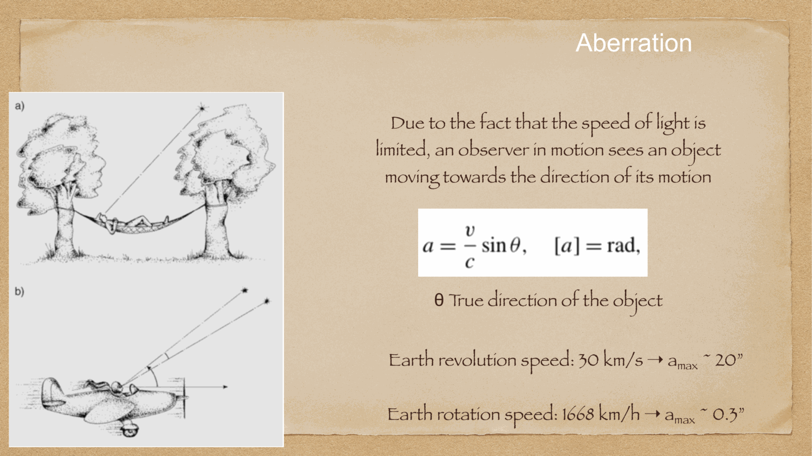
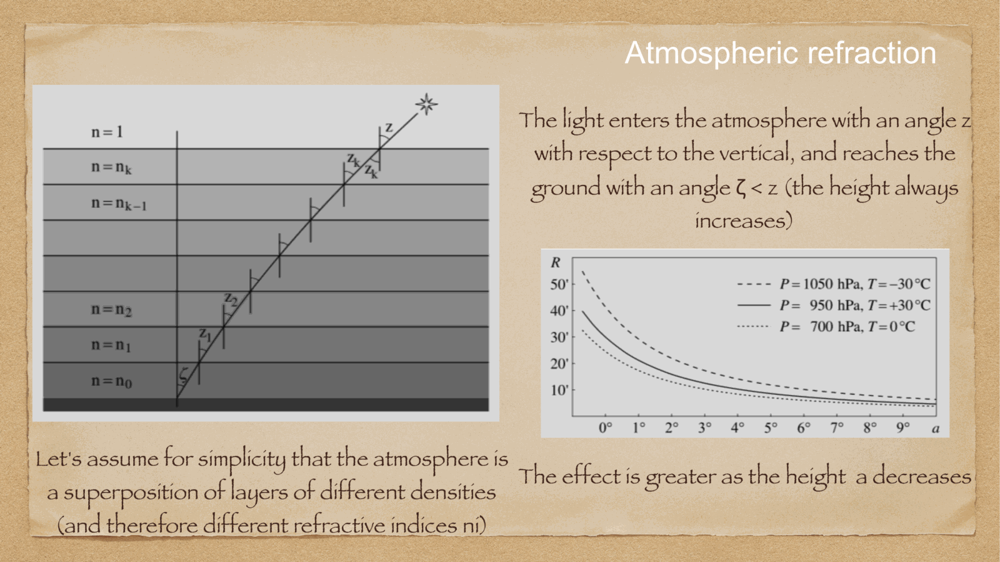
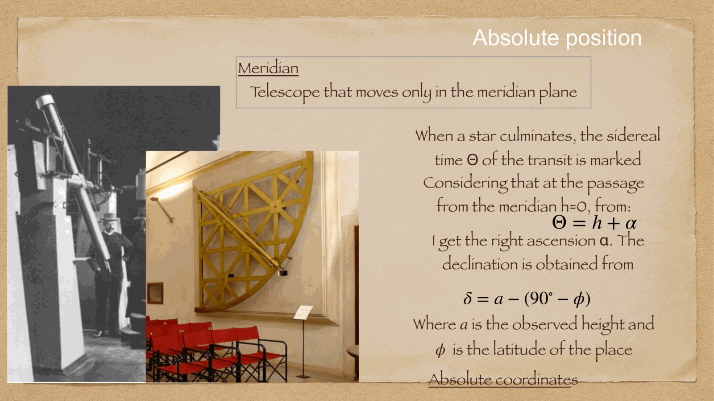
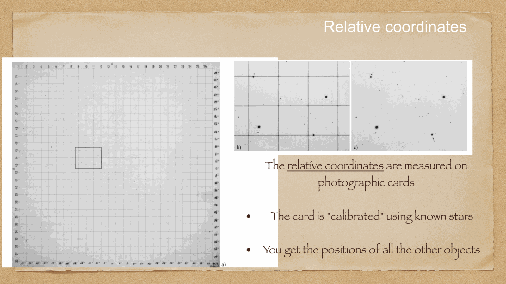


light rays from extraterrestrial astronomical sources travel through vacuum until they encounter Earth's atmosphere. because air has a refractive index $n > 1$ that increases continuously toward the surface as gas density rises, light rays bend progressively towards the normal (the local zenith). 

consequence: **all celestial objects appear higher above the horizon than their true geometric position**.

---

## Snell's law in a plane-parallel and spherical atmosphere

for a stratified atmosphere where $n = n(r)$, Snell's law in spherical coordinates states:
$$n(r) \, r \, \sin z(r) = \text{constant} = n_0 R_E \sin z_{\text{app}}$$
where $n_0$ is the refractive index at ground level, $R_E$ is Earth's radius, and $z_{\text{app}}$ is the observed (apparent) zenith distance.

the total **refraction angle** $R$ is defined as the difference between the true geometric zenith distance $z_{\text{true}}$ and the apparent zenith distance $z_{\text{app}}$:
$$\boxed{\, R = z_{\text{true}} - z_{\text{app}} = a_{\text{app}} - a_{\text{true}} > 0 \,}$$
so the true altitude is always lower: $a_{\text{true}} = a_{\text{app}} - R$.

---

## approximations for moderate zenith angles

for objects well above the horizon ($z \le 70^\circ$), the curvature of the atmosphere can be neglected, yielding the classical Cassini/radau formula:
$$R \approx (n_0 - 1) \tan z_{\text{app}}$$

at standard sea-level temperature and pressure ($T = 0^\circ$C, $P = 1013.25$ hPa), $(n_0 - 1) \approx 2.93 \times 10^{-4}$ rad $\approx 60.4'' \approx 1'$. therefore:
$$\boxed{\, R \approx 1' \tan z_{\text{app}} \approx 60'' \tan z_{\text{app}} \,}$$

### typical values:
- at zenith ($z = 0^\circ$): $R = 0''$.
- at $z = 45^\circ$ ($a = 45^\circ$): $R \approx 60'' = 1.0'$.
- at $z = 60^\circ$ ($a = 30^\circ$): $R \approx 1.73' \approx 104''$.
- at $z = 70^\circ$ ($a = 20^\circ$): $R \approx 2.75' \approx 165''$.

---

## horizon refraction and the sunset illusion

near the horizon ($z \to 90^\circ$), the $\tan z$ approximation diverges unphysically. full spherical integration through the atmospheric density profile reveals:
$$\boxed{\, R(z = 90^\circ) \approx 35' \approx 0.58^\circ \,}$$

### key physical consequences:
1. **geometric vs apparent sunrise/sunset**: the angular diameter of both the Sun and the Moon is $\sim 31'-32'$. because $R \approx 35' > 32'$, **when the lower limb of the Sun appears to just touch the horizon, the entire solar disk is already geometrically below the horizon!** atmospheric refraction lengthens daytime by about $4$ to $8$ minutes at mid-latitudes.
2. **vertical flattening of the solar/lunar disk**: because $R$ increases very steeply near the horizon, the lower limb of the Sun ($z \approx 90^\circ$) is refracted by $\sim 35'$, whereas the upper limb ($z \approx 89.5^\circ$) is refracted by only $\sim 29'$. this $6'$ differential refraction compresses the vertical diameter of the Sun, giving setting/rising celestial bodies their characteristic oval, squashed appearance.

---

## atmospheric dispersion (chromatic refraction)

the refractive index $n(\lambda)$ is wavelength-dependent (Cauchy dispersion): blue light bends more than red light:
$$n_{\text{blue}} > n_{\text{red}} \implies R(\lambda_{\text{blue}}) > R(\lambda_{\text{red}})$$

as a result, point-like stars observed at high airmass ($z > 30^\circ$) are dispersed into a tiny vertical spectrum with a blue top and red bottom. in astronomical imaging and high-resolution spectroscopy, this is corrected using an **Atmospheric Dispersion Corrector (ADC)** (a pair of counter-rotating prisms).

---

## see also

- [Fundamentals_Astrophysics_Cosmology_MOC](../../04_Atlas/Fundamentals_Astrophysics_Cosmology_MOC.html)
- [Horizontal alt-azimuth system](./Horizontal%20alt-azimuth%20system.html)
- [Earth coordinates](./Earth%20coordinates.html)
- [Precession and nutation](./Precession%20and%20nutation.html)
- [Aberration of light](./Aberration%20of%20light.html)
- [Annual stellar parallax](./Annual%20stellar%20parallax.html)
