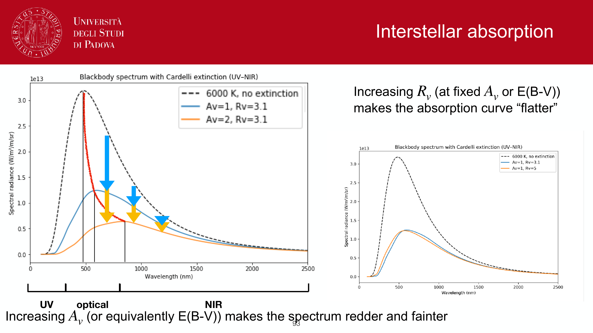
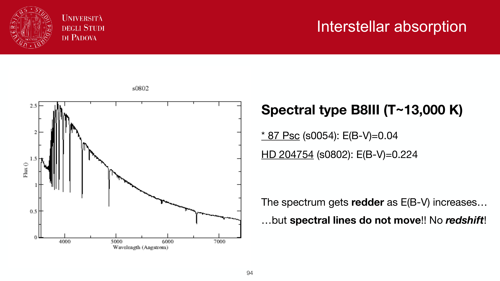
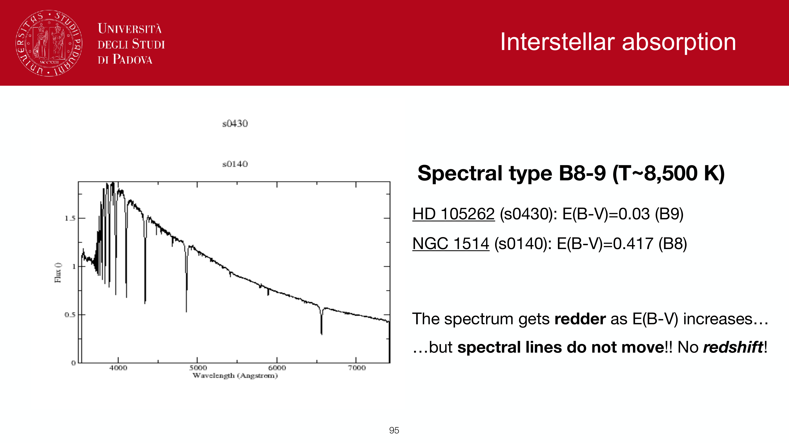
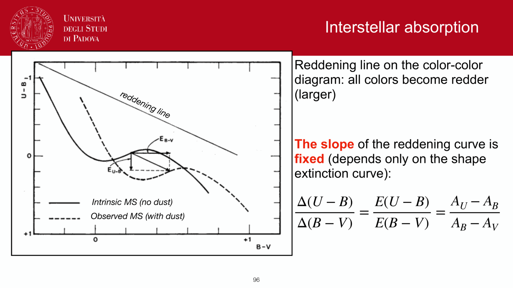


# Balmer decrement

up: [Pablo_03_Star_formation_in_galaxies](../../02_Literature/Lectures/Observational_Cosmology/Pablo_03_Star_formation_in_galaxies.html) · [H-alpha SFR tracer](./H-alpha%20SFR%20tracer.html)

## the idea

hydrogen recombination in HII regions produces Balmer lines in a *predictable* ratio, because the atomic transition probabilities are fixed. so any deviation from that predicted ratio is due to wavelength-dependent attenuation by dust between the nebula and us.

for case B recombination at $T = 10^4$ K, $n_e = 10^2$–$10^4\,\text{cm}^{-3}$:

$$\left[\frac{F(\text{H}\alpha)}{F(\text{H}\beta)}\right]_{\text{intrinsic}} = 2.86$$

any observed ratio above 2.86 means dust is suppressing Hβ more than Hα (because Hβ at 4861 Å is bluer than Hα at 6563 Å and dust extinction rises toward the blue).

## the correction

define $E(B-V)_{\text{gas}}$ from the observed ratio $R_{\text{obs}} \equiv F(\text{H}\alpha)/F(\text{H}\beta)_{\text{obs}}$ using an assumed extinction curve $k(\lambda)$:

$$E(B-V)_{\text{gas}} = \frac{2.5}{k(\text{H}\beta) - k(\text{H}\alpha)} \log_{10}\!\left(\frac{R_{\text{obs}}}{2.86}\right)$$

for the Calzetti 2000 curve, $k(\text{H}\alpha) = 3.33$, $k(\text{H}\beta) = 4.60$, so:

$$E(B-V)_{\text{gas}} = \frac{2.5}{1.27} \log_{10}\!\left(\frac{R_{\text{obs}}}{2.86}\right)$$

and $A_{\text{H}\alpha} = k(\text{H}\alpha) \cdot E(B-V)_{\text{gas}} = 3.33 \, E(B-V)_{\text{gas}}$.

## a worked example

MW $E(B-V)_{\text{gas}} = 0.4$ → $R_{\text{obs}} \simeq 4.0$. correction factor on Hα luminosity: $\times 10^{0.4 \cdot 3.33 \cdot 0.4} = 10^{0.53} \simeq 3.4$. so ignoring the decrement underestimates SFR by a factor $\sim 3$.

for a LIRG with $A_V \sim 3$ in the diffuse ISM and possibly $A_V \sim 6$ in the HII regions (Charlot-Fall 2-component model), the Balmer-decrement correction on Hα can be $\times 10$–$\times 100$.

## gas vs stars

the **gas** $E(B-V)_{\text{gas}}$ measured from Balmer decrement is generally *larger* than the **stellar** $E(B-V)_{\text{star}}$ measured from continuum slope, because HII regions live deeper in birth clouds (see Charlot & Fall 2000 in [Dust attenuation and extinction curves](./Dust%20attenuation%20and%20extinction%20curves.html)). typical ratio, from Calzetti 2000:

$$E(B-V)_{\text{star}} \simeq 0.44\, E(B-V)_{\text{gas}}$$

## failure modes

- if $R_{\text{obs}} < 2.86$, you have a measurement problem (noise, stellar absorption under Hβ is often the culprit)
- electron-density or temperature deviations push the intrinsic ratio slightly off 2.86 (to 2.75 at $T = 2 \times 10^4$ K)
- Hγ/Hβ can be used as a sanity check: intrinsic value 0.466 (case B, $T = 10^4$ K)

## connections

- primary use: [H-alpha SFR tracer](./H-alpha%20SFR%20tracer.html)
- extinction curves: [Dust attenuation and extinction curves](./Dust%20attenuation%20and%20extinction%20curves.html)
- alternative correction: [UV slope and IRX-beta relation](./UV%20slope%20and%20IRX-beta%20relation.html)

## key references

- Osterbrock & Ferland 2006, AGN2 Chapter 4
- Calzetti 2001 PASP (application to starburst galaxies)
- Groves, Brinchmann, Walcher 2012 (stellar absorption correction)

---

## observational astrophysics course slides (Prof. Paolo Cassata)

*Balmer decrement definition: ratio of H-alpha (6563 A) to H-beta (4861 A) flux.*

*Case B recombination theory: intrinsic ratio (H-alpha / H-beta)_0 = 2.86 (for T = 10000 K).*

*Obs2 / Obs5 exam question: Calculating color excess E(B - V) from Balmer decrement.*

*Formula: E(B - V) = [2.5 / (k(H-beta) - k(H-alpha))] * log10 [ (F_Ha / F_Hb)_obs / 2.86 ].*


  <h4 class="backlinks-title">Linked References (15)</h4>
  <ul class="backlinks-list">
    <li class="backlink-item-wrap"><a href="../../04_Atlas/Astronomical_Spectroscopy_MOC.html" class="backlink-item">Astronomical_Spectroscopy_MOC</a></li>
    <li class="backlink-item-wrap"><a href="./BPT%20diagram.html" class="backlink-item">BPT diagram</a></li>
    <li class="backlink-item-wrap"><a href="./Case%20A%20vs%20Case%20B%20recombination.html" class="backlink-item">Case A vs Case B recombination</a></li>
    <li class="backlink-item-wrap"><a href="./Dust%20attenuation%20and%20extinction%20curves.html" class="backlink-item">Dust attenuation and extinction curves</a></li>
    <li class="backlink-item-wrap"><a href="./Dust%20extinction%20in%20nebulae.html" class="backlink-item">Dust extinction in nebulae</a></li>
    <li class="backlink-item-wrap"><a href="./Forbidden%20line%20diagnostics.html" class="backlink-item">Forbidden line diagnostics</a></li>
    <li class="backlink-item-wrap"><a href="./H%20II%20region%20spectroscopy.html" class="backlink-item">H II region spectroscopy</a></li>
    <li class="backlink-item-wrap"><a href="./Hydrogen%20spectral%20series.html" class="backlink-item">Hydrogen spectral series</a></li>
    <li class="backlink-item-wrap"><a href="./OII%20SFR%20tracer.html" class="backlink-item">OII SFR tracer</a></li>
    <li class="backlink-item-wrap"><a href="../../04_Atlas/Observational_Astrophysics_MOC.html" class="backlink-item">Observational_Astrophysics_MOC</a></li>
    <li class="backlink-item-wrap"><a href="../../04_Atlas/Observational_Cosmology_MOC.html" class="backlink-item">Observational_Cosmology_MOC</a></li>
    <li class="backlink-item-wrap"><a href="./Optically%20thin%20recombination%20lines.html" class="backlink-item">Optically thin recombination lines</a></li>
    <li class="backlink-item-wrap"><a href="../../02_Literature/Lectures/Observational_Cosmology/Pablo_03_Star_formation_in_galaxies.html" class="backlink-item">Pablo_03_Star_formation_in_galaxies</a></li>
    <li class="backlink-item-wrap"><a href="./Recombination%20line%20emissivity.html" class="backlink-item">Recombination line emissivity</a></li>
    <li class="backlink-item-wrap"><a href="./Rydberg-Ritz%20formula.html" class="backlink-item">Rydberg-Ritz formula</a></li>
  </ul>

