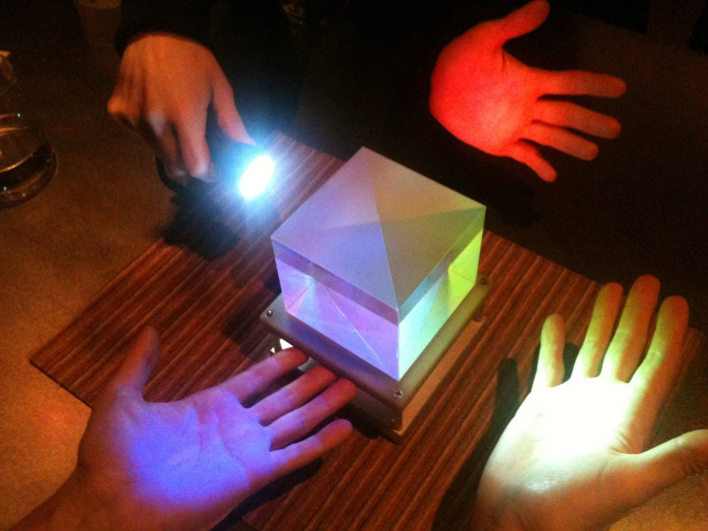

# Beam combiners

the optical heart of every interferometer. where light from separated apertures is brought together to interfere. each instrument's choice of beam combiner shapes its capabilities — pairwise vs all-at-once, image-plane vs pupil-plane, fiber vs free-space.

## three architectures

### Michelson (pupil-plane)

two beams meet at a half-silvered mirror. each output port carries the sum (or difference) of the two beams' fields. detectors at each port measure the intensities. the *fringe* shows up as out-of-phase modulations between the two ports.

**advantages**: simple, well-understood, energy-efficient
**disadvantages**: only two-beam, limited spectral range

### Fizeau (image-plane)

beams from each telescope are kept separate but reimaged to overlap at a focal plane. the resulting image is the *coherent sum* — a fringe pattern modulated by the source brightness distribution. essentially a "telescope-of-telescopes."

**advantages**: direct imaging without separate combiner, multi-beam works naturally
**disadvantages**: limited to short-baseline interferometers (LBT, hypertelescope concepts)

### single-mode fiber

each telescope's light is coupled into a single-mode optical fiber. fibers bring the light to a fiber coupler that combines the beams. all higher-order optical modes are *filtered out* by the fiber's single-mode condition.

**advantages**: removes spatial-mode mismatch between telescopes (a common visibility-killer), produces clean fringes, easy to combine many beams
**disadvantages**: photon loss in fiber coupling (typically 30-50%)

modern instruments (GRAVITY, MIRC-X) all use single-mode fibers.

### integrated optics

variant of single-mode fiber: a planar silica chip with etched waveguides. light from each telescope enters one input; combined outputs come out at multiple ports. compact, stable, multiplexable.

GRAVITY's beam combiner is integrated optics (4 telescopes → 6 baselines → 24 outputs).

## pairwise vs all-on-one

an $N$-telescope interferometer can combine beams two ways:

### pairwise combination

light from each pair of telescopes meets independently in its own combiner. for $N$ telescopes, $N(N-1)/2$ combiners. each combiner produces fringes for one baseline.

**advantages**: independent baselines, easy to measure each visibility separately
**disadvantages**: lots of combiners and detectors needed

VLTI's earlier instruments (AMBER, MIDI) used pairwise combination.

### all-on-one combination

all $N$ beams meet at a single combiner. fringes from different baselines have *different fringe spacings* on the detector. fitting a multi-baseline model recovers the visibilities for each baseline.

**advantages**: only one combiner needed, fringe-tracking sees all fringes simultaneously
**disadvantages**: harder data reduction, all visibility errors covary

GRAVITY uses an integrated-optics all-on-one design (4 beams → all 6 baselines on one chip → 24 detector channels for fringe encoding).

## the spectral dispersion question

light entering the combiner can be:

- **broad-band**: detected as a single channel. higher SNR per measurement, no spectral information
- **dispersed**: split into many narrow spectral channels. lower per-channel SNR, but wavelength-resolved visibility

modern instruments support both modes:
- low-resolution mode (R = 30-100): ~10 spectral bins, useful for continuum imaging
- high-resolution mode (R = 4000+): kinematic information, useful for resolved kinematics

## the polarization question

the wave is polarized; the beam combiner must handle both polarizations:

- **single-polarization** mode: select one polarization (e.g. linear horizontal), throw away half the light
- **dual-polarization** mode: detect both, recover full Stokes information

GRAVITY operates in single-polarization (high efficiency) and dual-polarization (slower but full polarimetry) modes.

## key engineering challenges

three:

### 1. interferometric phase stability

the optical path through the combiner must be stable to $\lesssim \lambda/100$ ($\sim 10$ nm at K-band). thermal expansion, vibration, mechanical creep — all must be controlled.

solution: enclosed in temperature-stabilized, vibration-isolated housings. metrology lasers monitor any drift.

### 2. throughput

each surface absorbs/scatters $\sim 5$% of light. a chain of 5-10 surfaces costs $\sim 30$-50% of the photons. for faint sources, every photon matters.

solution: minimize the number of surfaces, use anti-reflection coatings, single-mode-fiber coupling.

### 3. dispersion

if the two arms have different glass contents (windows, fibers, prisms), different wavelengths suffer different delays. fringes wash out at small bandwidth-times-mismatch.

solution: matched glasses in both arms, careful zero-OPD calibration.

## in practice

| instrument | combiner type | telescopes | baselines |
|---|---|---|---|
| VLTI/AMBER (decommissioned) | pairwise | 3 | 3 |
| VLTI/MIDI (decommissioned) | pairwise | 2 | 1 |
| VLTI/GRAVITY | integrated optics, all-on-one | 4 | 6 |
| VLTI/MATISSE | dual-band, all-on-one | 4 | 6 |
| CHARA/MIRC-X | image-plane all-on-one | 6 | 15 |
| LBT/LBTI | Fizeau (image-plane) | 2 | 1 |

each is optimized for specific science: GRAVITY for astrometry and accretion-disk science, MATISSE for MIR thermal sources, MIRC-X for stellar surface imaging.

## see also

- [Components of a modern interferometer](interf/Components%20of%20a%20modern%20interferometer.html)
- [Delay lines and path-length equalization](interf/Delay%20lines%20and%20path-length%20equalization.html)
- [Fringe tracking](interf/Fringe%20tracking.html)
- [VLTI Very Large Telescope Interferometer](interf/VLTI%20Very%20Large%20Telescope%20Interferometer.html)
- [CHARA array](interf/CHARA%20array.html)
- [Astronomical_Interferometry_MOC](../../04_Atlas/Astronomical_Interferometry_MOC.html)

  <h4 class="backlinks-title">Linked References (11)</h4>
  <ul class="backlinks-list">
    <li class="backlink-item-wrap"><a href="Beam%20splitter%20physics.html" class="backlink-item">Beam splitter physics</a></li>
    <li class="backlink-item-wrap"><a href="Components%20of%20a%20modern%20interferometer.html" class="backlink-item">Components of a modern interferometer</a></li>
    <li class="backlink-item-wrap"><a href="Delay%20lines%20and%20path-length%20equalization.html" class="backlink-item">Delay lines and path-length equalization</a></li>
    <li class="backlink-item-wrap"><a href="Fringe%20tracking.html" class="backlink-item">Fringe tracking</a></li>
    <li class="backlink-item-wrap"><a href="Mach-Zehnder%20interferometer.html" class="backlink-item">Mach-Zehnder interferometer</a></li>
    <li class="backlink-item-wrap"><a href="interf/Beam%20splitter%20physics.html" class="backlink-item">Beam splitter physics</a></li>
    <li class="backlink-item-wrap"><a href="interf/Components%20of%20a%20modern%20interferometer.html" class="backlink-item">Components of a modern interferometer</a></li>
    <li class="backlink-item-wrap"><a href="interf/Delay%20lines%20and%20path-length%20equalization.html" class="backlink-item">Delay lines and path-length equalization</a></li>
    <li class="backlink-item-wrap"><a href="interf/Fringe%20tracking.html" class="backlink-item">Fringe tracking</a></li>
    <li class="backlink-item-wrap"><a href="interf/Mach-Zehnder%20interferometer.html" class="backlink-item">Mach-Zehnder interferometer</a></li>
    <li class="backlink-item-wrap"><a href="../../04_Atlas/Astronomical_Interferometry_MOC.html" class="backlink-item">Astronomical_Interferometry_MOC</a></li>
  </ul>

