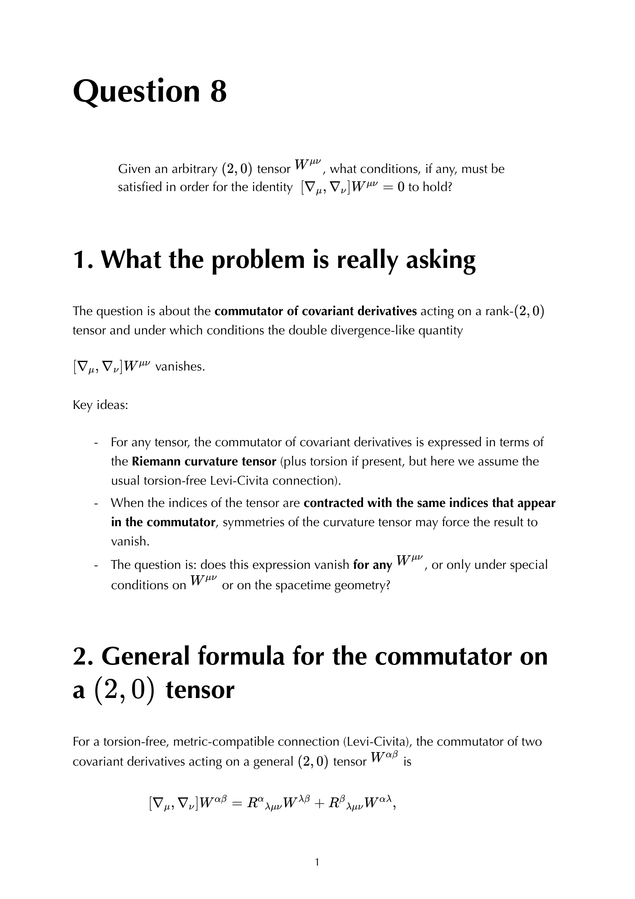


the **Bianchi identities** are differential constraints on the Riemann tensor that follow automatically from its definition. the **second Bianchi identity** is the source of conservation laws in GR; without it, Einstein's equation would not be consistent.

## the first Bianchi identity (algebraic, cyclic)

cyclic over the last three indices:
$$R_{\rho\sigma\mu\nu} + R_{\rho\mu\nu\sigma} + R_{\rho\nu\sigma\mu} = 0$$

equivalently $R_{\rho[\sigma\mu\nu]} = 0$. this is one of the four symmetries of Riemann (see [Riemann tensor symmetries](./Riemann%20tensor%20symmetries.html)).

it's algebraic: it relates Riemann components at the same point. it's a consequence of torsion-free (i.e. $\Gamma^\rho{}_{\mu\nu} = \Gamma^\rho{}_{\nu\mu}$).

## the second Bianchi identity (differential)

$$\boxed{\, \nabla_\lambda R_{\mu\nu\rho\sigma} + \nabla_\mu R_{\nu\lambda\rho\sigma} + \nabla_\nu R_{\lambda\mu\rho\sigma} = 0 \,}$$

cyclic over **three indices in the gradient**. equivalent: $\nabla_{[\lambda}R_{\mu\nu]\rho\sigma} = 0$.

this is differential: it relates Riemann derivatives at neighbouring points. consequence: certain combinations of Ricci must be conserved.

## the contracted Bianchi (the key)

contract the second Bianchi identity twice with the metric:
$$\nabla^\lambda(R_{\lambda\mu} - \frac{1}{2}g_{\lambda\mu}R) = 0$$

equivalently:
$$\nabla^\mu G_{\mu\nu} = 0$$

with the **Einstein tensor** $G_{\mu\nu} = R_{\mu\nu} - \frac{1}{2}g_{\mu\nu}R$. so the contracted Bianchi identity says **Einstein tensor is automatically conserved**.

## why this matters for Einstein's equation

Einstein's field equation $G_{\mu\nu} = 8\pi G T_{\mu\nu}$ requires $\nabla^\mu G_{\mu\nu} = 0$ on the geometry side, and $\nabla^\mu T_{\mu\nu} = 0$ on the matter side.

- **the geometry side automatically conserves** thanks to Bianchi.
- **the matter side** must be conserved as a separate physics requirement (energy-momentum conservation).

the equation $G = 8\pi G T$ then has both sides automatically conserved, so it's **consistent**.

historically: Einstein first tried $R_{\mu\nu} = 8\pi G T_{\mu\nu}$, but this is **inconsistent** because $\nabla^\mu R_{\mu\nu} \ne 0$ in general. fixing it to use $G$ instead of $R$ (which Einstein did after several false starts) makes the equation consistent and gives the right Newtonian limit.

## counting

in 4D, the second Bianchi identity has 4 free indices ($\rho, \sigma$ symmetric, $\lambda, \mu, \nu$ antisymmetric over a triple). gives $4 \cdot 4 = 16$ independent identities? no: with the cyclic structure + Riemann symmetries, the number of **independent** Bianchi identities is reduced.

the contracted Bianchi $\nabla^\mu G_{\mu\nu} = 0$ has $4$ components, exactly the number of stress-energy conservation equations. so contracted Bianchi $\leftrightarrow$ $\nabla^\mu T_{\mu\nu} = 0$ via Einstein's equation.

## the Bianchi as a covariance principle

mathematically, the Bianchi identities are the GR statement of "exterior derivative of curvature 2-form vanishes." in the language of differential forms, $dR = 0$ where $R$ is the curvature 2-form on the frame bundle.

physically: they encode the **diffeomorphism invariance** of the theory. coordinate freedom in GR is a gauge symmetry, and Bianchi expresses the constraint that this gauge be consistent.

## see also

- [Riemann tensor](./Riemann%20tensor.html)
- [Riemann tensor symmetries](./Riemann%20tensor%20symmetries.html)
- [Ricci tensor and scalar](./Ricci%20tensor%20and%20scalar.html)
- [Einstein tensor and Bianchi](./Einstein%20tensor%20and%20Bianchi.html)
- [Einstein equations](./Einstein%20equations.html)
- [Stress-energy tensor](./Stress-energy%20tensor.html)
- [General_Relativity_MOC](../../04_Atlas/General_Relativity_MOC.html)
- [Ch 4 - Spacetime Curvature](../../02_Literature/Book/Baumann%20GR/Ch%204%20-%20Spacetime%20Curvature.html)
- [Ch 5 - The Einstein Equation](../../02_Literature/Book/Baumann%20GR/Ch%205%20-%20The%20Einstein%20Equation.html)

---

### General Relativity Mathematical & Oral Defense Panel

*Question 8 Oral Exam Model Solution: Commutator of covariant derivatives $[\nabla_\mu, \nabla_\nu] W^{\mu\nu}$, Ricci identity for higher-rank tensors, and contraction leading to the divergence-free Einstein tensor $\nabla_\mu G^{\mu\nu} = 0$.*


  <h4 class="backlinks-title">Linked References (7)</h4>
  <ul class="backlinks-list">
    <li class="backlink-item-wrap"><a href="../../02_Literature/Book/Baumann%20GR/Ch%204%20-%20Spacetime%20Curvature.html" class="backlink-item">Ch 4 - Spacetime Curvature</a></li>
    <li class="backlink-item-wrap"><a href="./Einstein%20equations.html" class="backlink-item">Einstein equations</a></li>
    <li class="backlink-item-wrap"><a href="./Einstein%20tensor%20and%20Bianchi.html" class="backlink-item">Einstein tensor and Bianchi</a></li>
    <li class="backlink-item-wrap"><a href="../../04_Atlas/General_Relativity_MOC.html" class="backlink-item">General_Relativity_MOC</a></li>
    <li class="backlink-item-wrap"><a href="./Ricci%20tensor%20and%20scalar.html" class="backlink-item">Ricci tensor and scalar</a></li>
    <li class="backlink-item-wrap"><a href="./Riemann%20tensor.html" class="backlink-item">Riemann tensor</a></li>
    <li class="backlink-item-wrap"><a href="./Riemann%20tensor%20symmetries.html" class="backlink-item">Riemann tensor symmetries</a></li>
  </ul>

