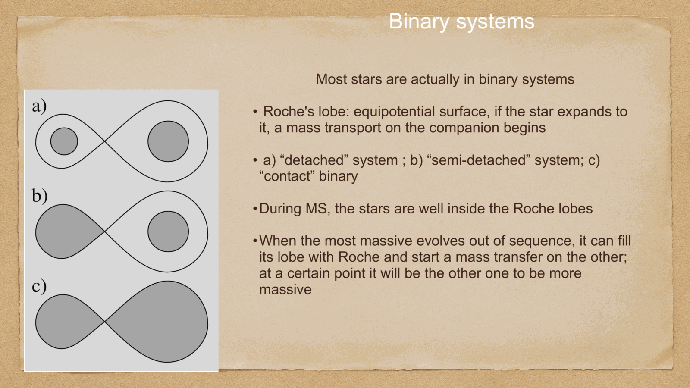
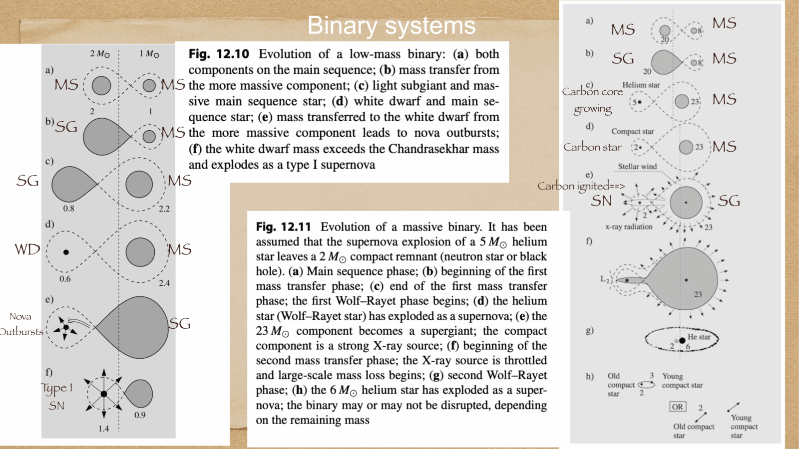

over $50\%$ of all stars (and over $70-80\%$ of massive O/B stars) are born in binary or multiple stellar systems. when binary stars orbit close to one another, gravitational tidal forces distort their shapes and drive dramatic mass exchange that fundamentally alters their evolutionary paths.

---

## Roche lobe geometry and the inner Lagrangian point L1

in a co-rotating frame centered on a binary system with masses $M_1$ and $M_2$, the effective gravitational-centrifugal potential defines critical teardrop-shaped equipotential surfaces called **Roche lobes**:
- each star is enclosed within its own Roche lobe.
- the two lobes touch at the **inner Lagrangian point L1**, a saddle point in the effective potential where gravitational and centrifugal forces perfectly balance.

### three morphological classes of binary systems:
1. **Detached binary**: both stars are well within their respective Roche lobes. they evolve independently as single stars (e.g. standard eclipsing binaries used for measuring stellar radii and masses).
2. **Semidetached binary**: one star expands to fill its Roche lobe. gas from its outer atmosphere spills through the L1 point into the Roche lobe of the companion star, forming an **accretion disk**.
   - **the Algol paradox**: in Algol ($\beta$ Persei), the less massive star ($0.8 M_\odot$) is an evolved subgiant, while the more massive star ($3.7 M_\odot$) is an unevolved main sequence star! this paradox is resolved by mass transfer: the subgiant was originally the more massive star, evolved faster, filled its Roche lobe, and dumped most of its mass onto its companion.
3. **Contact binary (W Ursae Majoris stars)**: both stars fill their Roche lobes, sharing a common gaseous envelope and having virtually identical surface temperatures.

### consequences of binary mass transfer:
- **Type Ia supernovae**: carbon-oxygen white dwarfs in semidetached binaries accrete matter from a companion until approaching the Chandrasekhar limit ($1.44 M_\odot$), triggering a runaway thermonuclear explosion.
- **Cataclysmic variables & Classical Novae**: hydrogen accreted onto a white dwarf surface undergoes periodic thermonuclear flashes.
- **X-ray binaries**: accretion onto a neutron star or stellar-mass black hole radiates intense high-energy X-rays.

---

## see also

- [Fundamentals_Astrophysics_Cosmology_MOC](../../04_Atlas/Fundamentals_Astrophysics_Cosmology_MOC.html)
- [Supernovae and compact remnants](Supernovae%20and%20compact%20remnants.html)
- [Stellar scaling relations](Stellar%20scaling%20relations.html)
- [Solar evolution and final stages](Solar%20evolution%20and%20final%20stages.html)

  <h4 class="backlinks-title">Linked References (1)</h4>
  <ul class="backlinks-list">
    <li class="backlink-item-wrap"><a href="../../04_Atlas/Fundamentals_Astrophysics_Cosmology_MOC.html" class="backlink-item">Fundamentals_Astrophysics_Cosmology_MOC</a></li>
  </ul>

