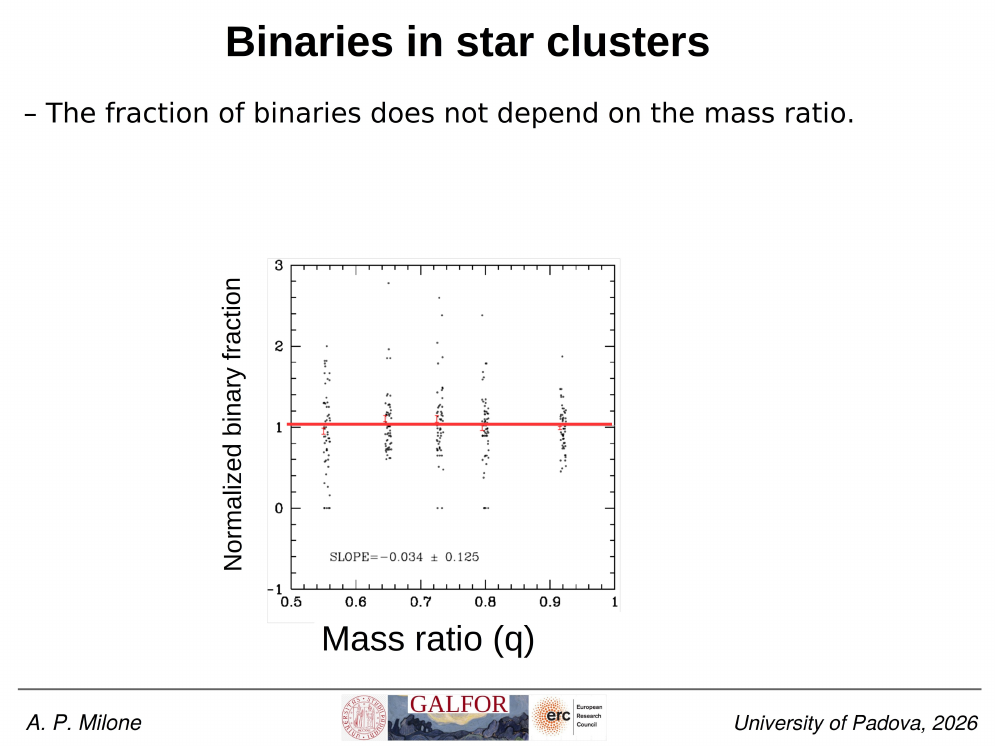
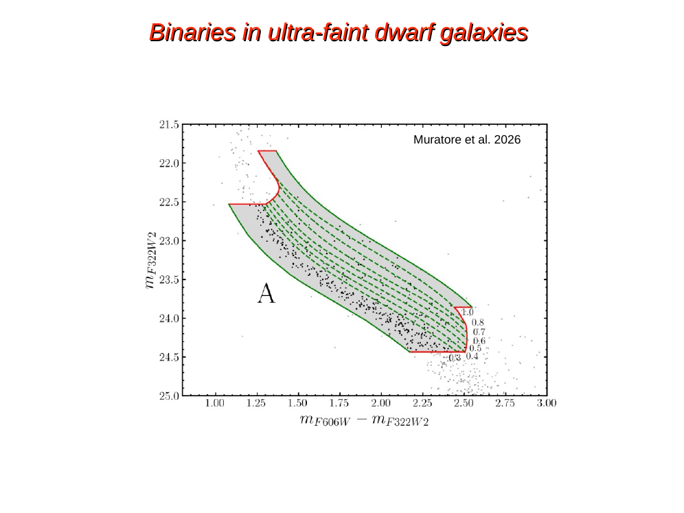
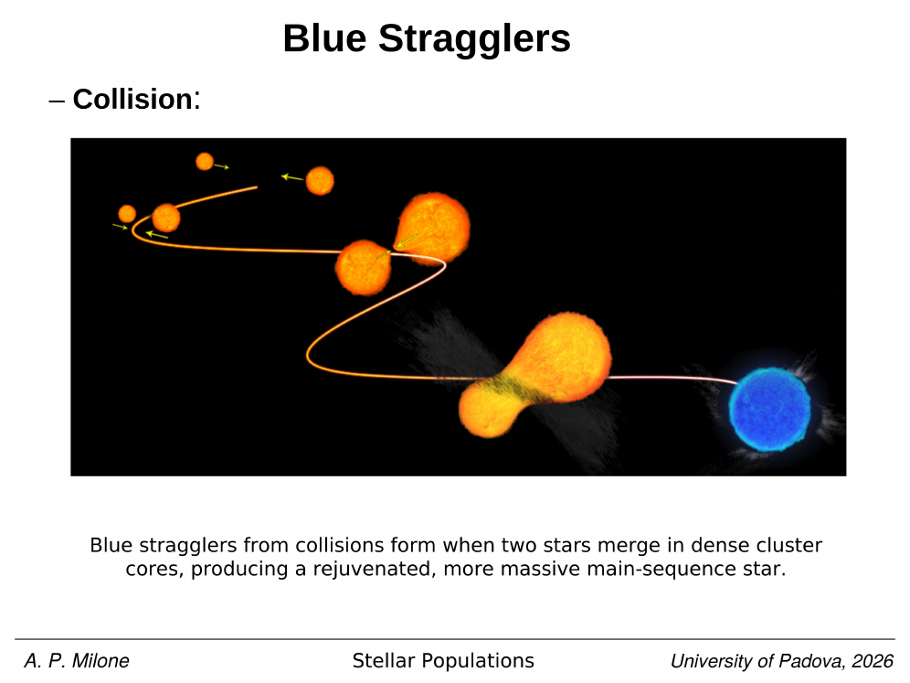
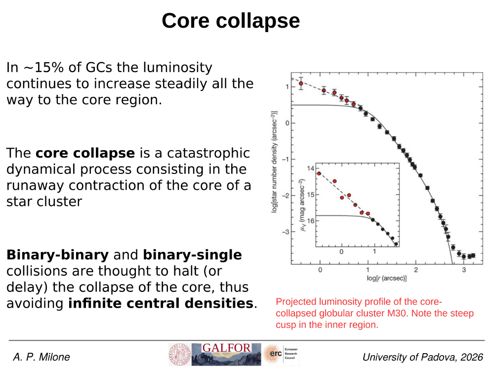


unresolved binaries are one of the most useful "contaminants" of a cluster [Color-magnitude diagrams of clusters](./Color-magnitude%20diagrams%20of%20clusters.html). when two stars share a single PSF in our images, we measure the combined flux and assign it to a single point in the [HR diagram](./HR%20diagram.html). the result is a systematic shift upward (brighter) and slightly redward, depending on the mass ratio $q = M_2/M_1$.

the cleanest case is the equal-mass binary, $q = 1$. two identical main-sequence stars contribute the same flux, so the total is exactly twice the single-star flux. in magnitudes,

$$\Delta m = -2.5 \log_{10}(2) \approx -0.753 \text{ mag}.$$

this is the famous "0.75 mag binary ridge" sitting parallel to and above the Main sequence in a high-precision cluster CMD. since both components have nearly identical colours, the colour shift for $q = 1$ is essentially zero, and the binary lies directly above its single-star counterpart at the same colour.

for partial-mass-ratio binaries ($0 < q < 1$), the displacement is smaller in magnitude and acquires a colour component, because the secondary is cooler and redder. these intermediate cases populate the strip between the single-star MS and the equal-mass binary ridge, forming a continuum rather than a discrete second sequence. the density of points across this strip carries information on the Binary mass ratio distribution.

if we model the magnitude offset for an unresolved pair of MS stars,

$$m_{\text{tot}} = -2.5 \log_{10}\!\left(10^{-0.4 m_1} + 10^{-0.4 m_2}\right),$$

we can build synthetic CMDs by sampling pairs from an assumed [Stellar mass function](./Stellar%20mass%20function.html) (often the [IMF](./Salpeter%20Kroupa%20Chabrier%20IMFs.html)) plus a $q$ distribution. the comparison to observations gives the [binary fraction](./Cluster%20binary%20fraction%20methods.html) $f_b$.

the same trick works for higher multiples. triples and quadruples shift even further above the MS, but they are rare and dynamically unstable in [Globular Clusters](./Globular%20Clusters.html). most "binary ridge" stars are genuine bound pairs, although a small fraction can be chance superpositions in dense cluster fields (mitigated with HST proper motions and high-resolution imaging).

## binary fraction measurements

- **Milone et al. 2012, A&A 540, A16**: established the standard photometric method to estimate the fraction of binaries in stellar populations by fitting synthetic CMDs with varying binary fractions and mass ratio distributions. they applied this to 59 Galactic GCs, finding binary fractions ranging from a few percent in dense cores to $\sim 50\%$ in sparse environments.
- **NGC 6791 binary fraction (Bedin et al. 2008, 2009)**: the metal-rich open cluster NGC 6791 is noted for hosting a exceptionally large fraction of MS+MS binaries ($f_{\rm bin} \approx 0.32 \pm 0.03$). unresolved binaries are also responsible for the double-peaked luminosity function of its white dwarf cooling sequence (34% WD-WD binaries, Bedin et al. 2009), illustrating how binary fractions affect all evolutionary phases on the CMD.

## reference papers

- **Milone et al. 2012, A&A 540, A16** — binary fractions in 59 Galactic GCs.
- **Bedin et al. 2008, 2009** — high binary fraction in NGC 6791 and its impact on the WDCS.

## see also
- [Stellar_Astrophysics_MOC](../../04_Atlas/Stellar_Astrophysics_MOC.html)
- [Cluster binary fraction methods](./Cluster%20binary%20fraction%20methods.html)
- [Color-magnitude diagrams of clusters](./Color-magnitude%20diagrams%20of%20clusters.html)
- [Binary star orbits](interf/Binary%20star%20orbits.html)
- [Single stellar population SSP](./Single%20stellar%20population%20SSP.html)
- [White dwarf cooling sequence on the CMD](./White%20dwarf%20cooling%20sequence%20on%20the%20CMD.html)

---

## Complete Lecture Slide Panels & Observational Evidence (Lecture 11 — Binaries in Star Clusters)

> **Context**: *Photometric binary sequence elevation (Delta V = -0.75 mag for q=1), binary mass ratio distribution f(q), and photometric binary fraction determination.*

The following slides from Prof. Antonino Milone's lecture series provide the direct observational, photometric, and theoretical foundations for this topic:

*Figure P11-01: LAntonino_p11_01.png — Observational data, CMD morphology, and diagnostics from Lecture 11 — Binaries in Star Clusters.*

*Figure P11-02: LAntonino_p11_02.png — Observational data, CMD morphology, and diagnostics from Lecture 11 — Binaries in Star Clusters.*

*Figure P11-03: LAntonino_p11_03.png — Observational data, CMD morphology, and diagnostics from Lecture 11 — Binaries in Star Clusters.*

*Figure P11-04: LAntonino_p11_04.png — Observational data, CMD morphology, and diagnostics from Lecture 11 — Binaries in Star Clusters.*

*Figure P11-05: LAntonino_p11_05.png — Observational data, CMD morphology, and diagnostics from Lecture 11 — Binaries in Star Clusters.*

*Figure P11-06: LAntonino_p11_06.png — Observational data, CMD morphology, and diagnostics from Lecture 11 — Binaries in Star Clusters.*

*Figure P11-07: LAntonino_p11_07.png — Observational data, CMD morphology, and diagnostics from Lecture 11 — Binaries in Star Clusters.*

*Figure P11-08: LAntonino_p11_08.png — Observational data, CMD morphology, and diagnostics from Lecture 11 — Binaries in Star Clusters.*

*Figure P11-09: LAntonino_p11_09.png — Observational data, CMD morphology, and diagnostics from Lecture 11 — Binaries in Star Clusters.*

*Figure P11-10: LAntonino_p11_10.png — Observational data, CMD morphology, and diagnostics from Lecture 11 — Binaries in Star Clusters.*

*Figure P11-11: LAntonino_p11_11.png — Observational data, CMD morphology, and diagnostics from Lecture 11 — Binaries in Star Clusters.*

*Figure P11-12: LAntonino_p11_12.png — Observational data, CMD morphology, and diagnostics from Lecture 11 — Binaries in Star Clusters.*

*Figure P11-13: LAntonino_p11_13.png — Observational data, CMD morphology, and diagnostics from Lecture 11 — Binaries in Star Clusters.*

*Figure P11-14: LAntonino_p11_14.png — Observational data, CMD morphology, and diagnostics from Lecture 11 — Binaries in Star Clusters.*

*Figure P11-15: LAntonino_p11_15.png — Observational data, CMD morphology, and diagnostics from Lecture 11 — Binaries in Star Clusters.*

*Figure P11-16: LAntonino_p11_16.png — Observational data, CMD morphology, and diagnostics from Lecture 11 — Binaries in Star Clusters.*

*Figure P11-17: LAntonino_p11_17.png — Observational data, CMD morphology, and diagnostics from Lecture 11 — Binaries in Star Clusters.*

*Figure P11-18: LAntonino_p11_18.png — Observational data, CMD morphology, and diagnostics from Lecture 11 — Binaries in Star Clusters.*

*Figure P11-19: LAntonino_p11_19.png — Observational data, CMD morphology, and diagnostics from Lecture 11 — Binaries in Star Clusters.*

*Figure P11-20: LAntonino_p11_20.png — Observational data, CMD morphology, and diagnostics from Lecture 11 — Binaries in Star Clusters.*

*Figure P11-21: LAntonino_p11_21.png — Observational data, CMD morphology, and diagnostics from Lecture 11 — Binaries in Star Clusters.*

*Figure P11-22: LAntonino_p11_22.png — Observational data, CMD morphology, and diagnostics from Lecture 11 — Binaries in Star Clusters.*

*Figure P11-23: LAntonino_p11_23.png — Observational data, CMD morphology, and diagnostics from Lecture 11 — Binaries in Star Clusters.*

*Figure P11-24: LAntonino_p11_24.png — Observational data, CMD morphology, and diagnostics from Lecture 11 — Binaries in Star Clusters.*

*Figure P11-25: LAntonino_p11_25.png — Observational data, CMD morphology, and diagnostics from Lecture 11 — Binaries in Star Clusters.*

*Figure P11-26: Lecture11_p15-15.png — Observational data, CMD morphology, and diagnostics from Lecture 11 — Binaries in Star Clusters.*

*Figure P11-27: Lecture11_p25-25.png — Observational data, CMD morphology, and diagnostics from Lecture 11 — Binaries in Star Clusters.*

*Figure P11-28: Lecture11_p35-35.png — Observational data, CMD morphology, and diagnostics from Lecture 11 — Binaries in Star Clusters.*

*Figure P11-29: Lecture11_p5-05.png — Observational data, CMD morphology, and diagnostics from Lecture 11 — Binaries in Star Clusters.*


  <h4 class="backlinks-title">Linked References (4)</h4>
  <ul class="backlinks-list">
    <li class="backlink-item-wrap"><a href="./Cluster%20binary%20fraction%20methods.html" class="backlink-item">Cluster binary fraction methods</a></li>
    <li class="backlink-item-wrap"><a href="./Initial%20vs%20present-day%20mass%20function.html" class="backlink-item">Initial vs present-day mass function</a></li>
    <li class="backlink-item-wrap"><a href="../../04_Atlas/Stellar_Astrophysics_MOC.html" class="backlink-item">Stellar_Astrophysics_MOC</a></li>
    <li class="backlink-item-wrap"><a href="./White%20dwarf%20cooling%20sequence%20on%20the%20CMD.html" class="backlink-item">White dwarf cooling sequence on the CMD</a></li>
  </ul>

