a **blackbody** (corpo nero) is an idealized physical object that absorbs 100% of all incident electromagnetic radiation, reflecting and transmitting none. when in thermodynamic equilibrium at temperature $T$, a blackbody emits a continuous spectrum whose shape and intensity depend **solely on its temperature $T$**, completely independent of the composition or shape of the emitter.

---

## Kirchhoff's law of thermal radiation

Gustav Kirchhoff proved in 1859 that for any body in thermodynamic equilibrium, the ratio between the emission coefficient $j_\nu$ and absorption coefficient $\alpha_\nu$ is a universal function of frequency and temperature:
$$\boxed{\, \frac{j_\nu}{\alpha_\nu} = B_\nu(T) \,}$$
where $B_\nu(T)$ is the Planck function. a good absorber is necessarily an equally good emitter.

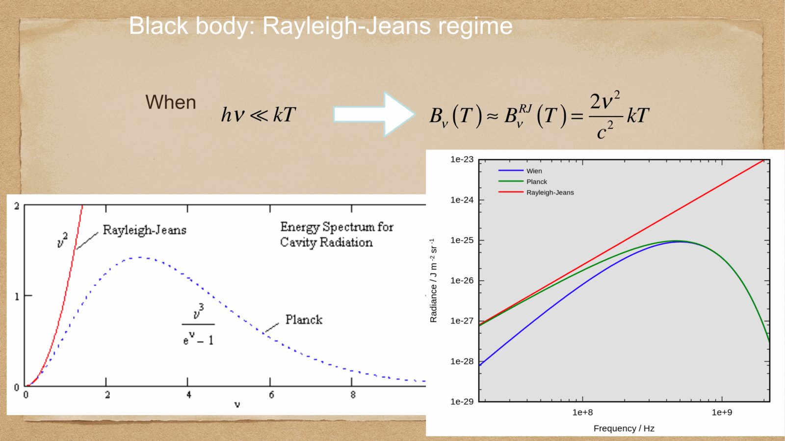

---

## Planck's radiation law

Max Planck solved the ultraviolet catastrophe in 1900 by hypothesizing that energy states of atomic oscillators are quantized in units of $E = h\nu$. 

the specific intensity of blackbody radiation as a function of frequency $\nu$ is:
$$\boxed{\, B_\nu(T) = \frac{2h\nu^3}{c^2} \frac{1}{e^{\frac{h\nu}{k_B T}} - 1} \qquad [\text{W m}^{-2}\text{ Hz}^{-1}\text{ sr}^{-1}] \,}$$

in terms of wavelength $\lambda$ (using $\lvert B_\lambda d\lambda\rvert = \lvert B_\nu d\nu\rvert$ with $\nu = c/\lambda$):
$$\boxed{\, B_\lambda(T) = \frac{2hc^2}{\lambda^5} \frac{1}{e^{\frac{hc}{\lambda k_B T}} - 1} \qquad [\text{W m}^{-2}\text{ m}^{-1}\text{ sr}^{-1}] \,}$$

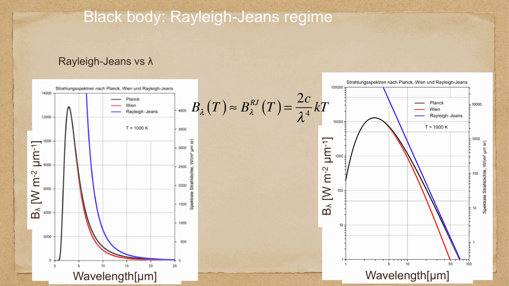

### properties of Planck curves:
1. **continuous**: smoothly defined across all wavelengths.
2. **non-intersecting**: as temperature increases, the Planck curve at higher $T$ sits strictly above the curve at lower $T$ at **all** wavelengths. a hotter body emits more radiation per unit area at every wavelength than a colder body.
3. **peak shift**: as temperature increases, the peak of the emission shifts toward higher frequencies / shorter wavelengths.

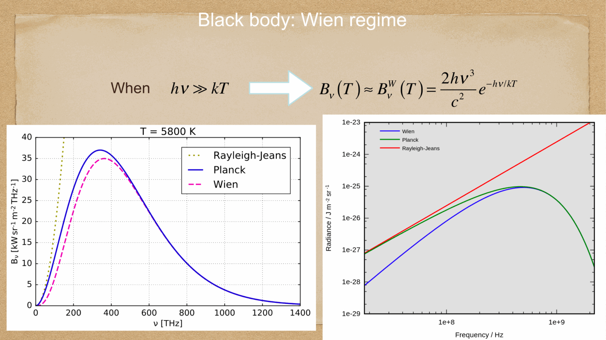

---

## Wien's displacement law

the peak wavelength $\lambda_{\text{max}}$ of the Planck function $B_\lambda(T)$ is obtained by setting $\frac{dB_\lambda}{d\lambda} = 0$. defining $x \equiv \frac{hc}{\lambda k_B T}$, the extremum satisfies $5(1 - e^{-x}) = x$, whose numerical root is $x \approx 4.9651$.

this yields **Wien's displacement law**:
$$\boxed{\, \lambda_{\text{max}} \, T = b \approx 2.89777 \times 10^{-3} \text{ m K} \approx 2898 \, \mu\text{m K} \,}$$

### astrophysical benchmarks:
- **the Sun ($T \approx 5800$ K)**: $\lambda_{\text{max}} \approx 2.9 \times 10^{-3} / 5800 \approx 500$ nm (green-yellow visible light).
- **hot O-star ($T \approx 30,000$ K)**: $\lambda_{\text{max}} \approx 97$ nm (far ultraviolet).
- **cool M-dwarf ($T \approx 3000$ K)**: $\lambda_{\text{max}} \approx 970$ nm (near infrared).
- **cosmic microwave background (CMB, $T = 2.725$ K)**: $\lambda_{\text{max}} \approx 1.06$ mm (microwave/sub-mm).

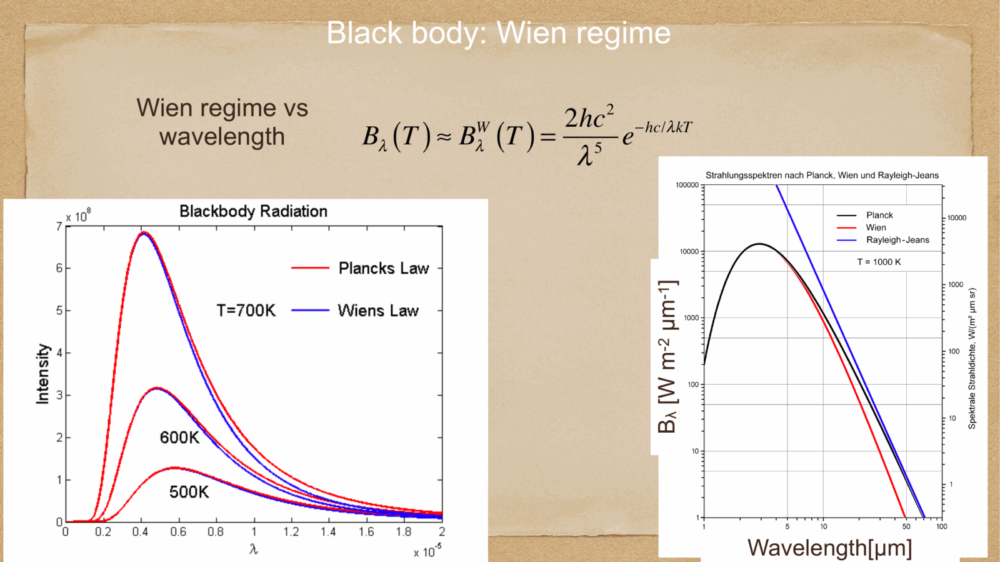

---

## Stefan-Boltzmann law and stellar luminosity

integrating the Planck intensity over all angles and frequencies gives the total flux emitted by a blackbody surface:
$$F = \pi \int_0^\infty B_\nu(T) \, d\nu = \sigma T^4$$

where the **Stefan-Boltzmann constant** $\sigma$ is:
$$\sigma = \frac{2\pi^5 k_B^4}{15 c^2 h^3} \approx 5.6704 \times 10^{-8} \text{ W m}^{-2}\text{ K}^{-4}$$

for a spherical star of radius $R$:
$$\boxed{\, L = 4\pi R^2 \sigma T_{\text{eff}}^4 \,}$$

this defines the star's **effective temperature** $T_{\text{eff}}$: the temperature of an ideal blackbody that would radiate the same total luminosity per unit surface area as the real star.

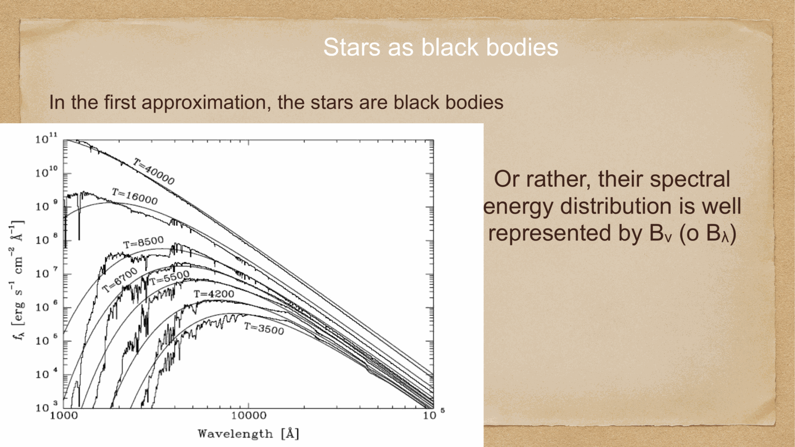

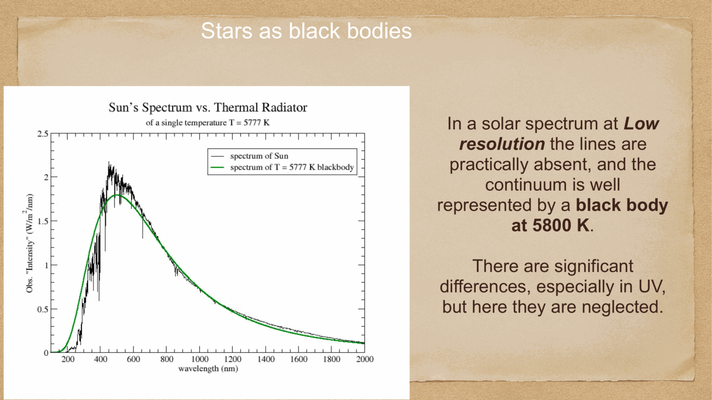

---

## asymptotic limits of the Planck distribution

### 1. Rayleigh-Jeans law (low frequencies / long wavelengths: $h\nu \ll k_B T$):
expanding the exponential $e^x \approx 1 + x$:
$$B_\nu(T) \approx \frac{2\nu^2 k_B T}{c^2} = \frac{2 k_B T}{\lambda^2}$$
- linear in temperature $T$ and quadratic in frequency $\nu^2$.
- fundamental in **radio astronomy**, allowing radio astronomers to define the **brightness temperature** $T_b \equiv \frac{c^2 I_\nu}{2 k_B \nu^2}$.

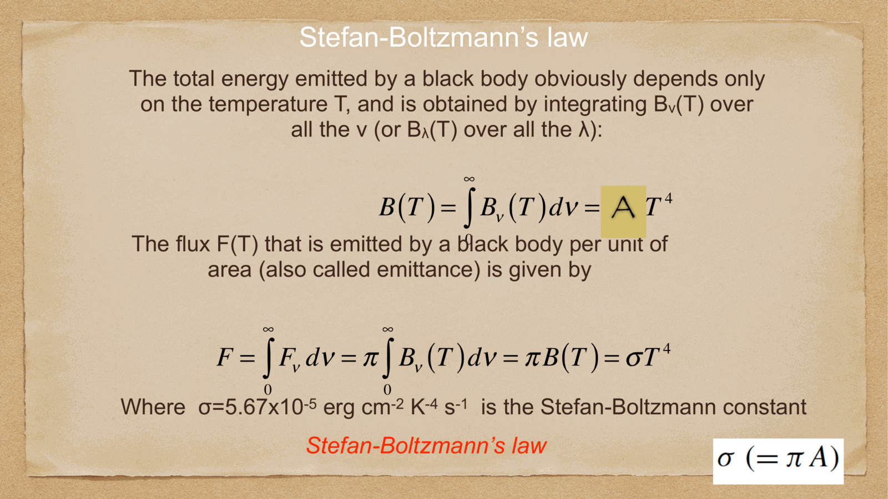

### 2. Wien's approximation (high frequencies / short wavelengths: $h\nu \gg k_B T$):
neglecting the $-1$ in the denominator:
$$B_\nu(T) \approx \frac{2h\nu^3}{c^2} e^{-\frac{h\nu}{k_B T}}$$
- exponential exponential cutoff describing the high-energy photon tail.

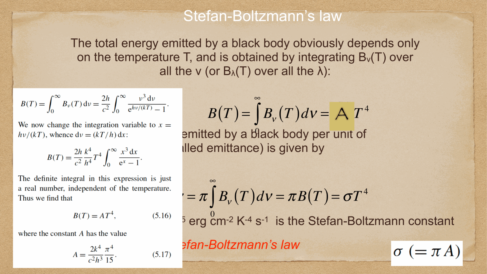

---

## color temperature vs effective temperature

real stars are not perfect blackbodies because their atmospheres have wavelength-dependent opacities (absorption lines, bound-free edges, dust). astronomers define:
- **effective temperature** $T_{\text{eff}}$: derived from total integrated bolometric flux ($F = \sigma T_{\text{eff}}^4$).
- **color temperature** $T_c$: temperature of a blackbody whose spectrum best matches the observed slope/color across a specific bandpass (e.g. $B-V$).
- **brightness temperature** $T_b$: temperature from the Rayleigh-Jeans equation for monochromatic intensity.

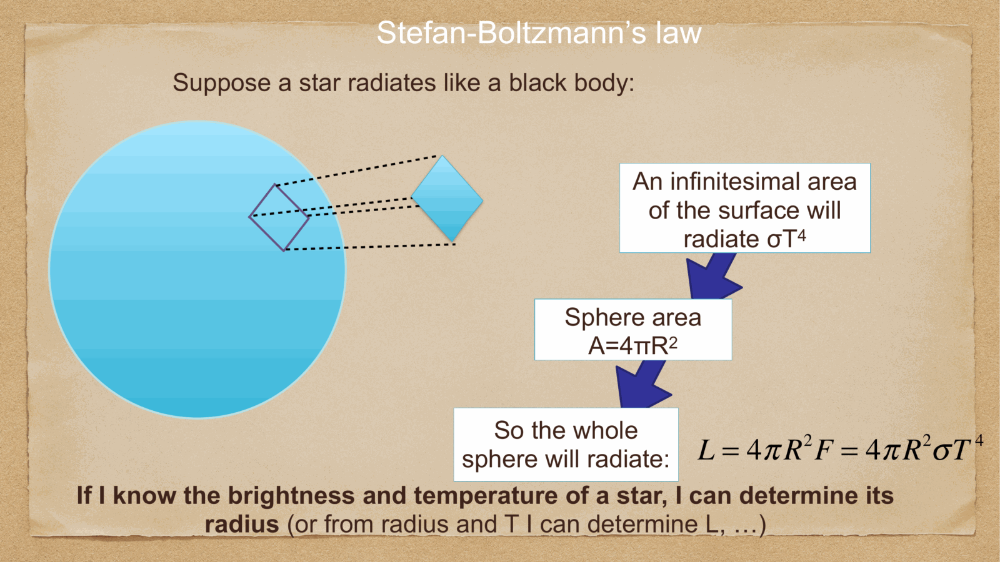

---

## see also

- [Fundamentals_Astrophysics_Cosmology_MOC](../../04_Atlas/Fundamentals_Astrophysics_Cosmology_MOC.html)
- [Electromagnetic radiation basics](Electromagnetic%20radiation%20basics.html)
- [Radiation quantities and inverse square law](Radiation%20quantities%20and%20inverse%20square%20law.html)
- [Stellar spectra and spectral classification](Stellar%20spectra%20and%20spectral%20classification.html)
- [HR diagram](HR%20diagram.html)
- [Cosmic_inventory_photons](Cosmic_inventory_photons.html)

---

## observational astrophysics course slides (Prof. Paolo Cassata)

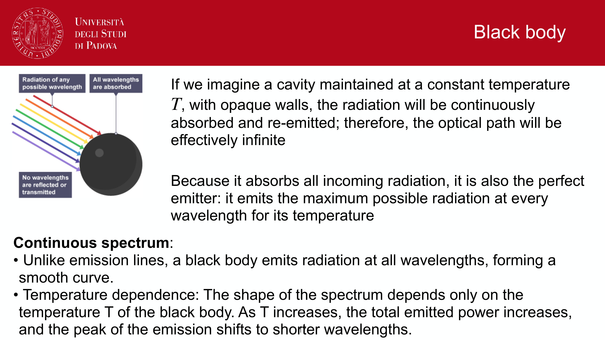
*Blackbody radiation: thermodynamic equilibrium cavity radiation.*

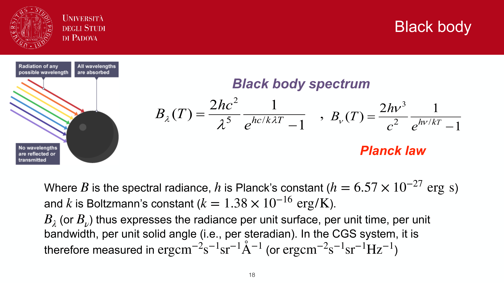
*Planck radiation law B_nu(T) and B_lambda(T).*

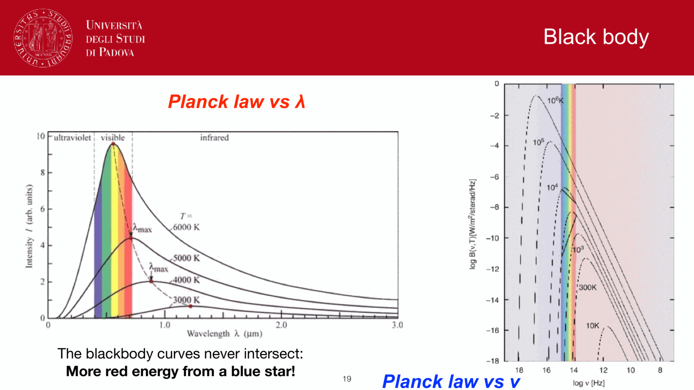
*Rayleigh-Jeans law at low frequencies (h nu << k_B T).*

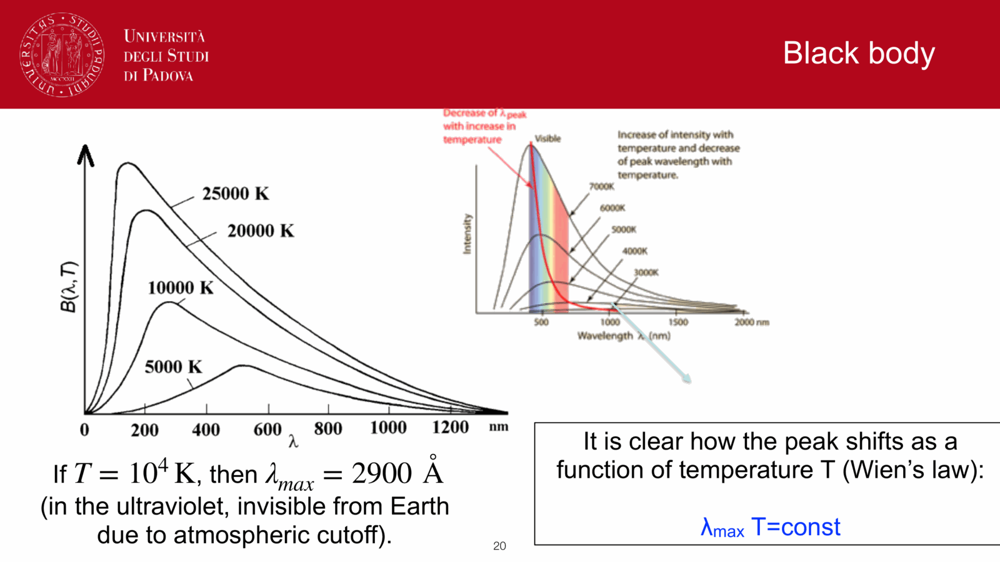
*Wien approximation at high frequencies (h nu >> k_B T).*

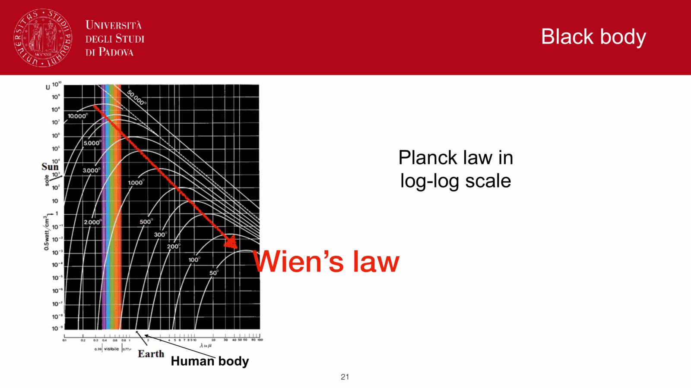
*Stefan-Boltzmann law: integration over all frequencies, F = sigma T^4.*

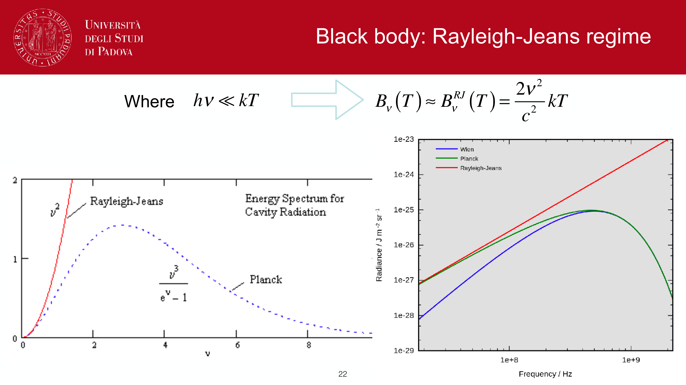
*Stefan-Boltzmann constant sigma = 2 pi^5 k_B^4 / (15 c^2 h^3).*

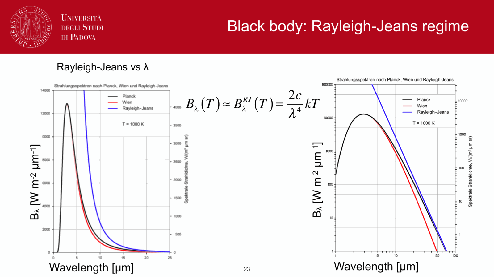
*Stellar luminosity formula: L = 4 pi R^2 sigma T_eff^4.*

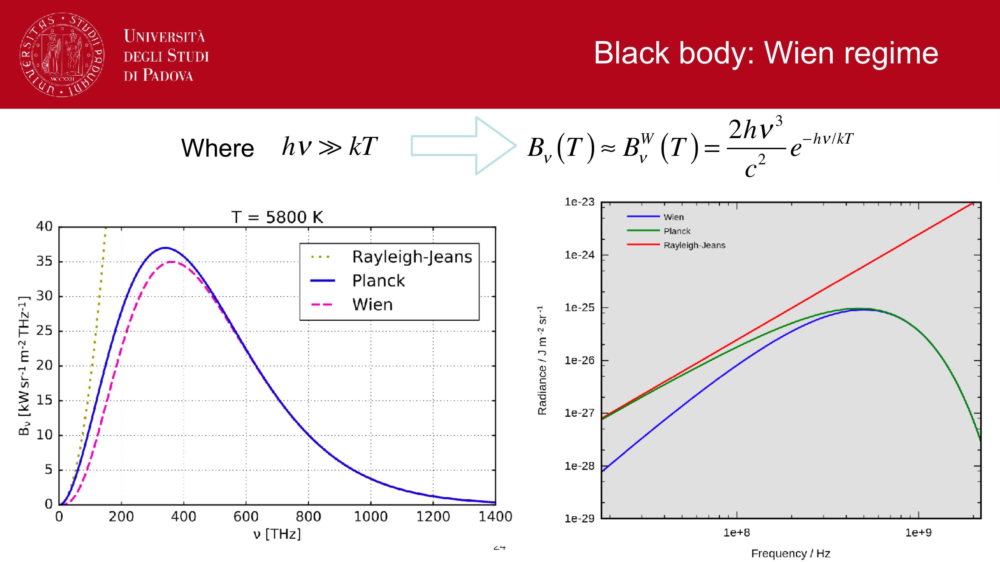
*Effective temperature T_eff definition for stars.*

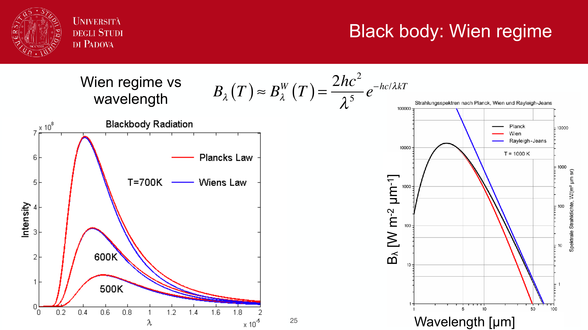
*Blackbody radiation curves across stellar temperatures (3000 K to 30000 K).*

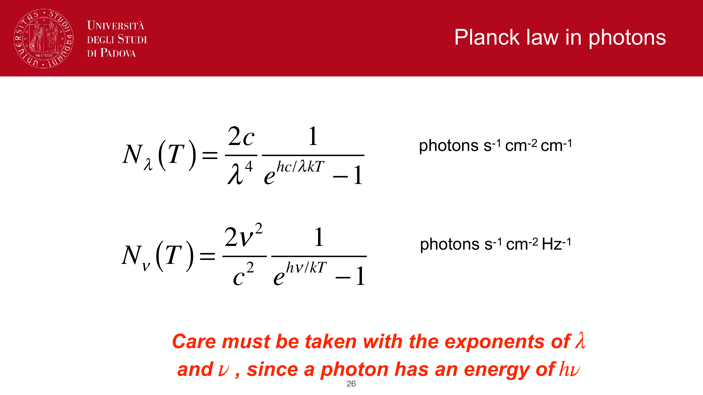
*Brightness temperature T_b and color temperature T_c.*

  <h4 class="backlinks-title">Linked References (9)</h4>
  <ul class="backlinks-list">
    <li class="backlink-item-wrap"><a href="Cosmic_inventory_photons_derivation.html" class="backlink-item">Cosmic_inventory_photons_derivation</a></li>
    <li class="backlink-item-wrap"><a href="Electromagnetic%20radiation%20basics.html" class="backlink-item">Electromagnetic radiation basics</a></li>
    <li class="backlink-item-wrap"><a href="Magnitudes%20and%20photometric%20systems.html" class="backlink-item">Magnitudes and photometric systems</a></li>
    <li class="backlink-item-wrap"><a href="Planck%20law%20Wien%20Stefan-Boltzmann.html" class="backlink-item">Planck law Wien Stefan-Boltzmann</a></li>
    <li class="backlink-item-wrap"><a href="Radiation%20quantities%20and%20inverse%20square%20law.html" class="backlink-item">Radiation quantities and inverse square law</a></li>
    <li class="backlink-item-wrap"><a href="Specific%20intensity%20flux%20luminosity.html" class="backlink-item">Specific intensity flux luminosity</a></li>
    <li class="backlink-item-wrap"><a href="Stellar%20spectra%20and%20spectral%20classification.html" class="backlink-item">Stellar spectra and spectral classification</a></li>
    <li class="backlink-item-wrap"><a href="../../04_Atlas/Fundamentals_Astrophysics_Cosmology_MOC.html" class="backlink-item">Fundamentals_Astrophysics_Cosmology_MOC</a></li>
    <li class="backlink-item-wrap"><a href="../../04_Atlas/Observational_Astrophysics_MOC.html" class="backlink-item">Observational_Astrophysics_MOC</a></li>
  </ul>

