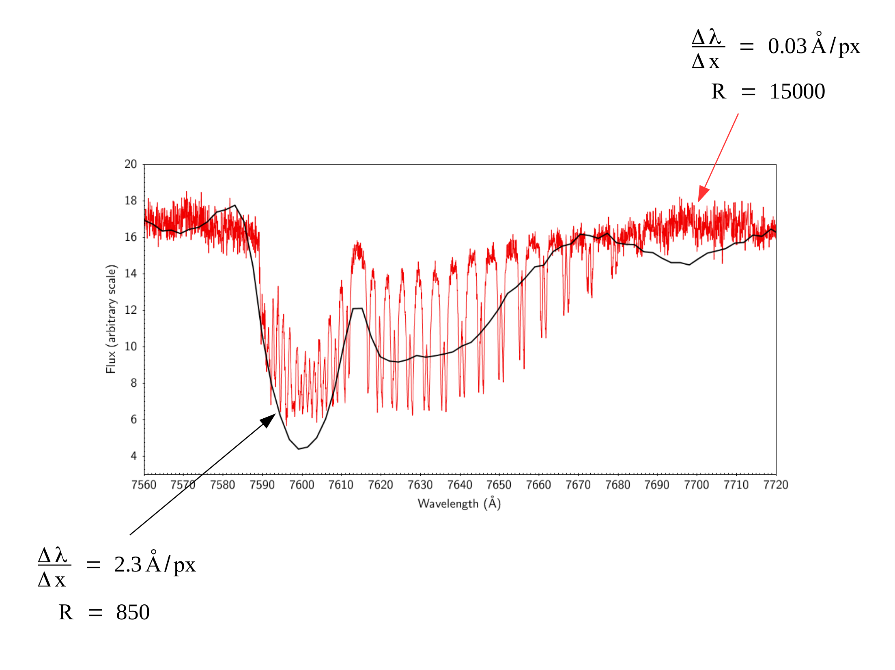
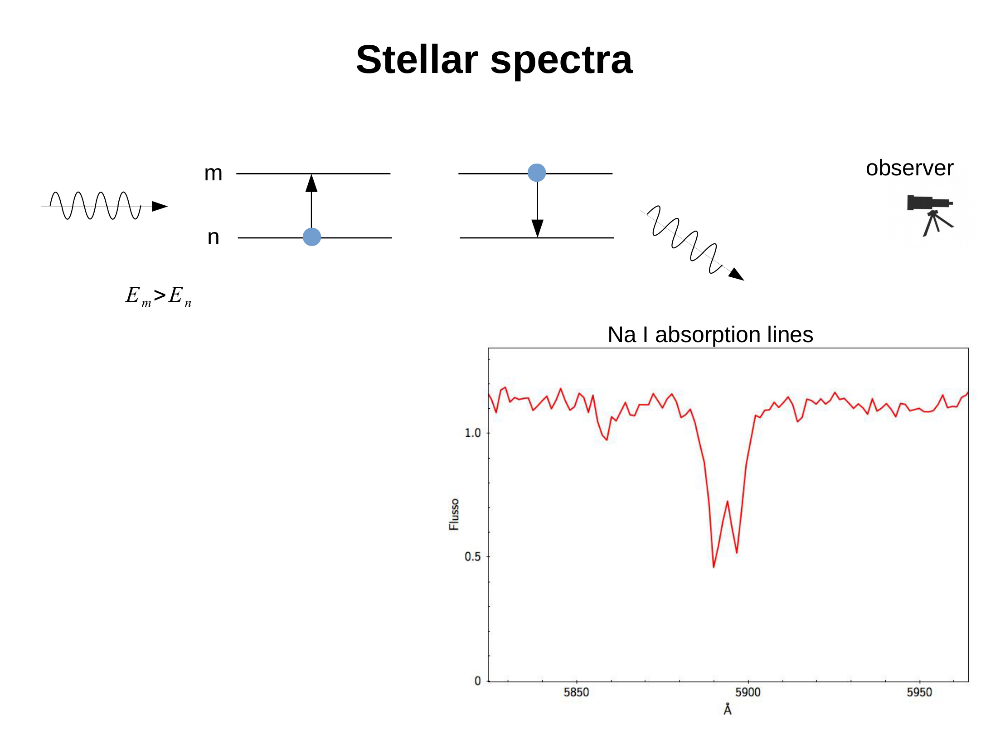

a **blazed grating** has its grooves cut at a specific tilt angle (the **blaze angle** $\theta_B$) so that the single-slit-diffraction envelope peaks at a chosen wavelength in a chosen order. dramatically increases throughput in that order vs an un-blazed grating.

## the geometry

each groove of a blazed grating is a tilted facet, sawtooth-like, with the **groove face** tilted by $\theta_B$ relative to the grating surface.

key property: light is **specularly reflected** off the groove face, with reflection angle equal to the incidence angle (measured from the *facet* normal, not the grating normal). by adjusting $\theta_B$, you can make this specular direction coincide with a particular dispersion order at a chosen $\lambda_B$.

## the blaze wavelength

at the blaze condition, the single-slit envelope (set by the facet width) is centred on the order $m$ at wavelength $\lambda_B$. the diffraction efficiency peaks at $\lambda_B$ in that order.

for normal incidence (Littrow configuration, where $i = \theta = \theta_B$):
$$\lambda_B = \frac{2\sin\theta_B}{\rho m}$$

example: a $300$ lines/mm grating blazed for $\lambda_B = 5000$ Å in $m = 1$ has $\theta_B = \arcsin(\rho m \lambda_B/2) = \arcsin(0.075) \approx 4.3°$.

higher-density gratings have steeper blaze angles. echelles ($m \sim 50$ to $100$) have very large blaze angles ($\sim 60°$), often ruled with the back side of the groove as the working face.

## the throughput curve

a blazed grating has a typical throughput envelope $T(\lambda)$ that peaks at $\lambda_B$ and falls off symmetrically. the **half-power** points are at roughly $0.7 \lambda_B$ and $1.4 \lambda_B$ in that order.

so a single blazed grating is **optimal for one $\lambda$ region**. to cover multiple regions, observatories stock multiple gratings of different $\rho$ and different $\theta_B$, each used in its sweet spot.

## blazed echelles

echelle gratings are blazed at very high $\theta_B$ to send light into very high orders ($m = 30$ to $100$). this gives high $R$ in compact instruments, but requires a cross-disperser to separate the densely overlapping orders.

## see also

- [Grating equation](Grating%20equation.html)
- [Single slit diffraction](Single%20slit%20diffraction.html)
- [N-slit interference and gratings](N-slit%20interference%20and%20gratings.html)
- [Spectrograph design](Spectrograph%20design.html)
- [Dispersion and spectral resolution](Dispersion%20and%20spectral%20resolution.html)
- [Echelle spectroscopy](Echelle%20spectroscopy.html)

---

### Astronomical Spectroscopy Diagnostic Panels

*Blazed reflection grating profile: sawtooth facet angle $\theta_B$ concentrating diffraction efficiency into order $m$ at design blaze wavelength $\lambda_B = \frac{2d}{m}\sin\theta_B\cos(\alpha - \theta_B)$.*

*Blaze efficiency function: modulation of multiple-slit interference pattern by single-facet Fraunhofer diffraction envelope.*

  <h4 class="backlinks-title">Linked References (5)</h4>
  <ul class="backlinks-list">
    <li class="backlink-item-wrap"><a href="Echelle%20spectroscopy.html" class="backlink-item">Echelle spectroscopy</a></li>
    <li class="backlink-item-wrap"><a href="Grating%20equation.html" class="backlink-item">Grating equation</a></li>
    <li class="backlink-item-wrap"><a href="N-slit%20interference%20and%20gratings.html" class="backlink-item">N-slit interference and gratings</a></li>
    <li class="backlink-item-wrap"><a href="Single%20slit%20diffraction.html" class="backlink-item">Single slit diffraction</a></li>
    <li class="backlink-item-wrap"><a href="../../04_Atlas/Astronomical_Spectroscopy_MOC.html" class="backlink-item">Astronomical_Spectroscopy_MOC</a></li>
  </ul>

