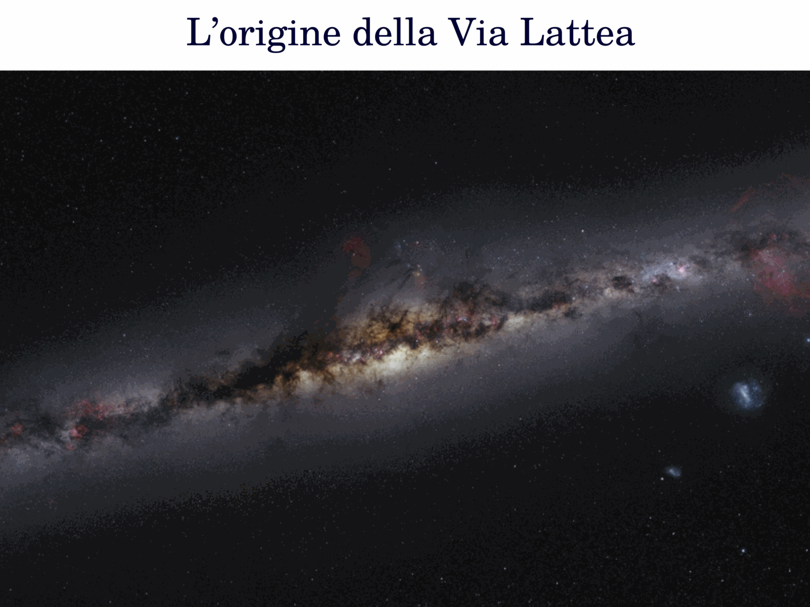
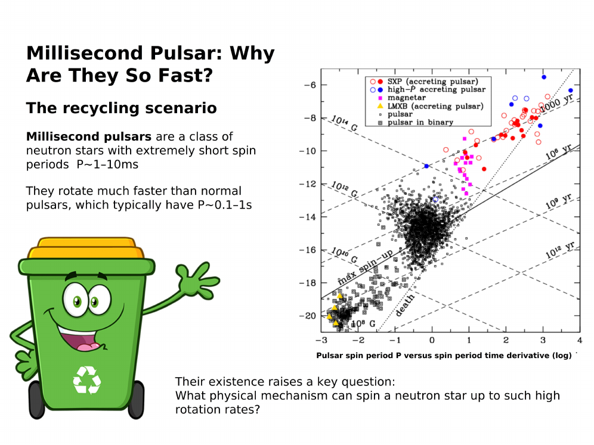
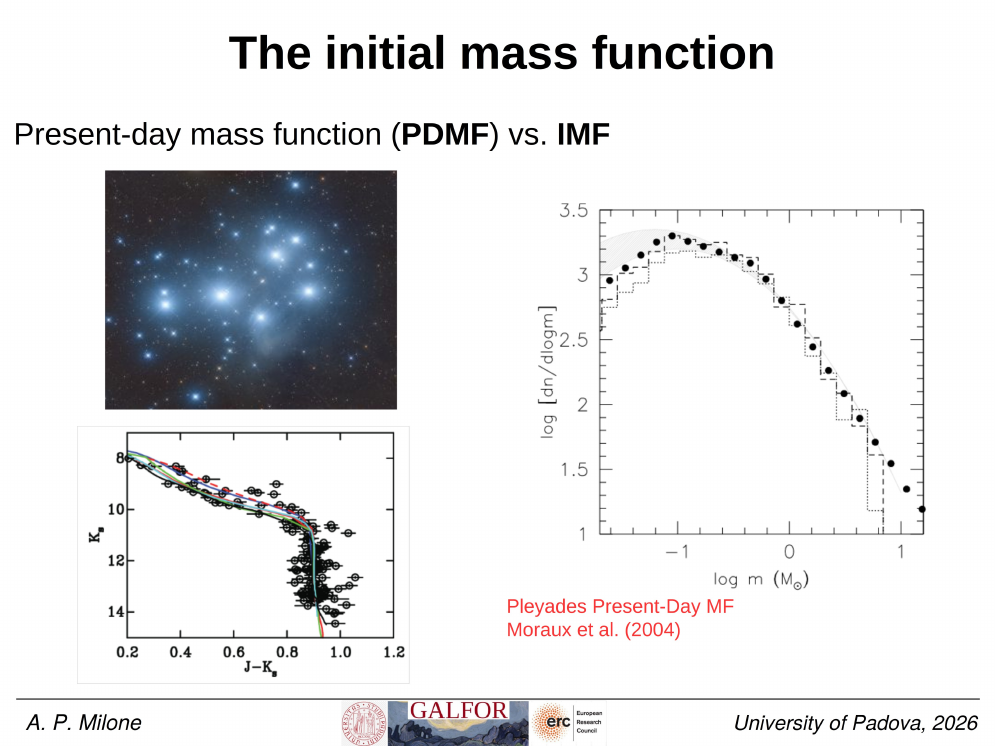
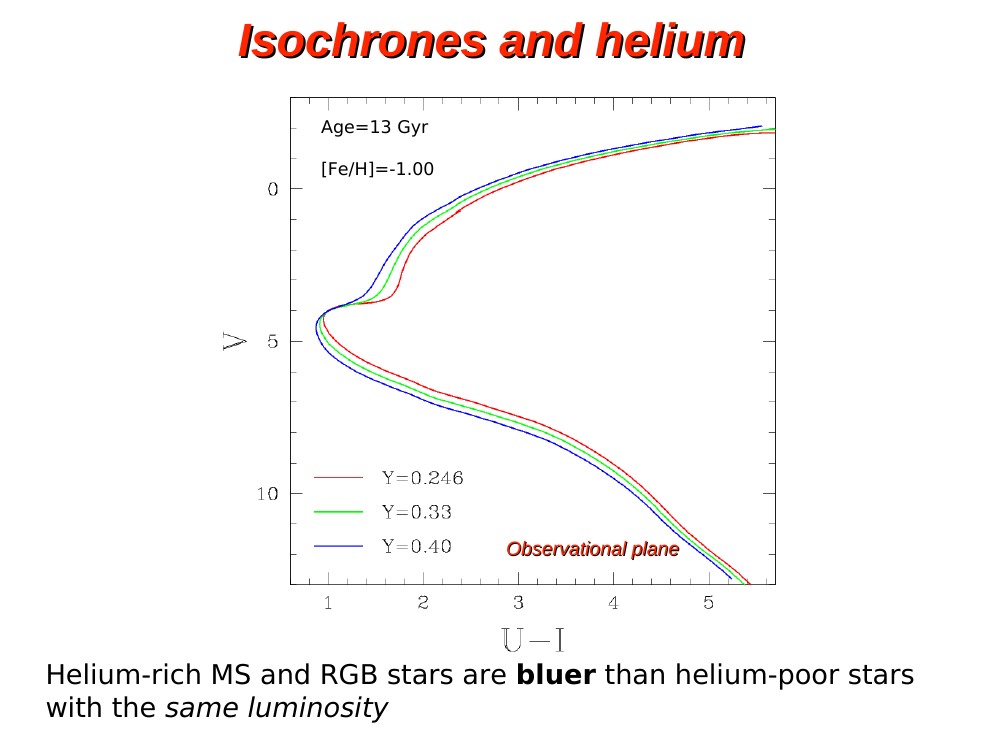
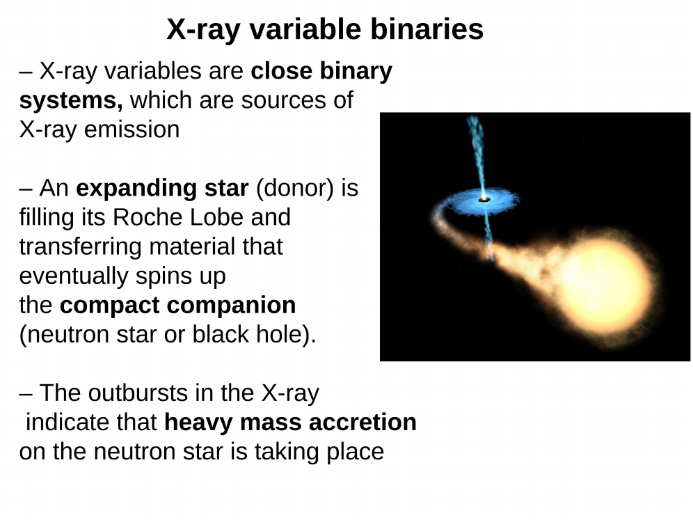

a [coeval cluster](Single%20stellar%20population%20SSP.html) should display, on its [CMD](Color-magnitude%20diagrams%20of%20clusters.html), a sharp Main sequence turnoff MSTO corresponding to the most massive star still on the Main sequence at the cluster age. yet in essentially every old cluster studied, a population of stars sits brighter and bluer than the MSTO, on the upward extrapolation of the MS. these are the **blue stragglers** (BSS).

allan sandage first identified them in 1953 in the globular cluster M3. he noted that the cluster CMD showed a handful of stars "straggling" above the turnoff, occupying positions that for a single-star population should require ages much younger than the cluster itself. for [Globular Clusters](Globular%20Clusters.html) with ages $\gtrsim 10\,\text{Gyr}$ and $M_{\text{TO}} \approx 0.8\,M_\odot$, the BSS appear to have masses $1.0\text{--}1.6\,M_\odot$, roughly twice the turnoff.

a single-star evolutionary track cannot put these stars there. once a star has used up its central hydrogen, it leaves the MS within a MS lifetime and cannot return. so BSS are not garden-variety MS stars; they are the result of mass gain during the cluster's life. this fits the simple picture: a higher-mass star burns hot hydrogen for longer (effectively), looking "rejuvenated" relative to its lower-mass siblings.

three observational properties define the population:

- they cluster on the upward extension of the MS, brighter and bluer than the MSTO,
- their numbers correlate with cluster total mass and central density,
- their radial distribution in many GCs is bimodal: peak in the centre, dip at intermediate radii, rise again in the outskirts (the "double-radial-distribution" first mapped by ferraro et al. 2012 in M3 and other GCs).

this bimodal distribution is interpreted as a Dynamical clock: the cluster's relaxation has segregated heavier BSS to the centre, with the dip filled in over time. the position of the dip in units of $r_h$ traces the cluster's dynamical age.

BSS are therefore unique probes:
- they trace [the binary population](Cluster%20binary%20fraction%20methods.html) (since most BSS form via binaries),
- they trace dynamical evolution of the cluster,
- they constrain the present-day [mass function](Stellar%20mass%20function.html) above the MSTO.

the formation channels (collisional vs binary mass transfer vs binary merger) are detailed in [Blue straggler formation channels](Blue%20straggler%20formation%20channels.html). observationally, BSS in low-density [Open clusters](Open%20clusters.html) favour binary channels, while dense [GC](Globular%20Clusters.html) cores show evidence of both, with collisional products distinguished by faster rotation and lower carbon/oxygen surface abundances (as found by ferraro et al. 2006 in 47 Tuc).

BSS connect to other exotic populations: their evolved descendants populate the [yellow straggler](Yellow%20stragglers%20and%20sub-subgiants.html) strip on the [subgiant/RGB](Red%20giant%20branch%20RGB.html), and their progenitor binaries are the same systems that produce [CVs](Cataclysmic%20variables%20in%20clusters.html) and [MSPs](Millisecond%20pulsars%20in%20GCs.html) in cluster cores.

historical note: sandage's 1953 paper was for years just an oddity; the BSS phenomenon was only taken seriously after subsequent CMDs of many GCs all showed the same feature. it is now one of the cleanest diagnostics of cluster dynamics we have.

## see also
- [Stellar_Astrophysics_MOC](../../04_Atlas/Stellar_Astrophysics_MOC.html)
- [Blue straggler formation channels](Blue%20straggler%20formation%20channels.html)
- [Color-magnitude diagrams of clusters](Color-magnitude%20diagrams%20of%20clusters.html)
- [Single stellar population SSP](Single%20stellar%20population%20SSP.html)
- [Yellow stragglers and sub-subgiants](Yellow%20stragglers%20and%20sub-subgiants.html)

---

## Complete Lecture Slide Panels & Observational Evidence (Lecture 12 — Blue Stragglers & Exotic Objects)

> **Context**: *Blue straggler stars (BSS), collisional vs mass-transfer binary formation channels, radial mass segregation, cataclysmic variables, millisecond pulsars, and LMXBs.*

The following slides from Prof. Antonino Milone's lecture series provide the direct observational, photometric, and theoretical foundations for this topic:

*Figure P12-01: LAntonino_p12_01.png — Observational data, CMD morphology, and diagnostics from Lecture 12 — Blue Stragglers & Exotic Objects.*

*Figure P12-02: LAntonino_p12_02.png — Observational data, CMD morphology, and diagnostics from Lecture 12 — Blue Stragglers & Exotic Objects.*

*Figure P12-03: LAntonino_p12_03.png — Observational data, CMD morphology, and diagnostics from Lecture 12 — Blue Stragglers & Exotic Objects.*

*Figure P12-04: LAntonino_p12_04.png — Observational data, CMD morphology, and diagnostics from Lecture 12 — Blue Stragglers & Exotic Objects.*

*Figure P12-05: LAntonino_p12_05.png — Observational data, CMD morphology, and diagnostics from Lecture 12 — Blue Stragglers & Exotic Objects.*

*Figure P12-06: LAntonino_p12_06.png — Observational data, CMD morphology, and diagnostics from Lecture 12 — Blue Stragglers & Exotic Objects.*

*Figure P12-07: LAntonino_p12_07.png — Observational data, CMD morphology, and diagnostics from Lecture 12 — Blue Stragglers & Exotic Objects.*

*Figure P12-08: LAntonino_p12_08.png — Observational data, CMD morphology, and diagnostics from Lecture 12 — Blue Stragglers & Exotic Objects.*

*Figure P12-09: LAntonino_p12_09.png — Observational data, CMD morphology, and diagnostics from Lecture 12 — Blue Stragglers & Exotic Objects.*

*Figure P12-10: LAntonino_p12_10.png — Observational data, CMD morphology, and diagnostics from Lecture 12 — Blue Stragglers & Exotic Objects.*

*Figure P12-11: LAntonino_p12_11.png — Observational data, CMD morphology, and diagnostics from Lecture 12 — Blue Stragglers & Exotic Objects.*

*Figure P12-12: LAntonino_p12_12.png — Observational data, CMD morphology, and diagnostics from Lecture 12 — Blue Stragglers & Exotic Objects.*

*Figure P12-13: LAntonino_p12_13.png — Observational data, CMD morphology, and diagnostics from Lecture 12 — Blue Stragglers & Exotic Objects.*

*Figure P12-14: LAntonino_p12_14.png — Observational data, CMD morphology, and diagnostics from Lecture 12 — Blue Stragglers & Exotic Objects.*

*Figure P12-15: LAntonino_p12_15.png — Observational data, CMD morphology, and diagnostics from Lecture 12 — Blue Stragglers & Exotic Objects.*

*Figure P12-16: LAntonino_p12_16.png — Observational data, CMD morphology, and diagnostics from Lecture 12 — Blue Stragglers & Exotic Objects.*

*Figure P12-17: LAntonino_p12_17.png — Observational data, CMD morphology, and diagnostics from Lecture 12 — Blue Stragglers & Exotic Objects.*

*Figure P12-18: LAntonino_p12_18.png — Observational data, CMD morphology, and diagnostics from Lecture 12 — Blue Stragglers & Exotic Objects.*

*Figure P12-19: LAntonino_p12_19.png — Observational data, CMD morphology, and diagnostics from Lecture 12 — Blue Stragglers & Exotic Objects.*

*Figure P12-20: LAntonino_p12_20.png — Observational data, CMD morphology, and diagnostics from Lecture 12 — Blue Stragglers & Exotic Objects.*

*Figure P12-21: LAntonino_p12_21.png — Observational data, CMD morphology, and diagnostics from Lecture 12 — Blue Stragglers & Exotic Objects.*

*Figure P12-22: LAntonino_p12_22.png — Observational data, CMD morphology, and diagnostics from Lecture 12 — Blue Stragglers & Exotic Objects.*

*Figure P12-23: LAntonino_p12_23.png — Observational data, CMD morphology, and diagnostics from Lecture 12 — Blue Stragglers & Exotic Objects.*

*Figure P12-24: LAntonino_p12_24.png — Observational data, CMD morphology, and diagnostics from Lecture 12 — Blue Stragglers & Exotic Objects.*

*Figure P12-25: LAntonino_p12_25.png — Observational data, CMD morphology, and diagnostics from Lecture 12 — Blue Stragglers & Exotic Objects.*

*Figure P12-26: Lecture12_p15-15.png — Observational data, CMD morphology, and diagnostics from Lecture 12 — Blue Stragglers & Exotic Objects.*

*Figure P12-27: Lecture12_p25-25.png — Observational data, CMD morphology, and diagnostics from Lecture 12 — Blue Stragglers & Exotic Objects.*

*Figure P12-28: Lecture12_p35-35.png — Observational data, CMD morphology, and diagnostics from Lecture 12 — Blue Stragglers & Exotic Objects.*

*Figure P12-29: Lecture12_p5-05.png — Observational data, CMD morphology, and diagnostics from Lecture 12 — Blue Stragglers & Exotic Objects.*

  <h4 class="backlinks-title">Linked References (6)</h4>
  <ul class="backlinks-list">
    <li class="backlink-item-wrap"><a href="Blue%20straggler%20formation%20channels.html" class="backlink-item">Blue straggler formation channels</a></li>
    <li class="backlink-item-wrap"><a href="Cataclysmic%20variables%20in%20clusters.html" class="backlink-item">Cataclysmic variables in clusters</a></li>
    <li class="backlink-item-wrap"><a href="Cluster%20binary%20fraction%20methods.html" class="backlink-item">Cluster binary fraction methods</a></li>
    <li class="backlink-item-wrap"><a href="Initial%20vs%20present-day%20mass%20function.html" class="backlink-item">Initial vs present-day mass function</a></li>
    <li class="backlink-item-wrap"><a href="Yellow%20stragglers%20and%20sub-subgiants.html" class="backlink-item">Yellow stragglers and sub-subgiants</a></li>
    <li class="backlink-item-wrap"><a href="../../04_Atlas/Stellar_Astrophysics_MOC.html" class="backlink-item">Stellar_Astrophysics_MOC</a></li>
  </ul>

