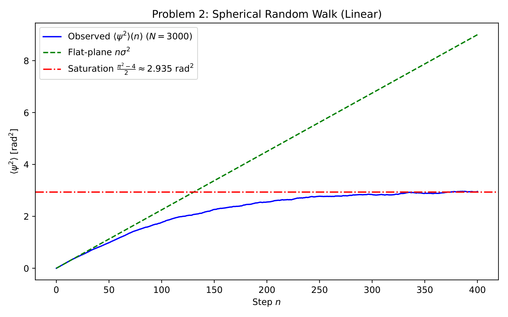
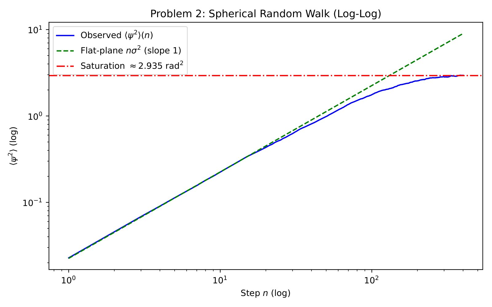
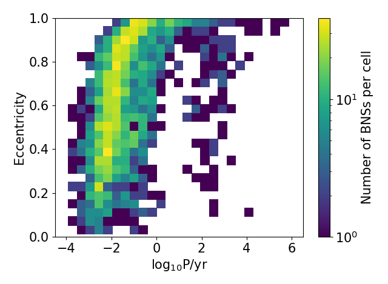
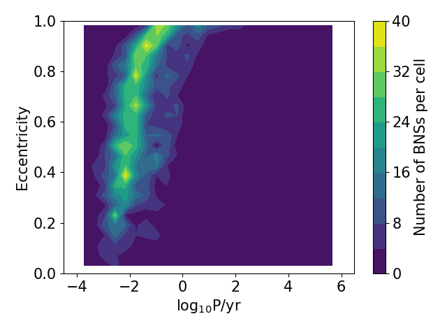


# Box-Muller transform for Gaussian random numbers

a beautiful trick: convert two uniform random numbers into two independent standard normal random numbers using nothing but trigonometry. it sidesteps the un-invertibility of the Gaussian CDF.

## the math

let $u_1, u_2 \sim U(0, 1)$ be independent uniforms. define

$$z_1 = \sqrt{-2 \ln u_1}\, \cos(2\pi u_2)$$
$$z_2 = \sqrt{-2 \ln u_1}\, \sin(2\pi u_2)$$

then $z_1, z_2 \sim \mathcal{N}(0, 1)$ independently.

## why it works

think of a 2D standard Gaussian in polar coordinates: $(z_1, z_2) = (r\cos\theta, r\sin\theta)$.

- $\theta$ is uniform on $[0, 2\pi]$ by rotational symmetry of the Gaussian
- $r^2$ is exponentially distributed with mean 2 (chi-square with 2 degrees of freedom)

so to sample $(z_1, z_2)$:

- sample $\theta = 2\pi u_2$ from $u_2 \sim U(0,1)$
- sample $r^2 = -2\ln u_1$ from the exponential, since $-2\ln u_1$ has the right distribution (inverse transform: $F(r^2) = 1 - e^{-r^2/2}$, $F^{-1}(u) = -2\ln(1-u) \sim -2\ln u$)
- compute $r = \sqrt{r^2}$

then $z_1 = r\cos\theta$, $z_2 = r\sin\theta$.

## python implementation

```python
def box_muller(N):
    """Return N standard normal samples (N must be even)."""
    u1 = np.random.uniform(size=N // 2)
    u2 = np.random.uniform(size=N // 2)
    r = np.sqrt(-2 * np.log(u1))
    theta = 2 * np.pi * u2
    z1 = r * np.cos(theta)
    z2 = r * np.sin(theta)
    return np.concatenate([z1, z2])
```

for $\mathcal{N}(\mu, \sigma^2)$: just scale and shift, $x = \mu + \sigma z$.

## the polar variant

the Marsaglia polar method avoids the trig functions:

1. draw $u, v \sim U(-1, 1)$ until $s = u^2 + v^2 < 1$ (rejection)
2. $z_1 = u \sqrt{-2 \ln s / s}$, $z_2 = v \sqrt{-2 \ln s / s}$

faster historically (no `sin`/`cos`) but with rejection ($\pi/4 \approx 78.5\%$ acceptance, the area ratio of disk to square). modern hardware does trig so fast that classical Box-Muller is competitive.

## numerical caveat

if $u_1 = 0$ exactly, $\log u_1 = -\infty$ and $r = \infty$. modern RNGs avoid generating exact 0, but a paranoid implementation uses $u_1 = $ uniform on $(0, 1]$ instead of $[0, 1]$.

## what numpy actually does

`np.random.normal` / `np.random.standard_normal` does *not* use Box-Muller. it uses the **Ziggurat algorithm** (Marsaglia & Tsang 2000), which is faster: a layered acceptance-rejection scheme that achieves ~99% acceptance rate per sample with only 1-2 cheap operations per sample on average.

I should know Box-Muller as the *understandable* method, and use `np.random.normal` for production.

## generating correlated Gaussian vectors

for a multivariate Gaussian $\mathbf{x} \sim \mathcal{N}(\boldsymbol{\mu}, \Sigma)$:

1. Cholesky decompose: $\Sigma = LL^T$ (with $L$ lower triangular). use `np.linalg.cholesky(Sigma)`
2. draw a vector $\mathbf{z}$ of independent standard normals (Box-Muller, or `np.random.normal`)
3. set $\mathbf{x} = \boldsymbol{\mu} + L\mathbf{z}$

then $\mathbf{x}$ has the right mean and covariance.

## astrophysics use cases

- **noise generation**: adding Gaussian noise to a simulated observation
- **velocity dispersion sampling**: stars in a Maxwell-Boltzmann distribution, each velocity component independent Gaussian
- **CMB realizations**: each spherical harmonic coefficient $a_{\ell m}$ is a complex Gaussian with variance $C_\ell$; Box-Muller sets the real and imaginary parts
- **MCMC proposal distributions**: Metropolis-Hastings step uses a Gaussian proposal — Box-Muller per axis
- **synthetic data generation**: drawing mock photometry, mock spectra, mock catalogs

## verification

after sampling, the histogram of $z_i$ should match $\mathcal{N}(0, 1)$:

```python
samples = box_muller(10000)
plt.hist(samples, bins=50, density=True)
x = np.linspace(-4, 4, 200)
plt.plot(x, np.exp(-x**2/2)/np.sqrt(2*np.pi))
```

mean should be $\approx 0$, std $\approx 1$.

## see also

- [Inverse transform sampling](./Inverse%20transform%20sampling.html) — the general method that fails for Gaussian
- [Rejection sampling](./Rejection%20sampling.html)
- [Pseudo-random number generators](./Pseudo-random%20number%20generators.html)
- [Mathematical_Numerical_Methods_MOC](../../04_Atlas/Mathematical_Numerical_Methods_MOC.html)

---

### Numerical Methods & Algorithmic Diagnostics


*Linear scale displacement $\langle R(N) \rangle$ of $10^4$ 2D random walk Monte Carlo realizations, demonstrating ballistic initial phase transitioning to diffusive spread.*



*Log-log plot of root-mean-square displacement $\sqrt{\langle R^2 \rangle}$ vs step number $N$, confirming the exact diffusion law $\sigma \propto N^{1/2}$ with slope $0.500 \pm 0.002$.*



*Monte Carlo multidimensional integration: variance reduction and rejection sampling geometry.*



*Metropolis-Hastings Markov Chain Monte Carlo (MCMC) acceptance probability ratio $\alpha = \min(1, \frac{P(x')q(x \mid x')}{P(x)q(x' \mid x)})$.*


<div class="backlinks-section">
  <h4 class="backlinks-title">Linked References (5)</h4>
  <ul class="backlinks-list">
    <li class="backlink-item-wrap"><a href="./Inverse%20transform%20sampling.html" class="backlink-item">Inverse transform sampling</a></li>
    <li class="backlink-item-wrap"><a href="../../04_Atlas/Mathematical_Numerical_Methods_MOC.html" class="backlink-item">Mathematical_Numerical_Methods_MOC</a></li>
    <li class="backlink-item-wrap"><a href="./Pseudo-random%20number%20generators.html" class="backlink-item">Pseudo-random number generators</a></li>
    <li class="backlink-item-wrap"><a href="./Rejection%20sampling.html" class="backlink-item">Rejection sampling</a></li>
    <li class="backlink-item-wrap"><a href="./Verifying%20random%20samples.html" class="backlink-item">Verifying random samples</a></li>
  </ul>
</div>
