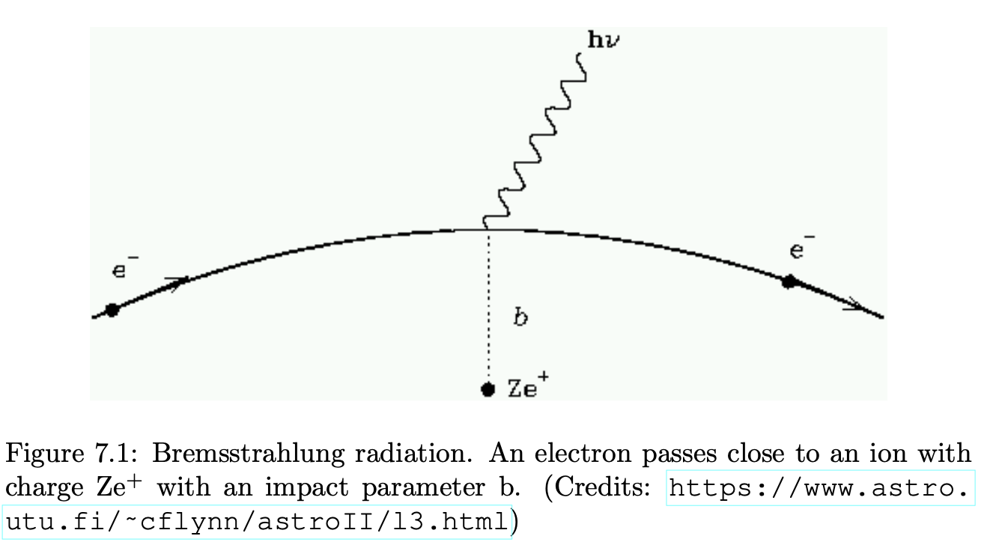


When a free charge (in general an electron) passes nearby an ion,
	the electron changes velocity (magnitude and direction)
		losing kinetic energy that is converted into radiation
			this is called **Bremsstrahlung** (= braking radiation) or **free-free radiation**

---
## Thermal Bremsstrahlung

If the electron moves within an **electric field** we have **thermal Bremsstrahlung**
	it is called thermal because the electron temperature changes
		but it is not a thermal process because it consists of an
			interaction (collision) between particles with different masses

If the electron moves within a **magnetic field** we have
	**cyclotron** or **synchrotron radiation**
		depending on whether the particle is non-relativistic or relativistic

---

## Power formula

The power per unit volume and unit frequency of the thermal Bremsstrahlung
	in the **non-relativistic case** is:
$$P_{br}(\nu) = 6.8 \times 10^{-38}~Z_i^2~n_e~n_i~\sqrt{T_e}~e^{-\frac{h\nu}{k_B T_e}}~f_G$$

where
	$Z_i$ is the atomic number
	$n_e$ and $n_i$ are the electron and ion density
	$T_e$ is the electron temperature
	the exponential factor comes from the **Maxwell-Boltzmann distribution**
	$f_G$ is the **Gaunt factor**
	units are $\text{erg s}^{-1}~\text{cm}^{-3}~\text{Hz}^{-1}$

In case of **relativistic electrons**, the power is:
$$P_{Br,rel}(\nu) = \rho(\nu)\left(1 + \frac{T_e}{2.3 \times 10^9~\text{K}}\right)$$

where the temperature at the denominator corresponds to an energy of about $200~\text{keV}$

---

## Key features

The spectrum has an **exponential cutoff** at $h\nu \sim k_B T_e$
	below the cutoff the spectrum is approximately flat
		above it the emission drops exponentially

As temperature increases,
	we move from the non-relativistic to the relativistic case
		and we can detect Bremsstrahlung at **high energies**

Bremsstrahlung can be detected in visible, near-infrared, and ultraviolet
	and in X-rays we can detect **free-free emission from a plasma**
		for example in **clusters of galaxies**


  <h4 class="backlinks-title">Linked References (13)</h4>
  <ul class="backlinks-list">
    <li class="backlink-item-wrap"><a href="../../04_Atlas/Astronomical_Spectroscopy_MOC.html" class="backlink-item">Astronomical_Spectroscopy_MOC</a></li>
    <li class="backlink-item-wrap"><a href="./Balmer%20continuum.html" class="backlink-item">Balmer continuum</a></li>
    <li class="backlink-item-wrap"><a href="./Collisional%20ionisation%20rate.html" class="backlink-item">Collisional ionisation rate</a></li>
    <li class="backlink-item-wrap"><a href="./Continuum%20opacity%20sources.html" class="backlink-item">Continuum opacity sources</a></li>
    <li class="backlink-item-wrap"><a href="./Cooling%20curve.html" class="backlink-item">Cooling curve</a></li>
    <li class="backlink-item-wrap"><a href="./Cooling%20rate%20in%20HII%20regions.html" class="backlink-item">Cooling rate in HII regions</a></li>
    <li class="backlink-item-wrap"><a href="./Free-free%20continuum.html" class="backlink-item">Free-free continuum</a></li>
    <li class="backlink-item-wrap"><a href="./Galaxy%20clusters%20and%20overview%20of%20evolution.html" class="backlink-item">Galaxy clusters and overview of evolution</a></li>
    <li class="backlink-item-wrap"><a href="../../04_Atlas/Lab_High-Energy_MOC.html" class="backlink-item">Lab_High-Energy_MOC</a></li>
    <li class="backlink-item-wrap"><a href="./Radiative%20Processes.html" class="backlink-item">Radiative Processes</a></li>
    <li class="backlink-item-wrap"><a href="./Recombination%20continuum.html" class="backlink-item">Recombination continuum</a></li>
    <li class="backlink-item-wrap"><a href="./Supernova%20remnant%20spectroscopy.html" class="backlink-item">Supernova remnant spectroscopy</a></li>
    <li class="backlink-item-wrap"><a href="./Synchrotron%20continuum.html" class="backlink-item">Synchrotron continuum</a></li>
  </ul>

