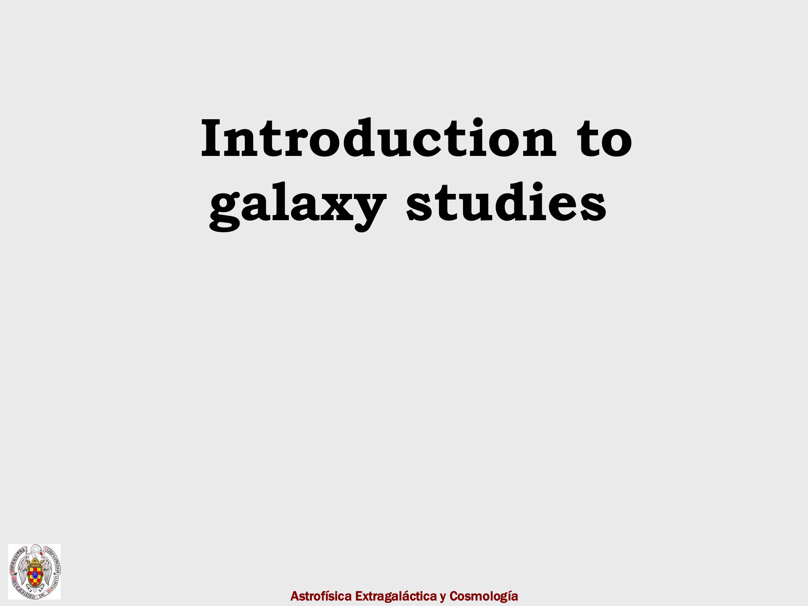
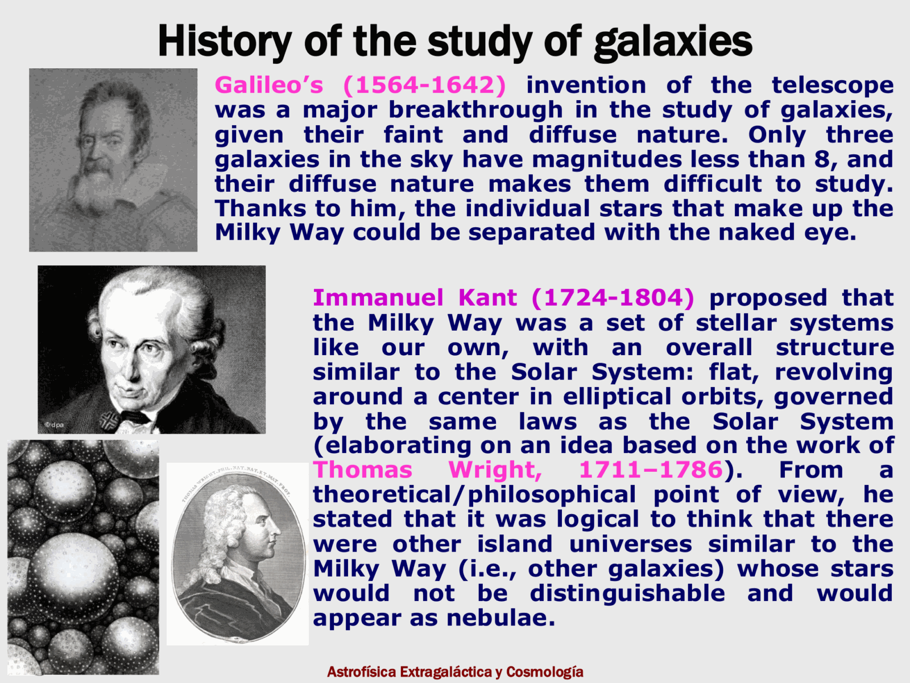
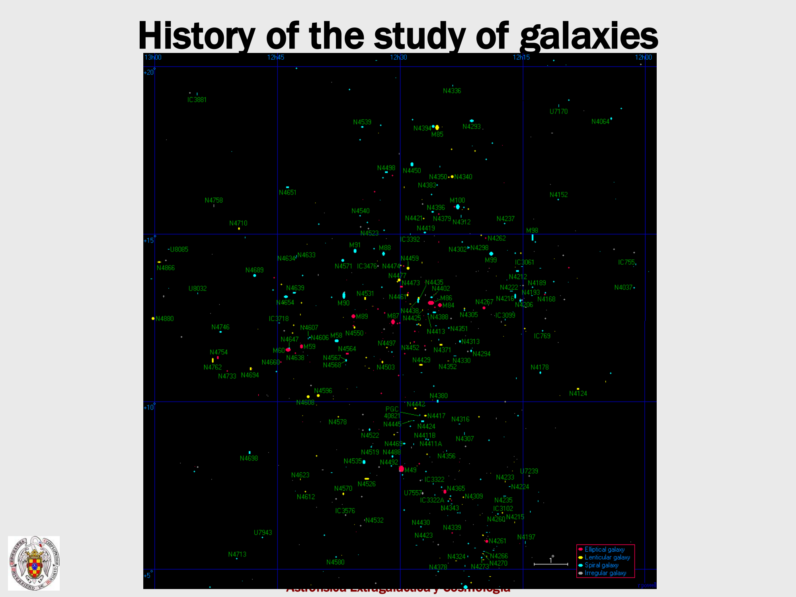
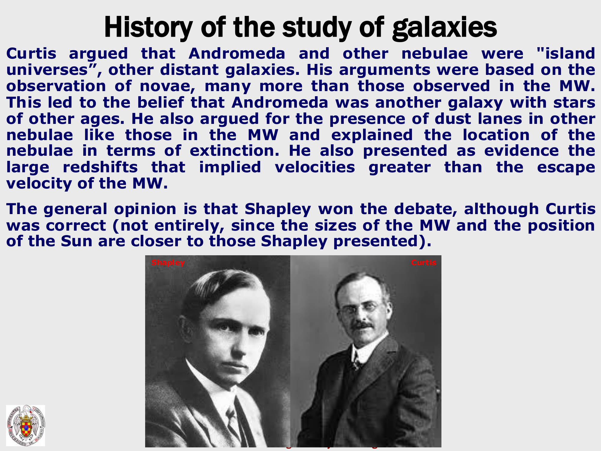


a single image, the thermal history of the universe from the quantum gravity wall down to today, drawn as a redshift cone:

---

## reading the cone, today to early times

| epoch | temperature / energy | redshift | age | what happens |
|---|---|---|---|---|
| **today** | $T_0 = 2.725$ K | $z = 0$ | 13.8 Gyr | dark energy dominates, life on Earth |
| **acceleration** | $\sim 10^{-3}$ eV | $z \sim 0.7$ | $\sim 11$ Gyr ago | $\Lambda$ takes over, $\ddot a > 0$ |
| **galaxy formation era** | meV | $z \sim$ a few | $\sim 3$ Gyr | star formation peaks |
| **earliest visible galaxies** | meV | $z \sim 10$ | 700 Myr | reionization (see [Reionization](./Reionization.html)) |
| **recombination** | $T \sim 0.25$ eV | $z_{\rm rec} \sim 1100$ | $\sim 4 \times 10^5$ yr | atoms form, CMB decouples |
| **matter domination** | $T \sim 0.7$ eV | $z_{\rm eq} \sim 3300$ | $\sim 5000$ yr | $\rho_m = \rho_\gamma$, gravitational collapse begins on small scales |
| **nucleosynthesis** | $T \sim 0.1\text{–}1$ MeV | — | 3 minutes | light elements created (see [BBN_overview](./BBN_overview.html)) |
| **quark-hadron transition** | $T \sim 1$ GeV | — | 1 μs | protons and neutrons form |
| **electroweak transition** | $T \sim 100$ GeV | — | 0.01 ns | EM and weak forces differentiate, supersymmetry breaking?, dark matter production? |
| **grand unification transition** | $T \sim 10^{16}$ GeV | — | $10^{-35}$ s | EM-weak and strong differentiate, baryogenesis? |
| **inflation** | $T \gtrsim 10^{16}$ GeV | — | $10^{-35}$ s | exponential expansion, quantum fluctuations stretched |
| **quantum gravity wall** | $T \sim 10^{19}$ GeV | — | $10^{-43}$ s | spacetime description breaks down |

at $T > 10^{19}$ GeV (Planck energy) we cannot describe spacetime classically. above that lies the realm of quantum gravity, beyond the reach of any current theory.

---

## three regimes

energy densities scale as $\rho_m \propto a^{-3}$, $\rho_\gamma \propto a^{-4}$, $\rho_\Lambda = $ const. so the universe goes through three distinct dynamical phases:

- **radiation-dominated** ($z \gtrsim 3300$): $a(t) \propto t^{1/2}$, photons and relativistic neutrinos rule
- **matter-dominated** ($0.7 \lesssim z \lesssim 3300$): $a(t) \propto t^{2/3}$, structures grow gravitationally
- **Λ-dominated** ($z \lesssim 0.7$): $a(t) \propto e^{Ht}$, accelerated expansion

the matter-radiation equality scale is what determines the turnover of the matter power spectrum (see [Matter power spectrum and BAO](./Matter%20power%20spectrum%20and%20BAO.html)).

---

## the central observable epochs

three observational windows pierce this timeline:

1. **CMB** ($z \sim 1100$, recombination/decoupling) — see [Cosmic_inventory_photons](./Cosmic_inventory_photons.html)
2. **BBN** ($T \sim 0.1\text{–}1$ MeV, three minutes) — see [BBN_overview](./BBN_overview.html)
3. **galaxy surveys** ($z \lesssim 10$) — see [Observational_Cosmology_MOC](../../04_Atlas/Observational_Cosmology_MOC.html)

between BBN and the CMB there is a "blind" epoch I cannot probe directly with photons — the universe is opaque before recombination. but I can read it indirectly through CMB anisotropies, BBN abundances, and the structure of the matter power spectrum at late times.

---

## what we want to learn from this picture

the slide says it well:
> we seek information about very early times and very high energies, $E$ up to $10^{16}$ GeV.

at energies above what any accelerator can reach, the early universe is the only laboratory we have. observational cosmology is high-energy physics on a different scale — we measure $\Omega_b h^2$ at the per-mille level from CMB peaks, then read it back into nuclear cross sections at $T \sim 0.1$ MeV. the universe is a precision instrument.

---

## see also

- [Fundamentals_Astrophysics_Cosmology_MOC](../../04_Atlas/Fundamentals_Astrophysics_Cosmology_MOC.html)
- [Cosmic_inventory_overview](./Cosmic_inventory_overview.html)
- [BBN_overview](./BBN_overview.html)
- [Saha equation and recombination](./Saha%20equation%20and%20recombination.html)
- [Inflation overview](./Inflation%20overview.html)
- [Baumann_reference](./Baumann_reference.html) — chapter 3.1.3 walks through this same picture rigorously

---

### Observational Cosmology Data Panels & Visual Evidence

*Cosmic timeline: Planck era, inflation, electroweak transition, QCD phase transition, BBN, recombination, and dark energy acceleration.*

*Particle decoupling: interaction rate $\Gamma = n\sigma v$ vs expansion rate $H(t)$, Freeze-out criterion $\Gamma \sim H$.*

*Relic abundance of weakly interacting massive particles (WIMPs) as cold dark matter candidates.*

*Big Bang Nucleosynthesis (BBN): neutron-proton ratio freeze-out $(n/p) \approx e^{-\Delta m/T_f} \approx 1/6$, yielding primordial $^4{\rm He}$ mass fraction $Y_p \approx 0.245$.*


  <h4 class="backlinks-title">Linked References (32)</h4>
  <ul class="backlinks-list">
    <li class="backlink-item-wrap"><a href="./BBN_overview.html" class="backlink-item">BBN_overview</a></li>
    <li class="backlink-item-wrap"><a href="./Baryogenesis.html" class="backlink-item">Baryogenesis</a></li>
    <li class="backlink-item-wrap"><a href="./Big%20Bang%20nucleosynthesis.html" class="backlink-item">Big Bang nucleosynthesis</a></li>
    <li class="backlink-item-wrap"><a href="./CMB%20-%20discovery%20and%20blackbody%20spectrum.html" class="backlink-item">CMB - discovery and blackbody spectrum</a></li>
    <li class="backlink-item-wrap"><a href="./CMB%20Spectral%20Distortions%20-%20What%20They%20Are%20and%20Where%20They%20Come%20From.html" class="backlink-item">CMB Spectral Distortions - What They Are and Where They Come From</a></li>
    <li class="backlink-item-wrap"><a href="./Conservation%20of%20entropy%20in%20a%20comoving%20volume.html" class="backlink-item">Conservation of entropy in a comoving volume</a></li>
    <li class="backlink-item-wrap"><a href="./Cosmic%20eras.html" class="backlink-item">Cosmic eras</a></li>
    <li class="backlink-item-wrap"><a href="./Cosmic%20look-back%20time.html" class="backlink-item">Cosmic look-back time</a></li>
    <li class="backlink-item-wrap"><a href="./Cosmic_inventory_overview.html" class="backlink-item">Cosmic_inventory_overview</a></li>
    <li class="backlink-item-wrap"><a href="./Cosmic_inventory_photons.html" class="backlink-item">Cosmic_inventory_photons</a></li>
    <li class="backlink-item-wrap"><a href="./Cosmic_inventory_photons_derivation.html" class="backlink-item">Cosmic_inventory_photons_derivation</a></li>
    <li class="backlink-item-wrap"><a href="./Cosmological%20inflation.html" class="backlink-item">Cosmological inflation</a></li>
    <li class="backlink-item-wrap"><a href="./Decoupling.html" class="backlink-item">Decoupling</a></li>
    <li class="backlink-item-wrap"><a href="./Friedmann%20models.html" class="backlink-item">Friedmann models</a></li>
    <li class="backlink-item-wrap"><a href="../../04_Atlas/Fundamentals_Astrophysics_Cosmology_MOC.html" class="backlink-item">Fundamentals_Astrophysics_Cosmology_MOC</a></li>
    <li class="backlink-item-wrap"><a href="./Inflation%20overview.html" class="backlink-item">Inflation overview</a></li>
    <li class="backlink-item-wrap"><a href="./LambdaCDM%20current%20parameters.html" class="backlink-item">LambdaCDM current parameters</a></li>
    <li class="backlink-item-wrap"><a href="./Matter%20radiation%20equality.html" class="backlink-item">Matter radiation equality</a></li>
    <li class="backlink-item-wrap"><a href="./Number%20density%20and%20energy%20density%20at%20thermal%20equilibrium.html" class="backlink-item">Number density and energy density at thermal equilibrium</a></li>
    <li class="backlink-item-wrap"><a href="../../04_Atlas/Observational_Cosmology_MOC.html" class="backlink-item">Observational_Cosmology_MOC</a></li>
    <li class="backlink-item-wrap"><a href="interf/Phase%20transitions.html" class="backlink-item">Phase transitions</a></li>
    <li class="backlink-item-wrap"><a href="./Phase%20transitions.html" class="backlink-item">Phase transitions</a></li>
    <li class="backlink-item-wrap"><a href="./Photon%20decoupling%20and%20CMB.html" class="backlink-item">Photon decoupling and CMB</a></li>
    <li class="backlink-item-wrap"><a href="./Recombination.html" class="backlink-item">Recombination</a></li>
    <li class="backlink-item-wrap"><a href="./Reionization.html" class="backlink-item">Reionization</a></li>
    <li class="backlink-item-wrap"><a href="./Saha%20equation%20and%20recombination.html" class="backlink-item">Saha equation and recombination</a></li>
    <li class="backlink-item-wrap"><a href="./Standard%20model%20problems.html" class="backlink-item">Standard model problems</a></li>
    <li class="backlink-item-wrap"><a href="./Temperature-time%20relation.html" class="backlink-item">Temperature-time relation</a></li>
    <li class="backlink-item-wrap"><a href="./Thermal%20equilibrium%20in%20the%20early%20universe.html" class="backlink-item">Thermal equilibrium in the early universe</a></li>
    <li class="backlink-item-wrap"><a href="./Transition%20epochs.html" class="backlink-item">Transition epochs</a></li>
    <li class="backlink-item-wrap"><a href="./Various%20models%20of%20the%20universe.html" class="backlink-item">Various models of the universe</a></li>
    <li class="backlink-item-wrap"><a href="./%CE%9BCDM%20current%20parameters.html" class="backlink-item">ΛCDM current parameters</a></li>
  </ul>

