
# bullet cluster and dark matter mapping

up: [Astrophysics_of_Galaxies_MOC](../../04_Atlas/Astrophysics_of_Galaxies_MOC.html) · [Strong vs weak lensing](./Strong%20vs%20weak%20lensing.html) · [Dark matter on galactic scales](./Dark%20matter%20on%20galactic%20scales.html)

## the physical system

The Bullet Cluster (1E 0657-56, $z = 0.296$) consists of two colliding galaxy clusters observed $\sim 100$ Myr after supersonic collision ($v_{\rm collision} \approx 4500$ km/s) in the plane of the sky.

## the three matter components

1. **optical galaxies** (Hubble / Magellan):
   - Collisionless stellar systems.
   - Cross-section for direct physical collisions between stars is virtually zero.
   - Galaxies passed straight through each other unhindered.
2. **x-ray intracluster gas** (Chandra):
   - Collisional plasma ($T \sim 10^8$ K).
   - Suffered hydrodynamical ram pressure and drag, producing a clear bow shock.
   - Decelerated and lagged behind the galaxies, remaining in the center.
   - Contains $\sim 80\%$ of the baryonic mass of the system.
3. **total gravitational mass** (weak and strong gravitational lensing):
   - Reconstructed using surface shear $\gamma(\theta)$ of background galaxies (Clowe et al. 2006, Bradač et al. 2006).
   - The reconstructed gravitational potential peaks are centered **directly on the collisionless galaxies**, completely separated from the baryonic gas peaks at $> 8\sigma$ statistical significance.

## why this rules out simple mond

In modified gravity theories without dark matter (e.g., standard MOND), the gravitational force field must trace the dominant baryonic mass distribution. In 1E 0657-56, the dominant baryons reside in the X-ray gas, yet the gravitational potential wells sit on the almost massless galaxy populations.

This spatial dissociation provides direct, empirical proof that the majority of matter in galaxy clusters is non-baryonic, collisionless dark matter.

## connections

- lensing technique: [Strong vs weak lensing](./Strong%20vs%20weak%20lensing.html), [Lensing as a cosmological probe](./Lensing%20as%20a%20cosmological%20probe.html)
- alternative theories: [Modified gravity alternatives](./Modified%20gravity%20alternatives.html)
- cluster context: [Coma cluster](./Coma%20cluster.html)

---

## astrophysics of galaxies figures and slides (Prof. Alessandro Pizzella)

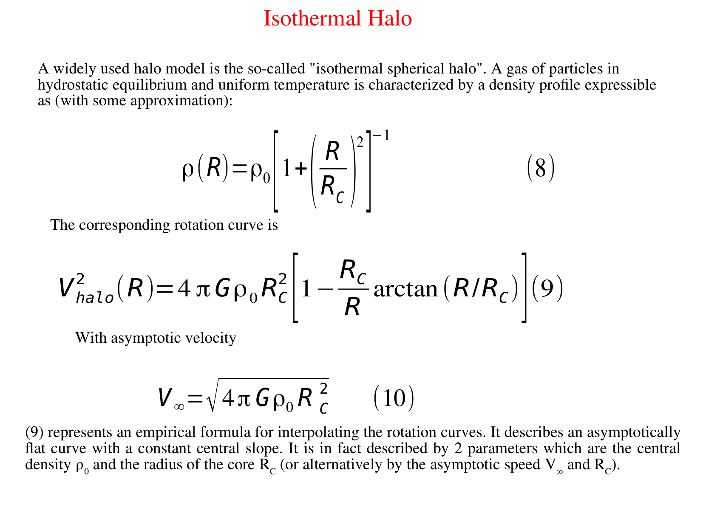
*1E 0657-56 (The Bullet Cluster): direct empirical evidence for collisionless dark matter (Clowe et al. 2006).*

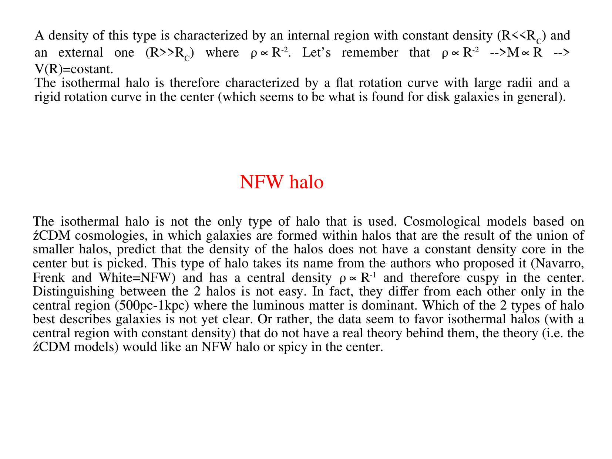
*Spatial separation of X-ray emitting collisional baryonic plasma (Chandra) from gravitational lensing mass peaks (Hubble/Magellan).*

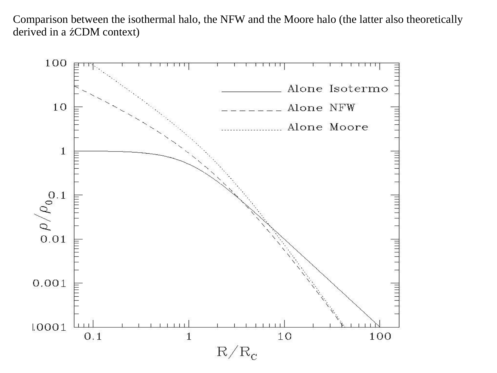
*Severe challenge to Modified Newtonian Dynamics (MOND) and pure baryonic gravity theories.*

---

## lecture slides and reference figures (Prof. Alessandro Pizzella)

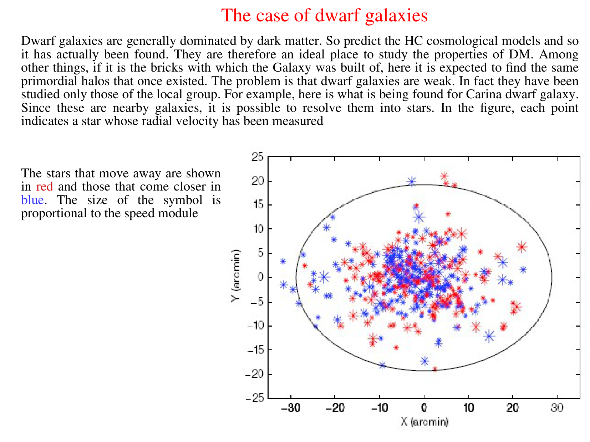

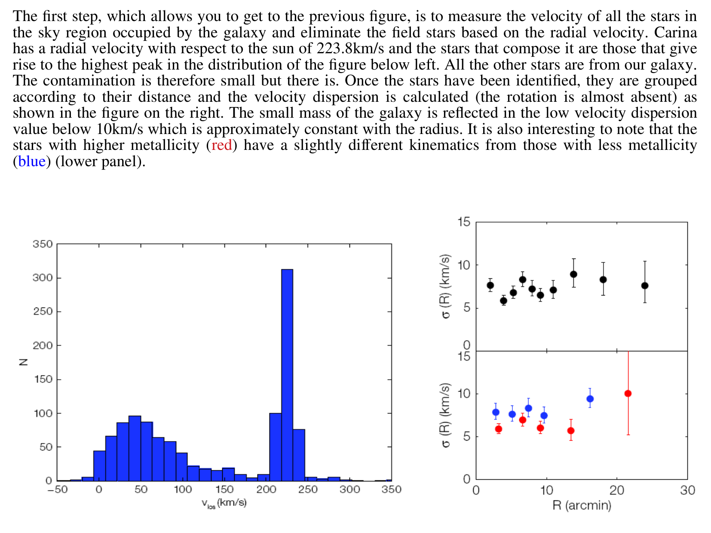

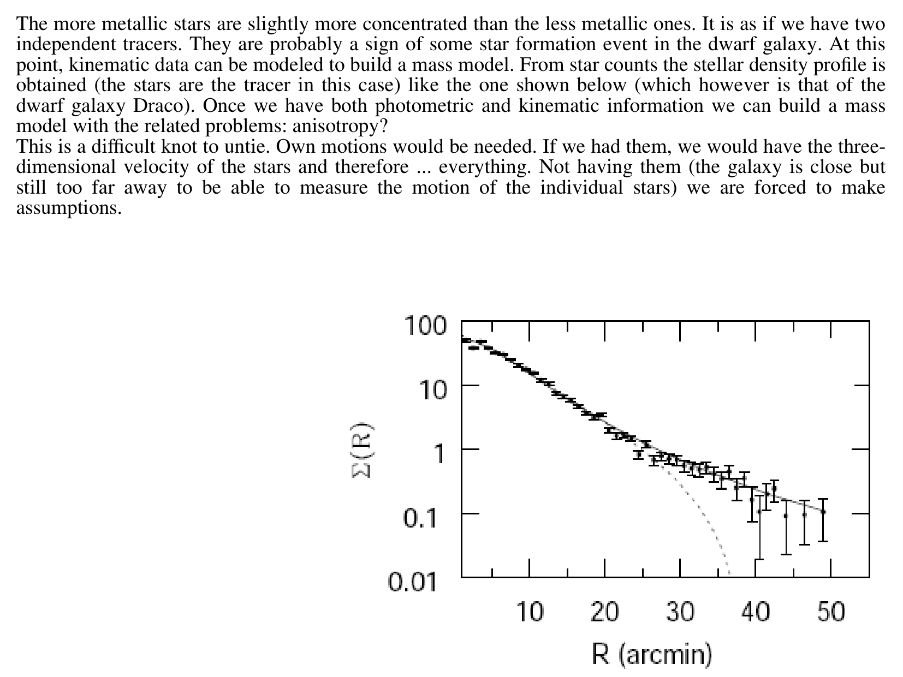

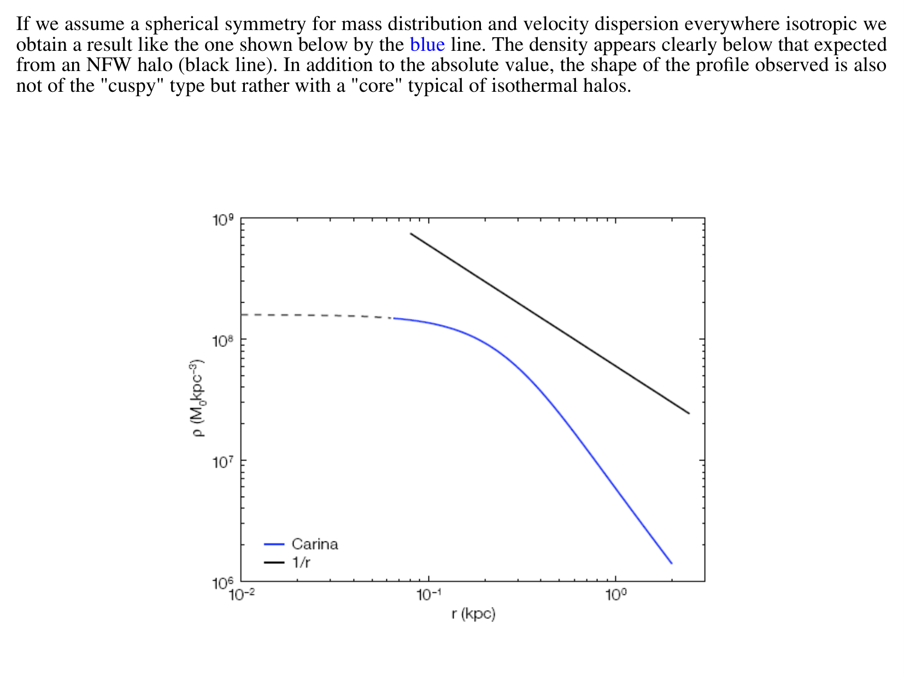

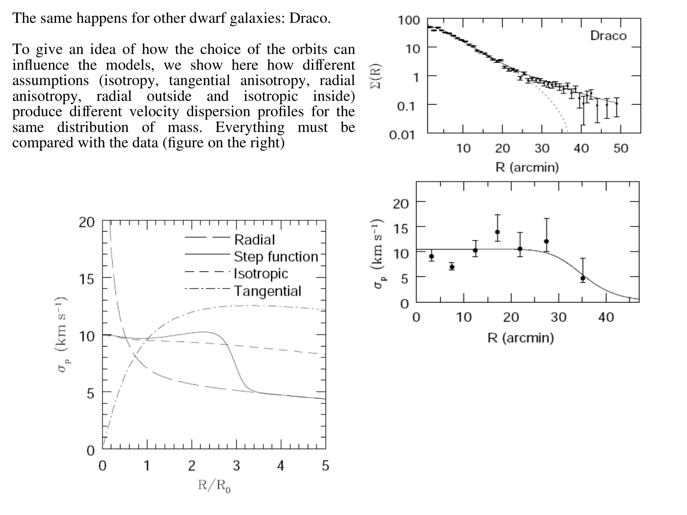

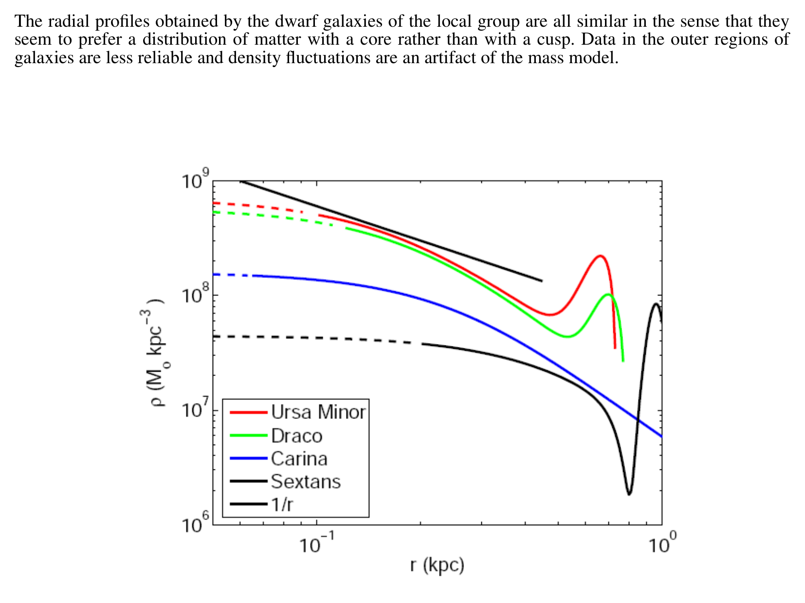

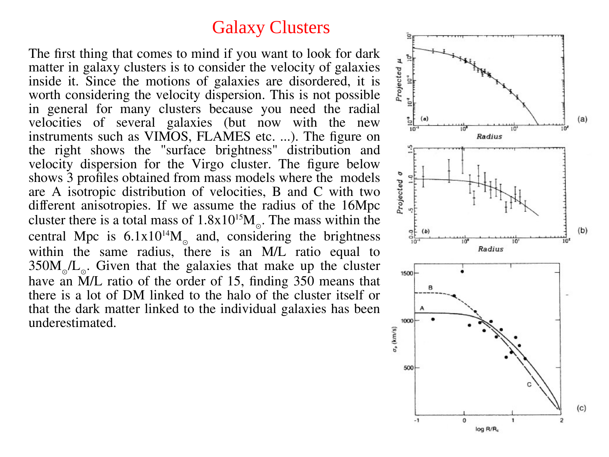

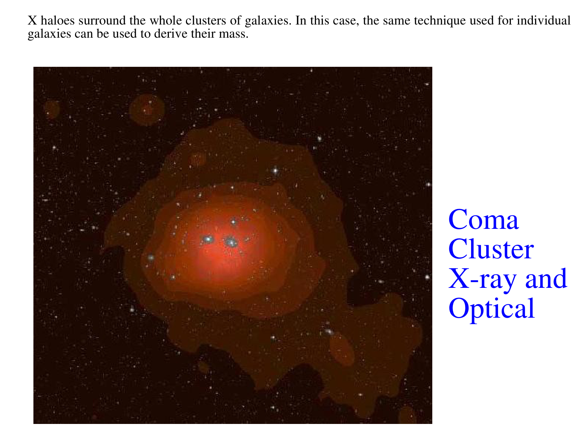

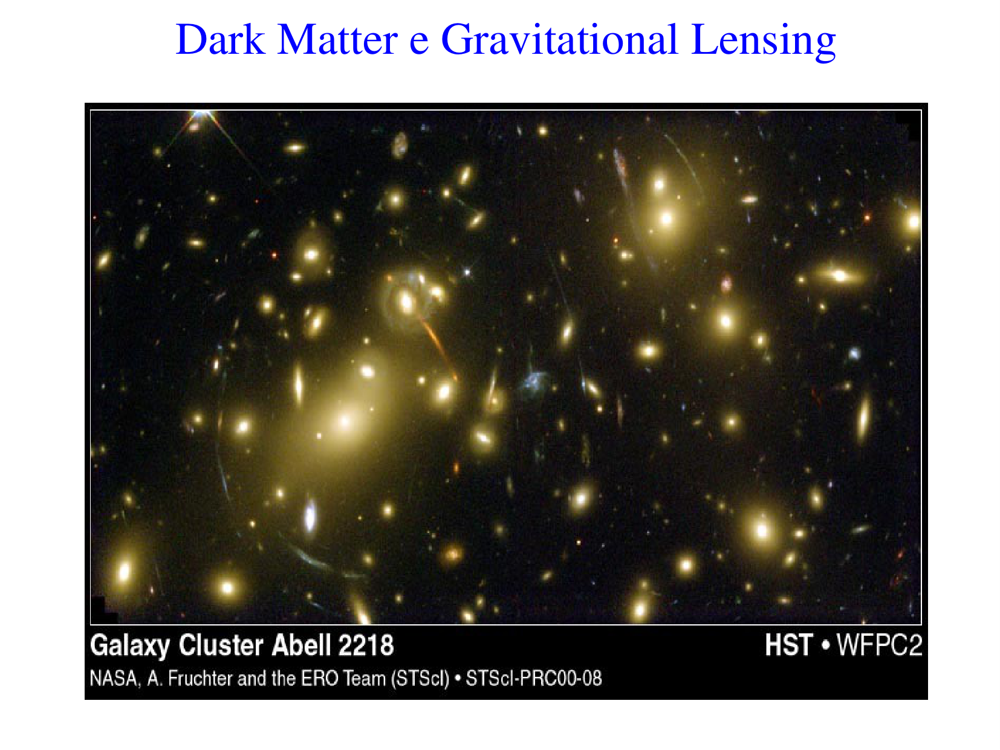

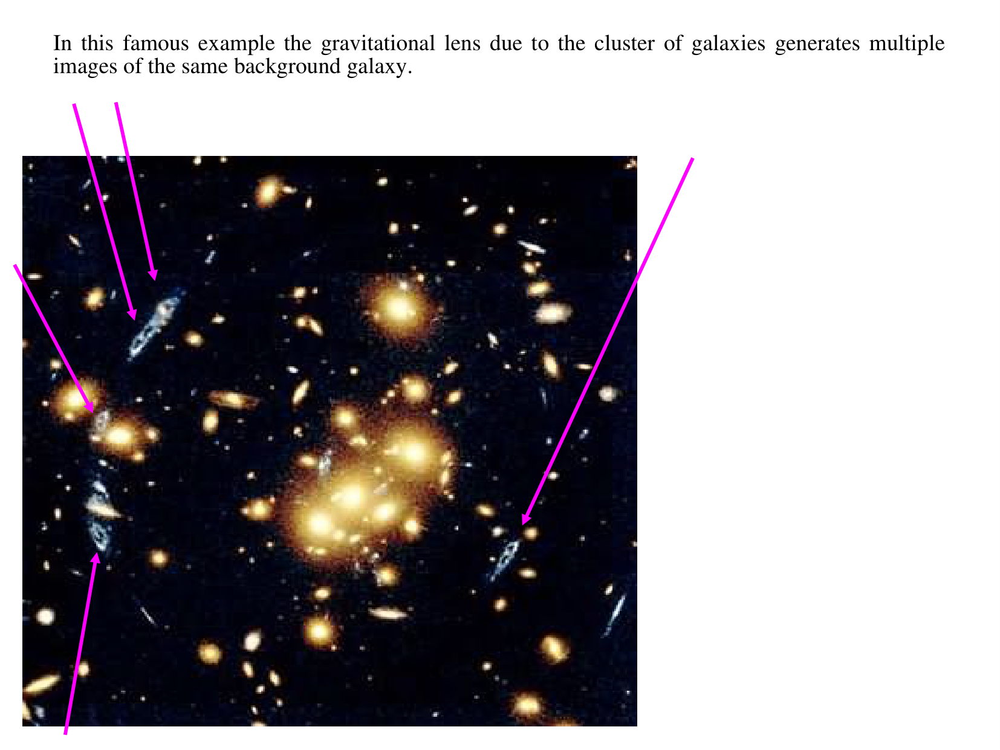


  <h4 class="backlinks-title">Linked References (3)</h4>
  <ul class="backlinks-list">
    <li class="backlink-item-wrap"><a href="../../04_Atlas/Astrophysics_of_Galaxies_MOC.html" class="backlink-item">Astrophysics_of_Galaxies_MOC</a></li>
    <li class="backlink-item-wrap"><a href="./Coma%20cluster.html" class="backlink-item">Coma cluster</a></li>
    <li class="backlink-item-wrap"><a href="./Modified%20gravity%20alternatives.html" class="backlink-item">Modified gravity alternatives</a></li>
  </ul>

