
**CAS** is a quantitative galaxy morphology classification scheme based on **concentration**, **asymmetry**, **smoothness**. introduced by **Conselice 2003** (hence "Conselice CAS"). objective + reproducible alternative to visual classification.

## the three parameters

### concentration $C$

how concentrated the light is toward the centre. defined as:
$$C = 5\log_{10}(r_{80}/r_{20})$$
with $r_{80}, r_{20}$ = radii enclosing $80\%, 20\%$ of total flux. high $C$ = centrally concentrated (early-type), low $C$ = diffuse (late-type).

typical:
- early-type (E, S0): $C \sim 4$ to $5$.
- late-type (Sb, Sc): $C \sim 2.5$ to $3$.
- irregular: $C \sim 2$ to $2.5$.

### asymmetry $A$

degree of rotational symmetry. compute:
$$A = \frac{\sum \lvert I(x, y) - I_{180}(x, y)\rvert}{2\sum \lvert I(x, y)\rvert}$$

with $I_{180}$ = image rotated by $180°$. high $A$ = lopsided / merging / disturbed galaxies.

typical:
- relaxed early-types: $A \sim 0.02$.
- spirals: $A \sim 0.1$ to $0.2$.
- mergers / starbursts: $A \sim 0.3$ to $0.5+$.

### smoothness (clumpiness) $S$

degree of small-scale structure. compute residual after smoothing:
$$S = \frac{\sum \lvert I(x, y) - I_S(x, y)\rvert}{\sum \lvert I(x, y)\rvert}$$

with $I_S$ = smoothed (Gaussian) image. high $S$ = clumpy (star-forming, knots), low $S$ = smooth (passive).

typical:
- early-type: $S \sim 0.02$ (very smooth).
- spirals: $S \sim 0.05$ to $0.10$.
- starbursts: $S \sim 0.15+$.

## the CAS plane

plot $C$ vs $A$ vs $S$:
- early-type galaxies cluster at high $C$, low $A$, low $S$ (smooth + concentrated + symmetric).
- late-type spirals at moderate $C$, moderate $A$, moderate $S$.
- mergers + starbursts at high $A$, often high $S$.
- irregular galaxies at low $C$, moderate-to-high $A$ + $S$.

separation in CAS space: roughly tracks Hubble morphology. but it's **automated** and **applicable to high-$z$ galaxies** where visual classification is hard.

## advantages over visual

CAS is:
- **objective**: defined entirely from pixel-level data.
- **reproducible**: same image gives same $C, A, S$.
- **automated**: applicable to surveys of $\sim 10^6$+ galaxies.
- **quantitative**: enables statistics (e.g. fraction of high-$A$ galaxies vs $z$).

## limitations

- **noise dependence**: for faint galaxies, $A$ + $S$ depend on background noise.
- **dust + AGN**: can mimic high $A$ (e.g. dusty bands).
- **resolution dependence**: results change with PSF + pixel scale.
- **interpretation**: $A$ + $S$ don't always map to Hubble type uniquely.

## extensions

modern variants add more parameters:
- **G** (Gini): inequality of pixel brightness distribution.
- **$M_{20}$**: second moment of brightest $20\%$ of pixels.
- **G-$M_{20}$ plane**: better separation of mergers from regular galaxies (Lotz 2004).

with all 5 parameters (C, A, S, G, $M_{20}$), can identify mergers efficiently.

## machine learning

modern deep-learning approaches (CNNs trained on visually-classified samples) outperform CAS for morphological classification, but CAS remains **interpretable** + a useful starting point.

## the science use

CAS-based classifications enable:
- **morphology evolution** with $z$: when did Hubble sequence emerge.
- **merger fraction** vs $z$: tracks galaxy assembly history.
- **environmental dependence**: morphology-density relation.
- **galaxy-cluster cores** dominated by ellipticals (high C, low A, low S).

## see also

- [Hubble morphological sequence](./Hubble%20morphological%20sequence.html)
- [Galaxy morphology vs physical properties](./Galaxy%20morphology%20vs%20physical%20properties.html)
- [Sersic profile](./Sersic%20profile.html)
- [Petrosian radius](./Petrosian%20radius.html)
- [Galaxy color, density and morphology](./Galaxy%20color%2C%20density%20and%20morphology.html)
- [SDSS overview](./SDSS%20overview.html)
- [Astrophysics_of_Galaxies_MOC](../../04_Atlas/Astrophysics_of_Galaxies_MOC.html)

---

## astrophysics of galaxies figures and slides (Prof. Alessandro Pizzella)

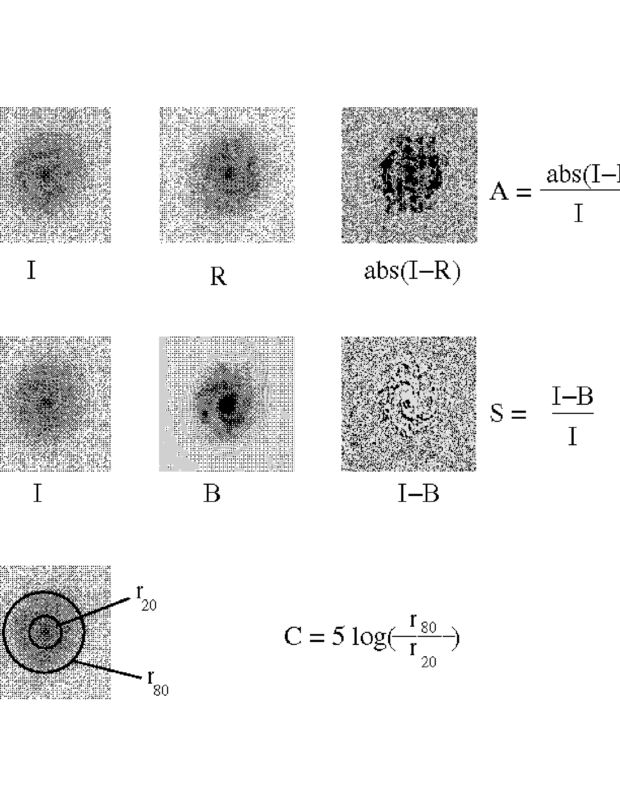
*The CAS parameter space from Conselice (2003): Asymmetry vs Concentration for galaxy types.*

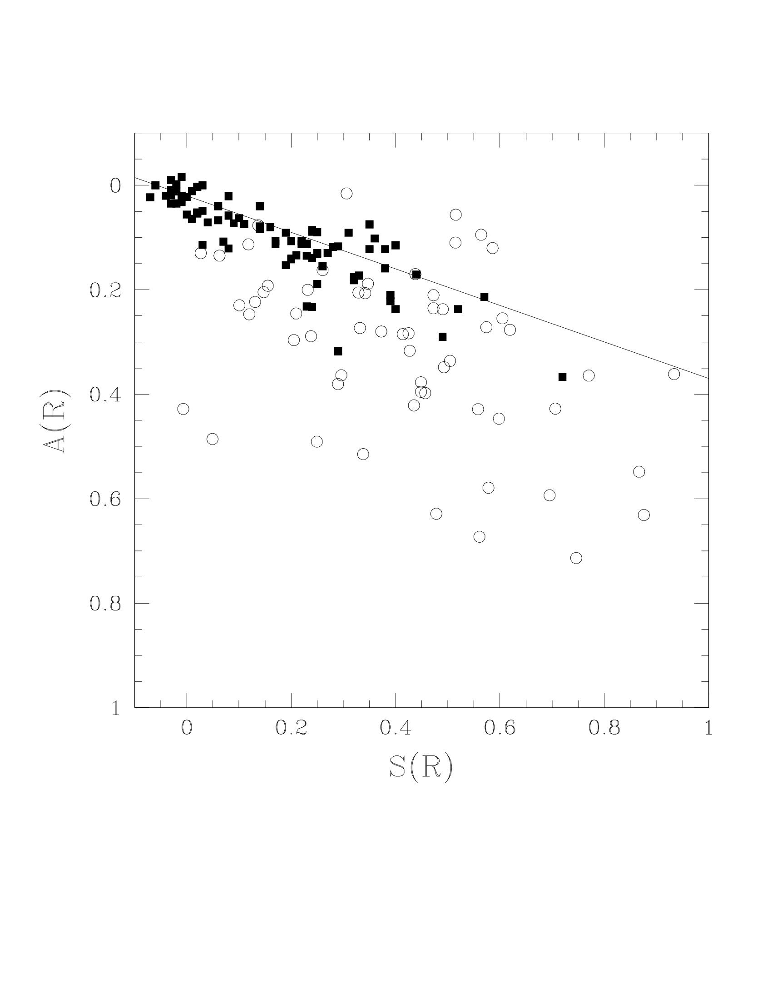
*Asymmetry vs Smoothness/Clumpiness diagram separating normal galaxies from starbursts and mergers.*

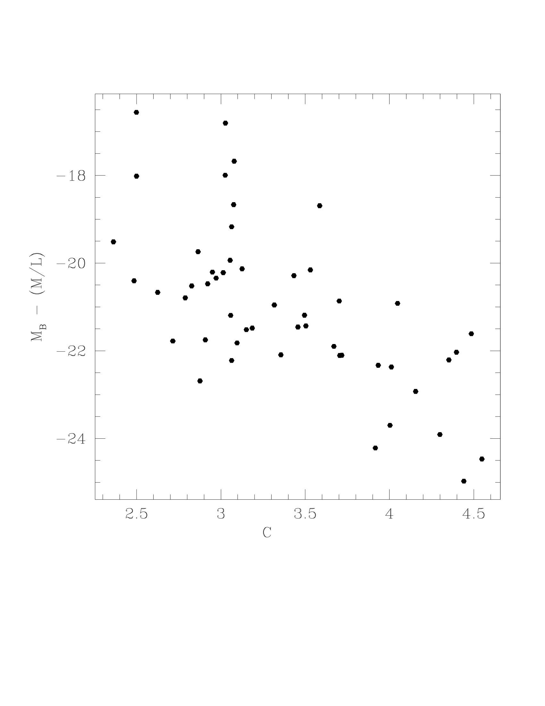
*Concentration index C as a function of visually classified Hubble type.*

---

## lecture slides and reference figures (Prof. Alessandro Pizzella)

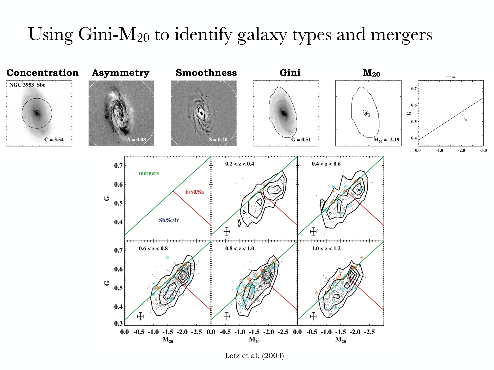

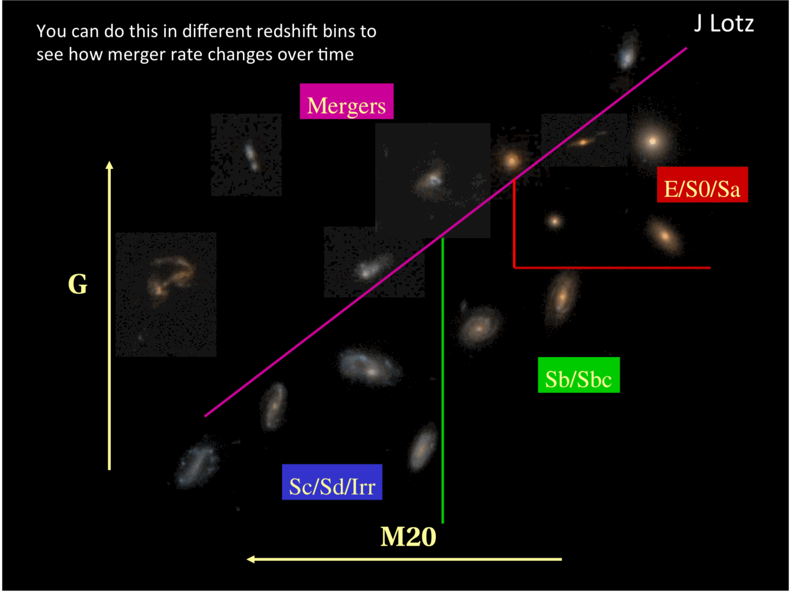

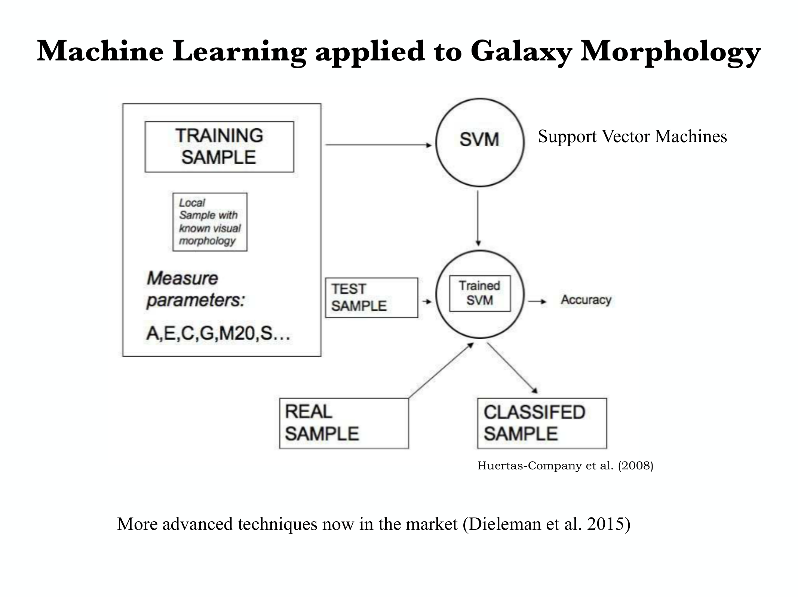

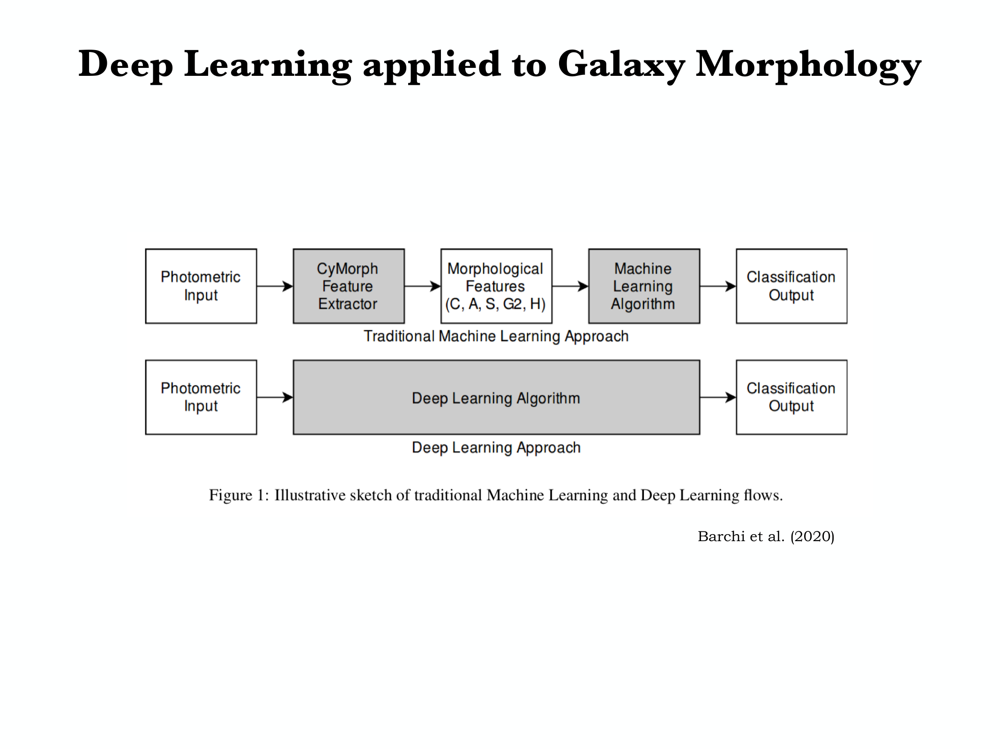

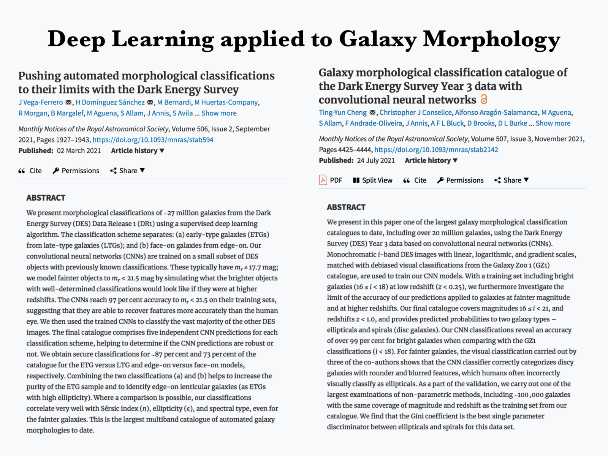

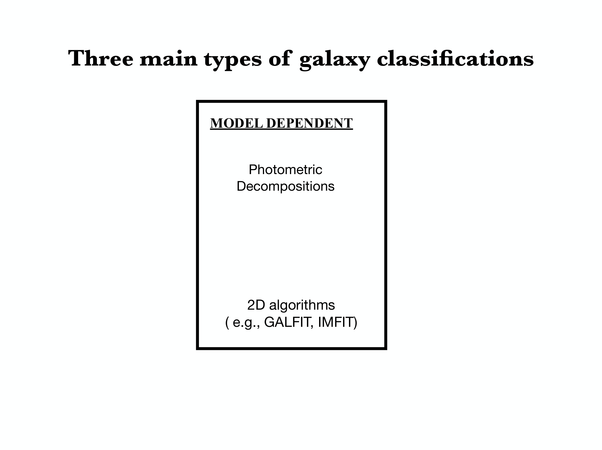

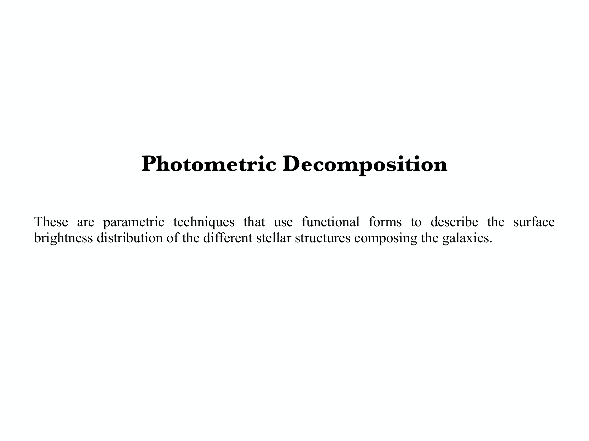

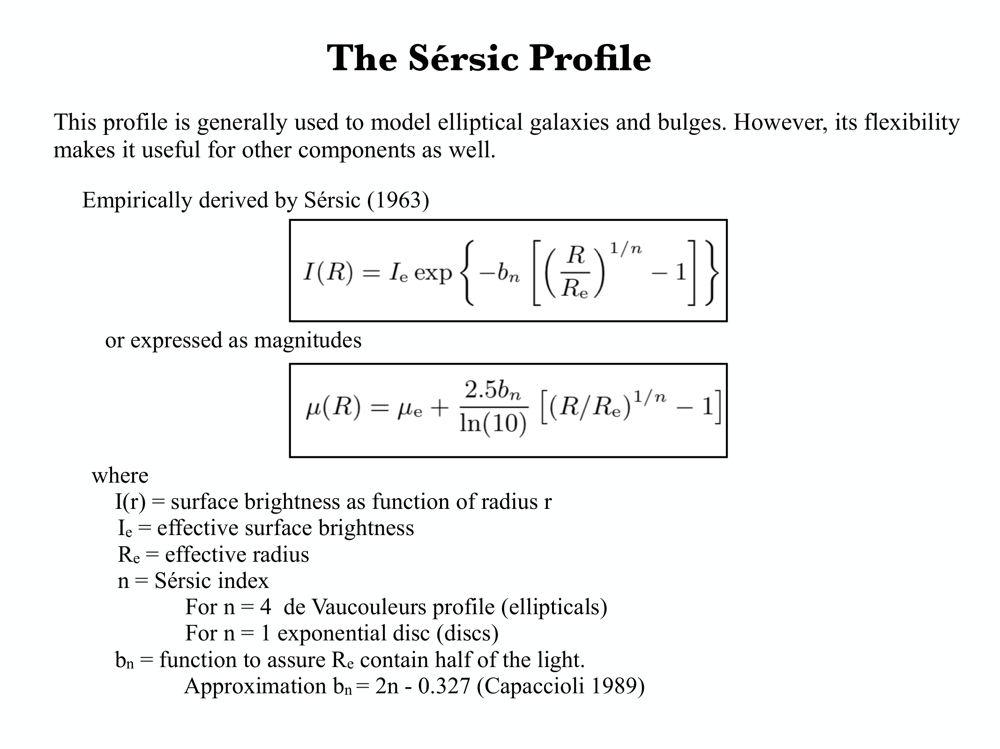


  <h4 class="backlinks-title">Linked References (4)</h4>
  <ul class="backlinks-list">
    <li class="backlink-item-wrap"><a href="../../04_Atlas/Astrophysics_of_Galaxies_MOC.html" class="backlink-item">Astrophysics_of_Galaxies_MOC</a></li>
    <li class="backlink-item-wrap"><a href="./De%20Vaucouleurs%20and%20exponential%20profiles.html" class="backlink-item">De Vaucouleurs and exponential profiles</a></li>
    <li class="backlink-item-wrap"><a href="./PCA%20spectral%20classification%20of%20galaxies.html" class="backlink-item">PCA spectral classification of galaxies</a></li>
    <li class="backlink-item-wrap"><a href="./Sersic%20profile.html" class="backlink-item">Sersic profile</a></li>
  </ul>

