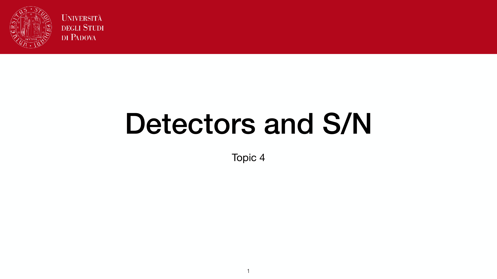
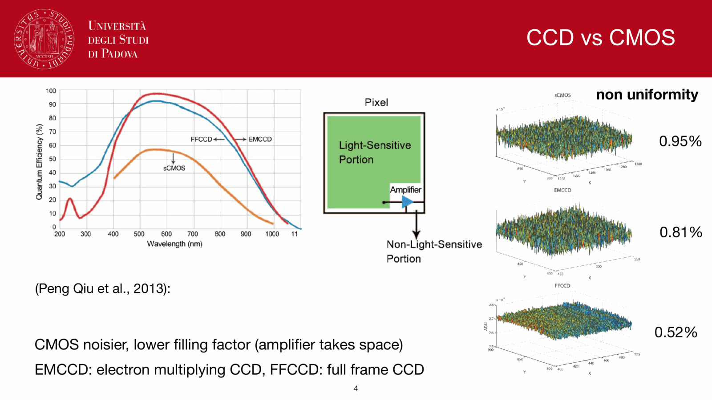
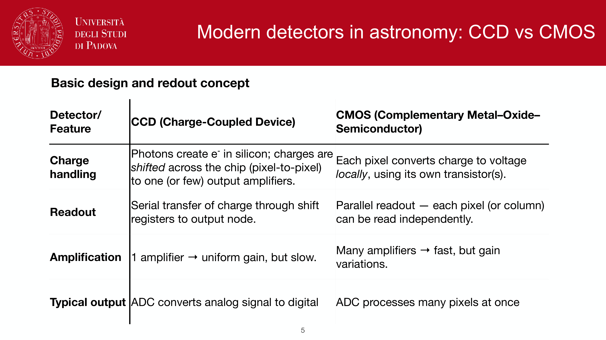
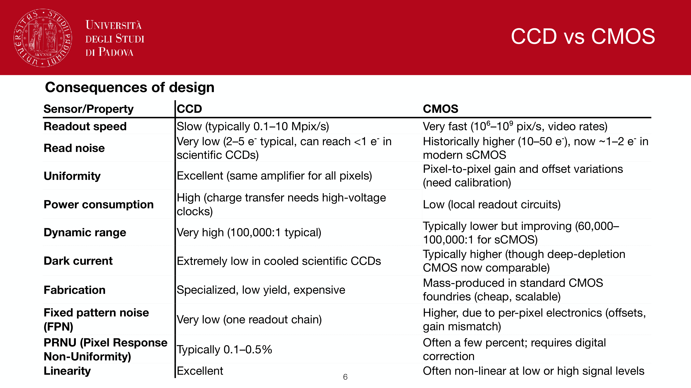
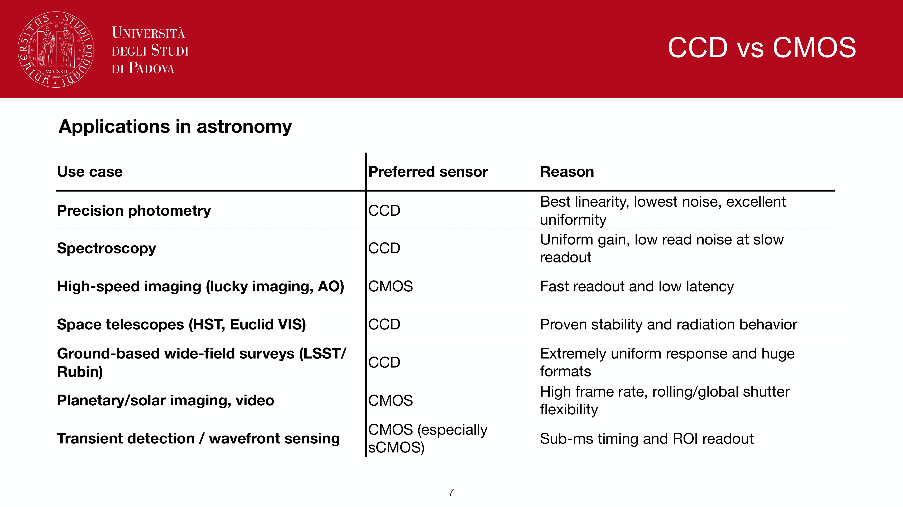
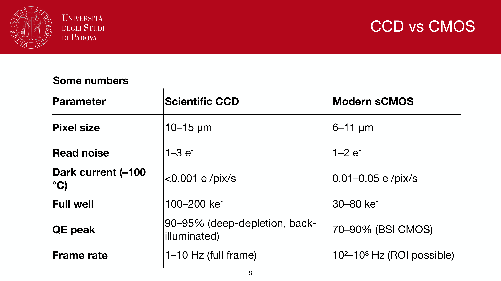

a CCD (charge-coupled device) is the workhorse imaging detector of optical astronomy. it converts photons into countable electrons in a pixel array, with high quantum efficiency, low noise, and clean linear response.

## the pixel as a MOS capacitor

each pixel is a **metal-oxide-semiconductor capacitor**: silicon substrate, SiO$_2$ insulating layer, polysilicon gate on top. positive bias on the gate creates a depletion region in the silicon, a potential well that traps electrons.

incoming photon with $E_\gamma > E_{\rm gap}^{\rm Si} = 1.12$ eV (i.e. $\lambda < 1100$ nm) has a chance of producing an electron-hole pair via photoelectric absorption in silicon. the electron drifts into the well; the hole is swept away. **one photon $\to$ one electron** (no internal gain, unlike MCPs or EMCCDs).

at the end of integration, the gate voltages are clocked to shift charge along the columns and through a serial register to the on-chip amplifier.

## quantum efficiency $\eta(\lambda)$

probability that an arriving photon produces a detected electron:
$$\eta(\lambda) = \frac{N_{\rm electrons}}{N_{\rm photons}}$$

modern back-illuminated, thinned, anti-reflection-coated science CCDs: $\eta > 0.9$ across most of the visible. front-illuminated CCDs lose photons to gate absorption, especially in the blue.

QE curve has hard cutoffs:
- **blue edge**: limited by gate / window absorption.
- **red edge** ($> 900$ nm): silicon becomes transparent, photon depth $> $ pixel depth. sometimes recovered by **deep depletion** CCDs.

## key per-pixel parameters

- **full well capacity**: typically $10^5$ to $10^6$ electrons. above this the well saturates and overflows (blooming).
- **pixel size**: typically $10$ to $20\,\mu$m. matched to seeing-disk via plate scale (typical: $0.2$ to $0.5''$/pix, several pixels per FWHM for Nyquist sampling).
- **pixel count**: from $4 \times 10^6$ (small science CCDs) to $\sim 10^9$ (DECam, LSST focal plane mosaics).
- **thickness**: $15\,\mu$m for thinned, $\sim 100\,\mu$m for deep-depletion (for red-sensitive applications).
- **fill factor**: fraction of pixel area sensitive to light; close to 1 for back-illuminated.

## readout architectures

- **frame transfer**: half the chip is exposed; charge is rapidly shifted to a covered storage area, then read out. allows "no shutter" mode.
- **interline transfer**: each pixel column has a paired masked column; charge transferred horizontally then shifted out. used in CMOS but rare in scientific CCDs.
- **drift mode** (LSST): continuously read out while the sky drifts across.

## trade-offs

- **deep wells** vs **small pixels**: bigger pixels store more charge but sample the PSF coarsely.
- **fast readout** vs **low read noise**: faster readout = more electronic noise per pixel.
- **back-illuminated** (high QE) vs **front-illuminated** (cheaper, more robust).
- **thinned** (better blue) vs **deep depletion** (better red).

every science instrument is a specific compromise: e.g. DECam uses $250\,\mu$m thick deep-depletion CCDs for red-band sensitivity at $z$-band.

## see also

- [[CCD detectors and SNR]]
- [[CCD readout]]
- [[CCD readout chain]]
- [[CCD noise sources]]
- [[The CCD equation]]
- [[The p-n junction]]
- [[Quantum efficiency]]
- [[Charge-Coupled Device]]
- [[Other detectors]]

---

## observational astrophysics course slides (Prof. Paolo Cassata)

*CCD architecture: two-dimensional array of pixel potential wells.*

*Photoelectric effect in silicon: electron-hole pair generation.*

*Gate electrodes and electrostatic potential distribution.*

*Pixel saturation and blooming along columns when full well is exceeded.*

*Quantum efficiency curve eta(lambda) of modern astronomical detectors.*

*Anti-reflective coatings on silicon surfaces.*

## Linked References

- [[CCD calibration steps]]
- [[CCD noise sources]]
- [[CCD readout chain]]
- [[Cosmic rays and bad pixels]]
- [[Linearity and saturation]]
- [[Other detectors]]
- [[The CCD equation]]
- [[Observational_Astrophysics_MOC]]

